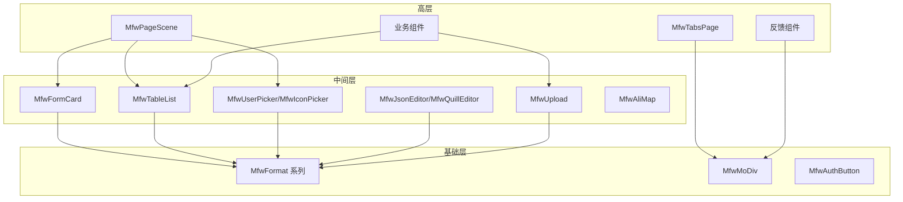

# 前端组件库开发计划

**文档编号**: FE-COMP-2026-0329
**版本**: 2.0（审查修订版）
**创建日期**: 2026-03-29
**审查日期**: 2026-03-29
**执行周期**: 2026-03-29 ~ 2026-04-15

**审查状态**: 待修订 | 已审查

---

## 1. 执行摘要

本计划**借鉴网约车项目**的组件设计思想和业务经验，**重新编写**一套完全符合 Moyan MFW 框架规范的 enterprise-grade 组件库 `moyan-mfw-base-frontend`。

### 1.1 借鉴要点（非代码迁移）

| 网约车项目组件 | 设计思想/可借鉴点 | 当前框架的对应实现 |
|----------------|-------------------|---------------------|
| FormCard | 配置驱动表单、草稿箱机制 | 参考设计理念，重新实现 |
| TableList | 分页 + 表格一体化 | 参考设计理念，重新实现 |
| Popup | 命令式弹窗 API | 参考设计理念，重新实现 |
| PageSceneV2 | 搜索面板 + 表格联动 | 参考设计理念，重新实现 |
| UserPicker | 业务选择器模式 | 参考设计理念，重新实现 |
| Upload | 统一上传管理器 | 参考设计理念，重新实现 |

### 1.2 开发原则

> **重要**: 本组件库**不迁移、不复制**网约车项目的任何代码，仅借鉴其**业务场景理解**和**组件设计思想**。

| 原则 | 说明 |
|------|------|
| 🆕 100% 重写 | 所有组件代码从零编写 |
| 🎨 风格统一 | 严格遵循当前框架的 UI 风格和样式规范 |
| 📐 规范优先 | 目录结构、命名规范完全符合框架要求 |
| 🔷 Mfw 前缀 | 所有组件必须以 `Mfw` 开头命名 |
| 📦 按需导入 | 支持 Tree-shaking 和按需加载 |

### 1.3 文档修订记录

| 版本 | 日期 | 修订内容 | 修订人 |
|------|------|----------|--------|
| 2.0 | 2026-03-29 | 综合审查报告后修订：补充用户需求、细化验收标准、明确分层架构、补充类型定义、Design Tokens、可访问性规范、**边界条件测试矩阵**、**API 文档模板** | @pm |
| 1.0 | 2026-03-29 | 初始版本 | @pm |

---

## 2. 用户需求说明（P-01 修订）

> 本节描述各组件的目标用户、使用场景和解决的问题。

### 2.1 表单类组件需求

| 组件 | 目标用户 | 使用场景 | 解决问题 |
|------|----------|----------|----------|
| **MfwFormCard** | 前端开发者 | 创建配置驱动的表单页面 | 避免重复编写表单模板代码，提供统一的表单配置接口 |
| **ElRadioGroupV2** | 前端开发者 | 大数据量下拉选项场景 | 解决传统 Select 在 1000+ 选项时渲染卡顿问题 |

### 2.2 表格类组件需求

| 组件 | 目标用户 | 使用场景 | 解决问题 |
|------|----------|----------|----------|
| **MfwTableList** | 前端开发者 | 后台管理系统列表页 | 提供分页 + 表格一体化解决方案，减少模板代码 |

### 2.3 反馈类组件需求

| 组件 | 目标用户 | 使用场景 | 解决问题 |
|------|----------|----------|----------|
| **MfwPopup** | 前端开发者 | 需要打开对话框/抽屉的场景 | 提供命令式弹窗 API，避免手动管理弹窗状态 |

### 2.4 上传类组件需求

| 组件 | 目标用户 | 使用场景 | 解决问题 |
|------|----------|----------|----------|
| **MfwUpload** | 前端开发者、终端用户 | 图片/文件上传场景 | 统一上传接口，支持多图、文件类型限制、进度显示 |

### 2.5 展示类组件需求

| 组件 | 目标用户 | 使用场景 | 解决问题 |
|------|----------|----------|----------|
| **MfwDateFormat** | 前端开发者 | 日期时间展示 | 统一日期格式化，处理空值、时区等边界情况 |
| **MfwImageFormat** | 前端开发者、终端用户 | 图片展示 | 处理图片加载失败、懒加载、预览等功能 |
| **MfwDictFormat** | 前端开发者 | 字典值展示 | 将字典 key 转换为可读文本，支持 tag 展示 |
| **MfwTagFormat** | 前端开发者、终端用户 | 状态/标签展示 | 统一状态颜色和样式 |

### 2.6 编辑器类组件需求

| 组件 | 目标用户 | 使用场景 | 解决问题 |
|------|----------|----------|----------|
| **MfwJsonEditor** | 前端开发者、高级用户 | JSON 数据编辑/查看 | 提供语法高亮、折叠、验证功能 |
| **MfwQuillEditor** | 前端开发者、终端用户 | 富文本内容编辑 | 集成 Quill，提供统一的富文本编辑体验 |

### 2.7 选择器类组件需求

| 组件 | 目标用户 | 使用场景 | 解决问题 |
|------|----------|----------|----------|
| **MfwIconPicker** | 前端开发者、运营人员 | 选择图标场景 | 提供可视化图标选择，避免记忆图标名称 |
| **MfwUserPicker** | 后台管理员、客服专员 | 表单中选择用户/部门（如任务分配、权限授予） | 避免手动输入用户 ID，提供可视化选择，返回标准用户数据结构 |

### 2.8 页面类组件需求

| 组件 | 目标用户 | 使用场景 | 解决问题 |
|------|----------|----------|----------|
| **MfwPageScene** | 前端开发者 | 标准列表页面（用户管理、订单列表等） | 提供搜索 + 表格一体化解决方案，减少重复页面开发 |
| **MfwTabsPage** | 前端开发者 | 多标签页后台系统 | 管理浏览器标签，支持路由同步、刷新保持 |

### 2.9 布局类组件需求

| 组件 | 目标用户 | 使用场景 | 解决问题 |
|------|----------|----------|----------|
| **MfwMoDiv** | 前端开发者 | 可调节分割的面板布局 | 提供拖拽调节功能，支持响应式 |

### 2.10 地图类组件需求

| 组件 | 目标用户 | 使用场景 | 解决问题 |
|------|----------|----------|----------|
| **MfwAliMap** | 前端开发者、物流/出行相关人员 | 地图展示、位置标注 | 封装高德地图 API，提供开箱即用的地图组件 |

### 2.11 权限类组件需求

| 组件 | 目标用户 | 使用场景 | 解决问题 |
|------|----------|----------|----------|
| **MfwAuthButton** | 前端开发者 | 需要根据权限显示/隐藏按钮 | 集成框架权限系统，避免在每个组件中重复判断权限 |

### 2.12 业务类组件需求

| 组件 | 目标用户 | 使用场景 | 解决问题 |
|------|----------|----------|----------|
| **MfwImportXlsx** | 运营人员、数据录入员 | Excel 数据导入 | 提供上传、解析、预览、映射一站式导入体验 |
| **MfwCountTo** | 前端开发者 | 数字增长动画展示（如数据统计） | 提供平滑数字滚动动画效果 |

---

## 3. 组件分层架构（P-03 修订）

> 明确组件分层原则和依赖关系，避免职责交叉和循环依赖。

### 3.1 分层原则

采用**三层架构**设计：

```
┌─────────────────────────────────────────────────────┐
│                  高层（业务层）                       │
│  page/  business/  feedback/                         │
│  可依赖所有低层组件                                   │
├─────────────────────────────────────────────────────┤
│                中间层（复合组件层）                    │
│  form/  table/  picker/  editor/  upload/  map/      │
│  仅可依赖基础层组件                                   │
├─────────────────────────────────────────────────────┤
│              基础层（原子组件层）                      │
│  display/  layout/  permission/                      │
│  不可依赖其他组件，仅依赖 Element Plus               │
└─────────────────────────────────────────────────────┘
```

### 3.2 组件依赖规则

| 层级 | 目录 | 可依赖 | 不可依赖 |
|------|------|--------|----------|
| 基础层 | `display/`, `layout/`, `permission/` | Element Plus | 任何自定义组件 |
| 中间层 | `form/`, `table/`, `picker/`, `editor/`, `upload/`, `map/` | 基础层 + Element Plus | 高层组件、同层组件 |
| 高层 | `page/`, `business/`, `feedback/` | 所有低层组件 | - |

### 3.3 依赖关系图



### 3.4 目录结构规范

严格遵循当前框架的层级结构，**同一体系组件归纳到同一分类目录**：

```
packages/base-frontend/src/components/
├── README.md                    # 组件库说明文档
├── index.ts                     # 统一导出入口
│
├── form/                        # ========== 表单类组件 ==========
│   ├── form-card/               # 配置驱动表单
│   │   ├── Index.vue            # 主组件（PascalCase）
│   │   ├── mod.ts               # 导出文件
│   │   ├── types.ts             # 类型定义
│   │   ├── style.scss           # 样式文件
│   │   └── use-draft-box.ts     # Composable（草稿箱）
│   ├── form-item-extend/        # 表单项扩展（如 ElRadioGroupV2）
│   │   ├── Index.vue
│   │   ├── mod.ts
│   │   └── types.ts
│   └── index.ts                 # 表单类组件统一导出
│
├── table/                       # ========== 表格类组件 ==========
│   ├── table-list/              # 动态表格列表
│   │   ├── Index.vue
│   │   ├── mod.ts
│   │   ├── types.ts
│   │   └── style.scss
│   └── index.ts                 # 表格类组件统一导出
│
├── feedback/                    # ========== 反馈类组件 ==========
│   ├── popup/                   # 命令式弹窗
│   │   ├── Index.vue
│   │   ├── mod.ts
│   │   ├── types.ts
│   │   └── style.scss
│   └── index.ts                 # 反馈类组件统一导出
│
├── upload/                      # ========== 上传类组件 ==========
│   ├── upload/                  # 文件上传组件
│   │   ├── Index.vue
│   │   ├── mod.ts
│   │   ├── types.ts
│   │   ├── style.scss
│   │   └── uploader.ts
│   └── index.ts                 # 上传类组件统一导出
│
├── display/                     # ========== 展示类组件 ==========
│   ├── mfw-format/              # 格式化组件组
│   │   ├── index.ts             # 插件注册
│   │   ├── base.ts              # 基础类型定义
│   │   ├── types.ts             # 类型定义
│   │   ├── date-format.tsx      # 日期格式化
│   │   ├── image-format.tsx     # 图片格式化
│   │   ├── dict-format.tsx      # 字典格式化
│   │   └── tag-format.tsx       # 标签格式化
│   └── index.ts                 # 展示类组件统一导出
│
├── editor/                      # ========== 编辑器类组件 ==========
│   ├── json-editor/             # JSON 编辑器
│   │   ├── Index.vue
│   │   ├── mod.ts
│   ├── quill-editor/            # 富文本编辑器
│   │   ├── Index.vue
│   │   ├── mod.ts
│   └── index.ts                 # 编辑器类组件统一导出
│
├── picker/                      # ========== 选择器类组件 ==========
│   ├── icon-picker/             # 图标选择器
│   ├── user-picker/             # 用户选择器
│   ├── department-picker/       # 部门选择器
│   └── index.ts                 # 选择器类组件统一导出
│
├── page/                        # ========== 页面类组件 ==========
│   ├── page-scene/              # 标准列表页面（搜索 + 表格）
│   ├── tabs-page/               # 多标签页
│   └── index.ts                 # 页面类组件统一导出
│
├── layout/                      # ========== 布局类组件 ==========
│   ├── mo-div/                  # 分割面板
│   └── index.ts                 # 布局类组件统一导出
│
├── map/                         # ========== 地图类组件 ==========
│   ├── ali-map/                 # 高德地图
│   └── index.ts                 # 地图类组件统一导出
│
├── permission/                  # ========== 权限类组件 ==========
│   ├── auth-button/             # 权限按钮
│   └── index.ts                 # 权限类组件统一导出
│
└── business/                    # ========== 业务类组件 ==========
    ├── import-xlsx/             # Excel 导入
    ├── count-to/                # 数字滚动
    └── index.ts                 # 业务类组件统一导出
```

### 3.5 命名规范

| 项目 | 规范 | 示例 | 等级 |
|------|------|------|------|
| 组件目录 | `kebab-case`（小写 + 连字符） | `form-card/`, `table-list/` | 🔴 强制 |
| 主组件文件 | `PascalCase` | `Index.vue` | 🔴 强制 |
| 子组件文件 | `kebab-case` | `column-control.vue` | 🟢 推荐 |
| 组件名（defineOptions） | `PascalCase` + `Mfw` 前缀 | `MfwFormCard` | 🔴 强制 |
| 导出模块 | `mod.ts` | `mod.ts` | 🔴 强制 |
| 类型定义 | `types.ts` | `types.ts` | 🔴 强制 |
| 样式文件 | `style.scss` | `style.scss` | 🔴 强制 |
| Composable | `kebab-case` + `use` 前缀 | `use-draft-box.ts` | 🔴 强制 |

### 3.6 网约车项目不规范项（需避免）

> **重要**: 以下是网约车项目中存在的不规范问题，在当前框架中必须**严格杜绝**：

| 问题类型 | 网约车项目示例 | 当前框架规范 | 纠正方式 |
|----------|----------------|--------------|----------|
| 组件无前缀 | `formCard`, `tableList` | 必须加 `Mfw` 前缀 | `MfwFormCard`, `MfwTableList` |
| 目录名驼峰 | `formCard/`, `pageSceneV2/` | 必须用 kebab-case | `form-card/`, `page-scene/` |
| 主文件小写 | `index.vue` | 必须 PascalCase | `Index.vue` |
| 组件名无驼峰 | `mo-div`, `el-radio-group-v2` | 组件名必须 PascalCase | `MfwMoDiv`, `ElRadioGroupV2` |
| 类型定义分散 | 内联定义或无类型 | 必须独立 `types.ts` | 统一类型定义 |
| 导出文件不统一 | `index.ts` 直接导出 | 必须 `mod.ts` 模块化导出 | 统一导出方式 |
| Composable 命名随意 | `commonProviders` | 必须 `use-xxx.ts` 格式 | `use-common.ts` |
| V2 后缀 | `pageSceneV2` | 不使用 V2 后缀 | `MfwPageScene` |

### 3.7 组件命名对照表

| 网约车项目组件名 | 当前框架组件名 | 命名说明 |
|------------------|----------------|----------|
| formCard | `MfwFormCard` | 增加 Mfw 前缀，PascalCase |
| tableList | `MfwTableList` | 增加 Mfw 前缀，PascalCase |
| popup | `MfwPopup` | 增加 Mfw 前缀，PascalCase |
| upload | `MfwUpload` | 增加 Mfw 前缀，PascalCase |
| pageSceneV2 | `MfwPageScene` | 增加 Mfw 前缀，去掉 V2 后缀 |
| userPicker | `MfwUserPicker` | 增加 Mfw 前缀，PascalCase |
| iconPicker | `MfwIconPicker` | 增加 Mfw 前缀，PascalCase |
| jsonEditor | `MfwJsonEditor` | 增加 Mfw 前缀，PascalCase |
| quill | `MfwQuillEditor` | 增加 Mfw 前缀，明确功能 |
| importXlsxPanel | `MfwImportXlsx` | 增加 Mfw 前缀，简化命名 |

### 3.8 样式规范（P-05 修订）

#### 3.8.1 Design Tokens 完整体系

```scss
// ==================== 色彩系统 ====================
.mfw-component {
  // 主题色
  --mfw-primary: var(--el-color-primary);
  --mfw-primary-light: var(--el-color-primary-light-3);
  --mfw-primary-dark: var(--el-color-primary-dark-2);

  // 状态色
  --mfw-success: var(--el-color-success);
  --mfw-warning: var(--el-color-warning);
  --mfw-danger: var(--el-color-danger);
  --mfw-info: var(--el-color-info);

  // 背景色
  --mfw-bg: var(--el-bg-color);
  --mfw-bg-overlay: var(--el-bg-color-overlay);
  --mfw-bg-page: var(--el-bg-color-page);

  // 文字颜色
  --mfw-text-primary: var(--el-text-color-primary);
  --mfw-text-regular: var(--el-text-color-regular);
  --mfw-text-secondary: var(--el-text-color-secondary);
  --mfw-text-placeholder: var(--el-text-color-placeholder);

  // 边框颜色
  --mfw-border-color: var(--el-border-color);
  --mfw-border-color-light: var(--el-border-color-light);
  --mfw-border-color-lighter: var(--el-border-color-lighter);
  --mfw-border-color-extra-light: var(--el-border-color-extra-light);

  // 填充色
  --mfw-fill-color: var(--el-fill-color);
  --mfw-fill-color-light: var(--el-fill-color-light);
  --mfw-fill-color-lighter: var(--el-fill-color-lighter);
  --mfw-fill-color-extra-light: var(--el-fill-color-extra-light);
  --mfw-fill-color-dark: var(--el-fill-color-dark);
  --mfw-fill-color-darker: var(--el-fill-color-darker);

  // 阴影
  --mfw-shadow-light: var(--el-box-shadow-light);
  --mfw-shadow: var(--el-box-shadow);
  --mfw-shadow-dark: var(--el-box-shadow-dark);

  // 圆角
  --mfw-radius-none: 0;
  --mfw-radius-small: var(--el-border-radius-small);
  --mfw-radius-base: var(--el-border-radius-base);
  --mfw-radius-round: var(--el-border-radius-round);
  --mfw-radius-full: 9999px;

  // 间距（基于 Element Plus spacing）
  --mfw-spacing-0: 0;
  --mfw-spacing-1: 4px;   // xs
  --mfw-spacing-2: 8px;   // sm
  --mfw-spacing-3: 12px;  // md
  --mfw-spacing-4: 16px;  // lg
  --mfw-spacing-5: 20px;  // xl
  --mfw-spacing-6: 24px;  // 2xl
  --mfw-spacing-7: 32px;  // 3xl
  --mfw-spacing-8: 40px;  // 4xl

  // 字体大小
  --mfw-font-size-xs: 12px;
  --mfw-font-size-sm: 14px;
  --mfw-font-size-md: 16px;
  --mfw-font-size-lg: 18px;
  --mfw-font-size-xl: 20px;
  --mfw-font-size-2xl: 24px;

  // 字重
  --mfw-font-weight-light: 300;
  --mfw-font-weight-normal: 400;
  --mfw-font-weight-medium: 500;
  --mfw-font-weight-semibold: 600;
  --mfw-font-weight-bold: 700;

  // 行高
  --mfw-line-height-none: 1;
  --mfw-line-height-tight: 1.25;
  --mfw-line-height-normal: 1.5;
  --mfw-line-height-relaxed: 1.625;

  // 动效
  --mfw-transition-duration: var(--el-transition-duration);
  --mfw-transition-duration-fast: var(--el-transition-duration-fast);
  --mfw-transition-duration-slow: var(--el-transition-duration-slow);
  --mfw-ease-in-out: cubic-bezier(0.645, 0.045, 0.355, 1);
  --mfw-ease-in: cubic-bezier(0.55, 0.055, 0.675, 0.19);
  --mfw-ease-out: cubic-bezier(0.215, 0.61, 0.355, 1);

  // 层级
  --mfw-z-index-normal: 1;
  --mfw-z-index-top: 1000;
  --mfw-z-index-modal: 2000;
  --mfw-z-index-popover: 3000;
}
```

#### 3.8.2 基础样式示例

```scss
// 使用框架 CSS 变量
.mfw-component-name {
  // 布局
  display: flex;
  gap: var(--mfw-spacing-2);
  padding: var(--mfw-spacing-3);

  // 背景与边框
  background-color: var(--mfw-bg);
  border: 1px solid var(--mfw-border-color);
  border-radius: var(--mfw-radius-base);
  box-shadow: var(--mfw-shadow-light);

  // 文字
  color: var(--mfw-text-regular);
  font-size: var(--mfw-font-size-sm);
  line-height: var(--mfw-line-height-normal);

  // 动效
  transition: all var(--mfw-transition-duration) var(--mfw-ease-in-out);
}
```

### 3.9 可访问性规范（P-06 修订）

> 所有组件必须遵循 WCAG 2.1 AA 标准，提供基本的无障碍支持。

#### 3.9.1 键盘导航要求

| 要求 | 说明 | 验收方式 |
|------|------|----------|
| Tab 导航 | 所有交互元素必须支持 Tab 键切换焦点 | 手动测试 |
| Enter/Space | 按钮、链接等元素支持 Enter/Space 激活 | 手动测试 |
| Esc 关闭 | 弹窗、下拉菜单等支持 Esc 关闭 | 手动测试 |
| 方向键导航 | 列表、菜单等支持方向键导航 | 手动测试 |
| 焦点可见 | 焦点状态必须有可见样式 | 视觉检查 |

#### 3.9.2 ARIA 属性要求

| 场景 | ARIA 属性 | 示例 |
|------|----------|------|
| 图标按钮 | `aria-label` | `<button aria-label="关闭">✕</button>` |
| 表单字段 | `aria-labelledby`, `aria-describedby` | label 关联 input |
| 错误提示 | `aria-invalid`, `aria-errormessage` | 表单验证错误 |
| 加载状态 | `aria-busy`, `aria-live` | 数据加载中 |
| 弹窗 | `role="dialog"`, `aria-modal` | 对话框组件 |
| 折叠区域 | `aria-expanded`, `aria-controls` | 折叠面板 |

#### 3.9.3 颜色对比度要求

| 元素类型 | 最小对比度 | 检查工具 |
|----------|------------|----------|
| 普通文本 | 4.5:1 | Chrome DevTools |
| 大文本（≥18px 或≥14px bold） | 3:1 | Chrome DevTools |
| UI 组件/图形 | 3:1 | Chrome DevTools |

#### 3.9.4 可访问性验收清单

```markdown
### 可访问性验收标准（必须全部满足）
- [ ] 所有交互元素支持键盘 Tab 导航
- [ ] 弹窗组件支持 ESC 关闭和焦点陷阱（focus trap）
- [ ] 表单组件关联 label 和 input（aria-labelledby）
- [ ] 图标按钮提供 aria-label 文本
- [ ] 颜色对比度符合 WCAG 2.1 AA 标准（≥4.5:1）
- [ ] 加载状态提供 aria-live 区域
- [ ] 错误信息关联到表单字段（aria-describedby）
- [ ] 焦点状态可见且清晰
```

```typescript
/**
 * @fileoverview 组件说明
 * @description 详细描述组件的用途和功能
 * @version 1.0.0
 * @author AuthorName
 */

// ========== 1. 组件配置 ==========
/** 组件名称，用于 devtools 识别 */
defineOptions({ name: 'MfwComponentName' });

// ========== 2. Props（带类型）==========
/**
 * 组件 Props 接口
 * @description 详细说明每个属性的用途
 */
const props = withDefaults(defineProps<ComponentProps>(), {
  disabled: false,
  size: 'default'
});

// ========== 3. Emits（带类型）==========
/**
 * 组件 Emits 接口
 * @description 详细说明每个事件的触发时机
 */
const emit = defineEmits<ComponentEmits>();
### 3.10 注释规范

```typescript
/**
 * @fileoverview 组件说明
 * @description 详细描述组件的用途和功能
 * @version 1.0.0
 * @author AuthorName
 */

// ========== 1. 组件配置 ==========
/** 组件名称，用于 devtools 识别 */
defineOptions({ name: 'MfwComponentName' });

// ========== 2. Props（带类型）==========
/**
 * 组件 Props 接口
 * @description 详细说明每个属性的用途
 */
const props = withDefaults(defineProps<ComponentProps>(), {
  disabled: false,
  size: 'default'
});

// ========== 3. Emits（带类型）==========
/**
 * 组件 Emits 接口
 * @description 详细说明每个事件的触发时机
 */
const emit = defineEmits<ComponentEmits>();

// ========== 4. Slots（带类型）==========
/**
 * 组件 Slots 接口
 * @description 详细说明每个插槽的用途和参数
 */
const slots = defineSlots<ComponentSlots>();

// ========== 5. 暴露实例 ==========
/**
 * 组件暴露实例接口
 * @description 详细说明每个暴露方法的用途
 */
defineExpose<ComponentInstance>({
  // 公开方法
});
```

---

## 4. 完整类型定义模板（P-04 修订）

```typescript
// types.ts
/**
 * @fileoverview 组件类型定义
 * @description 包含 Props、Emits、Slots、Instance 接口定义
 */

/** Props 接口 */
export interface ComponentNameProps {
  /** 属性说明 */
  value?: string;
  /** 是否禁用 */
  disabled?: boolean;
  /** 组件尺寸 */
  size?: 'small' | 'default' | 'large';
}

/** Emits 接口 */
export interface ComponentNameEmits {
  /** 值更新事件 */
  (e: 'update:modelValue', value: string): void;
  /** 值变化事件 */
  (e: 'change', value: string): void;
  /** 聚焦事件 */
  (e: 'focus', event: FocusEvent): void;
  /** 失去焦点事件 */
  (e: 'blur', event: FocusEvent): void;
}

/** Slots 接口 */
export interface ComponentNameSlots {
  /** 默认插槽 */
  default?: (props: { value: string }) => VNode[];
  /** 自定义头部插槽 */
  header?: (props: { title: string }) => VNode[];
  /** 前缀图标插槽 */
  prefix?: () => VNode[];
  /** 后缀图标插槽 */
  suffix?: () => VNode[];
}

/** 暴露实例接口 */
export interface ComponentNameInstance {
  /** 刷新数据 */
  refresh: () => Promise<void>;
  /** 重置表单 */
  reset: () => void;
  /** 验证方法 */
  validate: () => Promise<boolean>;
  /** 聚焦方法 */
  focus: () => void;
}

/** 组件实例类型 */
export type ComponentNameInstanceType = InstanceType<typeof ComponentName>;
```

---

## 5. MfwPageScene 功能清单（P-08 修订）

### 5.1 组件概述

**组件名**: `MfwPageScene`
**目标用户**: 前端开发者
**使用场景**: 标准列表页面（用户管理、订单列表、商品管理等）
**解决问题**: 提供搜索 + 表格一体化解决方案，减少重复页面开发

### 5.2 功能清单

#### 5.2.1 搜索面板功能

| 功能 | 说明 | 支持类型 |
|------|------|----------|
| 表单项配置 | 通过 template 配置搜索表单项 | Input, Select, DatePicker, RangePicker, TreeSelect, RadioGroup, CheckboxGroup |
| 展开/收起 | 多表单项时支持展开/收起 | 超过 3 项自动显示展开按钮 |
| 重置 | 一键重置所有搜索条件 | 恢复默认值 |
| 搜索 | 执行搜索操作 | 触发表格刷新 |
| 响应式 | 根据屏幕宽度自适应布局 | 支持断点配置 |

#### 5.2.2 表格功能

| 功能 | 说明 |
|------|------|
| 列配置 | 通过 columns 配置表格列 |
| 排序 | 支持前端/后端排序 |
| 筛选 | 支持列筛选 |
| 分页 | 支持分页，可配置每页条数 |
| 行选择 | 支持单选/多选 |
| 操作列 | 支持自定义操作列 |
| 空数据 | 支持自定义空数据展示 |
| 加载中 | 支持加载状态展示 |
| 虚拟滚动 | 大数据量支持虚拟滚动（1000+ 行） |

#### 5.2.3 联动机制

| 联动 | 说明 |
|------|------|
| 搜索→表格 | 搜索条件变化自动触发表格刷新 |
| 分页→表格 | 分页变化自动刷新表格 |
| 排序→表格 | 排序变化自动刷新表格 |
| 刷新按钮 | 提供手动刷新按钮 |

### 5.3 API 定义

#### Props

| 属性 | 类型 | 默认值 | 说明 |
|------|------|--------|------|
| searchTemplate | `SearchTemplate[]` | `[]` | 搜索表单模板 |
| columns | `TableColumn[]` | `[]` | 表格列配置 |
| loadData | `(params: any) => Promise<TableData>` | - | 数据加载函数 |
| showSearch | `boolean` | `true` | 是否显示搜索面板 |
| showRefresh | `boolean` | `true` | 是否显示刷新按钮 |
| rowKey | `string` | `'id'` | 行键名 |
| rowSelection | `boolean` | `false` | 是否支持行选择 |

#### Events

| 事件名 | 参数 | 说明 |
|--------|------|------|
| search | `formData: any` | 搜索时触发 |
| reset | `-` | 重置时触发 |
| refresh | `-` | 刷新时触发 |
| selection-change | `selection: any[]` | 选择变化时触发 |

#### Exposed Methods

| 方法名 | 参数 | 返回值 | 说明 |
|--------|------|--------|------|
| refresh | `-` | `Promise<void>` | 刷新表格 |
| resetSearch | `-` | `-` | 重置搜索条件 |
| getSelection | `-` | `any[]` | 获取选中行 |
| clearSelection | `-` | `-` | 清空选中行 |

### 5.4 验收标准（P-02 修订）

```markdown
### MfwPageScene 验收标准（可测试）
- [ ] 搜索面板支持 Input/Select/DatePicker/RangePicker/TreeSelect 组件
- [ ] 搜索表单项超过 3 项时自动显示展开/收起按钮
- [ ] 点击"重置"按钮清空所有搜索条件并恢复默认值
- [ ] 点击"搜索"按钮触发表格刷新，传递当前搜索条件
- [ ] 表格支持分页，每页条数可配置（默认 20 条）
- [ ] 表格支持列排序（前端/后端）
- [ ] 表格支持行选择（单选/多选）
- [ ] 搜索条件变化时自动刷新表格（可配置）
- [ ] 分页变化时自动刷新表格
- [ ] 提供手动刷新按钮
- [ ] 空数据时显示空状态提示
- [ ] 加载时显示 loading 状态
- [ ] 支持 1000+ 行数据流畅渲染（虚拟滚动）
- [ ] 响应式布局：窄屏下搜索面板自动折叠
- [ ] 键盘操作：支持 Tab 切换、Enter 搜索、Esc 取消
- [ ] 性能：首次渲染≤500ms，搜索响应≤300ms
```

---

## 6. 待开发组件清单

### 3.1 组件分类总览

| 分类目录 | 已完工组件 | 待开发组件 |
|----------|------------|------------|
| `form/` | MfwFormCard | ElRadioGroupV2 |
| `table/` | MfwTableList | - |
| `feedback/` | MfwPopup | - |
| `upload/` | MfwUpload | - |
| `display/` | MfwDateFormat/ImageFormat/DictFormat/TagFormat | - |
| `editor/` | MfwJsonEditor | MfwQuillEditor |
| `picker/` | MfwIconPicker | MfwUserPicker |
| `page/` | - | MfwPageScene, MfwTabsPage |
| `layout/` | - | MfwMoDiv |
| `map/` | - | MfwAliMap |
| `permission/` | - | MfwAuthButton |
| `business/` | - | MfwImportXlsx, MfwCountTo |

### 3.2 组件优先级分类

| 优先级 | 说明 | 组件列表 |
|--------|------|----------|
| **P0** | 核心组件，框架必需 | MfwPageScene, MfwUserPicker, ElRadioGroupV2 |
| **P1** | 业务常用组件 | MfwQuillEditor, MfwImportXlsx, MfwTabsPage |
| **P2** | 增强型组件 | MfwMoDiv, MfwAliMap, MfwAuthButton, MfwCountTo |

### 3.2 详细组件规格（按分类目录）

#### form/ - 表单类组件

| 组件 | 借鉴点 | 框架适配要点 | 估计工时 | 状态 |
|------|--------|--------------|----------|------|
| **MfwFormCard** | 配置驱动表单、草稿箱机制 | 遵循框架表单规范，使用 `use-draft-box.ts` | ✅ 完成 |
| **ElRadioGroupV2** | 大数据量虚拟列表 | 使用框架 Element Plus 版本，适配框架主题 | 2h | 待开发 |

#### table/ - 表格类组件

| 组件 | 借鉴点 | 框架适配要点 | 估计工时 | 状态 |
|------|--------|--------------|----------|------|
| **MfwTableList** | 分页 + 表格一体化 | 遵循框架表格规范 | ✅ 完成 |

#### feedback/ - 反馈类组件

| 组件 | 借鉴点 | 框架适配要点 | 估计工时 | 状态 |
|------|--------|--------------|----------|------|
| **MfwPopup** | 命令式弹窗 API | 遵循框架弹窗规范 | ✅ 完成 |

#### upload/ - 上传类组件

| 组件 | 借鉴点 | 框架适配要点 | 估计工时 | 状态 |
|------|--------|--------------|----------|------|
| **MfwUpload** | 统一上传管理器 | 遵循框架上传规范 | ✅ 完成 |

#### display/ - 展示类组件

| 组件 | 借鉴点 | 框架适配要点 | 估计工时 | 状态 |
|------|--------|--------------|----------|------|
| **MfwDateFormat** | 日期格式化显示 | - | ✅ 完成 |
| **MfwImageFormat** | 图片格式化显示 | - | ✅ 完成 |
| **MfwDictFormat** | 字典格式化显示 | - | ✅ 完成 |
| **MfwTagFormat** | 标签格式化显示 | - | ✅ 完成 |

#### editor/ - 编辑器类组件

| 组件 | 借鉴点 | 框架适配要点 | 估计工时 | 状态 |
|------|--------|--------------|----------|------|
| **MfwJsonEditor** | JSON 编辑展示 | - | ✅ 完成 |
| **MfwQuillEditor** | 富文本编辑器封装 | 集成 Quill，适配框架表单组件规范 | 3h | 待开发 |

#### picker/ - 选择器类组件

| 组件 | 借鉴点 | 框架适配要点 | 估计工时 | 状态 |
|------|--------|--------------|----------|------|
| **MfwIconPicker** | 图标选择 | - | ✅ 完成 |
| **MfwUserPicker** | 用户/部门选择业务场景 | 对接框架用户体系，支持单选/多选/部门树 | 4h | 待开发 |

#### page/ - 页面类组件

| 组件 | 借鉴点 | 框架适配要点 | 估计工时 | 状态 |
|------|--------|--------------|----------|------|
| **MfwPageScene** | 搜索面板 + 表格联动设计 | 集成 MfwTableList，使用框架搜索面板规范 | 6h | 待开发 |
| **MfwTabsPage** | 多标签页管理 | 适配框架路由系统，支持框架标签管理 | 4h | 待开发 |

#### layout/ - 布局类组件

| 组件 | 借鉴点 | 框架适配要点 | 估计工时 | 状态 |
|------|--------|--------------|----------|------|
| **MfwMoDiv** | 可调节分割面板 | 使用框架样式变量，适配框架主题 | 2h | 待开发 |

#### map/ - 地图类组件

| 组件 | 借鉴点 | 框架适配要点 | 估计工时 | 状态 |
|------|--------|--------------|----------|------|
| **MfwAliMap** | 高德地图集成 | 配置框架高德 API，封装地图基础功能 | 4h | 待开发 |

#### permission/ - 权限类组件

| 组件 | 借鉴点 | 框架适配要点 | 估计工时 | 状态 |
|------|--------|--------------|----------|------|
| **MfwAuthButton** | 权限控制按钮 | 集成框架权限系统，使用框架权限判断 | 2h | 待开发 |

#### business/ - 业务类组件

| 组件 | 借鉴点 | 框架适配要点 | 估计工时 | 状态 |
|------|--------|--------------|----------|------|
| **MfwImportXlsx** | Excel 导入预览 | 集成 xlsx 库，适配框架上传规范 | 3h | 待开发 |
| **MfwCountTo** | 数字滚动动画 | 独立实现，适配框架主题色 | 2h | 待开发 |

---

## 4. 开发计划详情

### 4.1 第一阶段：核心组件（2026-03-29 ~ 2026-04-01）

> 完成框架必需的 P0 级核心组件

| 任务编号 | 组件 | 开发要点 | 负责人 | 估计工时 | 交付物 | 验收标准 |
|----------|------|----------|--------|----------|--------|----------|
| COMP-001 | MfwPageScene | 搜索面板配置、表格集成、分页联动 | @frontend | 6h | page-scene/ 目录 | 支持搜索 + 表格一体化 |
| COMP-002 | MfwUserPicker | 用户搜索、部门树、单选/多选 | @frontend | 4h | user-picker/ 目录 | 支持用户/部门选择 |
| COMP-003 | ElRadioGroupV2 | 虚拟列表、大数据优化 | @frontend | 2h | elelements/ 目录 | 支持 1000+ 选项流畅渲染 |

**阶段验收**: 2026-04-01 17:00，由 @tech-lead 验证

---

### 4.2 第二阶段：业务组件（2026-04-01 ~ 2026-04-08）

> 完成业务常用的 P1 级组件

| 任务编号 | 组件 | 开发要点 | 负责人 | 估计工时 | 交付物 | 验收标准 |
|----------|------|----------|--------|----------|--------|----------|
| COMP-004 | MfwQuillEditor | Quill 集成、工具栏配置、图片上传 | @frontend | 3h | quill-editor/ 目录 | 支持富文本编辑 |
| COMP-005 | MfwImportXlsx | xlsx 解析、数据预览、映射配置 | @frontend | 3h | import-xlsx/ 目录 | 支持 Excel 导入预览 |
| COMP-006 | MfwTabsPage | 标签管理、路由集成、刷新保持 | @frontend | 4h | tabs-page/ 目录 | 支持多标签页管理 |

**阶段验收**: 2026-04-08 17:00，由 @tech-lead 验证

---

### 4.3 第三阶段：增强组件（2026-04-08 ~ 2026-04-15）

> 完成 P2 级增强组件和文档完善

| 任务编号 | 组件 | 开发要点 | 负责人 | 估计工时 | 交付物 | 验收标准 |
|----------|------|----------|--------|----------|--------|----------|
| COMP-007 | MfwMoDiv | 可调节分割、拖拽处理、响应式 | @frontend | 2h | mo-div/ 目录 | 支持拖拽调节 |
| COMP-008 | MfwAliMap | 高德 API、地图展示、标记点 | @frontend | 4h | ali-map/ 目录 | 支持地图展示 |
| COMP-009 | MfwAuthButton | 权限判断、按钮禁用/隐藏 | @frontend | 2h | auth-button/ 目录 | 支持权限控制 |
| COMP-010 | MfwCountTo | 数字滚动、动画配置 | @frontend | 2h | count-to/ 目录 | 支持数字动画 |
| DOC-001 | 文档完善 | API 文档、使用示例 | @doc | 4h | README.md | 文档完整 |
| TEST-001 | 单元测试 | 组件测试用例 | @qa | 4h | *.test.ts | 覆盖率≥80% |

**阶段验收**: 2026-04-15 17:00，由 @pm 组织验收

---

## 5. 组件开发模板

### 5.1 标准组件结构

```vue
<template>
  <div class="mfw-component-name">
    <!-- 模板内容 -->
  </div>
</template>

<script setup lang="ts">
// ========== 1. 组件配置 ==========
defineOptions({ name: 'MfwComponentName' });

// ========== 2. Props（带类型）==========
const props = withDefaults(defineProps<ComponentNameProps>(), {
  disabled: false
});

// ========== 3. Emits（带类型）==========
const emit = defineEmits<ComponentNameEmits>();

// ========== 4. 响应式数据 ==========
const loading = ref(false);

// ========== 5. 计算属性 ==========
const data = computed(() => props.xxx);

// ========== 6. 方法（按功能分组）==========
const handleClick = () => {
  // ...
};

// ========== 7. 生命周期 ==========
onMounted(() => {
  // ...
});

// ========== 8. 暴露实例 ==========
defineExpose<ComponentNameInstance>({
  // 公开方法
});
</script>

<style scoped lang="scss">
.mfw-component-name {
  // 使用框架 CSS 变量
  --mfw-component-bg: var(--el-bg-color);
}
</style>
```

### 5.2 类型定义模板

```typescript
// types.ts
/** Props 接口 */
export interface ComponentNameProps {
  /** 属性说明 */
  value?: string;
  /** 是否禁用 */
  disabled?: boolean;
}

/** Emits 接口 */
export interface ComponentNameEmits {
  (e: 'update:modelValue', value: string): void;
  (e: 'change', value: string): void;
}

/** 暴露实例接口 */
export interface ComponentNameInstance {
  /** 方法说明 */
  doSomething: () => void;
}
```

### 5.3 导出文件模板

```typescript
// mod.ts
/**
 * @fileoverview 组件模块导出
 */

import ComponentName from './Index.vue';
import type { ComponentNameProps, ComponentNameEmits } from './types';

export { ComponentName };
export type { ComponentNameProps, ComponentNameEmits };

export default ComponentName;
```

---

## 6. 资源分配

### 6.1 人力资源

| 团队 | 参与人员 | 投入时间 |
|------|----------|----------|
| 前端团队 | 2-3 名成员 | 32 小时 |
| 测试团队 | 1 名成员 | 4 小时 |
| 文档维护 | @doc | 4 小时 |
| 技术审查 | @tech-lead | 3 小时 |

### 6.2 总工时估算

| 阶段 | 开发工时 | 测试工时 | 文档工时 | 合计 |
|------|----------|----------|----------|------|
| 第一阶段 | 12h | 1h | 1h | 14h |
| 第二阶段 | 10h | 1h | 1h | 12h |
| 第三阶段 | 10h | 2h | 2h | 14h |
| **总计** | **32h** | **4h** | **4h** | **40h** |

---

## 7. 风险管理

| 风险 | 概率 | 影响 | 缓解措施 |
|------|------|------|----------|
| 组件设计与框架风格不符 | 中 | 高 | 开发前充分理解框架规范，@tech-lead 审查 |
| 高德地图 API 配置问题 | 低 | 中 | 使用环境变量配置，提供 mock 方案 |
| 权限系统集成复杂 | 中 | 中 | 与后端团队提前沟通接口规范 |
| 组件复用性不足 | 低 | 中 | 设计时考虑通用性，避免业务耦合 |

---

## 8. 验收标准

### 8.1 组件验收清单

- [ ] 组件功能完整，满足业务需求
- [ ] TypeScript 类型定义完整（Props/Emits/Slots/Exposed）
- [ ] 支持按需导入和 Tree-shaking
- [ ] 支持全局注册
- [ ] 使用框架 CSS 变量，无硬编码颜色
- [ ] ESLint 无 Error/Warning
- [ ] 代码格式符合 Prettier 规范
- [ ] 组件文档完整（API + 使用示例）
- [ ] 单元测试覆盖率≥80%

### 8.2 代码质量指标

| 指标 | 目标值 | 检查方式 |
|------|--------|----------|
| 单组件行数 | ≤500 行 | 代码统计 |
| 单函数行数 | ≤50 行 | ESLint |
| 嵌套层级 | ≤4 层 | ESLint |
| TypeScript 覆盖率 | ≥95% | tsc --noEmit |
| 单元测试覆盖率 | ≥80% | vitest --coverage |

---

## 9. 进度追踪

### 9.1 任务看板

#### 待办列表 (Backlog)

| 编号 | 任务名称 | 优先级 | 负责人 | 预计工时 |
|------|----------|--------|--------|----------|
| COMP-001 | MfwPageScene | P0 | @frontend | 6h |
| COMP-002 | MfwUserPicker | P0 | @frontend | 4h |
| COMP-003 | ElRadioGroupV2 | P0 | @frontend | 2h |
| COMP-004 | MfwQuillEditor | P1 | @frontend | 3h |
| COMP-005 | MfwImportXlsx | P1 | @frontend | 3h |
| COMP-006 | MfwTabsPage | P1 | @frontend | 4h |
| COMP-007 | MfwMoDiv | P2 | @frontend | 2h |
| COMP-008 | MfwAliMap | P2 | @frontend | 4h |
| COMP-009 | MfwAuthButton | P2 | @frontend | 2h |
| COMP-010 | MfwCountTo | P2 | @frontend | 2h |

#### 进行中 (In Progress)

| 编号 | 任务名称 | 负责人 | 开始日期 | 预计完成 |
|------|----------|--------|----------|----------|
| - | - | - | - | - |

#### 已完成 (Done)

| 编号 | 任务名称 | 负责人 | 完成日期 | 验收人 |
|------|----------|--------|----------|--------|
| COMP-101 | MfwFormCard | @frontend | 2026-03-29 | @tech-lead |
| COMP-102 | MfwTableList | @frontend | 2026-03-29 | @tech-lead |
| COMP-103 | MfwPopup | @frontend | 2026-03-29 | @tech-lead |
| COMP-104 | MfwUpload | @frontend | 2026-03-29 | @tech-lead |
| COMP-105 | MfwIconPicker | @frontend | 2026-03-29 | @tech-lead |
| COMP-106 | MfwJsonEditor | @frontend | 2026-03-29 | @tech-lead |
| COMP-107 | MfwFormat 系列 | @frontend | 2026-03-29 | @tech-lead |

### 9.2 每日站会

- **时间**: 每日 14:00 - 14:15
- **参与**: 前端团队代表
- **内容**: 同步进度、解决问题、调整计划

### 9.3 进度报告

| 报告类型 | 频率 | 发送人 | 接收人 |
|----------|------|--------|--------|
| 日报 | 每日 | @frontend | @pm |
| 阶段报告 | 每阶段结束 | @tech-lead | @pm |
| 总结报告 | 项目结束 | @pm | 相关方 |

---

## 10. 边界条件测试矩阵（P-07 修订）

> 本节定义各组件必须测试的边界条件和极端场景，确保组件在生产环境的稳定性。

### 10.1 测试场景分类

| 分类 | 说明 | 测试重点 |
|------|------|----------|
| 空数据 | 组件接收空值、空数组、null、undefined | 空状态渲染、默认值处理 |
| 大数据 | 大量数据输入（1000+ 行、100+ 选项） | 渲染性能、内存占用、虚拟滚动 |
| 超长文本 | 超出容器宽度的文本内容 | 文本溢出处理、换行、省略号 |
| 极端值 | 极大/极小数字、特殊字符 | 数值计算、格式化正确性 |
| 网络异常 | API 请求失败、超时、返回空数据 | 错误处理、重试机制、用户提示 |
| 快速操作 | 用户快速连续点击、切换 | 防抖节流、状态同步 |
| 键盘操作 | 仅使用键盘完成全部交互 | Tab 导航、Enter 确认、Esc 取消 |

### 10.2 各组件边界条件测试矩阵

#### MfwPageScene 测试矩阵

| 测试场景 | 输入条件 | 预期结果 | 优先级 |
|----------|----------|----------|--------|
| 空数据 | `loadData` 返回 `[]` | 显示空状态提示，不报错 | P0 |
| 大数据表格 | 10000 行数据 | 启用虚拟滚动，FPS≥30 | P0 |
| 搜索无结果 | 搜索条件匹配 0 条数据 | 显示"未找到相关数据"提示 | P1 |
| 网络请求失败 | `loadData` 抛出异常 | 显示错误提示，支持重试 | P0 |
| 快速切换分页 | 连续点击翻页 10 次 | 数据正确加载，无重复请求 | P1 |
| 超长文本 | 单元格文本超过 200 字符 | 自动省略号，悬停显示完整 | P2 |
| 键盘操作 | 仅用 Tab+Enter 完成搜索 | 功能完整可用 | P1 |

#### MfwFormCard 测试矩阵

| 测试场景 | 输入条件 | 预期结果 | 优先级 |
|----------|----------|----------|--------|
| 空表单 | `template` 为空数组 | 不报错，显示空容器 | P1 |
| 表单项过多 | 50+ 表单项 | 支持滚动，性能正常 | P2 |
| 超长默认值 | Input 默认值 500 字符 | 正常显示，支持编辑 | P2 |
| 表单验证失败 | 必填项未填 | 高亮显示错误提示 | P0 |
| 快速切换表单项 | 快速切换 Select 选项 20 次 | 值正确同步，无状态错乱 | P1 |
| 禁用状态 | `disabled=true` | 所有表单项不可编辑 | P1 |

#### MfwTableList 测试矩阵

| 测试场景 | 输入条件 | 预期结果 | 优先级 |
|----------|----------|----------|--------|
| 空数据 | `data=[]` | 显示空状态，不报错 | P0 |
| 超大数据 | 100000 行数据 | 必须启用虚拟滚动 | P0 |
| 超宽表格 | 20+ 列 | 支持横向滚动 | P1 |
| 超长文本 | 单元格 500 字符 | 自动省略，悬停/点击展开 | P1 |
| 快速排序 | 连续点击列头排序 10 次 | 排序正确，无请求冲突 | P1 |
| 多选边界 | 全选 1000 行 | 选择状态正确，性能正常 | P2 |

#### MfwPopup 测试矩阵

| 测试场景 | 输入条件 | 预期结果 | 优先级 |
|----------|----------|----------|--------|
| 快速开关 | 连续开关弹窗 10 次 | 状态正确，无内存泄漏 | P1 |
| 多层嵌套 | 打开 5 层弹窗 | 层级正确，ESC 关闭当前 | P1 |
| 焦点陷阱 | Tab 键循环 | 焦点限制在弹窗内 | P0 |
| ESC 关闭 | 按下 ESC 键 | 正确关闭当前弹窗 | P0 |
| 内容溢出 | 内容超过视口高度 | 支持滚动，不裁剪 | P1 |

#### MfwUserPicker 测试矩阵

| 测试场景 | 输入条件 | 预期结果 | 优先级 |
|----------|----------|----------|--------|
| 空数据 | 用户列表为空 | 显示"暂无数据"，支持搜索 | P0 |
| 大数据 | 10000+ 用户 | 虚拟滚动，搜索响应≤300ms | P0 |
| 超长名称 | 用户名称 50 字符 | 自动省略，显示完整工具提示 | P2 |
| 多选边界 | 选择 1000 个用户 | 值正确，性能正常 | P1 |
| 搜索无结果 | 搜索词匹配 0 人 | 显示提示信息 | P1 |
| 部门树展开 | 100+ 部门节点 | 支持懒加载，展开流畅 | P2 |

#### MfwUpload 测试矩阵

| 测试场景 | 输入条件 | 预期结果 | 优先级 |
|----------|----------|----------|--------|
| 超大文件 | 单文件 500MB | 提示超出限制，拒绝上传 | P0 |
| 多文件上传 | 99 个文件 | 全部成功上传，进度正确 | P1 |
| 网络中断 | 上传中断 | 支持断点续传或重试 | P1 |
| 文件类型错误 | 上传不支持的格式 | 提示错误，阻止上传 | P0 |
| 图片预览 | 10MB 大图 | 压缩预览，不卡顿 | P2 |

#### MfwDateFormat 测试矩阵

| 测试场景 | 输入条件 | 预期结果 | 优先级 |
|----------|----------|----------|--------|
| null 值 | `value=null` | 显示 `defaultValue` 或空 | P0 |
| 无效日期 | `value="invalid"` | 不报错，显示原始值或默认 | P1 |
| 时区差异 | 跨时区时间戳 | 正确转换为本时区时间 | P1 |
| 远古日期 | `year=1900` | 格式化正确 | P2 |
| 未来日期 | `year=2100` | 格式化正确 | P2 |

### 10.3 性能基准测试要求

| 组件 | 指标 | 目标值 | 测试方法 |
|------|------|--------|----------|
| MfwPageScene | 首次渲染时间 | ≤500ms | Lighthouse |
| MfwPageScene | 搜索响应时间 | ≤300ms | 人工计时 |
| MfwTableList | 1000 行渲染 | ≤1s | 性能面板 |
| MfwTableList | 10000 行滚动 FPS | ≥30 | Performance |
| MfwUserPicker | 搜索响应 | ≤300ms | 人工计时 |
| MfwPopup | 开关动画 | ≤300ms | 人工观察 |
| MfwUpload | 文件添加 | 瞬时响应 | 人工观察 |

---

## 11. API 文档模板（P-11 修订）

> 本节定义标准的组件 API 文档模板，所有组件的文档必须遵循此格式。

### 11.1 文档结构

```markdown
# MfwComponentName

> 组件中文名称 | 版本：1.0.0

组件简短描述（一句话说明组件的用途）。

## 何时使用

- 使用场景 1
- 使用场景 2
- 使用场景 3

## 何时不使用

- 不适用场景 1
- 不适用场景 2

## 基础示例

<!-- 最常用、最简单的用法 -->
<example>
<template>
  <mfw-component-name v-model="value" />
</template>

<script setup>
import { ref } from 'vue';
const value = ref('default value');
</script>
</example>

## API 参考

### Props

| 属性 | 类型 | 默认值 | 必填 | 说明 |
|------|------|--------|------|------|
| `modelValue` | `string` | `''` | 否 | 绑定值 |
| `disabled` | `boolean` | `false` | 否 | 是否禁用 |
| `placeholder` | `string` | `'请选择'` | 否 | 占位文本 |

### Events

| 事件名 | 参数 | 说明 |
|--------|------|------|
| `update:modelValue` | `(value: string)` | 值变化时触发 |
| `change` | `(value: string) => void` | 值确认时触发 |

### Slots

| 插槽名 | 作用域参数 | 说明 |
|--------|------------|------|
| `default` | `{ value: string }` | 默认插槽 |
| `prefix` | `-` | 前缀内容 |

### Expose

| 方法名 | 参数 | 返回值 | 说明 |
|--------|------|--------|------|
| `focus` | `-` | `void` | 聚焦输入框 |
| `blur` | `-` | `void` | 取消聚焦 |
| `validate` | `-` | `Promise<boolean>` | 验证表单 |

## 进阶示例

### 示例：自定义内容

描述此示例展示什么功能。

<example>
<template>
  <mfw-component-name>
    <custom-content />
  </mfw-component-name>
</template>
</example>

### 示例：高级用法

描述高级使用场景。

<example>
<!-- 代码示例 -->
</example>

## 主题定制

可通过以下 CSS 变量覆盖默认样式：

```css
.mfw-component-name {
  --mfw-primary: #your-color;
  --mfw-bg: #your-bg;
}
```

## 可访问性

- 支持键盘 Tab 导航
- 支持 ARIA 属性 `aria-label`
- 颜色对比度符合 WCAG 2.1 AA 标准

## 注意事项

1. 重要注意事项 1
2. 重要注意事项 2
3. 常见错误和解决方案

## 变更记录

| 版本 | 日期 | 变更内容 |
|------|------|----------|
| 1.0.0 | 2026-03-29 | 初始版本 |
```

### 11.2 Props 表格填写规范

| 列名 | 说明 | 示例 |
|------|------|------|
| 属性 | 属性名，使用 \`反引号包裹 | \`modelValue\` |
| 类型 | TypeScript 类型 | `string \| number` |
| 默认值 | 默认值，无填 \`-\` | `''` |
| 必填 | 是否必填 | 是 / 否 |
| 说明 | 简短描述，不超过 50 字 | 绑定值 |

### 11.3 示例代码规范

```vue
<example>
<!-- 必须包含 template 和 script setup -->
<template>
  <!-- 模板内容 -->
</template>

<script setup>
import { ref } from 'vue';
// 脚本内容
</script>
</example>
```

### 11.4 文档示例文件

每个组件必须在 `docs/` 目录下提供：

| 文件 | 说明 | 数量要求 |
|------|------|----------|
| `basic.md` | 基础示例 | 至少 1 个 |
| `advanced.md` | 进阶示例 | 至少 2 个 |
| `api.md` | 完整 API 文档 | 必须 |

---

## 12. 签字确认

| 团队 | 状态 | 日期 |
|------|------|------|
| 前端团队 | 🔲 待确认 | - |
| 测试团队 | 🔲 待确认 | - |
| 技术审查 | 🔲 待确认 | - |
| 项目管理 | ✅ 已批准 | 2026-03-29 |

---

**文档版本**: 2.0（审查修订版）
**下次更新**: 2026-04-01（第一阶段验收后）

---

*本计划由项目经理编制，强调：所有组件必须 100% 原创编写，仅借鉴网约车项目的业务场景理解和组件设计思想，不得复制任何代码。*
