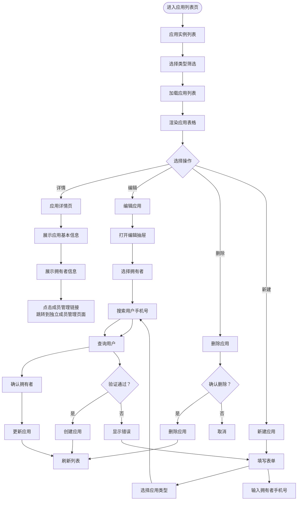

# 应用实例管理页面文档

## 概述

本文档描述应用实例管理页面的管理流程和核心业务规则。

**版本**: 2.0.0

---

## 目录

1. [页面流程图](#页面流程图)
2. [功能说明](#功能说明)
3. [业务规则](#业务规则)
4. [拥有者权限说明](#拥有者权限说明)

---

## 页面流程图



---

## 功能说明

### 应用实例列表页

| 功能 | 说明 |
|------|------|
| 列表展示 | 展示应用实例列表，支持分页 |
| 类型筛选 | 按应用类型筛选应用实例 |
| 新建应用 | 创建新的应用实例（需绑定拥有者） |
| 查看详情 | 查看应用详细信息及拥有者信息 |
| 编辑 | 修改应用信息，可变更拥有者 |
| 删除 | 删除应用实例 |
| 成员管理入口 | 跳转到成员管理页面（独立页面） |

### 应用详情页

| 功能 | 说明 |
|------|------|
| 基本信息 | 展示应用详细信息 |
| 拥有者信息 | 展示当前应用拥有者的用户信息 |
| 成员管理入口 | 提供跳转到成员管理页面的链接 |

### 编辑应用

| 功能 | 说明 |
|------|------|
| 修改应用信息 | 修改应用名称、描述、图标等 |
| 变更拥有者 | 将应用转让给其他用户（必须保留一个拥有者） |

---

## 业务规则

### 应用实例管理

- `appCode` 全局唯一，创建后不可修改
- 创建应用时必须选择应用类型
- 创建应用时必须绑定拥有者
- 应用实例必须始终有一个拥有者（不可解除绑定，只能变更）
- 应用实例删除前需检查是否有关联数据
- 没有设置拥有者的应用实例不允许使用（用户登录后获取的应用实例列表中没有 `ownerId IS NULL` 的应用实例）

### 内置应用实例

- 系统初始化时创建一个内置应用实例，`appCode = 'system-instance'`
- 内置应用实例归属于系统内置应用类型（`typeCode = 'system'`）
- 内置应用实例包含系统管理功能（应用类型管理、权限管理等）
- 内置应用实例的拥有者通常是系统管理员账号（如 admin）
- 内置应用实例与其他应用实例的处理逻辑相同，只是初始化方式不同

### 拥有者绑定

- 拥有者在两个地方记录：
  - `sys_app.ownerId`：标识应用实例的负责人（一对一，用于快速查询拥有者）
  - `sys_user_app`：记录拥有者可访问该应用（多对多）
- 一个用户可以拥有多个应用
- 拥有者变更时，原拥有者的拥有者角色自动移除，新拥有者自动绑定拥有者角色获得权限，同时更新 `sys_app.ownerId` 和 `sys_user_app` 表
- 拥有者是独立的身份标识，不属于角色体系

### 应用类型关联

- 应用实例必须归属于一个应用类型
- 应用实例继承应用类型的权限池配置
- 应用级角色的权限从应用类型权限池中选择

---

## 拥有者权限说明

### 拥有者的特殊地位

- **拥有者是应用的"老板"**：类似商铺所有者，拥有该应用的完整权限
- **权限来源**：拥有者通过绑定"拥有者角色"（`isOwner = 1` 的内置角色）获得权限，权限来源与其他成员相同
- **自动获得完整权限**：拥有者自动绑定应用类型的拥有者角色，该角色通常被分配了权限池的所有权限（开发者实际根据业务需求而定）
- **不可被分配角色**：拥有者在当前应用实体下不能有双重角色身份

### 拥有者权限范围

```
拥有者权限 = 拥有者角色 (isOwner=1) 的权限
           = 所有角色 permissionValue 的位运算 OR
           (拥有者角色的权限通常覆盖权限池中的所有权限)
```

### 拥有者变更流程

```
原拥有者 A ──[变更]──> 新拥有者 B
    │                        │
    ▼                        ▼
后端 Service 层事务处理：
  - 移除 A 的拥有者角色绑定    - B 自动绑定拥有者角色
    │                        │
    ▼                        ▼
A 不再是该应用的拥有者    B 成为新拥有者
```

**说明**:
- 拥有者变更在后端 Service 层用事务保证原子性
- 如果事务中的任意一步失败，整个操作回滚

### 拥有者与其他应用

- 拥有者可以是**其他应用实例**的成员（包括不同应用类型的应用）
- 拥有者身份是按应用实例独立管理的
- 一个用户可以同时是：
  - 应用 A 的拥有者
  - 应用 B 的成员（被分配了角色）
  - 应用 C 的成员（被分配了角色）

---

## 拥有者账号异常兜底机制

### 背景

当应用拥有者账号出现异常（如账号被禁用、离职、失联等）时，需要有一套完整的兜底机制来确保应用的持续管理和运营。

### 账号异常检测触发条件

| 异常类型 | 触发条件 | 检测方式 |
|----------|----------|----------|
| 账号被禁用 | 拥有者账号 `status = 0` | 定时任务扫描 |
| 账号被删除 | 拥有者账号被软删除或硬删除 | 外键约束/定时任务 |
| 拥有者失联 | 拥有者超过 30 天未登录且无法联系 | 人工上报 |
| 拥有者离职 | HR 系统同步离职状态 | 系统对接 |
| 应用无拥有者 | `sys_app.ownerId` 指向不存在用户 | 数据完整性检查 |

### 拥有者转移机制

#### 自动转移（系统托管场景）

**适用场景**:
- 系统内置应用（`appCode = 'system-instance'`）
- 配置了托管策略的应用

**转移规则**:
```
1. 检测原拥有者账号异常
2. 查找应用的"备用拥有者"（如有配置）
3. 如无备用拥有者，转移至系统管理员账号（phone = 'system-admin'）
4. 记录审计日志（operation_type = 'APP_OWNER_AUTO_TRANSFER'）
```

**配置方式**:
在 `sys_app` 表中增加备用拥有者字段：
```sql
ALTER TABLE sys_app ADD COLUMN backup_owner_id BIGINT DEFAULT NULL COMMENT '备用拥有者 ID';
```

#### 手动转移（超级管理员介入）

**适用场景**:
- 普通应用拥有者异常
- 需要人工确认的转移场景

**操作流程**:

1. **超级管理员发起转移**

```
PUT /api/v1/apps/{appId}/owner/transfer
{
  "newOwnerId": 123,           // 新拥有者用户 ID
  "reason": "原拥有者已离职",   // 转移原因
  "confirmBy": "admin-001"     // 超级管理员 ID
}
```

2. **权限校验**
   - 操作人必须是超级管理员（`isSuperAdmin = 1`）
   - 目标用户必须存在且账号正常

3. **执行转移**
   - 移除原拥有者的拥有者角色
   - 绑定新拥有者的拥有者角色
   - 更新 `sys_app.ownerId`
   - 更新 `sys_user_app` 记录
   - 记录审计日志

4. **通知相关方**
   - 通知新拥有者（站内信/邮件/短信）
   - 通知应用成员（可选）

### 应急操作示例

#### 场景一：拥有者账号被禁用

```sql
-- 1. 查询受影响的應用
SELECT a.id, a.app_code, a.app_name, u.name as owner_name, u.status
FROM sys_app a
JOIN sys_user u ON a.owner_id = u.id
WHERE u.status = 0;  -- 账号被禁用

-- 2. 将应用转移至系统管理员
UPDATE sys_app a
SET a.owner_id = (SELECT id FROM sys_user WHERE phone = '13800000000')
WHERE a.owner_id IN (SELECT id FROM sys_user WHERE status = 0);

-- 3. 更新 sys_user_app 记录（移除原拥有者，添加新拥有者）
-- 需要应用层 Service 处理，确保事务一致性
```

#### 场景二：拥有者离职

```typescript
// 伪代码示例：超级管理员执行拥有者转移
async function transferOwnerDueToResignation(appId: string, newOwnerId: number, adminId: number) {
  const app = await appRepository.findById(appId);
  const oldOwnerId = app.ownerId;

  // 权限校验
  const admin = await userRepository.findById(adminId);
  if (!admin.isSuperAdmin) {
    throw new Error('无权限执行拥有者转移');
  }

  // 开启事务
  const transaction = await db.beginTransaction();
  try {
    // 1. 移除原拥有者的拥有者角色
    await userAppRepository.removeOwnerRole(oldOwnerId, appId, transaction);

    // 2. 绑定新拥有者的拥有者角色
    const ownerRole = await roleRepository.findOwnerRoleByAppType(app.appTypeId);
    await userRoleRepository.bind({
      userId: newOwnerId,
      roleId: ownerRole.id,
      appId: appId
    }, transaction);

    // 3. 更新 sys_user_app
    await userAppRepository.remove(oldOwnerId, appId, transaction);
    await userAppRepository.add({
      userId: newOwnerId,
      appId: appId,
      isOwner: 1
    }, transaction);

    // 4. 更新 sys_app.ownerId
    await appRepository.update(appId, { ownerId: newOwnerId }, transaction);

    // 5. 记录审计日志
    await auditLogService.log({
      operatorId: adminId,
      operationType: 'APP_OWNER_MANUAL_TRANSFER',
      operationModule: 'APP',
      operationDesc: `因原拥有者离职，手动转移应用拥有者：${oldOwnerId} -> ${newOwnerId}`,
      appId: app.id,
      targetId: appId,
      beforeData: { ownerId: oldOwnerId },
      afterData: { ownerId: newOwnerId },
      status: 1
    });

    await transaction.commit();
  } catch (error) {
    await transaction.rollback();
    throw error;
  }
}
```

#### 场景三：应用无拥有者（数据异常修复）

```sql
-- 检测无拥有者或拥有者无效的应用
SELECT a.id, a.app_code, a.app_name, a.owner_id
FROM sys_app a
LEFT JOIN sys_user u ON a.owner_id = u.id
WHERE a.owner_id IS NULL OR u.id IS NULL;

-- 修复：转移至指定管理员
UPDATE sys_app
SET owner_id = (SELECT id FROM sys_user WHERE phone = '13800000000' LIMIT 1)
WHERE owner_id IS NULL OR owner_id NOT IN (SELECT id FROM sys_user);

-- 同步更新 sys_user_app
-- 需要在应用层处理，确保数据一致性
```

### 预防措施

1. **双拥有者机制（可选）**
   - 允许一个应用配置一个主拥有者和一个备用拥有者
   - 主拥有者异常时，备用拥有者自动接管

2. **定期健康检查**
   - 每周扫描所有应用，检查拥有者账号状态
   - 发现异常时，提前通知超级管理员

3. **拥有者变更通知**
   - 拥有者变更时，通知所有应用成员
   - 确保成员知晓当前应用负责人

---

## 相关文档

- [数据库实体设计](../数据库/数据库实体设计.md)
- [应用类型管理页面](./app-type-management.md)
- [角色管理页面](./role-management.md)
- [成员管理页面](./member-management.md)
- [权限池配置流程](../流程/权限池配置流程.md)
- [权限分配流程](../流程/权限分配流程.md)
- [审计日志设计](../接口/审计日志设计.md)

---

## 更新历史

| 版本 | 日期 | 变更说明 |
|------|------|----------|
| 2.0.0 | 2026-03-24 | 重构：移除用户绑定功能，明确拥有者权限，添加成员管理入口说明 |
| 1.0.0 | 2026-03-23 | 初始版本，从基础设施详细设计文档拆分 |

---

*本文档由基础设施页面详细设计文档拆分而来*
