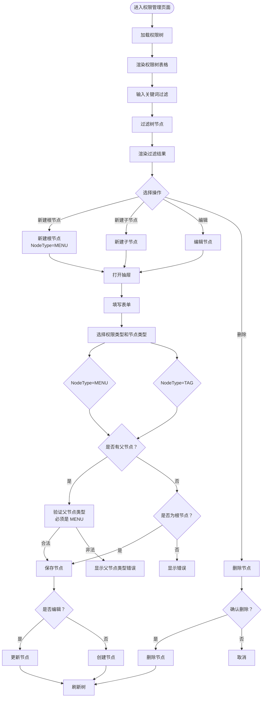

# 权限管理页面文档（普通权限 NORMAL）

## 概述

本文档描述**普通权限**（PermissionType=NORMAL）的管理页面和核心业务。

**适用范围**:
- **权限类型**: `PermissionType.NORMAL`
- **节点类型**: `MENU`（目录） + `TAG`（标签）
- **使用场景**: 移动端、非后台管理系统的权限管理
- **管理方式**: 手动创建、编辑、删除

> 💡 **提示**: PC 权限管理请使用 [PC 权限管理页面](./PC 权限管理页面.md)，支持路由同步功能。

**版本**: 2.0.0

---

## 目录

1. [权限树管理](#1-权限树管理)
2. [业务规则](#业务规则)

---

## 1. 权限树管理

### 页面流程图



### 功能说明

| 功能 | 说明 |
|------|------|
| 树形展示 | 以树形结构展示普通权限，支持展开/折叠 |
| 关键词过滤 | 输入关键词过滤树节点 |
| 新建根节点 | 创建根节点权限（NodeType=MENU） |
| 新建子节点 | 在选中节点下创建子节点（MENU 或 TAG） |
| 编辑节点 | 修改权限节点信息 |
| 删除节点 | 删除权限节点及其子节点 |

### 权限类型 hierarchy

```
ROOT (MENU)
└── 一级菜单 (MENU)
    ├── 二级菜单 (MENU)
    │   └── 标签权限 (TAG)
    └── 标签权限 (TAG)
```

### 业务规则

- `NodeType.TAG` 的 `parentId` 必须指向 `NodeType.MENU` 类型
- 根节点只能创建 `NodeType.MENU` 类型
- 删除节点时级联删除所有子节点
- **注意**: PC 权限和普通权限都支持 `permissionValue` 位运算权限值
  - PC 权限的 `permissionValue` 配置参考 [PC 权限管理页面](./PC 权限管理页面.md)
  - 普通权限的 `permissionValue` 可在此页面配置

---

## 业务规则

### 权限类型枚举

```typescript
enum PermissionType {
  PC = 'PC',                     // PC 权限
  NORMAL = 'NORMAL',             // 普通权限
}

enum NodeType {
  MENU = 'MENU',            // 目录（可与所有 PermissionType 组合使用）
  PAGE = 'PAGE',            // 页面（PermissionType=PC 时使用）
  TAG = 'TAG',              // 标签（PermissionType=NORMAL 时使用）
}

enum ShowMode {
  NORMAL = 'NORMAL',             // 普通模式
  DEV = 'DEV',                   // 开发模式
}
```

### PermissionType 与 NodeType 对应关系

| PermissionType | NodeType | 说明 |
|----------------|----------|------|
| PC | MENU | PC 菜单/目录 |
| PC | PAGE | PC 页面权限（支持 permissionValue） |
| NORMAL | MENU | 普通权限目录 |
| NORMAL | TAG | 普通权限标签（支持 permissionValue） |

**说明**:
- `NodeType.MENU` 可以与所有 `PermissionType` 组合使用，作为目录节点
- 2 种 `PermissionType` 类型的权限都可以渲染为树形结构的数据
- 树形结构中，`MENU` 节点作为目录/分组，`PAGE/TAG` 节点作为叶子节点
- `permissionValue` 字段同时适用于 PC 权限和普通权限
- PC 权限和普通权限的区别在于来源方式：PC 权限通过路由同步生成，普通权限通过手动添加

### 权限编码

- `permCode` 全局唯一，创建后不可修改
- 建议编码格式：
  - MENU: `menu.{module}.{name}`
  - TAG: `tag.{module}.{name}`

### 显示模式

- `showMode = NORMAL`: 普通模式，对所有用户可见
- `showMode = DEV`: 开发模式，仅对开发模式用户可见

---

## 相关文档

- [数据库实体设计](../03-数据库设计/数据库实体设计.md)
- [应用类型管理页面](./应用类型管理页面.md)
- [角色管理页面](./角色管理页面.md)
- [权限池配置流程](../04-业务流程/权限池配置流程.md)
- [PC 权限管理页面](./PC 权限管理页面.md) - PC 权限专用页面，支持路由同步

---

## 更新历史

| 版本 | 日期 | 变更说明 |
|------|------|----------|
| 2.0.0 | 2026-03-24 | 重构：使用新的 PermissionType 和 NodeType |
| 2.0.1 | 2026-03-28 | 明确适用范围：NORMAL 权限类型，移除 pcAction 相关描述 |
| 1.0.0 | 2026-03-23 | 初始版本，从基础设施详细设计文档拆分 |

---

*本文档由基础设施页面详细设计文档拆分而来*
