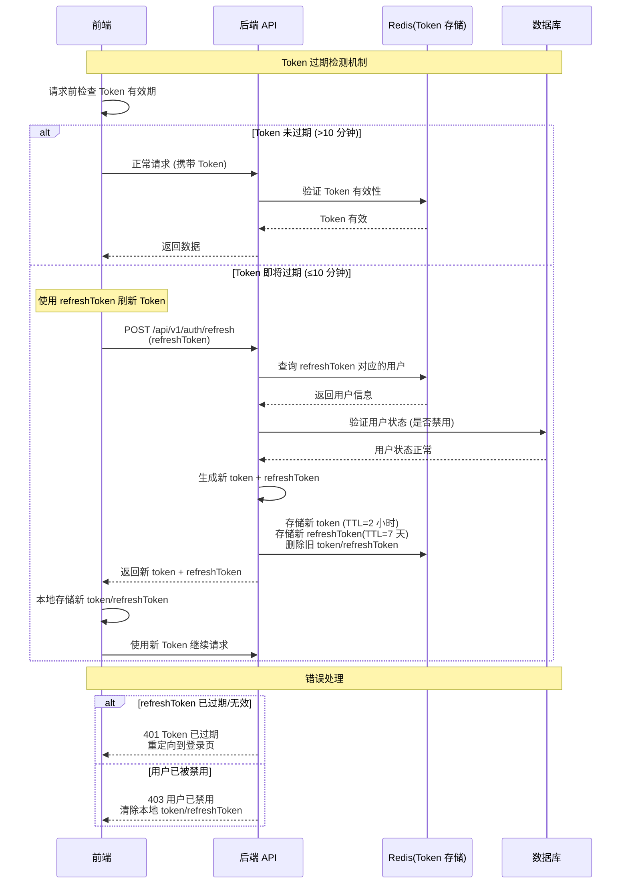

# 认证接口

> **相关页面**: 登录页、用户信息模块
>
> **数据结构**: [UserEntity](../数据库/数据库实体设计.md#15-userentity-用户实体)
>
> **相关接口**: [获取用户权限树](#6-获取用户权限树)

---

## 接口概览

| 接口 | 方法 | 使用场景 |
|------|------|----------|
| `/api/v1/auth/login` | POST | 用户登录 |
| `/api/v1/auth/logout` | POST | 用户登出 |
| `/api/v1/auth/me` | GET | 获取当前用户详细信息（含可访问应用列表） |
| `/api/v1/auth/refresh` | POST | 刷新 Token |
| `/api/v1/auth/password` | PUT | 修改密码 |
| `/api/v1/auth/permissions` | GET | 获取用户在应用下的权限树 |

---

## 1. 用户登录

**接口**: `POST /api/v1/auth/login`

**使用场景**: 用户在登录页输入账号密码后登录。

**请求体**:

```typescript
{
  identifier: string;        // 用户名或手机号
  password: string;          // 密码（明文，后端加密）
}
```

**返回数据**:

```typescript
{
  code: number;
  data: {
    token: string;           // JWT Token
    refreshToken: string;    // 刷新 Token
    expiresIn: number;       // 过期时间（秒）
    user: {
      id: string;
      username: string;
      nickname?: string;
      avatar?: string;
    };
  };
  message?: string;
}
```

**说明**:

- `identifier` 可以是 `username` 或 `phone`
- 由于注册时保证了 `username` 和 `phone` 不会交叉重复，登录时能唯一匹配用户
- 验证逻辑：`WHERE (username = ? OR phone = ?) AND password = ?`

---

## 2. 用户登出

**接口**: `POST /api/v1/auth/logout`

**使用场景**: 用户点击退出登录。

**请求头**: `Authorization: Bearer <token>`

**返回数据**:

```typescript
{
  code: number;
  data: null;
  message?: string;
}
```

---

## 3. 获取当前用户信息

**接口**: `GET /api/v1/auth/me`

**使用场景**:
- 应用初始化时获取当前登录用户详细信息及可访问的应用列表
- Token 刷新后重新获取用户信息
- 用户修改个人信息后刷新

**请求头**: `Authorization: Bearer <token>`

**返回数据**:

```typescript
{
  code: number;
  data: {
    // 用户详细信息
    id: string;
    username: string;
    nickname?: string;
    phone?: string;
    email?: string;
    avatar?: string;
    gender: number;                // 0-未知 1-男 2-女
    isDeveloper?: number;          // 1-是 0-否
    userStatus: number;            // 1-启用 0-禁用
    // 用户可访问的应用列表（包括拥有者和成员）
    apps: Array<{
      appId: string;
      appName: string;
      appCode: string;
      appLogo?: string;
      isOwner: boolean;            // 是否为拥有者
    }>;
  };
  message?: string;
}
```

---

## 4. 刷新 Token

**接口**: `POST /api/v1/auth/refresh`

**使用场景**: Token 即将过期时，使用 refreshToken 换取新 Token。

**请求体**:

```typescript
{
  refreshToken: string;
}
```

**返回数据**:

```typescript
{
  code: number;
  data: {
    token: string;
    refreshToken: string;
    expiresIn: number;
  };
  message?: string;
}
```

**Token 刷新机制时序图**:



**Token 刷新策略说明**:

| 场景 | 处理方式 |
|------|----------|
| Token 有效期 > 10 分钟 | 正常使用，无需刷新 |
| Token 有效期 ≤ 10 分钟 | 空闲时自动刷新（静默刷新） |
| 请求返回 401 | Token 已过期，尝试刷新 Token |
| 刷新 Token 失败 | 清除本地存储，跳转到登录页 |

**前端实现建议**:

```typescript
// Axios 拦截器示例
let isRefreshing = false
let refreshPromise: Promise<string> | null = null

axios.interceptors.response.use(
  response => response,
  async error => {
    const { config, response } = error
    const originalRequest = config

    // 401 错误且未尝试过刷新
    if (response?.status === 401 && !originalRequest._retry) {
      originalRequest._retry = true

      // 如果正在刷新，等待刷新完成
      if (isRefreshing) {
        const newToken = await refreshPromise
        originalRequest.headers.Authorization = `Bearer ${newToken}`
        return axios(originalRequest)
      }

      // 开始刷新 Token
      isRefreshing = true
      refreshPromise = refreshAccessToken()
        .then(newToken => {
          isRefreshing = false
          refreshPromise = null
          return newToken
        })
        .catch(err => {
          isRefreshing = false
          refreshPromise = null
          // 刷新失败，跳转到登录页
          redirectToLogin()
          return Promise.reject(err)
        })

      const newToken = await refreshPromise
      originalRequest.headers.Authorization = `Bearer ${newToken}`
      return axios(originalRequest)
    }

    return Promise.reject(error)
  }
)

// Token 刷新函数
async function refreshAccessToken(): Promise<string> {
  const refreshToken = localStorage.getItem('refreshToken')
  const response = await axios.post('/api/v1/auth/refresh', { refreshToken })
  const { token, refreshToken: newRefreshToken } = response.data.data

  // 本地存储新 Token
  localStorage.setItem('token', token)
  localStorage.setItem('refreshToken', newRefreshToken)

  return token
}
```

---

## 5. 修改密码

**接口**: `PUT /api/v1/auth/password`

**使用场景**: 用户在个人中心修改密码。

**请求头**: `Authorization: Bearer <token>`

**请求体**:

```typescript
{
  oldPassword: string;       // 原密码
  newPassword: string;       // 新密码
}
```

**返回数据**:

```typescript
{
  code: number;
  data: null;
  message?: string;
}
```

---

## 6. 获取用户权限树

**接口**: `GET /api/v1/auth/permissions`

**使用场景**:
- 用户选择应用后，获取该应用下的权限树
- 用于渲染系统菜单和构建路由
- 通常传入 `permissionType = PC` 获取 PC 权限树

**请求参数**:

| 参数 | 类型 | 必填 | 说明 |
|------|------|------|------|
| appCode | string | 是 | 应用编码 |
| permissionType | string | 否 | 权限类型：PC / NORMAL，默认 PC |

**返回数据**:

```typescript
{
  code: number;
  data: PermissionTreeNode[];
  message?: string;
}
```

**可能的错误码**: 见 [error-codes.md](./error-codes.md)
- `40402` - 应用不存在
- `40301` - 无权限访问

**PermissionTreeNode 结构**:

```typescript
interface PermissionTreeNode {
  id: string;
  permName: string;
  permCode: string;
  permDesc?: string;              // 权限描述
  permissionType: 'PC' | 'NORMAL';
  nodeType: 'MENU' | 'PAGE' | 'TAG';
  parentId?: string;
  routePath?: string;
  externalUrl?: string;           // v5.0 新增 - 外部链接
  iconName?: string;
  sortOrder: number;
  isVisible: number;
  isCache: number;
  showMode: 'NORMAL' | 'DEV';
  permStatus: number;             // 状态：1-启用 0-禁用
  // permissionValue 在 PC 权限的 PAGE 节点、普通权限的 TAG 节点时有效
  permissionValue?: bigint;       // v4.0 新增 - 位运算权限值
  children?: PermissionTreeNode[];
}
```

**约定式路由 (v5.0)**:
- `componentPath` 字段已移除，组件路径由前端根据 `permCode` 自动推导
- 推导规则：`permCode` = 路由路径 = 组件目录

---

## 更新历史

| 版本 | 日期 | 变更说明 |
|------|------|----------|
| 4.0.0 | 2026-03-28 | 位运算权限设计：PermissionTreeNode 新增 permissionValue 字段 |
| 1.0.0 | 2026-03-26 | 初始版本 |

---

*本文档由基础设施页面详细设计文档拆分而来*
