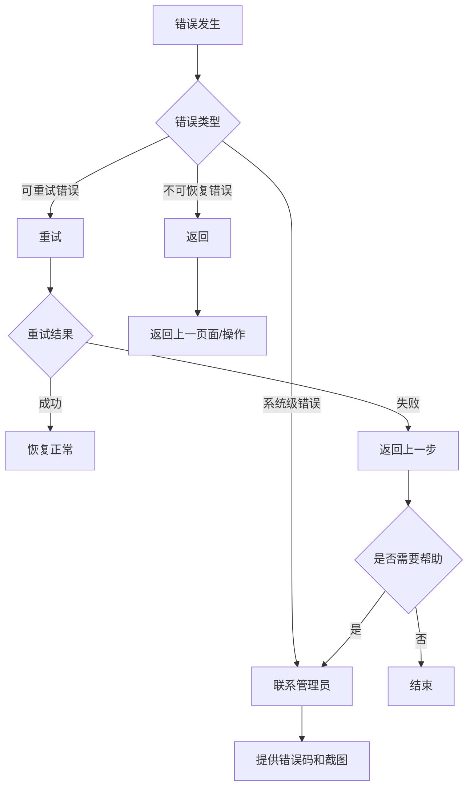
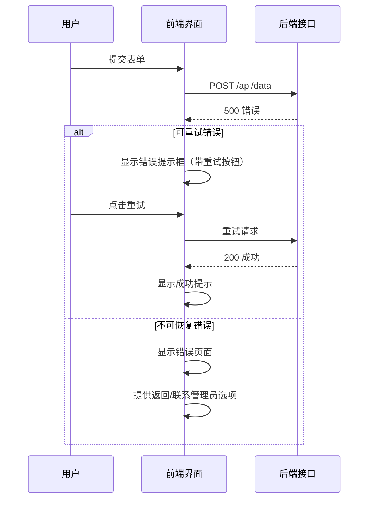

# 异常状态 UI 规范

> 定义系统中各类错误状态的 UI 表现、提示模板和恢复流程
>
> **版本**: 1.0.0 | **最后更新**: 2026-03-27

---

## 目录

1. [UI 组件规范](#1-ui 组件规范)
2. [错误提示模板](#2-错误提示模板)
3. [错误恢复流程](#3-错误恢复流程)
4. [可视化示例](#4-可视化示例)

---

## 1. UI 组件规范

### 1.1 错误提示框 (Error Alert)

用于页面内轻量级错误提示。

```
┌─────────────────────────────────────────────────────────┐
│ ⚠️  错误标题                                             │
│    错误详细描述，说明问题原因和建议操作。                 │
│                                         [确定] [重试]   │
└─────────────────────────────────────────────────────────┘
```

**规格**:
| 属性 | 值 |
|------|-----|
| 宽度 | 自适应内容，最大 480px |
| 背景色 | 浅红色 (#FFF5F5) |
| 边框色 | 红色 (#F56C6C) |
| 图标 | ⚠️ 警告三角图标 |
| 关闭方式 | 手动点击确定或自动 5 秒关闭（仅警告） |

**类型变体**:

| 类型 | 背景色 | 边框色 | 图标 | 使用场景 |
|------|--------|--------|------|----------|
| 成功 (Success) | #F0F9EB | #67C23A | ✓ | 操作成功确认 |
| 警告 (Warning) | #FFF3E0 | #E6A23C | ⚠️ | 需要注意的提示 |
| 错误 (Error) | #FFF5F5 | #F56C6C | ✕ | 操作失败 |
| 严重 (Critical) | #FEF0F0 | #F56C6C | ⛔ | 系统级严重错误 |

---

### 1.2 错误页面 (Error Page)

用于页面级错误展示（如 403、404、500 等）。

```
┌─────────────────────────────────────────────────────────┐
│                                                         │
│                      [错误图标]                          │
│                                                         │
│                   错误标题 (如 403)                      │
│              错误描述文字，说明问题原因                   │
│                                                         │
│           [返回首页]  [联系管理员]  [重试]               │
│                                                         │
└─────────────────────────────────────────────────────────┘
```

**规格**:
| 属性 | 值 |
|------|-----|
| 布局 | 垂直居中 |
| 图标尺寸 | 120x120px |
| 标题字号 | 24px |
| 描述字号 | 14px |
| 按钮间距 | 16px |

**错误代码对应页面**:

| 错误码 | 标题 | 描述 |
|--------|------|------|
| 403 | 禁止访问 | 您没有权限访问该页面，请联系管理员分配权限 |
| 404 | 页面未找到 | 您访问的页面不存在或已被移除 |
| 500 | 服务器错误 | 系统暂时繁忙，请稍后重试或联系管理员 |
| 503 | 服务不可用 | 系统维护中，请稍后访问 |

---

### 1.3 错误图标 (Error Icon)

用于_inline_错误状态标识。

| 状态 | 图标 | 颜色 | 使用场景 |
|------|------|------|----------|
| 成功 | ✓ | #67C23A | 表单验证通过、操作成功 |
| 警告 | ⚠️ | #E6A23C | 需要注意的提示 |
| 错误 | ✕ | #F56C6C | 表单验证失败、操作失败 |
| 加载 | ⟳ | #409EFF | 加载中、处理中 |

---

### 1.4 表单错误提示 (Form Error)

用于表单字段验证错误提示。

```
┌─────────────────────────────┐
│ 用户名                      │
│ ┌─────────────────────────┐ │
│ │ 输入框内容              │ │
│ └─────────────────────────┘ │
│ ✕ 用户名不能为空            │  ← 错误提示文字（红色）
└─────────────────────────────┘
```

**规格**:
| 属性 | 值 |
|------|-----|
| 提示位置 | 输入框下方 |
| 文字颜色 | #F56C6C |
| 文字大小 | 12px |
| 图标 | 前置错误图标 |

---

## 2. 错误提示模板

### 2.1 成功提示 (Success)

```typescript
{
  type: 'success',
  title: '操作成功',
  message: '数据已成功保存',
  duration: 3000,  // 3 秒自动关闭
  showClose: false
}
```

**使用场景**:
- 数据保存成功
- 提交成功
- 删除成功

---

### 2.2 警告提示 (Warning)

```typescript
{
  type: 'warning',
  title: '请注意',
  message: '该操作不可恢复，请确认是否继续？',
  duration: 5000,  // 5 秒自动关闭
  showClose: true,
  actions: [
    { text: '取消', type: 'secondary' },
    { text: '确认', type: 'primary' }
  ]
}
```

**使用场景**:
- 危险操作确认
- 数据即将过期提醒
- 配置变更提醒

---

### 2.3 错误提示 (Error)

```typescript
{
  type: 'error',
  title: '操作失败',
  message: '保存失败，请检查网络连接后重试',
  duration: 0,  // 不自动关闭
  showClose: true,
  actions: [
    { text: '重试', type: 'primary' },
    { text: '取消', type: 'secondary' }
  ]
}
```

**使用场景**:
- 网络请求失败
- 数据验证失败
- 权限不足

---

### 2.4 严重错误提示 (Critical)

```typescript
{
  type: 'critical',
  title: '系统错误',
  message: '系统发生严重错误，请保存当前工作并联系管理员',
  duration: 0,  // 不自动关闭
  showClose: false,
  actions: [
    { text: '联系管理员', type: 'primary' },
    { text: '返回首页', type: 'secondary' }
  ],
  errorCode: 'ERR_500_001'  // 错误追踪码
}
```

**使用场景**:
- 系统崩溃
- 数据损坏风险
- 安全事件

---

## 3. 错误恢复流程

### 3.1 恢复流程总览



---

### 3.2 重试机制 (Retry)

**适用场景**:
- 网络超时
- 临时服务不可用
- 并发冲突

**重试策略**:

```typescript
const retryConfig = {
  maxRetries: 3,           // 最大重试次数
  initialDelay: 1000,      // 初始延迟 1 秒
  maxDelay: 10000,         // 最大延迟 10 秒
  backoffMultiplier: 2,    // 退避倍数（指数退避）
  retryableErrors: [       // 可重试的错误码
    'NETWORK_TIMEOUT',
    'SERVICE_UNAVAILABLE',
    'CONCURRENT_CONFLICT'
  ]
};
```

**重试 UI 反馈**:

```
┌─────────────────────────────────────────┐
│ ⏳ 重试中... (1/3)                       │
│    正在重新提交数据，请稍候               │
│                                         │
│ ░░░░░░░░░░░░░░░░░░░░  [取消]            │
│    进度条                               │
└─────────────────────────────────────────┘
```

---

### 3.3 返回机制 (Go Back)

**适用场景**:
- 表单验证失败
- 权限不足
- 业务流程中断

**返回策略**:

| 场景 | 返回目标 | 是否保留数据 |
|------|----------|--------------|
| 表单验证失败 | 当前页面 | 保留已填写数据 |
| 权限不足 | 首页/上一页 | 保留上下文 |
| 页面未找到 | 首页 | 不保留 |
| 业务流程中断 | 流程起点 | 不保留 |

---

### 3.4 联系管理员 (Contact Admin)

**适用场景**:
- 系统级错误
- 数据异常
- 权限配置问题

**联系信息模板**:

```
┌─────────────────────────────────────────────────────────┐
│ 需要以下信息帮助管理员快速定位问题：                     │
│                                                         │
│ • 错误代码：ERR_500_001                                 │
│ • 发生时间：2026-03-27 14:30:00                         │
│ • 当前页面：/app/user-management                        │
│ • 操作步骤：1. 点击新增 2. 填写表单 3. 点击保存          │
│                                                         │
│ [复制错误信息]  [发送邮件给管理员]  [提交工单]           │
└─────────────────────────────────────────────────────────┘
```

---

## 4. 可视化示例

### 4.1 完整错误处理流程示例



---

### 4.2 前端组件示例

```tsx
// ErrorAlert.tsx - 错误提示框组件
interface ErrorAlertProps {
  type: 'success' | 'warning' | 'error' | 'critical';
  title: string;
  message: string;
  actions?: Array<{ text: string; onClick: () => void }>;
  onClose?: () => void;
}

const ErrorAlert: React.FC<ErrorAlertProps> = ({
  type, title, message, actions, onClose
}) => {
  const config = {
    success: { icon: '✓', bg: '#F0F9EB', border: '#67C23A' },
    warning: { icon: '⚠️', bg: '#FFF3E0', border: '#E6A23C' },
    error: { icon: '✕', bg: '#FFF5F5', border: '#F56C6C' },
    critical: { icon: '⛔', bg: '#FEF0F0', border: '#F56C6C' }
  }[type];

  return (
    <div className="error-alert" style={{ background: config.bg, borderColor: config.border }}>
      <span className="icon">{config.icon}</span>
      <div className="content">
        <h4>{title}</h4>
        <p>{message}</p>
      </div>
      <div className="actions">
        {actions?.map((action, i) => (
          <button key={i} onClick={action.onClick}>{action.text}</button>
        ))}
        {onClose && <button onClick={onClose}>关闭</button>}
      </div>
    </div>
  );
};
```

---

### 4.3 后端错误处理示例

```typescript
// errorHandler.ts - 统一错误处理
interface AppError {
  code: string;
  message: string;
  level: 'info' | 'warning' | 'error' | 'critical';
  retryable?: boolean;
}

function handleError(error: Error): AppError {
  // 根据错误类型映射到 UI 提示
  if (error.name === 'NetworkError') {
    return {
      code: 'NETWORK_ERROR',
      message: '网络连接失败，请检查网络后重试',
      level: 'error',
      retryable: true
    };
  }

  if (error.name === 'PermissionError') {
    return {
      code: 'PERMISSION_DENIED',
      message: '您没有权限执行该操作',
      level: 'warning',
      retryable: false
    };
  }

  // 默认系统错误
  return {
    code: 'SYSTEM_ERROR',
    message: '系统发生错误，请联系管理员',
    level: 'critical',
    retryable: false
  };
}
```

---

## 5. 无障碍访问 (Accessibility)

### 5.1 屏幕阅读器支持

- 错误提示框添加 `role="alert"` 属性
- 错误页面添加 `aria-live="polite"` 属性
- 错误图标添加 `aria-hidden="true"` 和 `alt=""` 属性

### 5.2 键盘导航

| 按键 | 行为 |
|------|------|
| Tab | 在操作按钮间切换 |
| Enter | 触发当前聚焦按钮 |
| Esc | 关闭可关闭的提示框 |

### 5.3 色彩对比度

- 错误文字与背景对比度至少 4.5:1
- 不单独依赖颜色传达信息（配合图标和文字）

---

## 相关文档

- [API 错误码定义](../06-API 接口/错误码定义.md) - 错误码列表
- [错误处理流程](../08-开发指南/错误处理流程.md) - 技术实现细节

---

## 更新历史

| 版本 | 日期 | 变更说明 |
|------|------|----------|
| 1.0.0 | 2026-03-27 | 初始版本，定义异常状态 UI 规范 |

---

*本文档是 P1-01 任务的产出，为系统提供统一的错误状态 UI 规范*
