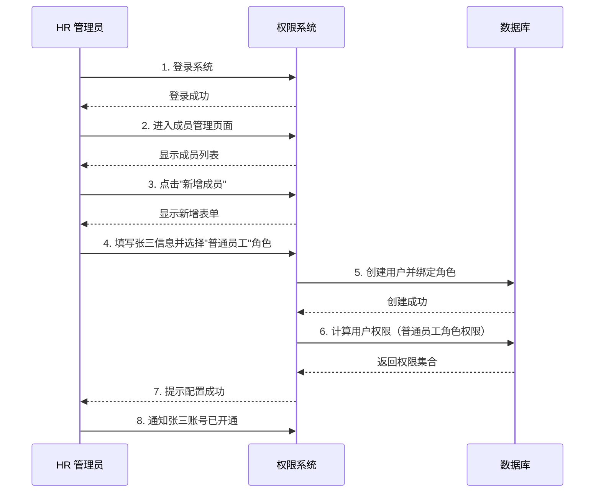
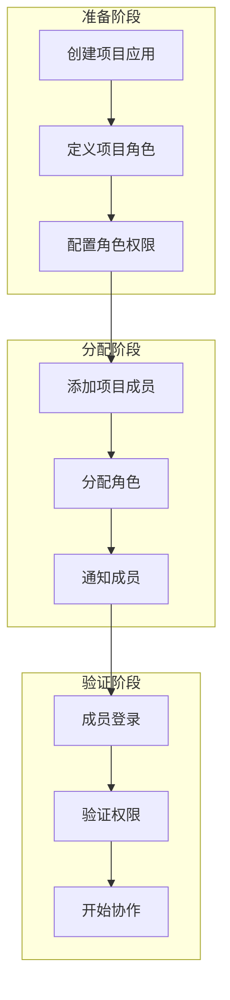
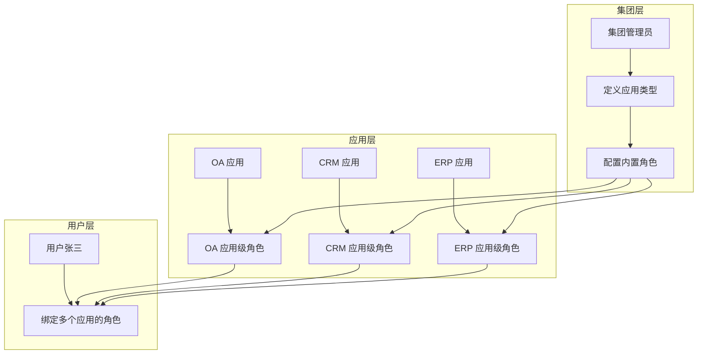
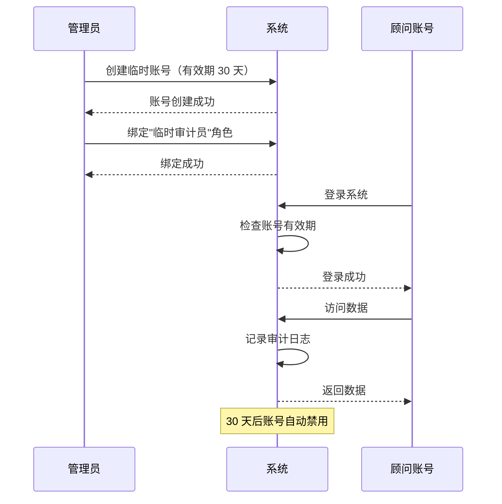
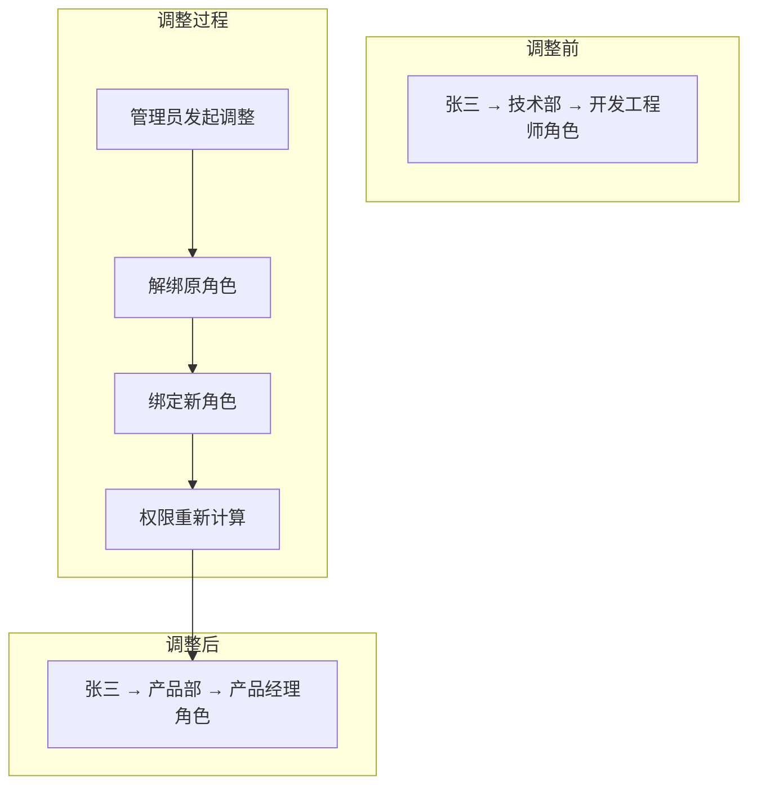

# 典型应用场景示例

> 展示权限系统在实际业务中的典型应用模式
>
> **版本**: 1.0.0 | **最后更新**: 2026-03-27

---

## 目录

1. [场景一：新员工入职权限配置](#1-场景一新员工入职权限配置)
2. [场景二：项目协作权限分配](#2-场景二项目协作权限分配)
3. [场景三：多应用统一管理](#3-场景三多应用统一管理)
4. [场景四：临时授权与审计](#4-场景四临时授权与审计)
5. [场景五：组织架构调整](#5-场景五组织架构调整)

---

## 1. 场景一：新员工入职权限配置

### 1.1 场景背景

**业务需求**: 公司新入职一名员工张三，需要为其配置 OA 系统中的基础权限，使其能够：
- 查看个人考勤记录
- 提交请假申请
- 查看公司公告

**涉及角色**:
- HR 管理员（操作者）
- 张三（新员工）
- 普通员工角色（预定义内置角色）

---

### 1.2 配置流程图



---

### 1.3 配置步骤

#### 步骤 1: 创建用户账号

```
路径：成员管理 → 新增成员

填写信息:
┌─────────────────────────────────────────┐
│ 姓名：张三                              │
│ 手机号：138****1234                     │
│ 邮箱：zhangsan@company.com              │
│ 所属应用：OA 系统                        │
│ 初始角色：普通员工（内置）               │
└─────────────────────────────────────────┘
```

#### 步骤 2: 确认角色权限

在分配前，查看"普通员工"角色的权限详情：

| 权限 ID | 权限名称 | permissionValue (位运算) |
|---------|----------|-------------------------|
| P001 | 考勤管理 | VIEW(32n) |
| P002 | 请假申请 | ADD(1n) | VIEW(32n) |
| P003 | 公告查看 | VIEW(32n) |

#### 步骤 3: 验证权限

```bash
# 以张三身份登录，验证权限
GET /api/permissions/my

响应:
{
  "code": 0,
  "data": {
    "P001": { "permissionValue": 32n },
    "P002": { "permissionValue": 33n },
    "P003": { "permissionValue": 32n }
  }
}
```

---

### 1.4 注意事项

| 注意点 | 说明 |
|--------|------|
| 角色选择 | 优先使用内置角色，避免重复创建 |
| 权限最小化 | 仅分配工作所需的最小权限 |
| 试用期限 | 可设置临时权限，试用期后调整 |

---

## 2. 场景二：项目协作权限分配

### 2.1 场景背景

**业务需求**: 某公司启动"天马项目"，需要为项目组成员分配项目管理系统中的权限：
- 项目经理：完整项目管理权限
- 开发人员：任务执行权限
- 测试人员：测试相关权限
- 观察员：只读权限

**涉及角色**:
- 项目管理员（操作者）
- 项目级角色（应用级角色，非内置）

---

### 2.2 场景流程图



---

### 2.3 配置步骤

#### 步骤 1: 创建项目级角色

```
路径：角色管理 → 新增角色

角色信息:
┌─────────────────────────────────────────┐
│ 角色名称：天马项目 - 开发工程师           │
│ 角色编码：tm_dev_engineer               │
│ 角色类型：应用级角色                     │
│ 所属应用：天马项目管理系统               │
│ 角色描述：负责天马项目的开发任务执行     │
└─────────────────────────────────────────┘
```

#### 步骤 2: 为角色分配权限

从权限池中选择所需权限：

| 权限模块 | 权限项 | permissionValue (位运算) |
|----------|--------|-------------------------|
| 任务管理 | 任务列表 | VIEW(32n) |
| 任务管理 | 任务详情 | VIEW(32n) |
| 任务管理 | 我的任务 | VIEW(32n) \| EDIT(2n) |
| 代码管理 | 代码仓库 | VIEW(32n) \| ADD(1n) |
| 文档管理 | 项目文档 | VIEW(32n) \| EDIT(2n) |

#### 步骤 3: 批量添加项目成员

```typescript
// 批量分配成员到角色
POST /api/role/tm_dev_engineer/members/batch

请求体:
{
  "memberIds": ["user001", "user002", "user003"],
  "appId": "tm_project_001"
}

响应:
{
  "code": 0,
  "message": "成功添加 3 名成员到角色"
}
```

---

### 2.4 项目成员权限总览

| 成员 | 角色 | 核心权限 |
|------|------|----------|
| 李四（项目经理）| tm_project_manager | 全部权限 |
| 王五（开发）| tm_dev_engineer | 任务执行、代码提交 |
| 赵六（开发）| tm_dev_engineer | 任务执行、代码提交 |
| 钱七（测试）| tm_qa_engineer | 测试用例管理、缺陷管理 |
| 孙八（观察员）| tm_viewer | 只读权限 |

---

### 2.5 注意事项

| 注意点 | 说明 |
|--------|------|
| 角色命名 | 使用项目前缀避免冲突（如 tm_） |
| 权限回收 | 项目结束后及时回收权限 |
| 审计日志 | 记录所有权限分配操作 |

---

## 3. 场景三：多应用统一管理

### 3.1 场景背景

**业务需求**: 集团公司有多个应用系统（OA、CRM、ERP），需要实现：
- 统一用户账号体系
- 统一角色管理
- 分级授权（集团管理员 → 应用管理员）

**涉及概念**:
- 应用类型（AppType）
- 应用类型中心模式
- 内置角色与应用级角色

---

### 3.2 架构图



---

### 3.3 配置步骤

#### 步骤 1: 定义应用类型

```
路径：应用类型管理 → 新增应用类型

应用类型信息:
┌─────────────────────────────────────────┐
│ 类型名称：办公自动化 (OA)                │
│ 类型编码：OA                            │
│ 支持多应用：是（集团可有多个 OA 实例）     │
│ 内置角色:                               │
│   - OA 管理员                           │
│   - OA 普通用户                         │
│   - OA 审计员                           │
└─────────────────────────────────────────┘
```

#### 步骤 2: 为应用类型配置权限池

| 权限 ID | 权限名称 | 内置角色可选 |
|---------|----------|--------------|
| OA001 | 考勤管理 | 管理员、普通用户 |
| OA002 | 审批管理 | 管理员、普通用户 |
| OA003 | 系统配置 | 仅管理员 |
| OA004 | 审计日志 | 仅审计员 |

#### 步骤 3: 创建具体应用实例

```
路径：应用管理 → 新增应用

应用信息:
┌─────────────────────────────────────────┐
│ 应用名称：集团 OA 系统                    │
│ 应用编码：GROUP_OA                       │
│ 应用类型：OA                            │
│ 拥有者：admin                            │
└─────────────────────────────────────────┘
```

#### 步骤 4: 应用级角色扩展

应用管理员可在内置角色基础上，创建应用级角色：

| 角色名称 | 基于内置角色 | 额外权限 |
|----------|--------------|----------|
| 考勤专员 | OA 普通用户 | 考勤数据导出 |
| 审批主管 | OA 普通用户 | 审批流程配置 |

---

### 3.4 用户统一视图

用户在统一门户中可查看所有应用的权限：

```
张三的权限总览:
┌─────────────────────────────────────────────────────────┐
│ 应用         角色              核心权限                  │
├─────────────────────────────────────────────────────────┤
│ OA 系统      普通用户          考勤查看、审批提交         │
│ CRM 系统     销售代表          客户管理、订单管理         │
│ ERP 系统     采购专员          采购申请、供应商管理       │
└─────────────────────────────────────────────────────────┘
```

---

### 3.5 注意事项

| 注意点 | 说明 |
|--------|------|
| 应用类型编码 | 全局唯一，使用前需检查 |
| 内置角色权限 | 定义各应用类型的标准权限集 |
| 应用级角色 | 不能超出内置角色的权限范围 |
| 拥有者机制 | 每个应用必须有且仅有一个拥有者 |

---

## 4. 场景四：临时授权与审计

### 4.1 场景背景

**业务需求**: 外部顾问需要临时访问系统进行审计工作：
- 授权期限：2026-03-01 至 2026-03-31
- 权限范围：只读查看所有模块
- 审计要求：记录所有操作

---

### 4.2 临时授权流程



---

### 4.3 配置步骤

#### 步骤 1: 创建临时角色

```
角色信息:
┌─────────────────────────────────────────┐
│ 角色名称：临时审计员                     │
│ 有效期：2026-03-01 至 2026-03-31         │
│ 权限范围：全部只读                       │
└─────────────────────────────────────────┘
```

#### 步骤 2: 配置只读权限

| 权限模块 | permissionValue | 说明 |
|----------|-----------------|------|
| 用户管理 | VIEW(32n) | 仅查看 |
| 角色管理 | VIEW(32n) | 仅查看 |
| 应用管理 | VIEW(32n) | 仅查看 |
| 审计日志 | VIEW(32n) \| EXPORT(8n) | 查看和导出 |

#### 步骤 3: 设置自动过期

```typescript
// 临时角色配置
POST /api/role/temp_auditor

请求体:
{
  "roleName": "临时审计员",
  "permissions": [...],
  "expiresAt": "2026-03-31T23:59:59.000Z",
  "autoDisable": true  // 到期自动禁用
}
```

---

### 4.4 审计日志示例

| 时间 | 用户 | 操作 | 资源 | 结果 |
|------|------|------|------|------|
| 2026-03-15 10:00 | 顾问 A | 查看用户列表 | /api/users | 成功 |
| 2026-03-15 10:05 | 顾问 A | 导出审计日志 | /api/audit/export | 成功 |
| 2026-03-15 10:10 | 顾问 A | 尝试删除用户 | DELETE /api/users/1 | 拒绝（无权限） |

---

### 4.5 注意事项

| 注意点 | 说明 |
|--------|------|
| 最小权限 | 临时账号仅分配必要权限 |
| 有效期 | 必须设置明确的过期时间 |
| 审计追踪 | 记录所有临时账号的操作 |
| 自动回收 | 到期自动禁用，避免遗忘 |

---

## 5. 场景五：组织架构调整

### 5.1 场景背景

**业务需求**: 公司组织架构调整，需要：
- 将张三从"技术部"调到"产品部"
- 收回技术部权限
- 分配产品部权限
- 保留跨部门协作权限（如有需要）

---

### 5.2 调整流程图



---

### 5.3 配置步骤

#### 步骤 1: 查看当前权限

```bash
# 查看张三当前角色绑定
GET /api/user/zhangsan/roles

响应:
{
  "code": 0,
  "data": {
    "currentApp": "tech_department",
    "roles": [
      { "id": "role_dev", "name": "开发工程师", "type": "应用级" }
    ]
  }
}
```

#### 步骤 2: 解绑原角色

```bash
# 解绑技术部角色
POST /api/user/zhangsan/roles/unbind

请求体:
{
  "appId": "tech_department",
  "roleIds": ["role_dev"]
}
```

#### 步骤 3: 绑定新角色

```bash
# 绑定产品部角色
POST /api/user/zhangsan/roles/bind

请求体:
{
  "appId": "product_department",
  "roleIds": ["role_pm"]
}
```

#### 步骤 4: 验证权限变更

```bash
# 验证新权限
GET /api/permissions/zhangsan/effective

响应:
{
  "code": 0,
  "data": {
    "currentApp": "product_department",
    "permissions": {
      "P101": ["view", "create", "edit"],  // 产品管理
      "P102": ["view"],                     // 需求查看
      "P103": ["view", "comment"]           // 评审参与
    }
  }
}
```

---

### 5.4 跨部门协作处理

如张三需要保留部分技术部权限（如代码审查）：

```bash
# 添加跨部门角色绑定
POST /api/user/zhangsan/roles/bind

请求体:
{
  "appId": "tech_department",
  "roleIds": ["role_reviewer"],  // 代码审查员（只读）
  "crossDepartment": true
}
```

调整后张三的权限：

| 应用 | 角色 | 权限 |
|------|------|------|
| 产品部（主） | 产品经理 | 产品管理、需求管理 |
| 技术部（跨） | 代码审查员 | 代码审查（只读） |

---

### 5.5 注意事项

| 注意点 | 说明 |
|--------|------|
| 权限回收 | 调岗后及时回收原权限 |
| 权限保留 | 跨部门协作需明确保留范围 |
| 审计记录 | 记录所有组织架构调整操作 |
| 通知相关方 | 调整后通知相关人员 |

---

## 附录：场景对比表

| 场景 | 核心操作 | 涉及角色类型 | 关键配置 |
|------|----------|--------------|----------|
| 新员工入职 | 用户创建 + 角色绑定 | 内置角色 | 角色选择 |
| 项目协作 | 项目角色创建 + 批量分配 | 应用级角色 | 项目权限池 |
| 多应用管理 | 应用类型定义 + 实例创建 | 内置 + 应用级 | 应用类型中心 |
| 临时授权 | 临时角色 + 有效期设置 | 临时角色 | 自动过期 |
| 组织架构调整 | 角色解绑 + 重新绑定 | 混合 | 权限回收 |

---

## 相关文档

- [权限分配流程](../04-业务流程/权限分配流程.md) - 权限分配详细流程
- [角色管理页面](../05-页面设计/角色管理页面.md) - 角色管理操作说明
- [成员管理页面](../05-页面设计/成员管理页面.md) - 成员管理操作说明
- [审计日志设计](../06-API 接口/审计日志设计.md) - 审计日志记录规范

---

## 更新历史

| 版本 | 日期 | 变更说明 |
|------|------|----------|
| 1.0.0 | 2026-03-27 | 初始版本，包含 5 个典型应用场景 |

---

*本文档是 P1-02 任务的产出，展示权限系统在实际业务中的典型应用模式*
