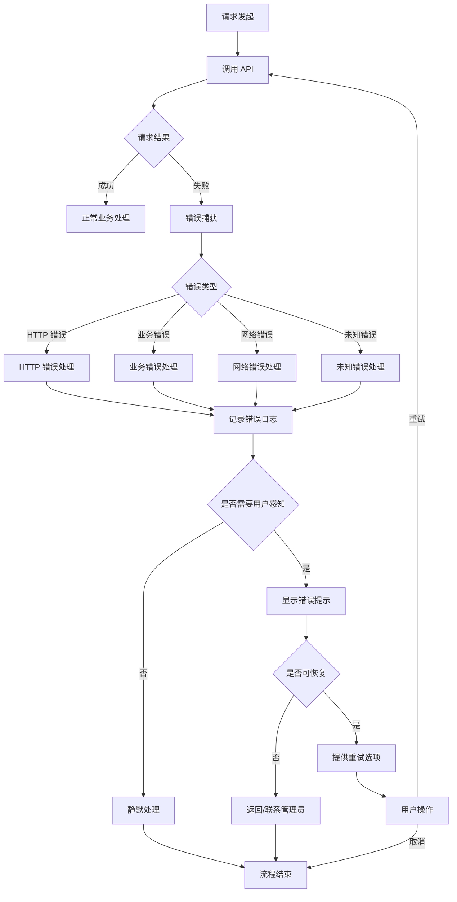
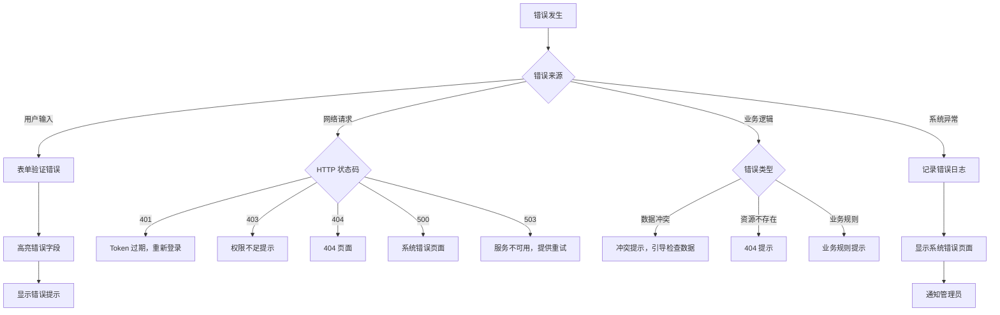

# 错误处理流程规范

> 定义系统中错误处理的标准流程、示例代码和最佳实践
>
> **版本**: 1.0.0 | **最后更新**: 2026-03-27

---

## 目录

1. [错误处理流程图](#1-错误处理流程图)
2. [标准处理步骤](#2-标准处理步骤)
3. [前端错误处理示例](#3-前端错误处理示例)
4. [后端错误处理示例](#4-后端错误处理示例)
5. [错误分类与处理策略](#5-错误分类与处理策略)

---

## 1. 错误处理流程图

### 1.1 整体错误处理流程



---

### 1.2 错误处理职责分工

```mermaid
swimlaneDiagram
    swimlane 前端 {
        A[捕获请求错误] --> B[错误类型识别]
        B --> C[显示错误提示]
        C --> D[提供恢复选项]
    }

    swimlane 后端 {
        E[捕获业务异常] --> F[记录错误日志]
        F --> G[返回标准错误响应]
        G --> H[错误码 + 错误消息]
    }

    swimlane 日志系统 {
        I[接收错误日志] --> J[持久化存储]
        J --> K[错误告警（可选）]
    }

    A --> E
    D --> E
    H --> I
```

---

## 2. 标准处理步骤

### 2.1 四步处理法

```
┌─────────────────────────────────────────────────────────────────┐
│ 步骤 1: 捕获 (Catch)                                            │
│ - 使用 try-catch 包裹异步操作                                    │
│ - 使用全局错误处理器捕获未捕获错误                              │
│ - 使用拦截器统一处理 HTTP 错误                                   │
└─────────────────────────────────────────────────────────────────┘
                              ▼
┌─────────────────────────────────────────────────────────────────┐
│ 步骤 2: 记录 (Log)                                              │
│ - 记录错误堆栈到日志系统                                        │
│ - 记录错误上下文（用户 ID、请求参数、时间戳）                    │
│ - 严重错误触发告警通知                                          │
└─────────────────────────────────────────────────────────────────┘
                              ▼
┌─────────────────────────────────────────────────────────────────┐
│ 步骤 3: 展示 (Display)                                          │
│ - 根据错误类型选择合适的 UI 提示                                  │
│ - 提供友好的错误描述，避免技术术语                               │
│ - 提供错误代码便于追踪                                          │
└─────────────────────────────────────────────────────────────────┘
                              ▼
┌─────────────────────────────────────────────────────────────────┐
│ 步骤 4: 恢复 (Recover)                                          │
│ - 可恢复错误：提供重试按钮                                      │
│ - 不可恢复错误：提供返回或联系管理员选项                         │
│ - 系统级错误：引导用户保存工作并退出                             │
└─────────────────────────────────────────────────────────────────┘
```

---

### 2.2 各步骤详细说明

#### 步骤 1: 捕获 (Catch)

| 错误来源 | 捕获方式 | 说明 |
|----------|----------|------|
| HTTP 请求 | Axios 拦截器 | 统一处理 HTTP 状态码错误 |
| 业务逻辑 | try-catch | 包裹异步操作 |
| 全局错误 | window.onerror | 捕获未处理的 JS 错误 |
| Vue 错误 | errorCaptured | 组件级错误捕获 |

#### 步骤 2: 记录 (Log)

| 日志级别 | 使用场景 | 记录内容 |
|----------|----------|----------|
| ERROR | 系统错误、业务异常 | 错误堆栈、请求参数、用户信息 |
| WARN | 警告信息、降级处理 | 警告原因、影响范围 |
| INFO | 重要操作记录 | 操作类型、操作结果 |

#### 步骤 3: 展示 (Display)

| 错误级别 | UI 组件 | 展示方式 |
|----------|---------|----------|
| 轻量提示 | Toast | 3 秒自动消失 |
| 一般错误 | Alert | 需要手动关闭 |
| 严重错误 | Dialog | 模态框，强制用户注意 |
| 页面错误 | Error Page | 整页错误展示 |

#### 步骤 4: 恢复 (Recover)

| 恢复方式 | 适用场景 | 用户操作 |
|----------|----------|----------|
| 自动重试 | 网络波动 | 系统自动执行 |
| 手动重试 | 临时故障 | 用户点击重试 |
| 返回上一步 | 流程中断 | 用户点击返回 |
| 联系管理员 | 系统错误 | 提供联系方式 |

---

## 3. 前端错误处理示例

### 3.1 Axios 拦截器统一处理

```typescript
// utils/http-error-handler.ts

import axios, { AxiosError, InternalAxiosRequestConfig } from 'axios';
import { showErrorAlert } from '@/components/ErrorAlert';
import { logError } from '@/utils/logger';

// 请求拦截器
axios.interceptors.request.use(
  (config: InternalAxiosRequestConfig) => {
    // 添加请求 ID 用于追踪
    config.headers['X-Request-ID'] = generateRequestId();
    return config;
  },
  (error) => {
    logError('Request Error', error);
    return Promise.reject(error);
  }
);

// 响应拦截器
axios.interceptors.response.use(
  (response) => {
    // 检查业务错误码
    const { code, message } = response.data;
    if (code !== 0) {
      handleBusinessError(code, message);
      return Promise.reject(new Error(message));
    }
    return response;
  },
  (error: AxiosError) => {
    handleHttpError(error);
    return Promise.reject(error);
  }
);

// HTTP 错误处理
function handleHttpError(error: AxiosError) {
  const status = error.response?.status;
  const requestId = error.response?.headers?.['x-request-id'];

  const errorMap: Record<number, string> = {
    400: '请求参数错误',
    401: '登录已过期，请重新登录',
    403: '没有权限访问该资源',
    404: '请求的资源不存在',
    409: '资源冲突，请检查数据',
    500: '系统内部错误',
    503: '服务暂时不可用'
  };

  const message = errorMap[status!] || `网络请求失败 (${status || 'Unknown'})`;

  // 记录错误日志
  logError('HTTP Error', {
    status,
    message: error.message,
    requestId,
    url: error.config?.url
  });

  // 显示错误提示
  showErrorAlert({
    type: 'error',
    title: '请求失败',
    message: `${message}${requestId ? ` (错误码：${requestId})` : ''}`,
    actions: status === 503 ? [{ text: '重试', onClick: () => window.location.reload() }] : undefined
  });
}

// 业务错误处理
function handleBusinessError(code: number, message: string) {
  // 特定业务错误码处理
  if (code === 40101) {
    // Token 过期，跳转到登录页
    setTimeout(() => {
      window.location.href = '/login';
    }, 2000);
  }

  logError('Business Error', { code, message });

  showErrorAlert({
    type: 'error',
    title: '操作失败',
    message
  });
}
```

---

### 3.2 组件级错误处理

```vue
<!-- components/UserForm.vue -->

<template>
  <div class="user-form">
    <el-form :model="form" @submit.prevent="handleSubmit">
      <el-form-item label="用户名">
        <el-input v-model="form.username" />
      </el-form-item>

      <el-button type="primary" @click="handleSubmit" :loading="isLoading">
        保存
      </el-button>
    </el-form>

    <!-- 错误提示 -->
    <ErrorAlert
      v-if="error"
      :type="error.type"
      :title="error.title"
      :message="error.message"
      :actions="error.actions"
      @close="error = null"
    />
  </div>
</template>

<script setup lang="ts">
import { ref } from 'vue';
import { createUser } from '@/api/user';
import { showErrorAlert, showSuccessAlert } from '@/components/Alert';

interface FormError {
  type: 'success' | 'warning' | 'error';
  title: string;
  message: string;
  actions?: Array<{ text: string; onClick: () => void }>;
}

const form = ref({ username: '' });
const isLoading = ref(false);
const error = ref<FormError | null>(null);

const handleSubmit = async () => {
  isLoading.value = true;
  error.value = null;

  try {
    await createUser(form.value);
    showSuccessAlert({
      title: '保存成功',
      message: '用户信息已保存'
    });
  } catch (err: any) {
    // 表单验证失败
    if (err.code === 42201) {
      error.value = {
        type: 'error',
        title: '验证失败',
        message: err.message,
        actions: [{ text: '重试', onClick: handleSubmit }]
      };
    }
    // 重复用户名
    else if (err.code === 40901) {
      error.value = {
        type: 'warning',
        title: '用户名已存在',
        message: '该用户名已被注册，请使用其他用户名',
        actions: [{ text: '返回修改', onClick: () => {} }]
      };
    }
    // 其他错误
    else {
      error.value = {
        type: 'error',
        title: '保存失败',
        message: err.message || '请稍后重试',
        actions: [{ text: '重试', onClick: handleSubmit }]
      };
    }
  } finally {
    isLoading.value = false;
  }
};
</script>
```

---

### 3.3 全局错误边界

```typescript
// utils/global-error-handler.ts

/**
 * 全局错误处理器
 */
export function setupGlobalErrorHandler() {
  // 捕获未处理的 Promise 拒绝
  window.addEventListener('unhandledrejection', (event) => {
    event.preventDefault();
    logError('Unhandled Promise Rejection', event.reason);

    showErrorAlert({
      type: 'error',
      title: '系统错误',
      message: '发生未知错误，请刷新页面重试',
      actions: [{ text: '刷新页面', onClick: () => window.location.reload() }]
    });
  });

  // 捕获全局 JavaScript 错误
  window.addEventListener('error', (event) => {
    event.preventDefault();
    logError('Global JavaScript Error', {
      message: event.message,
      filename: event.filename,
      lineno: event.lineno,
      colno: event.colno
    });
  });
}

/**
 * 错误日志记录
 */
function logError(source: string, error: any) {
  const errorLog = {
    timestamp: new Date().toISOString(),
    source,
    message: error?.message || String(error),
    stack: error?.stack,
    userId: getCurrentUserId(),
    url: window.location.href,
    userAgent: navigator.userAgent
  };

  // 发送到日志服务
  fetch('/api/log/error', {
    method: 'POST',
    headers: { 'Content-Type': 'application/json' },
    body: JSON.stringify(errorLog)
  }).catch(() => {
    // 日志发送失败，静默处理
  });
}
```

---

## 4. 后端错误处理示例

### 4.1 统一异常类定义

```typescript
// exceptions/app-exception.ts

/**
 * 应用异常基类
 */
export class AppException extends Error {
  constructor(
    public code: number,
    message: string,
    public data?: any
  ) {
    super(message);
    this.name = 'AppException';
  }
}

/**
 * 业务异常
 */
export class BusinessException extends AppException {
  constructor(message: string, code: number = 40000) {
    super(code, message);
    this.name = 'BusinessException';
  }
}

/**
 * 权限异常
 */
export class PermissionException extends AppException {
  constructor(message: string = '没有权限执行该操作') {
    super(40300, message);
    this.name = 'PermissionException';
  }
}

/**
 * 验证异常
 */
export class ValidationException extends AppException {
  constructor(
    message: string,
    public fieldErrors: Array<{ field: string; message: string }>
  ) {
    super(42200, message);
    this.name = 'ValidationException';
  }
}

/**
 * 资源不存在异常
 */
export class NotFoundException extends AppException {
  constructor(resource: string) {
    super(40400, `${resource}不存在`);
    this.name = 'NotFoundException';
  }
}

/**
 * 资源冲突异常
 */
export class ConflictException extends AppException {
  constructor(message: string) {
    super(40900, message);
    this.name = 'ConflictException';
  }
}
```

---

### 4.2 全局异常过滤器

```typescript
// middleware/error-handler.ts

import { Request, Response, NextFunction } from 'express';
import { AppException, BusinessException, ValidationException } from '../exceptions/app-exception';
import { logError } from '../utils/logger';

/**
 * 全局异常处理中间件
 */
export function errorHandler(
  err: Error,
  req: Request,
  res: Response,
  next: NextFunction
) {
  const requestId = req.headers['x-request-id'] as string;

  // 记录错误日志
  logError({
    requestId,
    method: req.method,
    url: req.url,
    userId: (req as any).user?.id,
    error: err
  });

  // 应用异常（已知错误）
  if (err instanceof AppException) {
    return res.status(getHttpStatus(err.code)).json({
      code: err.code,
      message: err.message,
      data: (err as any).data,
      fieldErrors: (err as ValidationException).fieldErrors,
      requestId
    });
  }

  // 未知错误（系统内部错误）
  logError('Unhandled Exception', err);

  return res.status(500).json({
    code: 50000,
    message: '系统内部错误，请联系管理员',
    requestId
  });
}

/**
 * 获取 HTTP 状态码
 */
function getHttpStatus(code: number): number {
  if (code >= 40000 && code < 40100) return 400;
  if (code >= 40100 && code < 40200) return 401;
  if (code >= 40300 && code < 40400) return 403;
  if (code >= 40400 && code < 40500) return 404;
  if (code >= 40900 && code < 41000) return 409;
  if (code >= 42200 && code < 42300) return 422;
  return 500;
}
```

---

### 4.3 业务层错误处理示例

```typescript
// services/user.service.ts

import {
  BusinessException,
  NotFoundException,
  ConflictException,
  ValidationException
} from '../exceptions/app-exception';
import { UserRepository } from '../repositories/user.repository';

export class UserService {
  constructor(private userRepository: UserRepository) {}

  /**
   * 创建用户
   */
  async createUser(data: CreateUserDto) {
    // 1. 验证数据
    const validationErrors = this.validateUser(data);
    if (validationErrors.length > 0) {
      throw new ValidationException('数据验证失败', validationErrors);
    }

    // 2. 检查用户名是否已存在
    const existingUser = await this.userRepository.findByUsername(data.username);
    if (existingUser) {
      throw new ConflictException('用户名已存在');
    }

    // 3. 创建用户
    try {
      const user = await this.userRepository.create(data);
      return user;
    } catch (dbError: any) {
      // 数据库错误转换为业务异常
      if (dbError.code === 'ER_DUP_ENTRY') {
        throw new ConflictException('数据已存在');
      }
      throw new BusinessException('创建用户失败');
    }
  }

  /**
   * 获取用户详情
   */
  async getUserById(id: string) {
    const user = await this.userRepository.findById(id);
    if (!user) {
      throw new NotFoundException('用户');
    }
    return user;
  }

  /**
   * 删除用户
   */
  async deleteUser(id: string) {
    // 检查用户是否存在
    const user = await this.getUserById(id);

    // 检查是否有关联数据
    const hasRelations = await this.userRepository.hasRelations(id);
    if (hasRelations) {
      throw new BusinessException('该用户有关联数据，无法删除');
    }

    await this.userRepository.delete(id);
  }

  /**
   * 验证用户数据
   */
  private validateUser(data: CreateUserDto) {
    const errors: Array<{ field: string; message: string }> = [];

    if (!data.username || data.username.length < 3) {
      errors.push({ field: 'username', message: '用户名至少 3 个字符' });
    }

    if (!data.phone || !/^1[3-9]\d{9}$/.test(data.phone)) {
      errors.push({ field: 'phone', message: '请输入有效的手机号' });
    }

    return errors;
  }
}
```

---

### 4.4 控制器层示例

```typescript
// controllers/user.controller.ts

import { Request, Response } from 'express';
import { UserService } from '../services/user.service';

export class UserController {
  constructor(private userService: UserService) {}

  /**
   * 创建用户
   * POST /api/users
   */
  async createUser(req: Request, res: Response) {
    const user = await this.userService.createUser(req.body);
    res.status(201).json({
      code: 0,
      data: user,
      message: '创建成功'
    });
  }

  /**
   * 获取用户详情
   * GET /api/users/:id
   */
  async getUser(req: Request, res: Response) {
    const user = await this.userService.getUserById(req.params.id);
    res.json({
      code: 0,
      data: user
    });
  }

  /**
   * 删除用户
   * DELETE /api/users/:id
   */
  async deleteUser(req: Request, res: Response) {
    await this.userService.deleteUser(req.params.id);
    res.json({
      code: 0,
      message: '删除成功'
    });
  }
}
```

---

## 5. 错误分类与处理策略

### 5.1 错误分类表

| 错误类别 | 错误码范围 | 处理策略 | UI 提示 |
|----------|-----------|----------|--------|
| 客户端错误 | 40000-40099 | 修正请求参数 | 表单错误提示 |
| 认证错误 | 40100-40199 | 重新登录 | 跳转登录页 |
| 授权错误 | 40300-40399 | 申请权限 | 权限不足提示 |
| 资源错误 | 40400-40499 | 检查资源 ID | 404 页面 |
| 冲突错误 | 40900-40999 | 检查数据冲突 | 冲突提示 |
| 验证错误 | 42200-42299 | 修正输入 | 表单验证提示 |
| 系统错误 | 50000-50099 | 联系管理员 | 系统错误页面 |

### 5.2 错误码详细定义

参见 [API 错误码定义](../06-API 接口/错误码定义.md)

---

### 5.3 处理策略决策树



---

## 附录：错误处理检查清单

### 开发阶段检查

- [ ] 所有异步操作都有 try-catch 包裹
- [ ] API 调用都有错误处理
- [ ] 错误日志包含足够上下文信息
- [ ] 错误消息对用户友好
- [ ] 提供适当的恢复选项

### 测试阶段检查

- [ ] 模拟各种错误场景
- [ ] 验证错误提示正确显示
- [ ] 验证错误日志正确记录
- [ ] 验证重试机制有效

### 上线前检查

- [ ] 错误日志系统配置正确
- [ ] 告警阈值设置合理
- [ ] 错误追踪 ID 贯穿全链路
- [ ] 敏感信息已脱敏

---

## 相关文档

- [UI 错误状态规范](../07-UI 规范/异常状态 UI 规范.md) - 错误 UI 组件规范
- [API 错误码定义](../06-API 接口/错误码定义.md) - 错误码列表
- [审计日志设计](../06-API 接口/审计日志设计.md) - 日志记录规范

---

## 更新历史

| 版本 | 日期 | 变更说明 |
|------|------|----------|
| 1.0.0 | 2026-03-27 | 初始版本，定义错误处理流程和示例代码 |

---

*本文档是 P1-04 任务的产出，为系统提供统一的错误处理规范*
