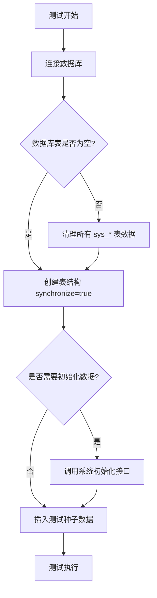
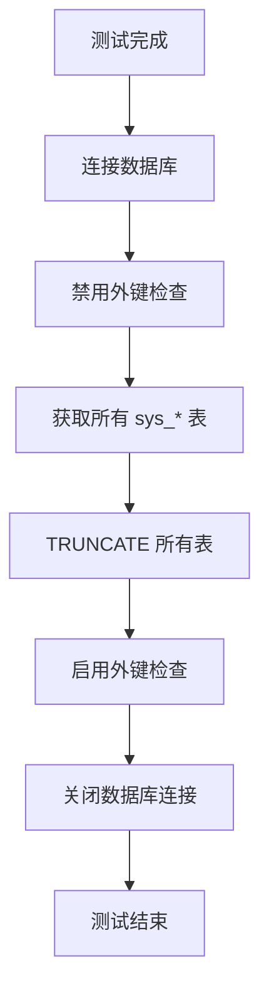

# 测试数据库规范

> 版本：1.0.0 | 状态：草稿 | 创建日期：2026-04-14

---

## 概述

本文档定义了 moyan-mfw 项目测试环境的数据库配置规范，确保：
- 测试数据与开发数据完全隔离
- 测试环境可重复、可预测
- 测试完成后数据自动清理
- 空数据库可自动初始化

---

## 适用范围

| 测试类型 | 适用范围 |
|----------|----------|
| 单元测试 | 不依赖数据库，无需遵循此规范 |
| 集成测试 | 必须遵循此规范 |
| E2E 测试 | 必须遵循此规范 |

---

## 测试数据库配置规范

### 1. 数据库隔离原则

| 原则 | 说明 | 实现 |
|------|------|------|
| 本地优先 | 测试必须使用本地数据库 | localhost |
| 数据库分离 | 测试数据库与开发数据库分离 | test_moyan_mfw |
| 账号统一 | 使用本地开发标准账号 | root/root |
| Redis 分离 | 使用独立 Redis 数据库索引 | REDIS_DB=1 |

### 2. 配置参数

**必需配置项**：

| 参数 | 值 | 说明 |
|------|-----|------|
| DB_HOST | localhost | 禁止使用远程数据库 |
| DB_PORT | 3306 | MySQL 默认端口 |
| DB_USERNAME | root | 本地开发标准账号 |
| DB_PASSWORD | root | 本地开发标准密码 |
| DB_NAME | test_moyan_mfw | 专用测试数据库 |
| REDIS_HOST | localhost | 本地 Redis |
| REDIS_DB | 1 | 独立 Redis 数据库索引 |

### 3. 配置文件模板

**.env.test 标准模板**：

```bash
# 测试环境配置 - 本地隔离
NODE_ENV=test

# 应用配置
PORT=3001
GLOBAL_PREFIX=/api

# 数据库配置 - 本地隔离（必须）
DB_HOST=localhost
DB_PORT=3306
DB_USERNAME=root
DB_PASSWORD=root
DB_NAME=test_moyan_mfw
DB_POOL_SIZE=10

# Redis 配置 - 本地（必须）
REDIS_HOST=localhost
REDIS_PORT=6379
REDIS_PASSWORD=
REDIS_DB=1

# JWT 配置
JWT_SECRET=test_jwt_secret_key_for_integration_testing_only
JWT_EXPIRES_IN=7200
JWT_REFRESH_EXPIRES_IN=604800

# CORS 配置
CORS_ORIGIN=*
```

---

## 测试生命周期规范

### 1. 测试前（Setup）流程



**Setup 检查清单**：

| 步骤 | 检查项 | 预期结果 |
|------|--------|----------|
| 1 | 连接 test_moyan_mfw | 成功连接 |
| 2 | 检查 sys_* 表是否存在 | 返回表列表或空 |
| 3 | 表为空时创建结构 | 表结构同步完成 |
| 4 | 调用初始化接口（可选） | 系统初始化完成 |
| 5 | 插入种子数据 | admin 用户创建完成 |

### 2. 测试后（Teardown）流程



**Teardown 检查清单**：

| 步骤 | 检查项 | 预期结果 |
|------|--------|----------|
| 1 | 禁用外键检查 | SET FOREIGN_KEY_CHECKS = 0 |
| 2 | 清理所有 sys_* 表数据 | TRUNCATE TABLE |
| 3 | 启用外键检查 | SET FOREIGN_KEY_CHECKS = 1 |
| 4 | 关闭数据库连接 | connection.close() |
| 5 | 验证数据已清理 | 所有表为空 |

---

## 数据清理策略

### 清理方式对比

| 方式 | DROP TABLE | TRUNCATE TABLE | DELETE |
|------|------------|----------------|--------|
| 速度 | 快 | 最快 | 慢 |
| 重置自增 ID | 是 | 是 | 否 |
| 保留表结构 | 否 | 是 | 是 |
| 适用场景 | Setup | Teardown | 不推荐 |

**推荐策略**：
- **Setup**：使用 DROP TABLE + synchronize=true（重建表结构）
- **Teardown**：使用 TRUNCATE TABLE（清理数据，保留表结构）

---

## 测试种子数据规范

### 标准种子数据

| 数据类型 | 数据内容 | 用途 |
|----------|----------|------|
| 用户 | admin (Admin@123) | 管理员角色测试 |
| 用户 | test (Test@123) | 普通用户测试 |
| 应用类型 | 默认应用类型 | 应用测试基础 |
| 角色 | 管理员角色 | 角色测试基础 |
| 角色 | 测试角色 | 权限测试基础 |

### 种子数据 ID 规范

| ID 类型 | UUID 格式 | 说明 |
|---------|-----------|------|
| admin 用户 | a1b2c3d4-e5f6-4a5b-8c9d-0e1f2a3b4c5d | 固定 ID |
| test 用户 | d5e6f7a8-b9c0-4d5e-3f4a-5b6c7d8e9f0a | 固定 ID |
| 默认应用类型 | b2c3d4e5-f6a7-4b5c-9d0e-1f2a3b4c5d6e | 固定 ID |

---

## 测试执行规范

### 1. 测试执行命令

```bash
# 运行所有集成测试
cd packages/base-backend && pnpm test

# 运行特定测试
cd packages/base-backend && pnpm test:integration:auth

# 运行测试并查看覆盖率
cd packages/base-backend && pnpm test -- --coverage
```

### 2. 并行执行限制

| 配置 | 值 | 原因 |
|------|-----|------|
| maxWorkers | 1 | 避免数据库连接冲突 |
| testTimeout | 30000ms | 集成测试需要更长超时 |

### 3. 测试前环境检查

```bash
# 检查本地 MySQL 状态
mysql -u root -proot -e "SHOW DATABASES;"

# 检查 test_moyan_mfw 是否存在
mysql -u root -proot -e "SHOW CREATE DATABASE test_moyan_mfw;"

# 创建测试数据库（如果不存在）
mysql -u root -proot -e "CREATE DATABASE test_moyan_mfw CHARACTER SET utf8mb4;"

# 检查本地 Redis 状态
redis-cli ping
```

---

## 禁止事项

### 禁止使用远程数据库

**原因**：
- 测试会删除/重建表结构
- 测试数据污染开发环境
- 多人协作数据冲突
- 网络延迟影响测试稳定性

**违规后果**：
- 测试失败或数据污染
- 需要回滚并修复配置

### 禁止跳过数据清理

**原因**：
- 数据残留影响后续测试
- 测试结果不可预测
- 数据库状态不一致

### 禁止使用生产账号密码

**原因**：
- 安全风险
- 生产环境数据污染

---

## 问题诊断指南

### 常见问题

| 问题 | 原因 | 解决方案 |
|------|------|----------|
| 连接失败 | 本地 MySQL 未启动 | 启动 MySQL 服务 |
| 数据库不存在 | test_moyan_mfw 未创建 | 手动创建数据库 |
| 权限不足 | root 无权限 | 检查 MySQL 用户权限 |
| 测试超时 | 网络或数据库慢 | 增加超时时间 |
| 数据残留 | teardown 未清理 | 检查 teardown 脚本 |

### 诊断命令

```bash
# 检查测试数据库表状态
mysql -u root -proot test_moyan_mfw -e "SHOW TABLES LIKE 'sys_%';"

# 检查表数据量
mysql -u root -proot test_moyan_mfw -e "SELECT COUNT(*) FROM sys_users;"

# 手动清理测试数据
mysql -u root -proot test_moyan_mfw -e "
SET FOREIGN_KEY_CHECKS = 0;
TRUNCATE TABLE sys_users;
TRUNCATE TABLE sys_roles;
-- 其他表...
SET FOREIGN_KEY_CHECKS = 1;
"
```

---

## 变更记录

| 日期 | 版本 | 变更内容 | 变更人 |
|------|------|----------|--------|
| 2026-04-14 | 1.0.0 | 创建初始规范文档 | PM-Agent |

---

**相关文档**：
- [系统初始化流程](../04-业务流程/系统初始化流程.md)
- [数据库实体设计](../03-数据库设计/数据库实体设计.md)
- [API 接口索引](../06-API%20接口/API%20接口索引.md)