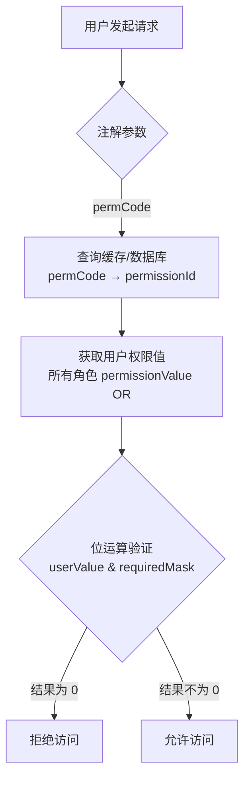
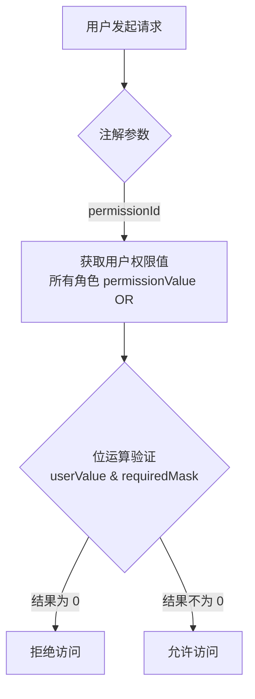

# 权限系统核心概念

> 5 分钟理解权限系统的核心机制

---

## 1. 权限数据结构

### PermissionType + NodeType 双层设计

```
Permission 树形结构示例:

ROOT (MENU)
├── system (MENU)                     ← 菜单目录
│   ├── user-list (PAGE)              ← 页面权限
│   │   └── permissionValue: 7n       ← 位运算值 (ADD|EDIT|DELETE)
│   └── role-list (PAGE)
│       └── permissionValue: 5n       ← 位运算值 (ADD|DELETE)
└── business (MENU)
    └── order-list (PAGE)
        └── permissionValue: 96n      ← 位运算值 (APPROVE|REJECT)
```

| 字段 | 说明 | 示例值 |
|------|------|--------|
| `permissionType` | 权限类型 | `PC` / `NORMAL` |
| `nodeType` | 节点类型 | `MENU` / `PAGE` / `TAG` |
| `permissionValue` | 位运算权限值 | `7n` (= ADD\|EDIT\|DELETE) |

**组合规则**:
- `PC + MENU` = PC 菜单目录
- `PC + PAGE` = PC 页面权限（支持 permissionValue，父节点必须是 MENU）
- `NORMAL + MENU` = 普通权限目录
- `NORMAL + TAG` = 普通权限标签（支持 permissionValue）

---

## 2. permissionValue 三层数据流

```
┌─────────────────────────────────────────────────────────────────┐
│ 1. 权限定义 (sys_permission.permissionValue)                    │
│    定义 PAGE/TAG 节点可用的所有操作：ADD|EDIT|DELETE = 7n       │
└────────────────────┬────────────────────────────────────────────┘
                     │ 权限池配置时选择子集
                     ▼
┌─────────────────────────────────────────────────────────────────┐
│ 2. 权限池 (sys_app_type_permission.permissionValue)             │
│    应用类型可选操作：ADD|EDIT = 3n                              │
└────────────────────┬────────────────────────────────────────────┘
                     │ 角色分配权限时选择子集
                     ▼
┌─────────────────────────────────────────────────────────────────┐
│ 3. 角色权限 (sys_role_permission.permissionValue)               │
│    角色实际分配的操作：ADD = 1n                                 │
└────────────────────┬────────────────────────────────────────────┘
                     │ 用户最终权限计算
                     ▼
┌─────────────────────────────────────────────────────────────────┐
│ 4. 用户最终权限 = 所有关联角色的 permissionValue 取 OR           │
│    userValue = role1Value | role2Value | ...                    │
└─────────────────────────────────────────────────────────────────┘
```

**核心约束**:
- 子层的 `permissionValue` 必须是父层定义集合的**子集**
- 验证公式：`(childValue & parentValue) === childValue`
- 权限验证时，使用位运算检查用户权限值是否包含所需操作
- PC 权限和普通权限都遵循相同的 permissionValue 约束规则

---

## 3. permissionValue 位运算设计

### 3.1 位运算存储格式

| 表名 | 字段 | 类型 | 说明 |
|------|------|------|------|
| `sys_permission` | `permissionValue` | bigint | 权限定义的操作集合（位运算值），适用于 PC 和普通权限 |
| `sys_app_type_permission` | `permissionValue` | bigint | 权限池中的操作子集（位运算值） |
| `sys_role_permission` | `permissionValue` | bigint | 角色分配的操作子集（位运算值） |

**位运算值示例** (`sys_permission.permissionValue`):

| 权限位组合 | 位运算值 | 二进制 | 说明 |
|-----------|---------|--------|------|
| ADD | 1n | 00001 | 新增 |
| ADD \| EDIT | 3n | 00011 | 新增 + 编辑 |
| ADD \| EDIT \| DELETE | 7n | 00111 | 新增 + 编辑 + 删除 |
| ADD \| EXPORT | 9n | 01001 | 新增 + 导出 |

**适用范围**:
- PC 权限（`PermissionType=PC`）：页面级操作权限，如新增、编辑、删除
- 普通权限（`PermissionType=NORMAL`）：标签级操作权限，同样使用位运算存储

### 3.2 API 请求体结构

**权限池配置请求体**:

```typescript
interface PermissionPoolConfigRequest {
  appTypeId: string;
  permissions: Array<{
    permissionId: string;
    permissionValue: bigint;    // 位运算值，如 ADD|EDIT = 3n
  }>;
}
```

**角色权限分配请求体**:

```typescript
interface RolePermissionAssignRequest {
  roleId: string;
  permissions: Array<{
    permissionId: string;
    permissionValue: bigint;    // 位运算值，如 ADD = 1n
  }>;
}
```

### 3.3 位运算约束

| 层级 | 约束公式 | 说明 |
|------|---------|------|
| 权限池 → 权限定义 | `(poolValue & permValue) === poolValue` | 权限池必须是权限定义的子集 |
| 角色 → 权限池 | `(roleValue & poolValue) === roleValue` | 角色必须是权限池的子集 |
| 用户 → 角色 | `userValue = role1Value \| role2Value \| ...` | 用户权限是所有角色的 OR |

**转换示例**:

```typescript
// 前端提交：勾选 ADD 和 EDIT
{ permissionId: "xxx", permissionValue: 3n }  // 3n = 1n | 2n

// 后端验证：检查是否是权限池的子集
const poolValue = 7n  // ADD|EDIT|DELETE
const roleValue = 3n  // ADD|EDIT
if ((roleValue & poolValue) === roleValue) {
  // 验证通过：3n & 7n = 3n === 3n
  await saveRolePermission(roleValue)
}
```

---

## 4. 权限池隔离机制

```
┌─────────────────────────────────────────────────────────────┐
│                      应用类型 A                              │
│  ┌─────────────┐  ┌─────────────┐  ┌─────────────┐         │
│  │  权限池 A    │  │  内置角色   │  │  应用级角色  │         │
│  │ 7n (全权限) │  │  A1,A2     │  │  A-app1    │         │
│  │             │  │ 3n (A\|E)   │  │ 1n (ADD)    │         │
│  │             │  │ 1n (ADD)    │  │ 2n (EDIT)   │         │
│  │ 所有角色的权 │  └─────────────┘  └─────────────┘         │
│  │ 限都从权限池 │         │                  │               │
│  │ 中选择       │         └──────────────────┘               │
│  └─────────────┘                  │                          │
│         ▲                         │                          │
│         └─────────────────────────┘                          │
│                   权限配置数据源                              │
└─────────────────────────────────────────────────────────────┘
```

**隔离规则**:
- 每个应用类型有独立的权限池（通过 `appTypeId` 隔离）
- 内置角色和应用级角色的权限都必须从权限池中选择
- 不同应用类型的权限池互不影响
- 权限池约束：`(poolValue & permValue) === poolValue`

---

## 5. 权限验证逻辑

### 5.1 权限位定义（全局）

**全局权限位枚举**（不存储 `permissionDesc`，通过映射表生成描述）：

```typescript
// 全局权限位定义（位运算）
enum Perm {
  ADD     = 1n,    // 2^0 = 00001
  EDIT    = 2n,    // 2^1 = 00010
  DELETE  = 4n,    // 2^2 = 00100
  EXPORT  = 8n,    // 2^3 = 01000
  IMPORT  = 16n,   // 2^4 = 10000
  VIEW    = 32n,   // 2^5 = 100000
  APPROVE = 64n,   // 2^6 = 1000000
  REJECT  = 128n,  // 2^7 = 10000000
  PUBLISH = 256n,  // 2^8 = 100000000
  ARCHIVE = 512n,  // 2^9 = 1000000000
}

// 权限位描述映射表（用于生成描述）
const PermDescMap: Map<bigint, string> = new Map([
  [Perm.ADD, '新增'],
  [Perm.EDIT, '编辑'],
  [Perm.DELETE, '删除'],
  [Perm.EXPORT, '导出'],
  [Perm.IMPORT, '导入'],
  [Perm.VIEW, '查看'],
  [Perm.APPROVE, '审批'],
  [Perm.REJECT, '拒绝'],
  [Perm.PUBLISH, '发布'],
  [Perm.ARCHIVE, '归档'],
])

// 动态生成权限描述
function getPermissionDesc(value: bigint): string {
  const actions: string[] = []
  for (const [bit, desc] of PermDescMap) {
    if ((value & bit) !== 0n) {
      actions.push(desc)
    }
  }
  return actions.join('、')  // "新增、编辑、删除"
}
```

---

### 5.2 前端按钮/菜单显示

**权限检查函数**：

```typescript
// 方式 1：检查单个权限位
function hasPermission(required: Perm): boolean {
  return (userPermissionValue & required) !== 0n
}

// 方式 2：检查多个权限位（支持 Array）
function hasPermission(required: Array<Perm>): boolean {
  // 只要有一个权限位匹配即返回 true
  return required.some(bit => (userPermissionValue & bit) !== 0n)
}

// 方式 3：检查是否拥有所有指定权限
function hasAllPermissions(required: Array<Perm>): boolean {
  // 所有权限位都必须匹配
  const mask = required.reduce((acc, bit) => acc | bit, 0n)
  return (userPermissionValue & mask) === mask
}

// 使用示例
<button v-if="hasPermission(Perm.ADD)">新增</button>
<button v-if="hasPermission([Perm.ADD, Perm.EDIT])">新增或编辑</button>
<button v-if="hasAllPermissions([Perm.ADD, Perm.EDIT])">新增且编辑</button>
```

---

### 5.3 后端接口权限验证

**方式 1：使用 `permCode`（推荐）**：

```typescript
// 方式 1：使用 permCode（推荐）
// 优势：开发时无需知道 UUID，代码可读性强，权限变更不影响代码
@RequirePermission(permCode = "system.user-list", perm = Perm.DELETE)
async deleteUser(userId: string) {
  // 框架自动根据 permCode 查询 permissionId，再验证用户权限
}

// 支持多个权限位
@RequirePermission(permCode = "system.user-list", perm = [Perm.ADD, Perm.EDIT])
async createOrEditUser(data: UserData) {
  // 框架验证用户是否有 ADD 或 EDIT 权限
}
```

**方式 2：使用 `permissionId`（需预分配 UUID 或代码生成）**：

```typescript
// 方式 2：使用 permissionId
@RequirePermission(permissionId = "550e8400-e29b-41d4-a716-446655440000", perm = Perm.DELETE)
async deleteUser(userId: string) {
  // 直接使用 UUID 验证，性能略优（无需 permCode→ID 转换）
}
```

**框架内部处理逻辑**：

```typescript
// 权限验证器伪代码
async validatePermission(
  param: { permissionId?: string; permCode?: string },
  required: Perm | Array<Perm>
) {
  let id: string

  if (param.permissionId) {
    // 方式 2：直接使用 ID
    id = param.permissionId
  } else if (param.permCode) {
    // 方式 1：根据 permCode 查询 ID（缓存优先）
    id = await this.cache.getPermissionId(param.permCode)
  } else {
    throw new Error('permissionId 或 permCode 必须提供一个')
  }

  // 获取用户的权限值（所有角色的 OR）
  const userValue = await getUserPermissionValue(id)

  // 计算需要的权限掩码
  const requiredMask = Array.isArray(required)
    ? required.reduce((acc, bit) => acc | bit, 0n)
    : required

  // 位运算验证
  if ((userValue & requiredMask) === 0n) {
    throw new ForbiddenException('无权限访问')
  }
}
```

### 5.4 验证流程

**方式 1：使用 permCode（推荐）**：



**方式 2：使用 permissionId**：



---

## 6. 关键业务规则

| 规则 | 说明 |
|------|------|
| 权限池约束 | 角色权限的 `permissionValue` 必须是权限池 `permissionValue` 的子集（`(roleValue & poolValue) === roleValue`） |
| 位运算约束 | 所有权限操作使用位运算：OR (`\|`) 合并权限，AND (`&`) 验证权限 |
| 用户权限计算 | 所有关联角色的 `permissionValue` 取 OR：`userValue = role1Value \| role2Value \| ...` |
| 权限验证时机 | 前端控制显示/隐藏（位运算检查），后端控制接口访问（位运算验证） |
| 全局权限位 | 权限位使用全局统一枚举 `Perm`，最多支持 64 种操作（bigint） |
| permissionValue | 使用 `bigint` 存储，避免 JavaScript 数值精度问题 |

**位运算公式**:

| 操作 | 公式 | 说明 |
|------|------|------|
| 合并权限 | `a \| b` | 取并集 |
| 验证单个权限 | `(value & Perm.ADD) !== 0n` | 是否有 ADD 权限 |
| 验证多个权限 (OR) | `(value & (a \| b)) !== 0n` | 是否有 a 或 b 权限 |
| 验证多个权限 (AND) | `(value & (a \| b)) === (a \| b)` | 是否同时有 a 和 b 权限 |
| 移除权限 | `value & ~Perm.DELETE` | 移除 DELETE 权限 |
| 添加权限 | `value \| Perm.ADD` | 添加 ADD 权限 |

---

## 7. 相关文档

- [权限分配详细流程](../flows/permission-assignment.md) - 完整的权限分配序列图
- [数据库实体设计](../database/database-entities-design.md) - 表结构定义
- [ER 关系图](../database/database-er-diagram.md) - 实体关系可视化

---

## 更新历史

| 版本 | 日期 | 变更说明 |
|------|------|----------|
| 2.7.0 | 2026-03-28 | 位运算权限设计：pcAction → permissionValue bigint |
| 2.1.0 | 2026-03-27 | 添加前后端权限计算泳道图 (P1-08) |
| 2.0.0 | 2026-03-25 | 重构：统一 PermissionType + NodeType 双层设计 |
| 1.0.0 | 2026-03-24 | 初始版本 |

---

*本文档是核心概念模块的一部分，建议按顺序阅读：[permissions.md](./permissions.md) → [roles.md](./roles.md) → [architecture.md](./architecture.md)*
