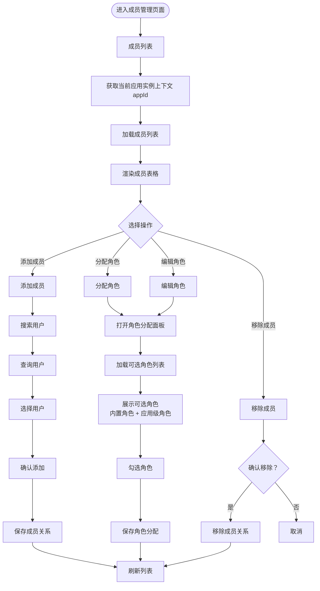

# 成员管理页面文档

## 概述

本文档描述成员管理页面的管理流程和核心业务规则。成员管理用于管理应用实例下的成员及其角色分配。

**版本**: 2.0.0

---

## 目录

1. [页面流程图](#页面流程图)
2. [功能说明](#功能说明)
3. [业务规则](#业务规则)
4. [角色分配说明](#角色分配说明)
5. [拥有者说明](#拥有者说明)

---

## 页面流程图



---

## 功能说明

### 成员列表页

| 功能 | 说明 |
|------|------|
| 成员列表 | 展示当前应用实例下的所有成员（不包括拥有者） |
| 成员信息 | 显示成员基本信息（头像、昵称、手机号等） |
| 角色标识 | 显示成员已分配的角色列表 |
| 添加成员 | 将用户添加为当前应用实例的成员 |
| 分配角色 | 为成员分配角色（可多角色） |
| 移除成员 | 将成员从应用实例中移除 |
| 编辑角色 | 修改成员已分配的角色 |

### 添加成员

| 功能 | 说明 |
|------|------|
| 搜索用户 | 支持通过用户标识搜索 |
| 选择用户 | 从搜索结果中选择要添加的用户 |
| 确认添加 | 将用户添加为当前应用实例的成员 |

### 角色分配

| 功能 | 说明 |
|------|------|
| 可选角色列表 | 展示当前应用实例的可选角色 |
| 内置角色 | 应用类型全局角色（只读展示，可选择） |
| 应用级角色 | 当前应用实例专属角色 |
| 多角色支持 | 支持为成员分配多个角色 |
| 保存分配 | 保存成员与角色的关联关系 |

---

## 业务规则

### 成员管理

- 成员管理是独立页面，通过动态菜单树配置
- 成员管理页面入口位于应用实例列表或应用详情页
- 权限控制通过角色的权限分配实现：角色配置了成员管理页面的操作权限，则绑定该角色的用户拥有成员管理操作权限
- 成员列表不显示拥有者，拥有者在应用实例管理中单独展示

### 成员关系

- 成员关系存储在 `sys_user_app` 表
- 一个用户可以属于多个应用实例的成员
- 成员关系与角色分配是分离的
- 移除成员时，同时移除该成员的所有角色分配

### 角色分配

- 可分配的角色包括：
  - 内置角色（应用类型全局角色）
  - 应用级角色（应用实例专属角色）
- 一个成员可以分配多个角色
- 角色权限从应用类型权限池中选择
- 成员最终权限 = ∪(所有分配角色的权限)

### 权限控制

- 用户是否有成员管理操作权限，取决于其绑定的角色是否配置了成员管理相关权限
- 角色权限通过权限池配置，权限池约束角色可分配的权限范围
- 成员不能给自己分配角色（防止权限提升）
- 成员管理页面提供"保护拥有者"选项，防止拥有者被移除
- 成员不可以为自己添加角色或移除角色

---

## 角色分配说明

### 可选角色范围

```
当前应用实例的可选角色 =
  内置角色（appTypeId = 当前应用类型 AND isBuiltin = 1）
  ∪
  应用级角色（appId = 当前应用实例 AND isBuiltin = 0）

注意：拥有者角色（isOwner = 1）不在此处分配，拥有者角色通过拥有者变更流程自动绑定
```

### 角色分配数据流

```
应用类型权限池
    ↓
角色权限配置（RolePermission）
    ↓
成员角色分配（UserRole）
    ↓
成员最终权限 = 所有角色的 permissionValue 取 OR（位运算并集）
```

### 多角色权限计算

```
成员 A 分配了角色 R1, R2, R3:

R1 permissionValue = {P1: 1n, P2: 3n}
R2 permissionValue = {P2: 1n, P3: 7n}
R3 permissionValue = {P1: 3n, P4: 1n}

成员 A 最终 permissionValue =
  P1: 3n  ← R1|R3 = 1n|3n = 3n (位运算 OR)
  P2: 3n  ← R1|R2 = 3n|1n = 3n
  P3: 7n  ← R2 独有
  P4: 1n  ← R3 独有
```

### 角色分配流程

```
应用实例上下文 (appId)
    ↓
获取应用类型 (appTypeId)
    ↓
加载可选角色:
  - 内置角色 (appTypeId 匹配)
  - 应用级角色 (appId 匹配)
    ↓
用户勾选角色
    ↓
保存 UserRole 关联
    ↓
成员获得角色权限
```

---

## 拥有者说明

### 拥有者定义

- 拥有者是应用实例的负责人，存储在 `sys_app.ownerId`
- 一个应用实例只能有一个拥有者，不允许多人
- 拥有者必须绑定一个用户 ID

### 拥有者与管理员角色

- 每个应用类型必须有一个特殊的"管理员"内置角色，该角色不允许删除，可以修改名称，通过 `isOwner = 1` 标识
- 拥有者自动绑定"管理员"内置角色，拥有应用实例的所有权限
- 拥有者变更时，后端 Service 层用事务保证原子性（更新 ownerId + 调整拥有者角色绑定）
- 拥有者在成员管理页面不显示，拥有者是独立身份

### 拥有者变更流程

```
变更拥有者
    ↓
1. 更新 sys_app.ownerId = newOwnerId
    ↓
2. 后端 Service 层事务处理:
   - 移除原拥有者的拥有者角色绑定
   - 给新拥有者分配拥有者角色
    ↓
3. 事务提交，完成变更
```

**说明**:
- 拥有者变更在后端 Service 层用事务保证原子性
- 如果事务中的任意一步失败，整个操作回滚

### 拥有者与其他应用实例

- 拥有者在当前应用实例下不具有双重角色身份
- 一个用户可以是多个应用实例的拥有者
- 一个用户可以是其他应用实例的成员（非拥有者）

---

## 相关文档

- [数据库实体设计](../database/database-entities-design.md)
- [应用实例管理页面](./app-management.md)
- [角色管理页面](./role-management.md)
- [应用类型管理页面](./app-type-management.md)
- [权限分配流程](../flows/permission-assignment.md)

---

## 更新历史

| 版本 | 日期 | 变更说明 |
|------|------|----------|
| 2.0.0 | 2026-03-25 | 重构：明确拥有者身份、管理员角色绑定机制、权限控制逻辑 |
| 1.0.0 | 2026-03-24 | 初始版本，新增成员管理页面文档 |

---

*本文档由基础设施页面详细设计文档拆分而来*
