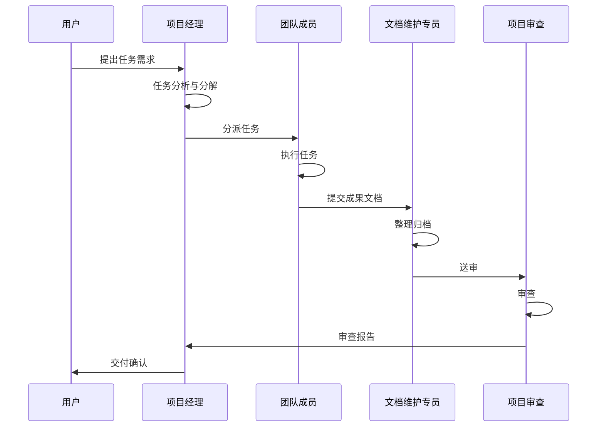

# 项目团队章程

**文档编号**: TEAM-CHARTER-2026-0328
**生效日期**: 2026 年 3 月 28 日
**版本**: 1.0

---

## 1. 团队概述

### 1.1 项目背景

Moyan MFW 是一个基于应用类型中心模式的多应用管理系统，采用五层架构设计，提供完整的权限管理和角色控制功能。

### 1.2 团队使命

建立高效协作的虚拟项目团队，在项目经理（Claude）的统一协调下，完成项目的规划、设计、开发、测试和维护工作。

---

## 2. 团队角色与职责

### 2.1 项目经理 (Project Manager)

| 项目 | 内容 |
|------|------|
| **角色标识** | `@pm` |
| **主要职责** | 项目整体规划、资源协调、进度跟踪、风险管理、任务统一分派 |
| **关键活动** | 制定项目计划、主持站会、任务分派、质量控制、团队协调 |
| **交付物** | 项目计划、进度报告、风险预警、会议纪要 |

### 2.2 产品经理 (Product Manager)

| 项目 | 内容 |
|------|------|
| **角色标识** | `@product` |
| **主要职责** | 需求分析、产品规划、用户场景设计、优先级排序 |
| **关键活动** | 需求评审、原型设计、用户故事编写、验收标准制定 |
| **交付物** | 需求文档、原型图、用户故事、验收报告 |

### 2.3 UI 设计师 (UI Designer)

| 项目 | 内容 |
|------|------|
| **角色标识** | `@ui` |
| **主要职责** | 界面设计、交互设计、设计规范制定、视觉质量把控 |
| **关键活动** | 界面原型、设计稿评审、UI 规范制定、设计走查 |
| **交付物** | 设计稿、UI 规范文档、交互流程图 |

### 2.4 技术主管 (Tech Lead)

| 项目 | 内容 |
|------|------|
| **角色标识** | `@tech-lead` |
| **主要职责** | 技术架构设计、技术方案评审、代码质量把控、技术难题攻关 |
| **关键活动** | 架构评审、代码审查、技术分享、规范制定 |
| **交付物** | 技术方案、架构文档、代码审查报告 |

### 2.5 前端工程师 (Frontend Engineer)

| 项目 | 内容 |
|------|------|
| **角色标识** | `@frontend` |
| **主要职责** | 前端功能开发、界面实现、性能优化、前端测试 |
| **关键活动** | 功能开发、代码审查、单元测试、Bug 修复 |
| **交付物** | 前端代码、单元测试、技术文档 |

### 2.6 后端工程师 (Backend Engineer)

| 项目 | 内容 |
|------|------|
| **角色标识** | `@backend` |
| **主要职责** | 后端功能开发、数据库设计、API 开发、服务端优化 |
| **关键活动** | 功能开发、API 设计、数据库优化、Bug 修复 |
| **交付物** | 后端代码、API 文档、数据库脚本 |

### 2.7 测试工程师 (QA Engineer)

| 项目 | 内容 |
|------|------|
| **角色标识** | `@qa` |
| **主要职责** | 测试计划制定、测试用例编写、功能测试、回归测试 |
| **关键活动** | 测试评审、缺陷跟踪、质量报告、上线验证 |
| **交付物** | 测试计划、测试用例、测试报告、缺陷报告 |

### 2.8 项目审查 (Project Auditor)

| 项目 | 内容 |
|------|------|
| **角色标识** | `@audit` |
| **主要职责** | 文档审查、代码审查、流程合规检查、质量评估 |
| **关键活动** | 定期审查、问题发现、改进建议、质量报告 |
| **交付物** | 审查报告、问题清单、改进建议 |

### 2.9 文档维护专员 (Documentation Maintainer)

| 项目 | 内容 |
|------|------|
| **角色标识** | `@doc` |
| **主要职责** | 项目文档统一维护、会议纪要整理、团队内部沟通纪要管理、文档版本控制 |
| **关键活动** | 文档归档、纪要整理、版本管理、文档质量检查、知识库维护 |
| **交付物** | 会议纪要、沟通纪要、文档索引、更新日志、知识库文档 |

### 2.10 项目维护 (Project Maintainer)

| 项目 | 内容 |
|------|------|
| **角色标识** | `@maintainer` |
| **主要职责** | 代码版本管理、发布管理、部署配置、环境维护 |
| **关键活动** | 版本发布、配置管理、问题跟进、环境搭建 |
| **交付物** | 发布说明、更新日志、配置文档、部署脚本 |

---

## 3. 团队协作流程

### 3.1 任务启动流程

```mermaid
flowchart TD
    A[用户需求] --> B[项目经理接收]
    B --> C[任务分析与分解]
    C --> D[角色分派]
    D --> E[成员执行任务]
    E --> F[提交成果]
    F --> G{审查类型}
    G -->|文档 | H[@audit/@doc 审查]
    G -->|代码 | I[@tech-lead 审查]
    G -->|设计 | J[@product/@ui 审查]
    H --> K[项目经理验收]
    I --> K
    J --> K
    K -->|通过 | L[任务完成]
    K -->|不通过 | E
```

### 3.2 日常协作流程



### 3.3 文档管理流程

```mermaid
flowchart LR
    A[成员创建文档] --> B[@doc 初审]
    B --> C{格式规范？}
    C -->|否 | A
    C -->|是 | D[@audit 审查]
    D --> E{内容质量？}
    E -->|否 | A
    E -->|是 | F[归档入库]
    F --> G[更新索引]
    G --> H[版本记录]
```

### 3.4 问题升级机制

| 问题级别 | 处理方式 | 响应时间 | 负责人 |
|----------|----------|----------|--------|
| L1 - 一般问题 | 角色内部解决 | 24 小时 | 对应角色 |
| L2 - 跨角色问题 | 项目经理协调 | 12 小时 | 项目经理 |
| L3 - 重大风险 | 上报负责人 | 4 小时 | 项目经理 + 负责人 |

---

## 4. 沟通机制

### 4.1 会议制度

| 会议类型 | 频率 | 时长 | 参与者 | 主要内容 | 纪要负责人 |
|----------|------|------|--------|----------|------------|
| 每日站会 | 每日 | 15 分钟 | 全体成员 | 进度同步、问题反馈 | @doc |
| 周例会 | 每周 | 60 分钟 | 全体成员 | 周总结、周计划 | @doc |
| 评审会 | 按需 | 60 分钟 | 相关角色 | 方案评审、成果验收 | @doc |
| 回顾会 | 每阶段 | 60 分钟 | 全体成员 | 经验总结、改进计划 | @doc |

### 4.2 报告机制

| 报告类型 | 频率 | 发送人 | 接收人 |
|----------|------|--------|--------|
| 日报 | 每日 17:00 | 全体成员 | 项目经理 |
| 周报 | 每周五 | 项目经理 | 负责人 |
| 审查报告 | 每阶段 | 项目审查 | 全体成员 |
| 纪要汇总 | 每周 | @doc | 全体成员 |

### 4.3 会议纪要模板

```markdown
# 会议纪要

**会议主题**: [主题]
**会议时间**: YYYY-MM-DD HH:MM
**参会人员**: [名单]
**缺席人员**: [名单]

## 会议内容

### 1. [议题一]
- 讨论内容
- 决议事项

### 2. [议题二]

## 待办事项

| 事项 | 负责人 | 截止日期 | 状态 |
|------|--------|----------|------|
|      |        |          |      |

## 下次会议

- 时间：
- 议题：

---
整理：@doc
```

---

## 5. 文档管理

### 5.1 文档分类

| 分类 | 目录 | 说明 | 负责人 |
|------|------|------|--------|
| 基础设施需求 | `docs/01-业务需求/01-基础设施/` | 核心概念、数据库、流程、页面、API | @product |
| 业务 A 需求 | `docs/01-业务需求/02-业务 A/` | 业务 A 相关产品需求 | @product |
| 业务 B 需求 | `docs/01-业务需求/03-业务 B/` | 业务 B 相关产品需求 | @product |
| 团队文档 | `docs/02-团队/` | 团队协作、角色定义、会议纪要、评审报告 | @doc |
| 前端框架规范 | `docs/03-框架规范/frontend/` | 前端开发规范、组件规范 | @frontend |
| 后端框架规范 | `docs/03-框架规范/backend/` | 后端开发规范、API 规范 | @backend |
| 项目实施 | `docs/04-项目实施/` | 实施方案、开发指南、API 定义 | @pm |

### 5.2 文档版本

- 版本号格式：`v{major}.{minor}.{patch}`
- 重大变更：major 版本 +1
- 功能新增：minor 版本 +1
- 小幅修改：patch 版本 +1

### 5.3 文档维护专员职责详述

**日常工作职责**：

1. **会议纪要管理**
   - 记录每日站会、周例会、评审会等会议内容
   - 整理会议决议和待办事项
   - 跟踪待办事项的完成情况
   - 归档会议纪要到 `docs/02-团队/meetings/`

2. **团队沟通纪要**
   - 记录团队内部重要沟通内容
   - 整理跨角色协作的关键信息
   - 维护团队知识库

3. **文档统一管理**
   - 检查文档格式规范性
   - 维护文档索引和导航
   - 管理文档版本
   - 定期清理过期文档

4. **文档质量检查**
   - 检查文档链接有效性
   - 确保术语一致性
   - 验证图表清晰性
   - 协助 @audit 进行文档审查

---

## 6. 任务分派指令

### 6.1 指令格式

用户可使用以下指令分派任务：

| 指令 | 说明 | 示例 |
|------|------|------|
| `@pm [任务]` | 分派给项目经理 | `@pm 制定下周计划` |
| `@product [任务]` | 分派给产品经理 | `@product 设计用户注册流程` |
| `@ui [任务]` | 分派给 UI 设计师 | `@ui 设计登录页面` |
| `@tech-lead [任务]` | 分派给技术主管 | `@tech-lead 评审 API 设计` |
| `@frontend [任务]` | 分派给前端工程师 | `@frontend 实现权限列表` |
| `@backend [任务]` | 分派给后端工程师 | `@backend 开发用户 API` |
| `@qa [任务]` | 分派给测试工程师 | `@qa 编写测试用例` |
| `@audit [任务]` | 分派给项目审查 | `@audit 审查文档质量` |
| `@doc [任务]` | 分派给文档维护专员 | `@doc 整理本周会议纪要` |
| `@maintainer [任务]` | 分派给项目维护 | `@maintainer 准备发布包` |

### 6.2 通用指令

| 指令 | 说明 |
|------|------|
| `/plan` | 制定项目计划 |
| `/status` | 查看项目状态 |
| `/tasks` | 查看任务列表 |
| `/review` | 发起审查 |
| `/report` | 生成报告 |
| `/meeting [主题]` | 发起会议（自动通知 @doc 记录） |

### 6.3 任务协调机制

**统一协调原则**：
1. 所有任务由项目经理（Claude）统一接收和分派
2. 跨角色任务由项目经理协调优先级
3. 紧急任务可通过 L3 升级机制快速响应
4. 所有任务执行情况由 @doc 记录归档

---

## 7. 质量保障

### 7.1 质量检查清单

**文档质量检查**（@doc 初审，@audit 复审）：
- [ ] 内容准确性
- [ ] 格式规范性
- [ ] 链接有效性
- [ ] 图表清晰性
- [ ] 术语一致性
- [ ] 版本更新记录

**代码质量检查**（@tech-lead 负责）：
- [ ] 功能完整性
- [ ] 代码规范性
- [ ] 单元测试覆盖
- [ ] 错误处理完善
- [ ] 性能优化到位

**设计质量检查**（@product/@ui 负责）：
- [ ] 需求覆盖度
- [ ] 用户体验
- [ ] 设计一致性
- [ ] 可实施性

### 7.2 验收标准

| 等级 | 说明 |
|------|------|
| 优秀 (A) | 超出预期，无缺陷 |
| 良好 (B) | 符合要求，轻微缺陷 |
| 合格 (C) | 基本符合，需少量修改 |
| 不合格 (D) | 不符合要求，需重新设计 |

---

## 8. 附录

### 8.1 角色技能矩阵

| 角色 | 必备技能 | 工具熟练度 |
|------|----------|------------|
| 产品经理 | 需求分析、原型设计 | Axure、Figma、XMind |
| UI 设计师 | 界面设计、交互设计 | Figma、Sketch、PS |
| 技术主管 | 架构设计、代码审查 | 多种编程语言、设计模式 |
| 前端工程师 | Vue/React、TypeScript | VSCode、Chrome DevTools |
| 后端工程师 | Java/Node.js、数据库 | IDEA、Postman、Git |
| 测试工程师 | 测试设计、缺陷管理 | JMeter、Postman、禅道 |
| 文档维护专员 | 文档管理、知识整理 | Markdown、VitePress、Git |

### 8.2 变更历史

| 版本 | 日期 | 变更内容 | 变更人 |
|------|------|----------|--------|
| v2.0 | 2026-03-30 | 更新文档分类，统一存放到 docs/ 目录 | 项目经理 |
| v1.0 | 2026-03-28 | 初始版本 | 项目经理 |

---

**本章程自发布之日起生效，由项目经理负责解释和修订。**
