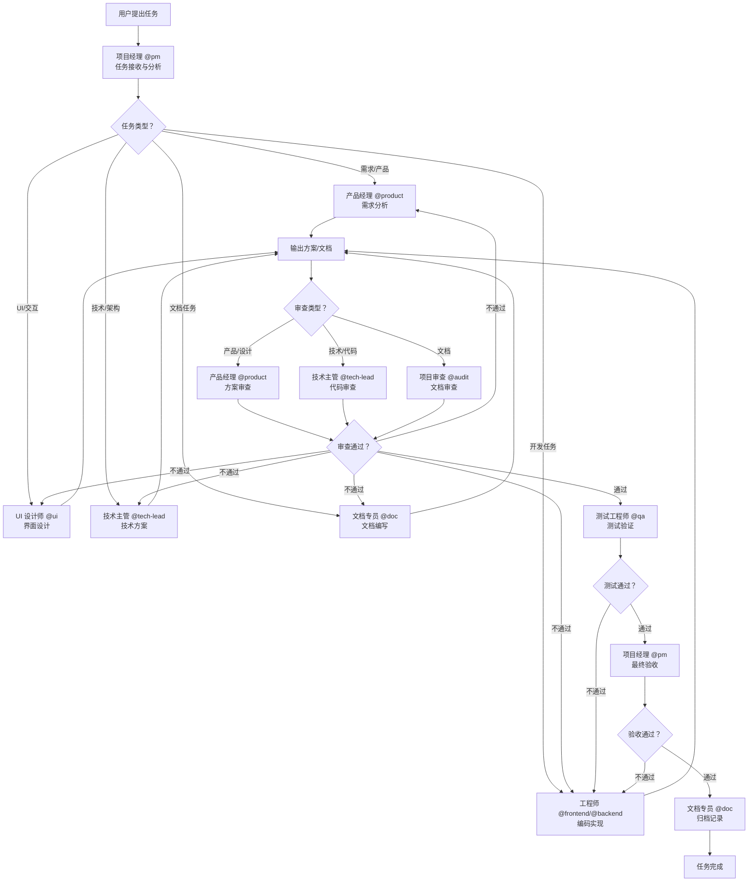

# 任务执行全流程指南

> 版本：1.0.0 | 创建：2026-03-30 | 维护：@doc

---

## 概述

本文档详细描述从任务开始执行到任务结束的完整流程，包括各智能体角色的参与时机、具体工作内容和交付物。

---

## 流程图



---

## 阶段一：任务启动

### 1.1 任务接收与分析

**参与角色**：项目经理 `@pm`

**工作内容**：
1. 接收用户任务请求
2. 分析任务类型和复杂度
3. 评估所需角色和资源
4. 确定任务优先级

**输出**：
- 任务分析报告
- 角色分派计划

**示例**：
```
用户：我需要开发一个用户登录功能

@pm 分析：
- 任务类型：功能开发
- 涉及角色：@product(需求)、@ui(设计)、@backend(API)、@frontend(前端)、@qa(测试)
- 优先级：P1
- 预计工作量：5 人日
```

---

### 1.2 任务分派

**参与角色**：项目经理 `@pm`

**工作内容**：
1. 向团队成员分派任务
2. 明确任务要求和截止时间
3. 确认成员接收任务

**输出**：
- 任务分派记录

**示例**：
```
@pm:
✅ 任务已接收并分派

| 任务 | 负责人 | 截止时间 |
|------|--------|----------|
| 需求分析 | @product | 2026-04-01 |
| 界面设计 | @ui | 2026-04-02 |
| API 开发 | @backend | 2026-04-05 |
| 前端开发 | @frontend | 2026-04-07 |
| 测试用例 | @qa | 2026-04-08 |
```

---

## 阶段二：方案设计与评审

### 2.1 需求分析（产品类任务）

**参与角色**：产品经理 `@product`

**工作内容**：
1. 分析用户需求和业务场景
2. 梳理功能点和用户故事
3. 制定验收标准
4. 输出 PRD 文档

**输出**：
- 需求文档 (PRD)
- 用户故事列表
- 验收标准

**交付物示例**：
```markdown
# 用户登录功能 - 需求文档

## 用户故事
- 作为用户，我希望通过账号密码登录系统
- 作为用户，我希望记住登录状态
- 作为管理员，我希望查看登录日志

## 功能点
1. 账号密码验证
2. 记住登录状态（7 天）
3. 登录失败次数限制

## 验收标准
- [ ] 正确账号密码可成功登录
- [ ] 错误账号密码提示友好
- [ ] 连续 5 次失败后锁定 30 分钟
```

---

### 2.2 界面设计（UI 类任务）

**参与角色**：UI 设计师 `@ui`

**工作内容**：
1. 设计界面原型
2. 设计交互流程
3. 制定 UI 规范
4. 输出设计稿

**输出**：
- 界面原型图
- 交互流程图
- UI 规范文档
- 设计稿（Figma/Sketch）

---

### 2.3 技术方案（技术类任务）

**参与角色**：技术主管 `@tech-lead`

**工作内容**：
1. 设计系统架构
2. 制定技术方案
3. 评估技术风险
4. 输出技术方案文档

**输出**：
- 架构图
- 技术方案文档
- 接口定义
- 数据库设计

**交付物示例**：
```markdown
# 用户登录功能 - 技术方案

## 架构设计
[架构图]

## API 设计
POST /api/auth/login
Request: { username, password }
Response: { token, expiresIn }

## 数据库设计
users 表：
- id (PK)
- username (UNIQUE)
- password_hash
- last_login_at
```

---

### 2.4 方案评审

**参与角色**：项目经理 `@pm`、产品经理 `@product`、技术主管 `@tech-lead`

**工作内容**：
1. 评审方案的完整性
2. 评估可行性和风险
3. 确认方案可实施

**输出**：
- 评审意见
- 修改建议（如有）

---

## 阶段三：编码实现

### 3.1 后端开发

**参与角色**：后端工程师 `@backend`

**工作内容**：
1. 实现业务逻辑
2. 开发 API 接口
3. 编写单元测试
4. 编写 API 文档

**输出**：
- 后端代码
- 单元测试
- API 文档

**交付物示例**：
```typescript
// src/api/auth/login.ts
/**
 * 用户登录接口
 * @param username 用户名
 * @param password 密码
 * @returns 登录 token
 */
export async function login(username: string, password: string) {
  // 验证用户
  const user = await findUser(username);
  if (!user) throw new Error('用户不存在');

  // 验证密码
  const valid = await verifyPassword(password, user.passwordHash);
  if (!valid) throw new Error('密码错误');

  // 生成 token
  const token = generateToken(user);
  return { token, expiresIn: 7 * 24 * 60 * 60 };
}
```

---

### 3.2 前端开发

**参与角色**：前端工程师 `@frontend`

**工作内容**：
1. 实现界面组件
2. 对接 API 接口
3. 编写前端测试
4. 编写组件文档

**输出**：
- 前端代码
- 组件文档
- 单元测试

**交付物示例**：
```tsx
// src/components/login-form.tsx
/**
 * 登录表单组件
 */
export const LoginForm: React.FC = () => {
  const [form] = Form.useForm();

  const handleSubmit = async (values) => {
    await api.auth.login(values.username, values.password);
  };

  return (
    <Form form={form} onFinish={handleSubmit}>
      <Form.Item name="username" rules={[{ required: true }]}>
        <Input placeholder="请输入用户名" />
      </Form.Item>
      <Form.Item name="password">
        <Input.Password placeholder="请输入密码" />
      </Form.Item>
      <Button htmlType="submit">登录</Button>
    </Form>
  );
};
```

---

### 3.3 文档编写

**参与角色**：文档维护专员 `@doc`

**工作内容**：
1. 记录开发过程
2. 编写用户文档
3. 整理 API 文档
4. 更新项目文档

**输出**：
- 用户手册
- API 文档
- 开发文档

---

## 阶段四：测试与审查

### 4.1 代码审查

**参与角色**：技术主管 `@tech-lead`、项目审查 `@audit`

**工作内容**：
1. 审查代码规范性
2. 审查代码质量
3. 审查测试覆盖率
4. 输出审查报告

**检查清单**：
```markdown
## 代码审查清单

### 规范性
- [ ] 遵循命名规范
- [ ] 代码格式统一
- [ ] 注释完整

### 质量
- [ ] 逻辑清晰
- [ ] 无重复代码
- [ ] 错误处理完善

### 测试
- [ ] 单元测试覆盖
- [ ] 边界条件测试
- [ ] 异常场景测试
```

---

### 4.2 文档审查

**参与角色**：项目审查 `@audit`、文档维护专员 `@doc`

**工作内容**：
1. 审查文档准确性
2. 审查文档完整性
3. 审查文档规范性

**检查清单**：
```markdown
## 文档审查清单

### 准确性
- [ ] 内容正确
- [ ] 示例可运行
- [ ] 参数说明准确

### 完整性
- [ ] 功能覆盖完整
- [ ] 场景覆盖全面
- [ ] 边界情况说明

### 规范性
- [ ] 格式统一
- [ ] 术语一致
- [ ] 链接有效
```

---

### 4.3 功能测试

**参与角色**：测试工程师 `@qa`

**工作内容**：
1. 执行测试用例
2. 记录测试结果
3. 提交缺陷报告
4. 跟踪缺陷修复

**输出**：
- 测试报告
- 缺陷报告

**交付物示例**：
```markdown
# 测试报告 - 用户登录功能

## 测试概况
- 测试用例：25 个
- 通过：23 个
- 失败：2 个

## 失败用例
| 用例编号 | 用例名称 | 失败原因 |
|----------|----------|----------|
| TC-001 | 密码含特殊字符登录 | 前端校验过严 |
| TC-015 | 并发登录测试 | 服务端锁竞争 |

## 结论
□ 通过  ■ 不通过（需修复后复测）
```

---

## 阶段五：验收与归档

### 5.1 最终验收

**参与角色**：项目经理 `@pm`

**工作内容**：
1. 确认所有交付物完整
2. 确认审查报告合格
3. 确认测试报告合格
4. 用户验收确认

**检查清单**：
```markdown
## 验收清单

### 交付物
- [ ] 代码已提交
- [ ] 文档已完善
- [ ] 测试已通过

### 质量
- [ ] 代码审查通过
- [ ] 文档审查通过
- [ ] 功能测试通过

### 用户确认
- [ ] 用户验收签字
```

---

### 5.2 任务归档

**参与角色**：文档维护专员 `@doc`

**工作内容**：
1. 整理所有交付物
2. 归档到指定位置
3. 更新任务状态
4. 记录经验教训

**输出**：
- 归档记录
- 经验教训文档

**归档内容**：
```markdown
## 任务归档 - 用户登录功能

### 基本信息
- 任务编号：2026-03-30-1000
- 完成日期：2026-04-10
- 负责人：@pm

### 交付物清单
1. 需求文档：docs/01-业务需求/01-用户登录-PRD.md
2. 设计稿：docs/01-业务需求/01-用户登录-设计稿.fig
3. 技术方案：docs/04-项目实施/01-用户登录-技术方案.md
4. 后端代码：src/api/auth/login.ts
5. 前端代码：src/components/login-form.tsx
6. 测试报告：docs/04-项目实施/05-测试报告/用户登录-测试报告.md

### 经验教训
- 密码特殊字符校验需要前后端一致
- 并发登录需要增加分布式锁
```

---

### 5.3 TASK.md 更新

**参与角色**：项目经理 `@pm`

**工作内容**：
1. 标记任务为已完成
2. 记录下一步行动
3. 更新 updated 和 lock 字段
4. 准备归档或新任务

**输出**：
```markdown
## 已完成
- [x] 用户登录功能开发（2026-04-10）
  - 交付物：PRD、设计稿、代码、测试报告

## 下一步行动
- 准备用户登录功能上线
- 开始下一个任务：用户注册功能
```

---

## 各角色参与阶段总结

| 阶段 | @pm | @product | @ui | @tech-lead | @frontend | @backend | @qa | @audit | @doc |
|------|-----|----------|-----|------------|-----------|----------|-----|--------|------|
| 任务启动 | ★ | ○ | ○ | ○ | ○ | ○ | ○ | ○ | ○ |
| 方案设计 | ★ | ★ | ★ | ★ | ○ | ○ | ○ | ○ | ○ |
| 编码实现 | ○ | ○ | ○ | ● | ★ | ★ | ○ | ○ | ★ |
| 测试审查 | ● | ○ | ○ | ★ | ● | ● | ★ | ★ | ● |
| 验收归档 | ★ | ○ | ○ | ○ | ○ | ○ | ○ | ○ | ★ |

**图例**：★ 主导角色 | ● 参与角色 | ○ 支持角色

---

## 附录：典型任务流程示例

### 示例 A：文档编写任务

```
用户：帮我写一份 API 接口设计规范

流程：
1. @pm 接收任务 → 分析为文档类任务
2. @doc 编写文档 → 输出 API 设计规范草案
3. @audit 审查文档 → 输出审查报告
4. @pm 验收 → 用户确认
5. @doc 归档 → 更新 TASK.md
```

### 示例 B：功能开发任务

```
用户：开发一个用户注册功能

流程：
1. @pm 接收任务 → 分析为功能开发任务
2. @product 需求分析 → 输出 PRD
3. @ui 界面设计 → 输出设计稿
4. @tech-lead 技术方案 → 输出架构设计
5. @backend API 开发 → 输出后端代码
6. @frontend 前端开发 → 输出前端代码
7. @qa 功能测试 → 输出测试报告
8. @audit 审查 → 输出审查报告
9. @pm 验收 → 用户确认
10. @doc 归档 → 更新 TASK.md
```

---

**维护**: @doc | **审查**: @audit | **批准**: @pm

*本文档是项目任务执行的指导文件，所有任务执行应参考本流程*
