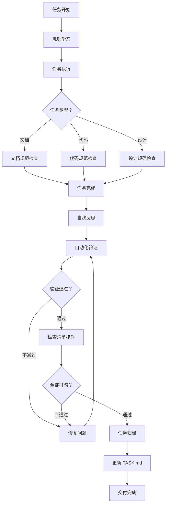

# 质量保障体系总览

> 版本：1.0.0 | 创建：2026-03-30 | 维护：@qa

---

## 概述

本体系定义项目质量保障的三层防护机制，确保每个交付物都符合规范要求。

---

## 质量保障体系架构

```
┌─────────────────────────────────────────────────────────────┐
│                    质量目标                                  │
│  准确性 | 一致性 | 完整性 | 规范性 | 可维护性                │
└─────────────────────────────────────────────────────────────┘
                              ↓
┌─────────────────────────────────────────────────────────────┐
│                 第一层：规则定义（预防）                     │
│  - .claude.md 项目宪法（核心规则）                          │
│  - .claude/rules/core/*.md 核心流程规则                     │
│  - docs/02-团队/01-团队规范/*.md 团队规范                    │
│  - docs/03-框架规范/*.md 技术规范                           │
└─────────────────────────────────────────────────────────────┘
                              ↓
┌─────────────────────────────────────────────────────────────┐
│                 第二层：检查清单（事中检查）                 │
│  - 文档质量检查清单                                         │
│  - 前端代码检查清单                                         │
│  - 后端代码检查清单                                         │
│  - 设计稿检查清单                                           │
│  - 测试用例检查清单                                         │
│  - 任务归档前检查清单                                       │
└─────────────────────────────────────────────────────────────┘
                              ↓
┌─────────────────────────────────────────────────────────────┐
│                 第三层：自动化验证（工具保障）               │
│  - 文档链接检查器 (npm run validate:links)                  │
│  - 文档模板检查器 (npm run validate:docs)                   │
│  - 类型定义检查器 (npm run validate:types)                  │
│  - 代码规范检查器 (npm run lint)                            │
│  - Git 提交检查器 (npm run validate:commit)                 │
└─────────────────────────────────────────────────────────────┘
                              ↓
┌─────────────────────────────────────────────────────────────┐
│                    交付物                                    │
│  ✅ 合规 | ✅ 一致 | ✅ 高质量                               │
└─────────────────────────────────────────────────────────────┘
```

---

## 各层职责

### 第一层：规则定义（预防）

**目的**：定义什么是"正确"的交付物

**规则类型**：

| 规则类型 | 文件位置 | 约束范围 |
|----------|----------|----------|
| 项目宪法 | `.claude.md` | 所有任务 |
| 核心流程 | `.claude/rules/core/*.md` | 会话流程、任务管理、记忆保存 |
| 团队规范 | `docs/02-团队/01-团队规范/*.md` | 角色职责、协作流程 |
| 技术规范 | `docs/03-框架规范/*.md` | 编码规范、设计规范 |

**执行方式**：
- 会话开始时注入模型上下文
- 模型在任务执行中参考遵守

---

### 第二层：检查清单（事中检查）

**目的**：确保任务完成时逐项核对不遗漏

**检查清单库**：`docs/02-团队/01-团队规范/06-质量检查清单.md`

**使用流程**：
```
任务完成
    ↓
打开对应类型的检查清单
    ↓
逐项核对并打勾
    ↓
发现问题 → 修复 → 重新检查
    ↓
全部通过 → 进入归档流程
```

**检查清单类型**：

| 清单类型 | 适用任务 | 检查项数 |
|----------|----------|----------|
| 文档质量检查清单 | PRD、技术方案、API 文档等 | ~16 项 |
| 前端代码检查清单 | Vue 组件、Composables、TSX | ~15 项 |
| 后端代码检查清单 | API 接口、数据库操作 | ~16 项 |
| 设计稿检查清单 | 界面原型、交互设计 | ~10 项 |
| 测试用例检查清单 | 功能测试、回归测试 | ~10 项 |
| 任务归档前检查清单 | 所有任务归档前 | ~8 项 |

---

### 第三层：自动化验证（工具保障）

**目的**：用工具检查人容易忽略的细节

**验证工具库**：`docs/02-团队/01-团队规范/07-质量自动化验证方案.md`

**验证命令**：

```bash
# 文档验证
npm run validate:docs          # 文档模板检查
npm run validate:links         # 链接检查

# 代码验证
npm run lint                   # ESLint/Stylelint
npm run lint:fix               # 自动修复

# 类型验证
npm run validate:types         # 类型定义检查

# 提交验证
npm run validate:commit        # 提交信息检查

# 全量验证
npm run validate:all           # 运行所有验证
```

**集成点**：

| 集成点 | 触发时机 | 执行验证 |
|--------|----------|----------|
| 任务完成时 | 模型自发性执行 | 对应类型的验证命令 |
| Git 提交前 | pre-commit hook | 文档/代码变更对应验证 |
| CI/CD | push/PR 触发 | 全量验证 |

---

## 质量保障流程

### 完整流程图



---

## 角色职责

| 角色 | 质量保障职责 |
|------|--------------|
| @pm | 质量目标定义、流程监督 |
| @product | 需求文档质量检查 |
| @ui | 设计稿质量检查 |
| @tech-lead | 代码质量检查、技术方案评审 |
| @frontend | 前端代码自检、清单核对 |
| @backend | 后端代码自检、清单核对 |
| @qa | 检查清单维护、自动化验证执行 |
| @audit | 质量审查、流程合规检查 |
| @doc | 文档质量检查 |
| @maintainer | 自动化验证工具维护 |

---

## 质量度量指标

| 指标 | 计算方式 | 目标值 |
|------|----------|--------|
| 一次通过率 | 首次验证通过的任务数 / 总任务数 | ≥ 80% |
| 缺陷密度 | 验证发现的问题数 / 交付物规模 | ≤ 5 个/千行 |
| 规范遵守率 | 符合规范的任务数 / 总任务数 | ≥ 95% |
| 自动化覆盖率 | 自动化验证覆盖的任务类型 / 总类型数 | ≥ 80% |

---

## 持续改进

### 定期审查

| 审查类型 | 频率 | 负责人 | 输出 |
|----------|------|--------|------|
| 文档健康度审查 | 每阶段 | @audit | 审查报告 |
| 代码质量审查 | 每周 | @tech-lead | 审查报告 |
| 流程合规审查 | 每月 | @pm | 改进建议 |

### 规则更新

当发现以下情况时，更新规则体系：

1. **新缺陷模式**：发现新的常见错误类型 → 更新检查清单
2. **规范变更**：技术栈/框架升级 → 更新技术规范
3. **流程优化**：发现流程低效点 → 更新流程规则

---

## 相关文件

| 文件 | 说明 |
|------|------|
| [06-质量检查清单.md](./06-质量检查清单.md) | 各类型任务的检查清单 |
| [07-质量自动化验证方案.md](./07-质量自动化验证方案.md) | 自动化验证工具说明 |
| [01-团队章程.md](./01-团队章程.md) | 角色职责定义 |
| .claude.md | 项目核心规则 |

---

**维护**: @qa | **审查**: @audit | **批准**: @pm

*本体系是项目质量保障的纲领性文件，所有任务交付必须遵循本体系执行*
