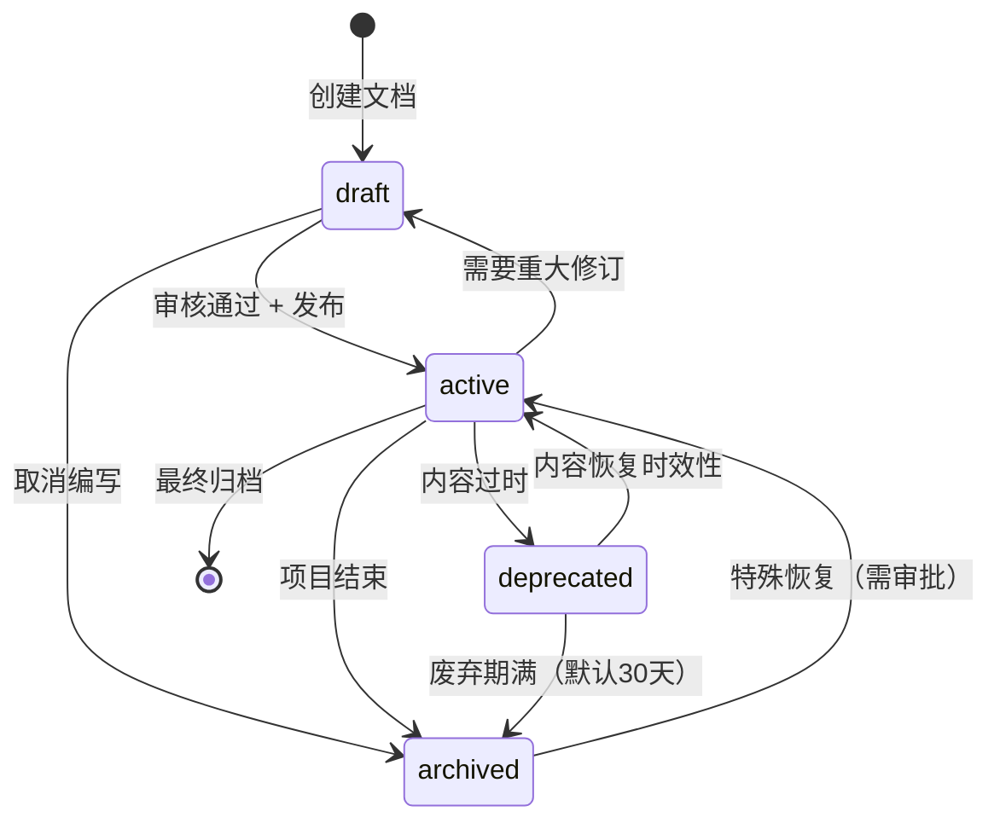
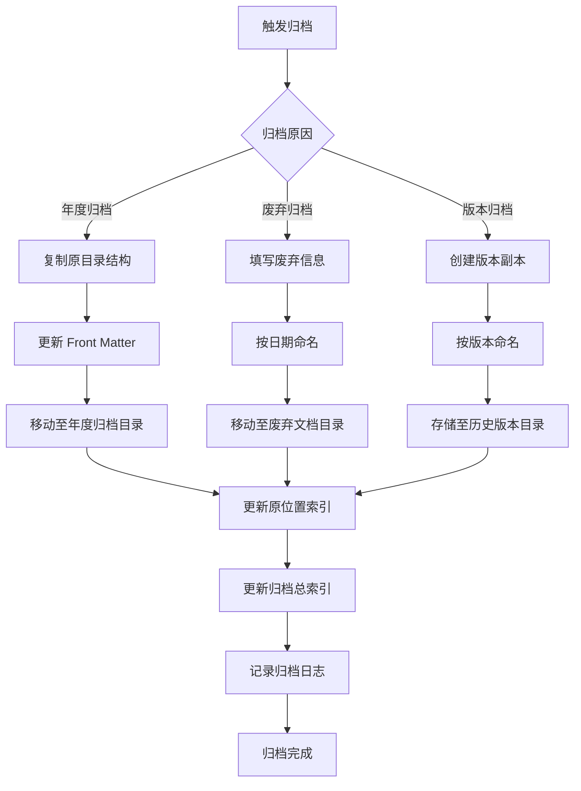

# 文档生命周期管理规范

> 版本：1.0.0 | 创建：2026-04-12 | 维护：@doc | 审查：@audit

---

## 概述

本规范定义项目文档从创建到归档的完整生命周期管理流程，确保文档始终保持准确性、时效性和可追溯性。

---

## 1. 文档生命周期定义

### 1.1 状态定义

文档生命周期包含四个核心状态：

| 状态 | 英文标识 | 含义 | 颜色标识 | 适用场景 |
|------|----------|------|----------|----------|
| **草案** | `draft` | 正在编写，内容未完成 | 黄色 `#F59E0B` | 新文档编写阶段 |
| **活跃** | `active` | 内容完整，正在使用 | 绿色 `#10B981` | 正式发布的文档 |
| **废弃** | `deprecated` | 已过时，不再推荐使用 | 红色 `#EF4444` | 被新版本替代的文档 |
| **归档** | `archived` | 历史保留，仅供参考 | 灰色 `#6B7280` | 完全停止使用的文档 |

### 1.2 状态转换条件



#### 状态转换规则详解

| 转换路径 | 触发条件 | 执行动作 | 负责人 |
|----------|----------|----------|--------|
| `draft` → `active` | 1. 内容完整 2. @audit 审核 3. @pm 发布批准 | 更新状态、发布通知 | @doc |
| `draft` → `archived` | 编写取消或超过30天未完成 | 移动至归档目录 | @doc |
| `active` → `draft` | 需要重大修订（内容错误或架构变更） | 回退状态、创建修订任务 | @audit |
| `active` → `deprecated` | 1. 新版本替代 2. 技术栈变更 3. 流程废止 | 标记废弃、发布废弃通知 | @doc |
| `active` → `archived` | 项目结束或功能永久移除 | 移动至归档目录、更新索引 | @doc |
| `deprecated` → `active` | 内容恢复时效性（技术回退或需求变更） | 恢复状态、发布通知 | @pm |
| `deprecated` → `archived` | 废弃期满（默认30天） | 自动归档 | @doc |

### 1.3 状态标识方法（Front Matter）

所有文档必须在开头包含 YAML Front Matter，声明文档状态：

```yaml
---
# 必填字段
title: 文档标题
status: draft | active | deprecated | archived
version: X.Y.Z
created: YYYY-MM-DD
updated: YYYY-MM-DD

# 可选字段
deprecated_date: YYYY-MM-DD      # 仅废弃状态必填
deprecated_reason: 废弃原因      # 仅废弃状态必填
archived_date: YYYY-MM-DD        # 仅归档状态必填
archived_location: 归档路径      # 仅归档状态必填
reviewer: @audit                 # 审核人
review_date: YYYY-MM-DD          # 上次审核日期
review_cycle: quarterly          # 审核周期
---
```

#### Front Matter 示例

**草案文档**：
```yaml
---
title: API 设计规范 v2.0
status: draft
version: 0.1.0
created: 2026-04-12
updated: 2026-04-12
---
```

**活跃文档**：
```yaml
---
title: API 设计规范 v1.0
status: active
version: 1.0.0
created: 2026-03-15
updated: 2026-04-12
reviewer: @audit
review_date: 2026-04-10
review_cycle: quarterly
---
```

**废弃文档**：
```yaml
---
title: 旧版登录流程说明
status: deprecated
version: 1.0.0
created: 2026-01-10
updated: 2026-03-20
deprecated_date: 2026-04-12
deprecated_reason: 新版 OAuth 2.0 登录已替代旧版流程
replacement: docs/03-后端开发/02-认证授权/OAuth2-登录流程.md
---
```

**归档文档**：
```yaml
---
title: 2025年项目架构说明
status: archived
version: 1.0.0
created: 2025-06-01
updated: 2025-12-31
archived_date: 2026-01-15
archived_location: docs/06-归档/2025/架构说明.md
---
```

---

## 2. 审查周期管理

### 2.1 不同类型文档的审查周期

| 文档类型 | 目录位置 | 审查周期 | 审查触发条件 |
|----------|----------|----------|--------------|
| **核心规范** | `docs/02-团队/01-团队规范/` | 季度审查 | 每3个月或重大变更 |
| **技术规范** | `docs/03-框架规范/` | 半年审查 | 每6个月或技术栈变更 |
| **产品需求** | `docs/01-业务需求/` | 按需审查 | 功能迭代前 |
| **评审报告** | `docs/02-团队/03-评审报告/` | 不审查 | 一次性文档，无需周期审查 |
| **会议纪要** | `docs/02-团队/04-会议纪要/` | 不审查 | 历史记录，无需周期审查 |
| **检查清单** | `docs/02-团队/02-检查清单/` | 季度审查 | 每3个月或流程变更 |
| **协作模板** | `docs/02-团队/05-协作模板/` | 半年审查 | 每6个月或模板优化 |

### 2.2 审查责任人

| 文档类型 | 主要责任人 | 协助责任人 | 审批人 |
|----------|------------|------------|--------|
| 核心规范 | @audit | @doc | @pm |
| 技术规范 | @tech-lead | @frontend/@backend | @pm |
| 产品需求 | @product | @ui | @pm |
| 检查清单 | @qa | 相关角色 | @audit |

### 2.3 审查检查清单

每次文档审查必须核对以下检查项：

#### 基础检查（所有文档）

| 序号 | 检查项 | 检查方法 | 通过标准 |
|------|--------|----------|----------|
| 1 | 状态标识正确 | 检查 Front Matter | `status` 字段与实际状态一致 |
| 2 | 版本号更新 | 检查 Front Matter | 有变更时 `version` 已更新 |
| 3 | 更新日期准确 | 检查 Front Matter | `updated` 为最近修改日期 |
| 4 | 审核日期记录 | 检查 Front Matter | `review_date` 已更新 |
| 5 | 链接有效性 | 自动化检查 | 所有内部链接可访问 |

#### 内容检查（活跃文档）

| 序号 | 检查项 | 检查方法 | 通过标准 |
|------|--------|----------|----------|
| 6 | 内容时效性 | 人工审核 | 与当前实现一致 |
| 7 | 术语一致性 | 对比审查 | 与其他文档术语统一 |
| 8 | 完整性 | 清单核对 | 必要章节完整 |
| 9 | 准确性 | 验证测试 | 示例代码可运行 |
| 10 | 可读性 | 阅读测试 | 新成员能理解 |

#### 废弃检查（废弃文档）

| 序号 | 检查项 | 检查方法 | 通过标准 |
|------|--------|----------|----------|
| 11 | 废弃原因记录 | 检查 Front Matter | `deprecated_reason` 已填写 |
| 12 | 替代文档链接 | 检查 Front Matter | `replacement` 指向正确 |
| 13 | 废弃日期记录 | 检查 Front Matter | `deprecated_date` 已填写 |
| 14 | 废弃通知发布 | 检查通知记录 | 团队已知晓 |

#### 归档检查（归档文档）

| 序号 | 检查项 | 检查方法 | 通过标准 |
|------|--------|----------|----------|
| 15 | 归档位置正确 | 检查目录 | 在归档目录下 |
| 16 | 归档日期记录 | 检查 Front Matter | `archived_date` 已填写 |
| 17 | 索引已更新 | 检查索引文件 | 归档索引已记录 |

### 2.4 审查流程

```mermaid
flowchart TD
    A[审查周期触发] --> B[@doc 筛选待审文档]
    B --> C[生成审查清单]
    C --> D[分派审查责任人]
    D --> E{审查执行}
    
    E -->|通过 | F[更新 review_date]
    F --> G[状态保持 active]
    G --> H[记录审查报告]
    
    E -->|需修订 | I[回退至 draft]
    I --> J[创建修订任务]
    J --> K[修订完成后重新审查]
    
    E -->|已过时 | L[转为 deprecated]
    L --> M[填写废弃信息]
    M --> N[发布废弃通知]
    
    H --> O[审查完成]
    K --> E
    N --> O
```

---

## 3. 归档管理

### 3.1 归档目录结构

```
docs/06-归档/
├── README.md                    # 归档索引说明
├── YYYY/                        # 按年份归档
│   ├── README.md                # 年度归档索引
│   ├── 团队规范/                 # 原团队规范归档
│   ├── 技术规范/                 # 原技术规范归档
│   ├── 产品需求/                 # 原产品需求归档
│   └── 项目交付/                 # 项目交付文档归档
│   └── 会议纪要/                 # 会议纪要归档
├── 废弃文档/                     # 废弃后归档的文档
│   ├── README.md                # 废弃文档索引
│   └── YYYY-MM-DD_主题.md       # 按日期命名
└── 历史版本/                     # 文档历史版本
    ├── README.md                # 历史版本索引
    └── 文档名/
        ├── v1.0.0.md
        ├── v1.1.0.md
        └── ...
```

### 3.2 归档文件命名规则

| 归档类型 | 命名格式 | 示例 |
|----------|----------|------|
| **年度归档** | 原目录结构保持 | `docs/06-归档/2025/团队规范/01-团队章程.md` |
| **废弃归档** | `YYYY-MM-DD_主题.md` | `docs/06-归档/废弃文档/2026-04-12_旧版登录流程.md` |
| **历史版本** | `vX.Y.Z.md` | `docs/06-归档/历史版本/API规范/v1.0.0.md` |

### 3.3 归档文档访问方式

| 访问场景 | 访问路径 | 说明 |
|----------|----------|------|
| **查找历史规范** | `docs/06-归档/YYYY/团队规范/` | 查看特定年份的规范版本 |
| **查阅废弃文档** | `docs/06-归档/废弃文档/` | 了解历史设计和废弃原因 |
| **对比版本差异** | `docs/06-归档/历史版本/文档名/` | 对比不同版本的变化 |
| **快速检索** | `docs/06-归档/README.md` | 归档总索引 |

### 3.4 归档操作流程



---

## 4. 废弃流程

### 4.1 废弃条件

文档进入废弃状态需满足以下条件之一：

| 废弃条件 | 触发场景 | 废弃类型 |
|----------|----------|----------|
| **内容替代** | 新版本文档发布，完全替代旧版 | 版本废弃 |
| **技术变更** | 技术栈升级，旧规范不再适用 | 技术废弃 |
| **流程废止** | 业务流程取消，相关文档失效 | 流程废弃 |
| **需求变更** | 产品需求调整，原设计文档失效 | 需求废弃 |
| **功能移除** | 功能永久删除，相关文档无用 | 功能废弃 |

### 4.2 废弃通知

废弃文档必须在 Front Matter 中记录完整废弃信息：

```yaml
---
title: [原文档标题]
status: deprecated
version: [最后版本]
created: [创建日期]
updated: [更新日期]
deprecated_date: YYYY-MM-DD
deprecated_reason: [废弃原因详细描述]
replacement: [替代文档路径，如有]
archive_schedule: YYYY-MM-DD  # 预计归档日期
---
```

#### 废弃通知模板

废弃状态变更时，需发布团队通知：

```markdown
# 文档废弃通知

**文档名称**: [原标题]
**废弃日期**: YYYY-MM-DD
**废弃原因**: [详细原因]

**替代方案**:
- 新文档：[替代文档链接]
- 注意事项：[迁移指南或注意事项]

**归档计划**:
- 废弃期：30天（默认）
- 归档日期：YYYY-MM-DD

**影响范围**:
- [列出受影响的团队成员或角色]

**行动要求**:
- 请相关人员更新参考链接
- 如有疑问请联系 @doc

---
发布人：@doc | 发布日期：YYYY-MM-DD
```

### 4.3 废弃文档处理

#### 废弃期内处理

| 处理动作 | 执行时机 | 负责人 | 说明 |
|----------|----------|--------|------|
| 添加废弃标识 | 废弃当日 | @doc | 在文档开头添加醒目的废弃警告 |
| 更新索引 | 废弃当日 | @doc | 在索引中标记 `[废弃]` |
| 发布通知 | 废弃当日 | @doc | 发送废弃通知到团队 |
| 监控引用 | 废弃期内 | @audit | 检查是否有新文档引用废弃文档 |
| 回答咨询 | 废弃期内 | @doc | 解答团队成员关于废弃文档的疑问 |

#### 废弃警告标识

在废弃文档开头添加醒目的警告块：

```markdown
> ⚠️ **废弃警告**
> 
> 本文档已于 **YYYY-MM-DD** 废弃，不再推荐使用。
> 
> **废弃原因**: [原因]
> 
> **替代文档**: [替代文档链接]
> 
> **归档日期**: YYYY-MM-DD
```

#### 废弃期满处理

废弃期满（默认30天）后执行归档：

| 步骤 | 动作 | 说明 |
|------|------|------|
| 1 | 最终确认 | @pm 确认无需恢复 |
| 2 | 移动文件 | 移动至归档目录 |
| 3 | 更新状态 | `status: archived` |
| 4 | 记录归档信息 | 填写 `archived_date` 和 `archived_location` |
| 5 | 更新索引 | 移除活跃索引，添加归档索引 |
| 6 | 清理引用 | 移除其他文档中对废弃文档的链接 |

---

## 5. 自动化支持

### 5.1 Hook 检测机制

项目使用 Harness Hook 系统实现自动化检测：

#### 文档状态检测 Hook

| Hook 名称 | 触发时机 | 检测内容 | 执行动作 |
|-----------|----------|----------|----------|
| `doc-status-check-hook` | Write/Edit `.md` 文件 | Front Matter 状态字段 | 验证状态合法性 |
| `doc-review-reminder-hook` | 会话开始 | 检查待审查文档 | 提醒审查周期到期 |
| `doc-deprecation-hook` | 定时检测 | 废弃期满文档 | 自动触发归档提醒 |
| `doc-archive-hook` | 文档移动 | 归档操作 | 更新索引和日志 |

#### Hook 实现规范

```typescript
/**
 * 文档状态检测 Hook
 *
 * 触发时机：PreToolUse (Write/Edit docs/**/*.md)
 * 
 * 检查项：
 * 1. Front Matter 是否包含必填字段
 * 2. 状态字段值是否合法
 * 3. 废弃文档是否包含废弃信息
 * 4. 归档文档是否包含归档信息
 */
interface DocStatusHookResult {
  passed: boolean;
  message: string;
  warnings: string[];
  errors: string[];
  data?: {
    status: 'draft' | 'active' | 'deprecated' | 'archived';
    requiredFields: string[];
    missingFields: string[];
  };
}
```

### 5.2 提醒机制

#### 审查周期提醒

| 提醒类型 | 触发条件 | 提醒方式 | 提醒对象 |
|----------|----------|----------|----------|
| **季度审查** | 活跃文档超过90天未审查 | 会话提醒 + 日志 | @audit |
| **半年审查** | 技术规范超过180天未审查 | 会话提醒 + 日志 | @tech-lead |
| **废弃到期** | 废弃文档超过30天 | 会话提醒 + 日志 | @doc |
| **草案超期** | 草案超过30天未发布 | 会话提醒 + 日志 | @doc |

#### 提醒消息模板

```markdown
【文档状态提醒】

📋 待审查文档：X 份
- 团队规范：X 份（超过90天）
- 技术规范：X 份（超过180天）

⚠️ 废弃即将归档：X 份
- 文档名（废弃日期，即将归档）

📝 草案超期：X 份
- 文档名（创建日期，超过30天）

建议行动：
1. 执行审查：调用 @audit 审查待审文档
2. 处理废弃：确认废弃文档是否归档
3. 完成草案：推进超期草案完成发布
```

### 5.3 自动化脚本

#### 文档状态扫描脚本

```bash
# 扫描所有文档状态
pnpm run docs:scan-status

# 输出待审查文档列表
pnpm run docs:list-review-pending

# 输出废弃文档列表
pnpm run docs:list-deprecated

# 输出归档文档列表
pnpm run docs:list-archived
```

#### 批量归档脚本

```bash
# 归档废弃期满文档
pnpm run docs:archive-expired

# 归档指定年份文档
pnpm run docs:archive-year --year=2025

# 创建文档历史版本
pnpm run docs:archive-version --doc="API规范" --version="v1.0.0"
```

### 5.4 Hook 配置集成

在 `.harness/config/docs.json` 中添加生命周期配置：

```json
{
  "lifecycle": {
    "reviewCycles": {
      "coreSpec": 90,
      "techSpec": 180,
      "productReq": "on-demand",
      "checklist": 90,
      "template": 180
    },
    "deprecationPeriod": 30,
    "draftMaxDays": 30,
    "archiveLocation": "docs/06-归档",
    "hooks": {
      "statusCheck": ".harness/hooks/doc-status-check-hook.ts",
      "reviewReminder": ".harness/hooks/doc-review-reminder-hook.ts",
      "deprecation": ".harness/hooks/doc-deprecation-hook.ts",
      "archive": ".harness/hooks/doc-archive-hook.ts"
    }
  }
}
```

---

## 6. 执行规范

### 6.1 日常操作

| 操作场景 | 操作流程 | 负责人 |
|----------|----------|--------|
| **创建新文档** | 1. 填写 Front Matter (status: draft) 2. 编写内容 3. 提交审查 4. 发布 | @doc |
| **更新文档** | 1. 更新内容 2. 更新 version 和 updated 3. 如有重大变更需重新审查 | 相关角色 |
| **废弃文档** | 1. 填写废弃信息 2. 添加废弃警告 3. 发布通知 4. 监控废弃期 | @doc |
| **归档文档** | 1. 移动文件 2. 更新状态 3. 更新索引 4. 记录日志 | @doc |

### 6.2 异常处理

| 异常场景 | 处理方式 | 负责人 |
|----------|----------|--------|
| **误废弃** | 恢复为 active 状态，发布恢复通知 | @pm |
| **误归档** | 从归档目录恢复，更新状态和索引 | @pm |
| **审查超期** | 加急审查，记录超期原因 | @audit |
| **草案停滞** | 评估是否继续，否则取消或归档 | @pm |

---

## 7. 相关文件

| 文件 | 说明 |
|------|------|
| [01-团队章程.md](./01-团队章程.md) | 团队角色职责定义 |
| [06-质量检查清单.md](./06-质量检查清单.md) | 文档质量检查清单 |
| [14-归档说明.md](./14-归档说明.md) | 归档目录说明 |
| [.harness/config/docs.json](../../.harness/config/docs.json) | 文档自动化配置 |

---

## 8. 附录

### 8.1 文档状态流转日志模板

```markdown
## 文档状态流转日志

**文档名称**: [标题]
**当前状态**: [状态]

### 流转记录

| 日期 | 原状态 | 新状态 | 操作人 | 原因 |
|------|--------|--------|--------|------|
| YYYY-MM-DD | draft | active | @doc | 审核通过，正式发布 |
| YYYY-MM-DD | active | deprecated | @doc | 新版本替代 |
| YYYY-MM-DD | deprecated | archived | @doc | 废弃期满，自动归档 |
```

### 8.2 归档索引文件模板

```markdown
# 归档文档索引

**归档范围**: YYYY 年度
**归档日期**: YYYY-MM-DD
**归档数量**: X 份

## 归档列表

### 团队规范（X 份）
| 文档 | 原位置 | 归档日期 | 归档原因 |
|------|--------|----------|----------|
| ... | ... | ... | ... |

### 技术规范（X 份）
| 文档 | 原位置 | 归档日期 | 归档原因 |
|------|--------|----------|----------|

---
维护：@doc | 更新日期：YYYY-MM-DD
```

---

**维护**: @doc | **审查**: @audit | **批准**: @pm

*本规范是文档生命周期管理的纲领性文件，所有文档状态变更必须遵循本规范执行*