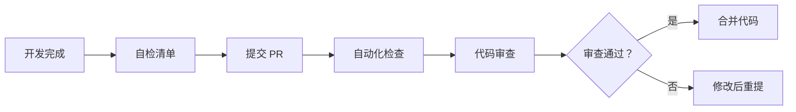

# 前端项目摸底测试 - 团队动员与协作方案

**发布日期**: 2026-04-12  
**发布人**: 技术负责人 + PM  
**执行周期**: 2026-04-12 ~ 2026-04-30  

---

## 一、动员令

### 1.1 当前状态

各位团队成员：

经过全面摸底测试，我们完成了对 `moyan-mfw-base-frontend` 组件库的第一次系统性审查。以下是关键发现：

**✅ 优势项**：
- 技术栈选型正确（Vue 3 + TypeScript + Element Plus）
- 组件架构分层清晰（基础层/中间层/高层）
- 14 个核心组件已完成开发
- 91 个单元测试通过
- 命名规范统一（Mfw 前缀）

**⚠️ 待改进项**：
- 9 个组件待开发（3 个 P0 优先级）
- 核心组件缺少单元测试（FormCard, TableList, Upload）
- 可访问性支持不足（ARIA 属性缺失）
- 存在 TODO 遗留代码
- 文档链接 71 处错误待修复

**总体评分**: ⭐⭐⭐⭐☆ (4/5)

---

### 1.2 目标与愿景

我们的目标是在 **2026-04-30** 前完成以下改进：

1. **组件完整性**: 完成 9 个待开发组件，达到 100% 覆盖
2. **代码质量**: 补充核心组件测试，覆盖率 ≥80%
3. **文档完善**: 修复全部文档链接错误
4. **可访问性**: 按照 WCAG 2.1 AA 标准改进

这不仅是技术问题，更是我们团队专业能力和交付能力的体现。

---

## 二、团队角色与职责

### 2.1 角色定义

| 角色 | 人员 | 主要职责 |
|------|------|----------|
| 技术负责人 | @tech-lead | 架构决策、代码审查、技术风险评估 |
| 前端开发 | @frontend (2-3 人) | 组件开发、单元测试、文档编写 |
| 测试工程师 | @qa (1 人) | 测试用例、E2E 测试、质量验收 |
| 产品经理 | @pm | 需求优先级、用户体验、进度追踪 |
| 文档维护 | @doc | 文档审查、链接修复、模板更新 |

### 2.2 协作模式

采用 **虚拟团队 + 每日站会** 模式：

```
每日站会 (14:00 - 14:15)
├── 昨日完成
├── 今日计划
└── 遇到的问题

阶段评审 (每周五 17:00)
├── 进度汇报
├── 代码审查
└── 问题讨论
```

---

## 三、改进计划详情

### 3.1 第一阶段：核心问题修复（2026-04-12 ~ 2026-04-15）

| 任务 | 负责人 | 交付物 | 验收标准 |
|------|--------|--------|----------|
| 修复 SyncPreview TODO | @frontend | 同步逻辑实现 | 功能可用，有测试 |
| 补充 FormCard 测试 | @qa | 测试文件 | 覆盖率 ≥70% |
| 补充 TableList 测试 | @qa | 测试文件 | 覆盖率 ≥70% |
| 修复类型警告 | @frontend | 代码修复 | ESLint 通过 |
| 问卷发放与回收 | @pm | 回收率 ≥80% | 有效问卷统计 |

**阶段验收**: 2026-04-15 17:00

---

### 3.2 第二阶段：P0 组件开发（2026-04-15 ~ 2026-04-22）

| 任务 | 负责人 | 交付物 | 验收标准 |
|------|--------|--------|----------|
| MfwPageScene 开发 | @frontend | 组件 + 文档 + 测试 | 功能完整，覆盖虚拟滚动 |
| MfwUserPicker 开发 | @frontend | 组件 + 文档 + 测试 | 支持用户/部门选择 |
| ElRadioGroupV2 开发 | @frontend | 组件 + 文档 + 测试 | 1000+ 选项流畅渲染 |
| 问卷结果分析 | @pm | 分析报告 | 问题汇总 + 改进行动 |

**阶段验收**: 2026-04-22 17:00

---

### 3.3 第三阶段：P1/P2 组件与改进（2026-04-22 ~ 2026-04-30）

| 任务 | 负责人 | 交付物 | 验收标准 |
|------|--------|--------|----------|
| MfwQuillEditor | @frontend | 组件 + 文档 | 富文本编辑可用 |
| MfwImportXlsx | @frontend | 组件 + 文档 | Excel 导入预览 |
| MfwTabsPage | @frontend | 组件 + 文档 | 多标签页管理 |
| 可访问性改进 | @frontend | 代码修复 | ARIA 属性完整 |
| 文档链接修复 | @doc | 链接修复 | 0 错误 |
| 组件库文档完善 | @doc | API 文档 | 覆盖率 100% |

**阶段验收**: 2026-04-30 17:00 - **全员验收会议**

---

## 四、沟通与协作

### 4.1 沟通渠道

| 渠道 | 用途 | 响应时间 |
|------|------|----------|
| 每日站会 | 进度同步 | 14:00 准时 |
| 技术讨论群 | 技术问题讨论 | 2 小时内 |
| 项目管理工具 | 任务分配与追踪 | 实时更新 |
| 邮件 | 正式通知/报告 | 24 小时内 |

### 4.2 问题升级流程

```
L1: 自行解决 (30 分钟内)
   ↓ 无法解决
L2: 团队内部讨论 (1 小时内)
   ↓ 无法解决
L3: 技术负责人介入 (2 小时内)
   ↓ 重大问题
L4: 全员评审会议 (次日站会)
```

### 4.3 代码审查流程



**审查清单**:
- [ ] ESLint/Prettier 通过
- [ ] TypeScript 类型完整
- [ ] 单元测试通过
- [ ] 文档已更新
- [ ] 无 TODO 遗留

---

## 五、质量保障

### 5.1 质量标准

| 指标 | 目标值 | 检查方式 |
|------|--------|----------|
| TypeScript 覆盖率 | ≥95% | `tsc --noEmit` |
| 单元测试覆盖率 | ≥80% | `vitest --coverage` |
| ESLint 通过率 | 100% | `pnpm lint` |
| 文档覆盖率 | 100% | 人工审查 |
| 可访问性合规 | WCAG 2.1 AA | 人工审查 + 工具 |

### 5.2 测试策略

| 测试类型 | 工具 | 覆盖率目标 | 负责人 |
|----------|------|------------|--------|
| 单元测试 | Vitest | ≥80% | @qa |
| 组件测试 | Vue Test Utils | ≥70% | @frontend |
| E2E 测试 | Playwright | 核心流程 100% | @qa |
| 性能测试 | Lighthouse | ≥90 分 | @frontend |

### 5.3 验收流程

```
开发自测 → 测试工程师验收 → 技术负责人审查 → 产品经理确认
```

---

## 六、风险管理

### 6.1 已识别风险

| 风险 | 概率 | 影响 | 缓解措施 | 负责人 |
|------|------|------|----------|--------|
| 人员时间不足 | 中 | 高 | 调整优先级，@pm 协调资源 | @pm |
| 技术难点延期 | 中 | 中 | 提前技术预研，@tech-lead 支持 | @tech-lead |
| 需求变更 | 低 | 高 | 变更评审，@pm 把控 | @pm |
| 依赖库问题 | 低 | 中 | 锁定版本，准备降级方案 | @frontend |

### 6.2 应急预案

- **人员短缺**: 调整任务优先级，P0 优先，P1/P2 延期
- **技术障碍**: 组织技术攻关，邀请外部专家
- **进度延期**: 增加工作时间，或调整里程碑

---

## 七、激励机制

### 7.1 认可与奖励

| 贡献类型 | 认可方式 |
|----------|----------|
| 高质量完成任务 | 团队通报表扬 |
| 解决关键技术难题 | 技术分享会主讲 |
| 优秀代码/文档 | 代码库 Featured |
| 超出预期表现 | 绩效加分 |

### 7.2 团队建设

- **阶段性庆祝**: 每个阶段验收后团队小聚
- **技术分享**: 每两周一次技术分享会
- **经验总结**: 项目结束后复盘会议

---

## 八、附录

### 8.1 相关文档

- [前端项目摸底测试报告](../03-评审报告/2026-04-12_前端项目摸底测试报告.md) - 详细问题分析
- [前端项目摸底测试问卷](../05-协作模板/2026-04-12_前端项目摸底测试问卷.md) - 团队调研
- [前端组件库开发计划](./09-前端组件库开发计划.md) - 组件规格
- [代码审查清单](../../../03-框架规范/01-前端规范/12-代码审查清单.md) - 审查标准

### 8.2 任务看板

| 状态 | P0 任务 | P1 任务 | P2 任务 |
|------|--------|--------|--------|
| 待办 | 3 | 3 | 4 |
| 进行中 | 0 | 0 | 0 |
| 已完成 | 0 | 0 | 0 |

### 8.3 联系方式

| 角色 | 邮箱 | 电话 |
|------|------|------|
| 技术负责人 | tech@example.com | xxx-xxxx-xxxx |
| 产品经理 | pm@example.com | xxx-xxxx-xxxx |
| 前端代表 | frontend@example.com | xxx-xxxx-xxxx |

---

## 九、签字确认

| 角色 | 姓名 | 签字 | 日期 |
|------|------|------|------|
| 技术负责人 | _______ | _______ | _______ |
| 产品经理 | _______ | _______ | _______ |
| 前端代表 | _______ | _______ | _______ |
| 测试代表 | _______ | _______ | _______ |

---

**发布**: 技术负责人 + PM  
**执行**: 全体团队成员  
**下次更新**: 2026-04-15（第一阶段验收后）

---

*让我们携手合作，打造一个企业级的前端组件库！*