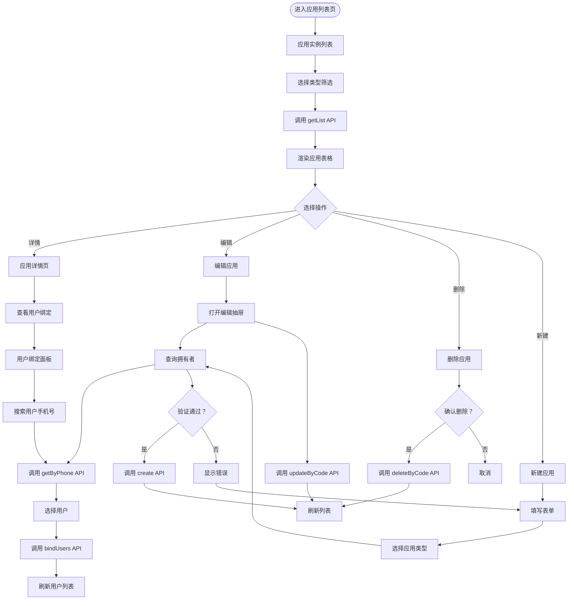

# 应用实例管理页面文档

## 概述

本文档描述应用实例管理页面的前端流程和核心业务。

**模块路径**: `packages/base-frontend/src/app/pages/permission/`

**版本**: 1.0.0

---

## 目录

1. [页面流程图](#页面流程图)
2. [功能说明](#功能说明)
3. [API 接口](#API 接口)
4. [业务规则](#业务规则)

---

## 页面流程图



---

## 功能说明

### 应用实例列表页

| 功能 | 说明 |
|------|------|
| 列表展示 | 展示应用实例列表，支持分页 |
| 类型筛选 | 按应用类型筛选应用实例 |
| 新建应用 | 创建新的应用实例 |
| 查看详情 | 查看应用详细信息及用户绑定 |
| 编辑 | 修改应用信息 |
| 删除 | 删除应用实例 |

### 应用详情页

| 功能 | 说明 |
|------|------|
| 基本信息 | 展示应用详细信息 |
| 用户绑定 | 查看绑定该应用的用户列表 |
| 绑定用户 | 搜索用户并绑定到应用 |
| 角色管理 | 管理应用级角色（见角色管理页面） |

### 用户绑定面板

| 功能 | 说明 |
|------|------|
| 搜索用户 | 通过手机号搜索用户 |
| 选择用户 | 从搜索结果中选择用户 |
| 绑定用户 | 将用户绑定到应用 |
| 解除绑定 | 解除用户与应用的绑定关系 |

---

## API 接口

### 获取应用列表

```
GET /sys/app/list
Params: { appTypeId?: string, page: number, size: number }
```

### 获取应用详情

```
GET /sys/app/:code
```

### 创建应用

```
POST /sys/app
Body: {
  appTypeId: string,
  appName: string,
  appCode: string,
  appDesc?: string,
  appLogo?: string,
  ownerId: string
}
```

### 更新应用

```
PUT /sys/app/:code
Body: {
  appName?: string,
  appDesc?: string,
  appLogo?: string,
  ownerId?: string
}
```

### 删除应用

```
DELETE /sys/app/:code
```

### 绑定用户

```
POST /sys/app/:code/users
Body: {
  userIds: string[],
  isDefault?: number
}
```

### 获取拥有者信息

```
GET /sys/user/:id
```

---

## 业务规则

### 应用实例管理

- `appCode` 全局唯一，创建后不可修改
- 创建应用时必须选择应用类型
- 创建应用时自动绑定拥有者到 `sys_user_app` 表
- 应用实例删除前需检查是否有关联数据

### 用户绑定

- 一个用户可以绑定多个应用
- 绑定关系存储在 `sys_user_app` 表
- 可设置用户的默认应用

### 应用类型关联

- 应用实例必须归属于一个应用类型
- 应用实例继承应用类型的权限池配置
- 应用级角色的权限从应用类型权限池中选择

---

## 相关文档

- [数据库实体设计](./database-entities-design.md)
- [应用类型管理页面](./app-type-management.md)
- [角色管理页面](./role-management.md)
- [权限池配置流程](./permission-pool-setup.md)

---

## 更新历史

| 版本 | 日期 | 变更说明 |
|------|------|----------|
| 1.0.0 | 2026-03-23 | 初始版本，从基础设施详细设计文档拆分 |

---

*本文档由基础设施页面详细设计文档拆分而来*
