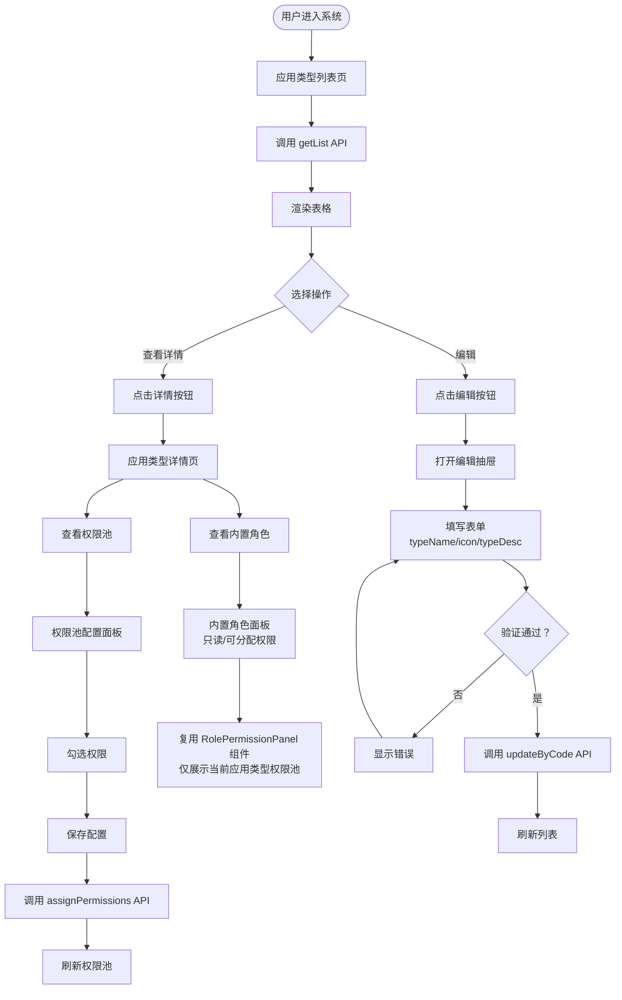

# 应用类型管理页面文档

## 概述

本文档描述应用类型管理页面的前端流程和核心业务。

**模块路径**: `packages/base-frontend/src/app/pages/permission/`

**版本**: 1.0.0

---

## 目录

1. [页面流程图](#页面流程图)
2. [功能说明](#功能说明)
3. [API 接口](#API 接口)
4. [业务规则](#业务规则)

---

## 页面流程图



---

## 功能说明

### 应用类型列表页

| 功能 | 说明 |
|------|------|
| 列表展示 | 展示所有应用类型，支持排序 |
| 查看详情 | 跳转到应用类型详情页 |
| 编辑 | 打开编辑抽屉，修改 typeName、icon、typeDesc |

### 应用类型详情页

| 功能 | 说明 |
|------|------|
| 基本信息 | 展示应用类型详细信息 |
| 权限池配置 | 配置该应用类型可用的权限池 |
| 内置角色 | 查看应用类型全局角色（只读） |

### 权限池配置面板

| 功能 | 说明 |
|------|------|
| PC 权限树 | 勾选 PC 菜单、页面、操作权限加入权限池 |
| 普通权限 | 勾选普通权限加入权限池 |
| OpenAPI 权限 | 勾选 API 权限加入权限池 |
| 保存配置 | 提交权限池配置到后端 |

### 内置角色面板

| 功能 | 说明 |
|------|------|
| 角色列表 | 展示应用类型的内置角色 |
| 查看权限 | 复用 RolePermissionPanel 组件查看角色权限 |
| 只读 | 不允许编辑、删除、分配权限 |

---

## API 接口

### 获取应用类型列表

```
GET /sys/app-type/list
```

### 获取应用类型详情

```
GET /sys/app-type/:code
```

### 更新应用类型

```
PUT /sys/app-type/:code
Body: {
  typeName?: string,
  icon?: string,
  typeDesc?: string
}
```

### 获取权限池配置

```
GET /sys/app-type/:code/permissions
```

### 配置权限池

```
POST /sys/app-type/:code/permissions
Body: {
  permissionCodes: string[]
}
```

---

## 业务规则

### 应用类型管理

- 应用类型不允许前端新增、删除，仅允许后端通过代码管理
- 前端仅允许编辑字段：typeName（应用类型名称）、icon（图标）、typeDesc（应用类型描述）
- `typeCode = 'system'` 为系统内置类型，不可编辑/删除

### 权限池约束

- 权限池通过 `appTypeId` 进行隔离，不同应用类型的权限池相互独立
- 角色权限只能从所属应用类型的权限池中选择

### 内置角色

- 内置角色 (`isBuiltin = 1`) 为应用类型全局角色，不绑定 `appId`
- 内置角色不允许在前端编辑、删除、分配权限
- 内置角色权限查看复用 `RolePermissionPanel` 组件

---

## 相关文档

- [数据库实体设计](./database-entities-design.md)
- [应用实例管理页面](./app-management.md)
- [角色管理页面](./role-management.md)
- [权限池配置流程](./permission-pool-setup.md)

---

## 更新历史

| 版本 | 日期 | 变更说明 |
|------|------|----------|
| 1.0.0 | 2026-03-23 | 初始版本，从基础设施详细设计文档拆分 |

---

*本文档由基础设施页面详细设计文档拆分而来*