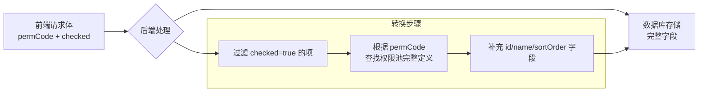
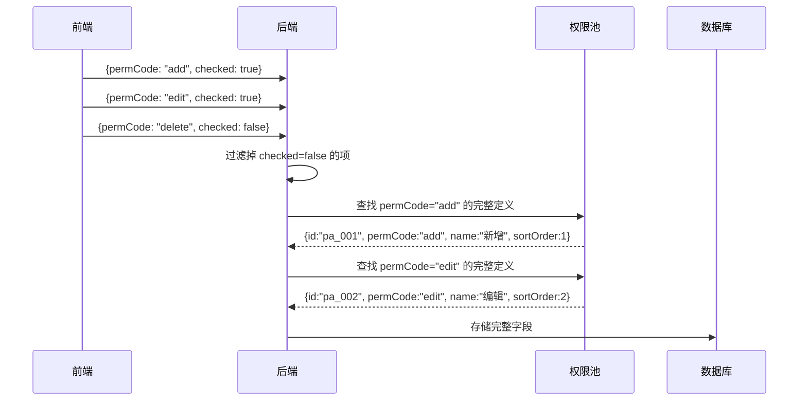
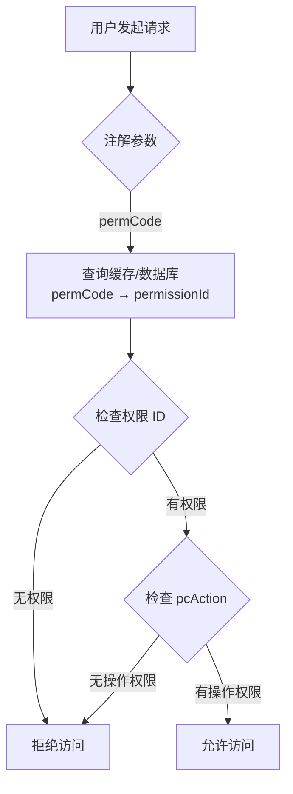
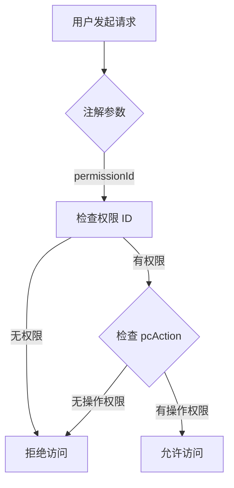

# 权限系统核心概念

> 5 分钟理解权限系统的核心机制

---

## 1. 权限数据结构

### PermissionType + NodeType 双层设计

```
Permission 树形结构示例:

ROOT (MENU)
├── system (MENU)                     ← 菜单目录
│   ├── user-list (PAGE)              ← 页面权限
│   │   └── pcAction: [add, edit]     ← 页面内操作权限
│   └── role-list (PAGE)
│       └── pcAction: [add, delete]
└── business (MENU)
    └── order-list (PAGE)
        └── pcAction: [create, approve]
```

| 字段 | 说明 | 示例值 |
|------|------|--------|
| `permissionType` | 权限类型 | `PC` / `NORMAL` |
| `nodeType` | 节点类型 | `MENU` / `PAGE` / `TAG` |
| `pcAction` | 页面操作权限 | `["add", "edit", "delete"]` |

**组合规则**:
- `PC + MENU` = PC 菜单目录
- `PC + PAGE` = PC 页面权限（父节点必须是 MENU）
- `NORMAL + MENU` = 普通权限目录
- `NORMAL + TAG` = 普通权限标签

---

## 2. pcAction 三层数据流

```
┌─────────────────────────────────────────────────────────────────┐
│ 1. 权限定义 (sys_permission.pcAction)                           │
│    定义 PAGE 节点可用的所有操作：[add, edit, delete]            │
└────────────────────┬────────────────────────────────────────────┘
                     │ 权限池配置时选择子集
                     ▼
┌─────────────────────────────────────────────────────────────────┐
│ 2. 权限池 (sys_app_type_permission.pcAction)                    │
│    应用类型可选操作：[add, edit]                                │
└────────────────────┬────────────────────────────────────────────┘
                     │ 角色分配权限时选择子集
                     ▼
┌─────────────────────────────────────────────────────────────────┐
│ 3. 角色权限 (sys_role_permission.pcAction)                      │
│    角色实际分配的操作：[add]                                    │
└────────────────────┬────────────────────────────────────────────┘
                     │ 用户最终权限计算
                     ▼
┌─────────────────────────────────────────────────────────────────┐
│ 4. 用户最终权限 = ∪(所有关联角色的 permissionId + pcAction)     │
│    相同 permissionId 的 pcAction 取并集                          │
└─────────────────────────────────────────────────────────────────┘
```

**核心约束**:
- 子层的 `pcAction` 必须是父层定义集合的**子集**
- 权限验证时，检查用户最终权限集合是否包含所需操作

---

## 3. pcAction 存储结构与 API 请求体对比

### 3.1 存储结构（数据库）

| 表名 | 字段 | 类型 | 说明 |
|------|------|------|------|
| `sys_permission` | `pcAction` | JSON | 权限定义的操作集合 |
| `sys_app_type_permission` | `pcAction` | JSON | 权限池中的操作子集 |
| `sys_role_permission` | `pcAction` | JSON | 角色分配的操作子集 |

**数据库存储格式示例** (`sys_permission.pcAction`):

```json
[
  {
    "id": "pa_001",
    "permCode": "add",
    "name": "新增",
    "sortOrder": 1
  },
  {
    "id": "pa_002",
    "permCode": "edit",
    "name": "编辑",
    "sortOrder": 2
  },
  {
    "id": "pa_003",
    "permCode": "delete",
    "name": "删除",
    "sortOrder": 3
  }
]
```

### 3.2 API 请求体结构

**权限池配置请求体**:

```typescript
interface PermissionPoolConfigRequest {
  appTypeId: string;
  permissions: Array<{
    permissionId: string;
    pcAction: Array<{
      permCode: string;    // 仅需要 permCode，后端自动映射
      checked: boolean;    // true=选中，false=取消
    }>;
  }>;
}
```

**角色权限分配请求体**:

```typescript
interface RolePermissionAssignRequest {
  roleId: string;
  permissions: Array<{
    permissionId: string;
    pcAction: Array<{
      permCode: string;    // 仅需要 permCode
      checked: boolean;    // true=选中，false=取消
    }>;
  }>;
}
```

### 3.3 存储结构 vs 请求体结构对比表

| 维度 | 存储结构（数据库） | API 请求体结构 |
|------|-------------------|---------------|
| **用途** | 持久化完整权限定义 | 前端提交配置参数 |
| **字段完整性** | 完整（id, permCode, name, sortOrder） | 精简（permCode, checked） |
| **permCode** | 必需，用于权限校验 | 必需，用于标识操作 |
| **id** | 必需，主键标识 | 不需要，后端自动处理 |
| **name** | 必需，展示用 | 不需要，前端已有 |
| **sortOrder** | 必需，排序用 | 不需要，使用存储的排序 |
| **checked** | 不存在 | 必需，表示选中状态 |
| **数据转换** | 原始数据 | 后端转换为存储格式 |

### 3.4 字段映射和转换逻辑

**数据流转过程**:



**字段映射表**:

| 前端请求体字段 | 后端处理 | 数据库存储字段 |
|----------------|----------|----------------|
| `permCode` | 作为查找键 | `permCode` |
| `checked: true` | 保留该项 | - |
| `checked: false` | 忽略该项 | - |
| - | 查找权限池，补充完整信息 | `id` |
| - | 从权限池获取 | `name` |
| - | 从权限池获取 | `sortOrder` |

**转换示例**:



### 3.5 转换示例

**输入（前端请求体）**:

```json
{
  "roleId": "role_001",
  "permissions": [
    {
      "permissionId": "P001",
      "pcAction": [
        { "permCode": "add", "checked": true },
        { "permCode": "edit", "checked": true },
        { "permCode": "delete", "checked": false }
      ]
    }
  ]
}
```

**输出（数据库存储）**:

```json
[
  {
    "roleId": "role_001",
    "permissionId": "P001",
    "pcAction": [
      { "id": "pa_001", "permCode": "add", "name": "新增", "sortOrder": 1 },
      { "id": "pa_002", "permCode": "edit", "name": "编辑", "sortOrder": 2 }
    ]
  }
]
```

**关键说明**:
1. `checked: false` 的操作不会被存储
2. 后端自动补充 `id`、`name`、`sortOrder` 等字段
3. 前端只需关心 `permCode` 和 `checked` 状态

---

## 4. 权限池隔离机制

```
┌─────────────────────────────────────────────────────────────┐
│                      应用类型 A                              │
│  ┌─────────────┐  ┌─────────────┐  ┌─────────────┐         │
│  │  权限池 A    │  │  内置角色   │  │  应用级角色  │         │
│  │ [P1,P2,P3]  │  │  A1,A2     │  │  A-app1    │         │
│  │ [pcA1,pcA2] │  │ [P1,P2]     │  │ [P2,P3]     │         │
│  │             │  │ [pcA1]      │  │ [pcA2]      │         │
│  │ 所有角色的权 │  └─────────────┘  └─────────────┘         │
│  │ 限都从权限池 │         │                  │               │
│  │ 中选择       │         └──────────────────┘               │
│  └─────────────┘                  │                          │
│         ▲                         │                          │
│         └─────────────────────────┘                          │
│                   权限配置数据源                              │
└─────────────────────────────────────────────────────────────┘
```

**隔离规则**:
- 每个应用类型有独立的权限池（通过 `appTypeId` 隔离）
- 内置角色和应用级角色的权限都必须从权限池中选择
- 不同应用类型的权限池互不影响

---

## 5. 权限验证逻辑

### 5.1 前端按钮/菜单显示

```typescript
// 伪代码示例
function canViewMenu(permissionId: string): boolean {
  return userPermissions.has(permissionId);
}

function canPerformAction(permissionId: string, action: string): boolean {
  const actions = userPermissions.get(permissionId);
  return actions?.includes(action) ?? false;
}
```

### 5.2 后端接口权限验证

**推荐方式：使用 `permCode`（开发友好）**：

```typescript
// 方式 1：使用 permCode（推荐）
// 优势：开发时无需知道 UUID，代码可读性强，权限变更不影响代码
@RequirePermission(permCode = "system.user-list", pcAction = "delete")
async deleteUser(userId: string) {
  // 框架自动根据 permCode 查询 permissionId，再验证用户权限
}
```

**备选方式：使用 `permissionId`（需预分配 UUID 或代码生成）**：

```typescript
// 方式 2：使用 permissionId
// 适用场景：权限编码固定，通过初始化脚本预分配 UUID
@RequirePermission(permissionId = "550e8400-e29b-41d4-a716-446655440000", pcAction = "delete")
async deleteUser(userId: string) {
  // 直接使用 UUID 验证，性能略优（无需 permCode→ID 转换）
}
```

**框架内部处理逻辑**：

```typescript
// 权限验证器伪代码
async validatePermission(param: { permissionId?: string; permCode?: string }, action: string) {
  let id: string;

  if (param.permissionId) {
    // 方式 2：直接使用 ID
    id = param.permissionId;
  } else if (param.permCode) {
    // 方式 1：根据 permCode 查询 ID（缓存优先）
    id = await this.cache.getPermissionId(param.permCode);
  } else {
    throw new Error('permissionId 或 permCode 必须提供一个');
  }

  // 验证用户是否有该权限
  const hasPermission = userPermissions.has(id);
  if (!hasPermission) {
    throw new ForbiddenException('无权限访问');
  }

  // 验证 pcAction
  const actions = userPermissions.get(id);
  if (!actions?.includes(action)) {
    throw new ForbiddenException(`无 ${action} 操作权限`);
  }
}
```

### 5.3 验证流程

**方式 1：使用 permCode（推荐）**：



**方式 2：使用 permissionId**：



---

## 6. 关键业务规则

| 规则 | 说明 |
|------|------|
| 权限池约束 | 角色权限必须是权限池的子集 |
| pcAction 约束 | 角色 pcAction 必须是权限池 pcAction 的子集 |
| 用户权限计算 | 所有关联角色权限的并集，相同 permissionId 的 pcAction 合并 |
| 权限验证时机 | 前端控制显示/隐藏，后端控制接口访问 |

---

## 7. 相关文档

- [权限分配详细流程](../flows/permission-assignment.md) - 完整的权限分配序列图
- [数据库实体设计](../database/database-entities-design.md) - 表结构定义
- [ER 关系图](../database/database-er-diagram.md) - 实体关系可视化

---

*本文档是核心概念模块的一部分，建议按顺序阅读：[permissions.md](./permissions.md) → [roles.md](./roles.md) → [architecture.md](./architecture.md)*
