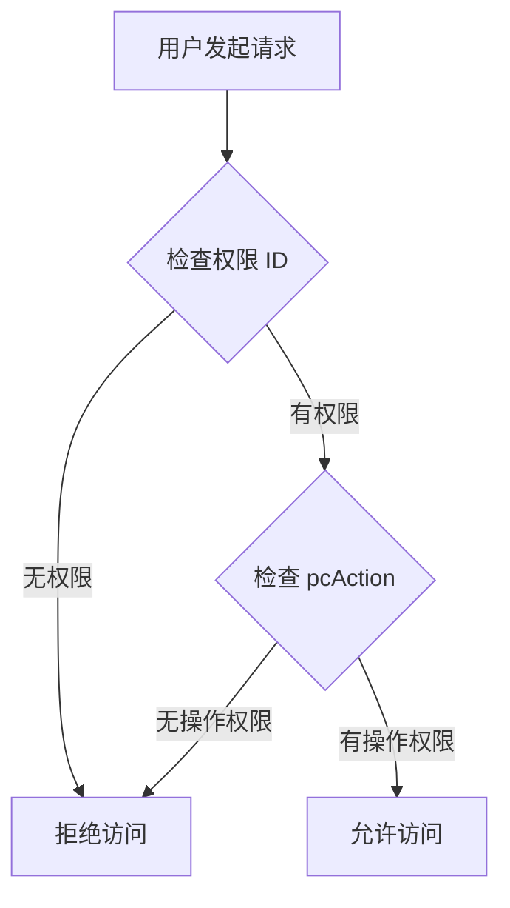

# 权限系统核心概念

> 5 分钟理解权限系统的核心机制

---

## 1. 权限数据结构

### PermissionType + NodeType 双层设计

```
Permission 树形结构示例:

ROOT (MENU)
├── system (MENU)                     ← 菜单目录
│   ├── user-list (PAGE)              ← 页面权限
│   │   └── pcAction: [add, edit]     ← 页面内操作权限
│   └── role-list (PAGE)
│       └── pcAction: [add, delete]
└── business (MENU)
    └── order-list (PAGE)
        └── pcAction: [create, approve]
```

| 字段 | 说明 | 示例值 |
|------|------|--------|
| `permissionType` | 权限类型 | `PC` / `NORMAL` |
| `nodeType` | 节点类型 | `MENU` / `PAGE` / `TAG` |
| `pcAction` | 页面操作权限 | `["add", "edit", "delete"]` |

**组合规则**:
- `PC + MENU` = PC 菜单目录
- `PC + PAGE` = PC 页面权限（父节点必须是 MENU）
- `NORMAL + MENU` = 普通权限目录
- `NORMAL + TAG` = 普通权限标签

---

## 2. pcAction 三层数据流

```
┌─────────────────────────────────────────────────────────────────┐
│ 1. 权限定义 (sys_permission.pcAction)                           │
│    定义 PAGE 节点可用的所有操作：[add, edit, delete]            │
└────────────────────┬────────────────────────────────────────────┘
                     │ 权限池配置时选择子集
                     ▼
┌─────────────────────────────────────────────────────────────────┐
│ 2. 权限池 (sys_app_type_permission.pcAction)                    │
│    应用类型可选操作：[add, edit]                                │
└────────────────────┬────────────────────────────────────────────┘
                     │ 角色分配权限时选择子集
                     ▼
┌─────────────────────────────────────────────────────────────────┐
│ 3. 角色权限 (sys_role_permission.pcAction)                      │
│    角色实际分配的操作：[add]                                    │
└────────────────────┬────────────────────────────────────────────┘
                     │ 用户最终权限计算
                     ▼
┌─────────────────────────────────────────────────────────────────┐
│ 4. 用户最终权限 = ∪(所有关联角色的 permissionId + pcAction)     │
│    相同 permissionId 的 pcAction 取并集                          │
└─────────────────────────────────────────────────────────────────┘
```

**核心约束**:
- 子层的 `pcAction` 必须是父层定义集合的**子集**
- 权限验证时，检查用户最终权限集合是否包含所需操作

---

## 3. 权限池隔离机制

```
┌─────────────────────────────────────────────────────────────┐
│                      应用类型 A                              │
│  ┌─────────────┐  ┌─────────────┐  ┌─────────────┐         │
│  │  权限池 A    │  │  内置角色   │  │  应用级角色  │         │
│  │ [P1,P2,P3]  │  │  A1,A2     │  │  A-app1    │         │
│  │ [pcA1,pcA2] │  │ [P1,P2]     │  │ [P2,P3]     │         │
│  │             │  │ [pcA1]      │  │ [pcA2]      │         │
│  │ 所有角色的权 │  └─────────────┘  └─────────────┘         │
│  │ 限都从权限池 │         │                  │               │
│  │ 中选择       │         └──────────────────┘               │
│  └─────────────┘                  │                          │
│         ▲                         │                          │
│         └─────────────────────────┘                          │
│                   权限配置数据源                              │
└─────────────────────────────────────────────────────────────┘
```

**隔离规则**:
- 每个应用类型有独立的权限池（通过 `appTypeId` 隔离）
- 内置角色和应用级角色的权限都必须从权限池中选择
- 不同应用类型的权限池互不影响

---

## 4. 权限验证逻辑

### 4.1 前端按钮/菜单显示

```typescript
// 伪代码示例
function canViewMenu(permissionId: string): boolean {
  return userPermissions.has(permissionId);
}

function canPerformAction(permissionId: string, action: string): boolean {
  const actions = userPermissions.get(permissionId);
  return actions?.includes(action) ?? false;
}
```

### 4.2 后端接口权限验证

```typescript
// 伪代码示例
@RequirePermission(permissionId = "user-list", pcAction = "delete")
async deleteUser(userId: string) {
  // 框架自动验证用户是否有 user-list 权限的 delete 操作
}
```

### 4.3 验证流程



---

## 5. 关键业务规则

| 规则 | 说明 |
|------|------|
| 权限池约束 | 角色权限必须是权限池的子集 |
| pcAction 约束 | 角色 pcAction 必须是权限池 pcAction 的子集 |
| 用户权限计算 | 所有关联角色权限的并集，相同 permissionId 的 pcAction 合并 |
| 权限验证时机 | 前端控制显示/隐藏，后端控制接口访问 |

---

## 6. 相关文档

- [权限分配详细流程](../flows/permission-assignment.md) - 完整的权限分配序列图
- [数据库实体设计](../database/database-entities-design.md) - 表结构定义
- [ER 关系图](../database/database-er-diagram.md) - 实体关系可视化

---

*本文档是核心概念模块的一部分，建议按顺序阅读：permissions.md → roles.md → architecture.md*
