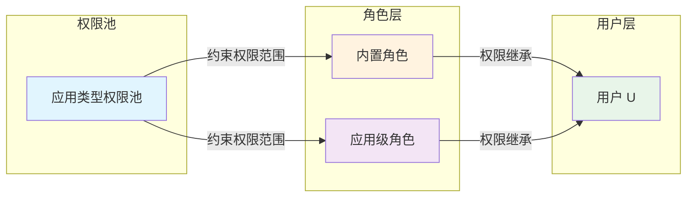

# 角色体系核心概念

> 5 分钟理解角色分类、拥有者机制与权限继承规则

---

## 1. 角色分类

系统中有两种角色，通过 `sys_role` 表的字段区分：

| 角色类型 | 标识字段 | 说明 | 绑定关系 |
|----------|----------|------|----------|
| **内置角色** | `isBuiltin=1` + `appTypeId` | 应用类型级别的全局角色 | 绑定到应用类型 |
| **应用级角色** | `isBuiltin=0` + `appId` | 特定应用实例的角色 | 绑定到应用实例 |

```
示例：
┌─────────────────────────────────────────────────────────────┐
│ 应用类型：OA 系统 (appTypeId = "oa")                        │
│                                                             │
│   内置角色（全局有效）：                                     │
│   - OA 管理员 (isBuiltin=1, appTypeId="oa")                │
│   - OA 普通用户 (isBuiltin=1, appTypeId="oa")              │
│                                                             │
│   应用级角色（仅对特定应用实例有效）：                       │
│   - 审批专员 (isBuiltin=0, appId="oa-app-001")             │
│   - 数据查看员 (isBuiltin=0, appId="oa-app-002")           │
└─────────────────────────────────────────────────────────────┘
```

---

## 2. 拥有者角色机制

### 2.1 拥有者的定义

每个应用类型必须有一个**拥有者角色**（`isOwner=1`），通常是内置角色：

```
sys_role 表示例:
┌──────┬────────────┬───────────┬────────────┬───────────┬─────────┐
│ id   │ roleName   │ appTypeId │ isBuiltin  │ isOwner   │ 说明    │
├──────┼────────────┼───────────┼────────────┼───────────┼─────────┤
│ r001 │ OA 拥有者  │ oa        │ 1          │ 1         │ 拥有者  │
│ r002 │ OA 管理员  │ oa        │ 1          │ 0         │ 管理员  │
│ r003 │ OA 用户    │ oa        │ 1          │ 0         │ 普通用户│
└──────┴────────────┴───────────┴────────────┴───────────┴─────────┘
```

### 2.2 拥有者权限来源

**核心规则**: 拥有者通过**绑定拥有者角色**获得权限，而非直接获得权限池所有权限。

```
用户 U (应用所有者)
    │
    │ 1. 自动绑定拥有者角色 (isOwner=1)
    ↓
sys_user_role 记录:
┌──────────┬─────────┬───────────┐
│ userId   │ roleId  │ 说明      │
├──────────┼─────────┼───────────┤
│ user-U   │ r001    │ 拥有者角色│
└──────────┴─────────┴───────────┘
    │
    │ 2. 通过角色关联获得权限
    ↓
sys_role_permission 记录 (拥有者角色的权限):
┌──────────┬──────────────┬───────────────────┐
│ roleId   │ permissionId │ permissionValue   │
├──────────┼──────────────┼───────────────────┤
│ r001     │ perm-001     │ 3n (ADD|EDIT)     │
│ r001     │ perm-002     │ 4n (DELETE)       │
└──────────┴──────────────┴───────────────────┘
```

### 2.3 为什么在两处记录拥有者？

| 记录位置 | 字段 | 用途 |
|----------|------|------|
| `sys_app.ownerId` | `ownerId` | 应用归属关系（业务层面） |
| `sys_user_app` | `userId` + `appId` | 用户 - 应用绑定关系（权限计算层面） |

**设计理由**:
- `sys_app.ownerId`: 快速查询"这个应用属于谁"
- `sys_user_app`: 统一处理用户 - 应用绑定关系，支持多拥有者场景

---

## 3. 角色权限继承规则

### 3.1 用户最终权限计算公式

```
用户最终权限 = 所有关联角色的 permissionValue 取 OR

userValue = role1Value | role2Value | ...

关联角色来源:
1. 用户直接绑定的角色 (sys_user_role)
2. 通过应用绑定的角色 (应用 → 角色 → sys_user_role)
3. 通过应用类型绑定的角色 (应用类型 → 内置角色 → sys_user_role)
```

### 3.2 权限并集计算示例

```
用户 U 的角色关联:
├── 角色 R1 (直接绑定)
│   └── 权限：{P1: 3n, P2: 1n}
├── 角色 R2 (通过应用 A 绑定)
│   └── 权限：{P2: 6n, P3: 32n}
└── 角色 R3 (通过应用类型 T 绑定)
    └── 权限：{P1: 4n}

用户 U 的最终权限:
├── P1: 7n  ← R1|R3 = 3n|4n = 7n (ADD|EDIT|DELETE)
├── P2: 7n  ← R1|R2 = 1n|6n = 7n (ADD|EDIT|DELETE)
└── P3: 32n ← R2 独有 (VIEW)
```

### 3.3 权限继承流程图



---

## 4. 角色删除级联处理

删除角色时，按以下顺序处理以保证数据一致性：

```
1. BEGIN TRANSACTION

2. 删除角色 - 用户关联 (sys_user_role)
   DELETE FROM sys_user_role WHERE roleId = ?

3. 删除角色 - 权限关联 (sys_role_permission)
   DELETE FROM sys_role_permission WHERE roleId = ?

4. 删除角色 (sys_role)
   DELETE FROM sys_role WHERE id = ?

5. COMMIT
```

**注意**:
- 拥有者角色 (`isOwner=1`) 不允许删除
- 删除操作必须在事务中执行，保证原子性

---

## 5. 关键业务规则

| 规则 | 说明 |
|------|------|
| 角色分类 | 内置角色 (isBuiltin=1, appTypeId) / 应用级角色 (isBuiltin=0, appId) |
| 拥有者角色 | 每个应用类型必须有一个 isOwner=1 的角色，不可删除 |
| 拥有者权限 | 通过绑定拥有者角色获得权限，非直接获得 |
| 权限继承 | 用户权限 = 所有关联角色权限的位运算 OR |
| permissionValue 合并 | 相同 permissionId 的 permissionValue 取位运算 OR |

---

## 6. 相关文档

- [权限系统核心概念](./permissions.md) - 权限数据结构与验证逻辑
- [系统架构核心概念](./architecture.md) - 应用类型中心模式
- [角色管理页面](../pages/role-management.md) - 角色配置 UI 流程
- [数据库实体设计](../database/database-entities-design.md) - sys_role 表定义

---

*本文档是核心概念模块的一部分，建议按顺序阅读：[permissions.md](./permissions.md) → [roles.md](./roles.md) → [architecture.md](./architecture.md)*
