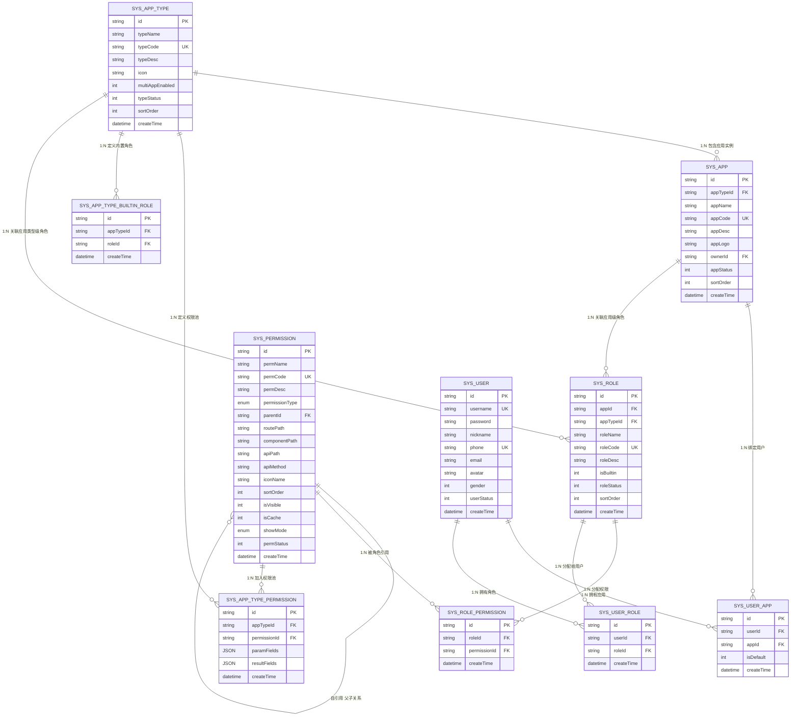

# 数据库 ER 关系图文档

## 概述

本文档描述基础设施页面的数据库 ER 关系和实体间关联。

**版本**: 1.0.0

---

## 目录

1. [完整 ER 图](#完整 ER 图)
2. [核心关系说明](#核心关系说明)
3. [应用类型中心模式](#应用类型中心模式)
4. [权限隔离机制](#权限隔离机制)
5. [角色权限继承](#角色权限继承)
6. [权限树形结构](#权限树形结构)

---

## 完整 ER 图



---

## 核心关系说明

| 关系 | 类型 | 说明 |
|------|------|------|
| AppType → App | 1:N | 一个应用类型可包含多个应用实例 |
| AppType → AppTypePermission | 1:N | 一个应用类型有多个权限池配置 |
| AppType → AppTypeBuiltinRole | 1:N | 一个应用类型有多个内置角色 |
| AppType → Role | 1:N | 一个应用类型有多个应用类型级角色 |
| App → UserApp | 1:N | 一个应用可绑定多个用户 |
| App → Role | 1:N | 一个应用有多个应用级角色 |
| Role → RolePermission | 1:N | 一个角色有多个权限分配 |
| Role → UserRole | 1:N | 一个角色可分配给多个用户 |
| Permission → Permission | 1:N | 权限自引用形成树形结构 |
| Permission → RolePermission | 1:N | 一个权限可被多个角色引用 |
| Permission → AppTypePermission | 1:N | 一个权限可加入多个权限池 |
| User → UserApp | 1:N | 一个用户可拥有多个应用 |
| User → UserRole | 1:N | 一个用户可拥有多个角色 |

---

## 应用类型中心模式

```
应用类型 (AppType) 是整个权限系统的中心节点：

                    ┌─────────────────┐
                    │   AppType       │
                    │  (应用类型)     │
                    └────────┬────────┘
                             │
         ┌───────────────────┼───────────────────┐
         │                   │                   │
         ▼                   ▼                   ▼
┌─────────────────┐ ┌─────────────────┐ ┌─────────────────┐
│      App        │ │      Role       │ │AppTypePermission│
│  (应用实例)     │ │  (应用类型角色) │ │  (权限池)       │
└────────┬────────┘ └────────┬────────┘ └────────┬────────┘
         │                   │                   │
         ▼                   ▼                   │
┌─────────────────┐ ┌─────────────────┐         │
│    UserApp      │ │  RolePermission │         │
│  (用户绑定)     │ │  (角色权限)     │         │
└─────────────────┘ └────────┬────────┘         │
                             │                  │
                             └────────┬─────────┘
                                      │
                                      ▼
                             ┌─────────────────┐
                             │   Permission    │
                             │    (权限)       │
                             └─────────────────┘
```

---

## 权限隔离机制

```
应用类型级别隔离：

┌─────────────────────────────────────────────────────────────┐
│                      应用类型 A                              │
│  ┌─────────────┐  ┌─────────────┐  ┌─────────────┐         │
│  │  权限池 A    │  │  内置角色   │  │  应用级角色  │         │
│  │ [P1,P2,P3]  │  │  A1,A2     │  │  A-app1    │         │
│  │             │  │ [P1,P2]     │  │ [P2,P3]     │         │
│  │ 所有角色的权 │  └─────────────┘  └─────────────┘         │
│  │ 限都从权限池 │         │                  │               │
│  │ 中选择       │         └──────────────────┘               │
│  └─────────────┘                  │                          │
│         ▲                         │                          │
│         └─────────────────────────┘                          │
│                   权限配置数据源                              │
└─────────────────────────────────────────────────────────────┘

┌─────────────────────────────────────────────────────────────┐
│                      应用类型 B                              │
│  ┌─────────────┐  ┌─────────────┐  ┌─────────────┐         │
│  │  权限池 B    │  │  内置角色   │  │  应用级角色  │         │
│  │ [P4,P5,P6]  │  │  B1,B2     │  │  B-app1    │         │
│  │             │  │ [P4,P5]     │  │ [P5,P6]     │         │
│  │ 所有角色的权 │  └─────────────┘  └─────────────┘         │
│  │ 限都从权限池 │         │                  │               │
│  │ 中选择       │         └──────────────────┘               │
│  └─────────────┘                  │                          │
│         ▲                         │                          │
│         └─────────────────────────┘                          │
│                   权限配置数据源                              │
└─────────────────────────────────────────────────────────────┘

说明:
1. 内置角色：不绑定 appId，仅绑定 appTypeId，为应用类型全局角色
2. 应用级角色：必须绑定 appId，属于具体应用实例
3. 所有角色的权限配置数据源均为应用类型权限池
4. 权限 P1,P2,P3 仅在应用类型 A 中可用
5. 权限 P4,P5,P6 仅在应用类型 B 中可用
```

---

## 角色权限继承

```
用户最终权限计算：

用户 U
├── 直接绑定的角色 R1
│   └── 权限集合 {P1, P2, P3}
├── 通过应用 A 绑定的角色 R2
│   └── 权限集合 {P4, P5}
└── 通过应用类型 T 绑定的角色 R3
    └── 权限集合 {P6, P7}

用户 U 的最终权限 = {P1, P2, P3, P4, P5, P6, P7}
                    (并集)
```

---

## 权限树形结构

```
Permission 树形示例:

ROOT
├── PC_MENU (菜单权限)
│   ├── system (系统管理)
│   │   ├── PC_PAGE
│   │   │   ├── user-list (用户列表)
│   │   │   │   ├── user-add (新增用户) [PC_ACTION]
│   │   │   │   ├── user-edit (编辑用户) [PC_ACTION]
│   │   │   │   └── user-delete (删除用户) [PC_ACTION]
│   │   │   └── role-list (角色列表)
│   │   │       └── role-edit (编辑角色) [PC_ACTION]
│   │   └── PC_PAGE
│   │       └── config-page (配置页面)
│   └── PC_MENU
│       └── business (业务管理)
│           └── PC_PAGE
│               └── order-list (订单列表)
└── API (OpenAPI 权限)
    ├── API:ROOT
    │   └── API:MODULE:SYS
    │       └── API:CONTROLLER:USER
    │           ├── API:METHOD:getList
    │           ├── API:METHOD:getById
    │           └── API:METHOD:create
    │       └── API:CONTROLLER:ROLE
    │           └── API:METHOD:assignPermissions
```

---

## 相关文档

- [数据库实体设计](./database-entities-design.md)
- [应用类型管理页面](./app-type-management.md)
- [角色管理页面](./role-management.md)
- [权限池配置流程](./permission-pool-setup.md)

---

## 更新历史

| 版本 | 日期 | 变更说明 |
|------|------|----------|
| 1.0.0 | 2026-03-23 | 初始版本，从基础设施详细设计文档拆分 |

---

*本文档由基础设施页面详细设计文档拆分而来*
