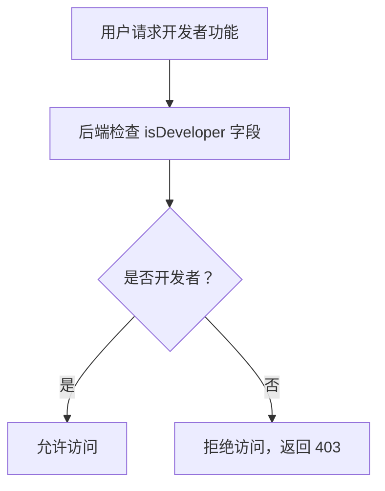

# 开发者模式说明文档

## 概述

本文档描述开发者模式的定义、鉴权方式、可见功能等相关内容。

**版本**: 1.0.0

---

## 目录

1. [开发者模式定义](#1-开发者模式定义)
2. [开发者用户标识](#2-开发者用户标识)
3. [鉴权方式](#3-鉴权方式)
4. [可见功能](#4-可见功能)
5. [业务规则](#5-业务规则)

---

## 1. 开发者模式定义

开发者模式是一种特殊的应用模式，用于管理系统的基础配置和开发相关功能。

**特点**:
- 仅对开发者用户开放
- 包含应用类型管理、权限管理等基础配置功能
- 通过后端接口鉴权实现访问控制

---

## 2. 开发者用户标识

### 2.1 用户实体字段

```typescript
class UserEntity {
  // ... 其他字段
  isDeveloper?: number;  // 是否开发者：1-是 0-否 (tinyint(1), default 0)
}
```

### 2.2 标识说明

| 值 | 说明 |
|----|------|
| 1 | 开发者用户，可访问开发者模式功能 |
| 0 | 普通用户，不可访问开发者模式功能 |

### 2.3 开发者用户设置

- 开发者用户在系统初始化时配置
- 通常系统管理员账号（如 admin）默认为开发者用户
- 开发者用户可以通过另一个开发者用户修改

---

## 3. 鉴权方式

### 3.1 路由鉴权



### 3.2 菜单显示控制

```
用户登录后加载菜单
    ↓
检查用户是否为开发者 (isDeveloper = 1)
    ↓
是：在菜单树中包含开发者模式菜单
否：过滤掉开发者模式菜单
    ↓
返回用户可见的菜单树
```

### 3.3 接口响应

**非开发者用户访问开发者功能时的响应**:

```json
{
  "code": 403,
  "message": "无权限访问，仅限开发者模式访问"
}
```

---

## 4. 可见功能

### 4.1 开发者模式专属功能

| 功能 | 页面 | 说明 |
|------|------|------|
| 应用类型管理 | `/app-type` | 管理应用类型、配置权限池、管理内置角色 |
| 权限管理 | `/permission` | 管理 PC 权限树 |
| 开发者工具 | `/dev-tools` | 代码生成、元数据同步等（可选） |

### 4.2 应用类型管理

开发者模式的核心功能，包括：

- **应用类型列表**: 查看所有应用类型
- **权限池配置**: 配置应用类型可用的权限范围
- **内置角色管理**: 添加、编辑、删除内置角色，分配权限
- **基本信息编辑**: 修改应用类型名称、图标、描述

### 4.3 权限管理

- **PC 权限树**: 管理 PC 后台的菜单和页面权限
- **NORMAL 权限**: 管理移动端或非后台程序的权限

---

## 5. 业务规则

### 5.1 访问控制

- 只有 `isDeveloper = 1` 的用户可以访问开发者模式功能
- 后端接口必须检查用户的开发者身份
- 前端路由根据用户身份动态生成

### 5.2 应用类型管理

- 应用类型不允许前端新增、删除，仅允许后端程序启动时通过代码按编码管理
- 前端仅允许编辑字段：typeName（应用类型名称）、icon（图标）、typeDesc（应用类型描述）
- `typeCode = 'system'` 为系统内置类型，不可删除

### 5.3 权限管理

- PC 权限、NORMAL 权限都可以通过权限管理页面配置
- `showMode = DEV` 的权限仅对开发者模式用户可见

### 5.4 安全考虑

- 开发者用户应该严格控制数量
- 建议仅系统初始化时配置 1-2 个开发者用户
- 开发者用户的密码应该更加严格（长度、复杂度要求）

---

## 相关文档

- [数据库实体设计](../database/entities-design.md)
- [应用类型管理页面](../pages/app-type-management.md)
- [权限管理页面](../pages/permission-management.md)
- [系统初始化说明](./system-initialization.md)

---

## 更新历史

| 版本 | 日期 | 变更说明 |
|------|------|----------|
| 1.0.0 | 2026-03-25 | 初始版本，描述开发者模式的定义和鉴权方式 |

---

*本文档由基础设施页面详细设计文档拆分而来*
