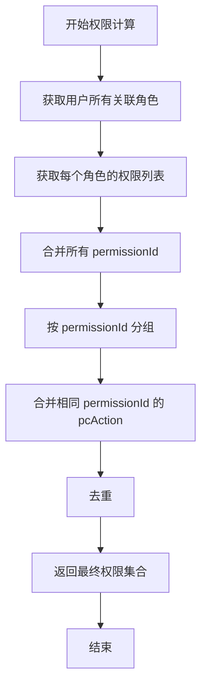
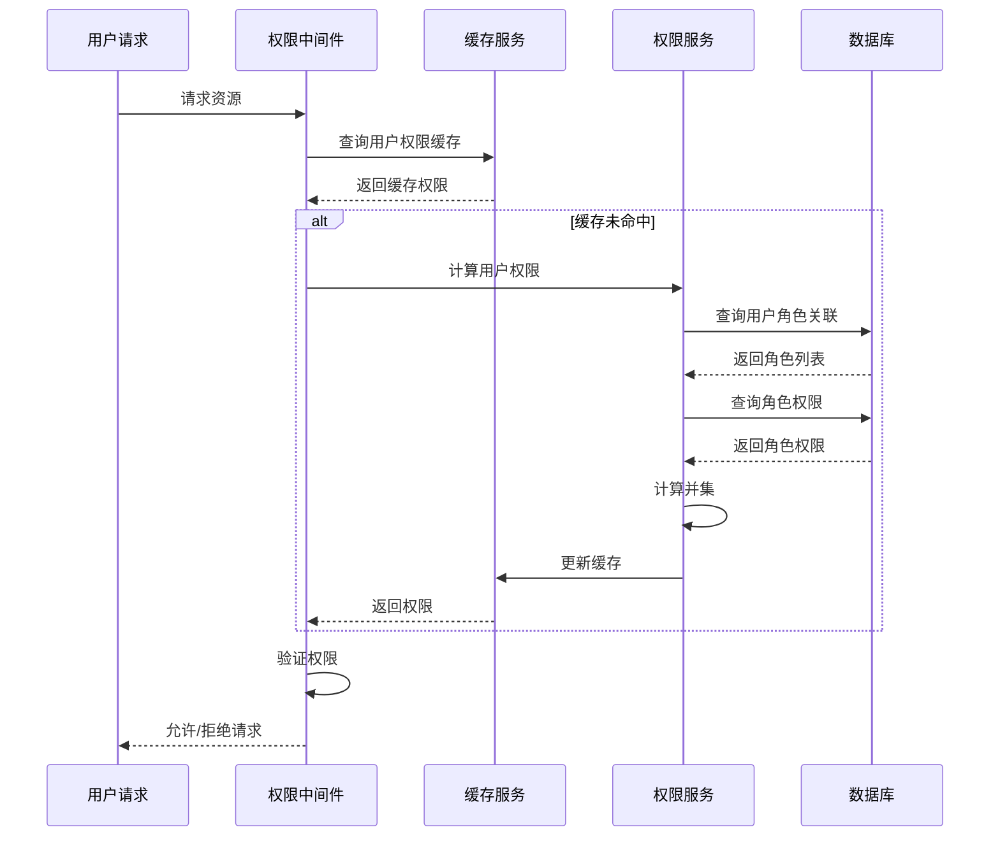
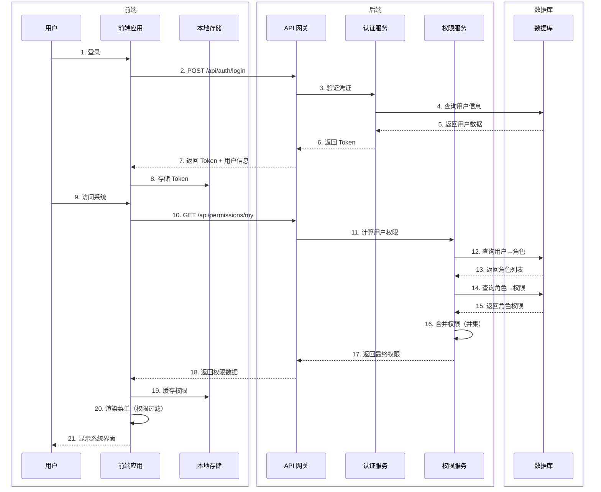

# 权限计算规则文档

## 概述

本文档描述系统权限计算的详细规则和逻辑，包括用户最终权限的计算方式、pcAction 合并规则等。

**版本**: 2.1.0 | **最后更新**: 2026-03-27

---

## 目录

1. [权限计算基础](#1-权限计算基础)
2. [用户最终权限计算](#2-用户最终权限计算)
3. [pcAction 合并规则](#3-pcAction合并规则)
4. [权限验证流程](#4-权限验证流程)
5. [业务规则](#5-业务规则)
6. [前后端权限计算泳道图](#6-前后端权限计算泳道图)

---

## 1. 权限计算基础

### 1.1 权限来源

用户的权限来源于其绑定的角色，具体包括：

| 来源 | 说明 | 绑定方式 |
|------|------|----------|
| 拥有者角色 | 每个应用类型必须有一个拥有者角色 (`isOwner=1`)，拥有者自动绑定该角色 | 拥有者变更时自动绑定/解绑 |
| 内置角色 | 应用类型全局角色，绑定 `appTypeId` | 通过成员管理页面分配 |
| 应用级角色 | 应用实例专属角色，绑定 `appId` | 通过成员管理页面分配 |

### 1.2 权限约束

- 所有角色的权限配置都必须从所属应用类型的权限池中选择
- 权限池通过 `appTypeId` 进行隔离，不同应用类型的权限池相互独立
- 角色权限中的 `pcAction` 必须是权限池中对应权限 `pcAction` 的子集

---

## 2. 用户最终权限计算

### 2.1 计算公式

```
用户最终权限 = ∪(用户所有关联角色的权限)
```

### 2.2 计算步骤



### 2.3 计算示例

```
用户 U 绑定了以下角色：
- 角色 R1: 拥有者角色
- 角色 R2: 普通员工角色
- 角色 R3: 审计员角色

各角色的权限：
R1 权限 = {
  P1: [pcA1, pcA2, pcA3],  // 用户管理页面
  P2: [pcA1, pcA2],        // 角色管理页面
  P3: [pcA1, pcA2, pcA3]   // 配置管理页面
}

R2 权限 = {
  P1: [pcA1],              // 用户管理页面（只查看）
  P4: [pcA1, pcA2]         // 订单管理页面
}

R3 权限 = {
  P1: [pcA1, pcA2],        // 用户管理页面（查看 + 编辑）
  P5: [pcA1]               // 日志查看页面
}

用户 U 的最终权限 = {
  P1: [pcA1, pcA2, pcA3],  // 取并集
  P2: [pcA1, pcA2],
  P3: [pcA1, pcA2, pcA3],
  P4: [pcA1, pcA2],
  P5: [pcA1]
}
```

---

## 3. pcAction合并规则

### 3.1 合并原则

- 相同 `permissionId` 的 `pcAction` 取并集
- 不同 `permissionId` 的 `pcAction` 不合并
- `pcAction` 的合并基于 `permCode` 去重

### 3.2 合并算法

```typescript
function mergePermissions(rolePermissions: RolePermission[]): UserPermission[] {
  const permissionMap = new Map<string, Set<string>>();

  for (const rolePerm of rolePermissions) {
    const { permissionId, pcAction } = rolePerm;

    if (!permissionMap.has(permissionId)) {
      permissionMap.set(permissionId, new Set());
    }

    // 合并 pcAction 的 permCode
    if (pcAction) {
      for (const action of pcAction) {
        permissionMap.get(permissionId)!.add(action.permCode);
      }
    }
  }

  // 转换为最终结果
  return Array.from(permissionMap.entries()).map(([permissionId, permCodes]) => ({
    permissionId,
    pcAction: Array.from(permCodes).map(code => ({ permCode: code }))
  }));
}
```

### 3.3 示例

```
输入（角色权限）：
RolePermission 1: { permissionId: 'P1', pcAction: [{name: '新增', permCode: 'add'}, {name: '编辑', permCode: 'edit'}] }
RolePermission 2: { permissionId: 'P1', pcAction: [{name: '编辑', permCode: 'edit'}, {name: '删除', permCode: 'delete'}] }
RolePermission 3: { permissionId: 'P2', pcAction: [{name: '查看', permCode: 'view'}] }

输出（用户最终权限）：
UserPermission 1: { permissionId: 'P1', pcAction: [{permCode: 'add'}, {permCode: 'edit'}, {permCode: 'delete'}] }
UserPermission 2: { permissionId: 'P2', pcAction: [{permCode: 'view'}] }
```

---

## 4. 权限验证流程

### 4.1 运行时权限验证



### 4.2 验证规则

| 验证项 | 说明 |
|--------|------|
| permissionId | 检查用户是否拥有所请求的权限 ID |
| pcAction | 检查用户是否拥有所请求的操作权限 |
| 权限池 | 检查权限是否在应用类型权限池中（可选） |

---

## 5. 业务规则

### 5.1 权限隔离

- 不同应用实例的权限相互隔离
- 用户在不同应用实例下可能拥有不同的权限
- 用户切换应用实例后，权限自动刷新

### 5.2 拥有者权限

- 拥有者通过绑定拥有者角色获得权限
- 拥有者角色 (`isOwner=1`) 的权限由应用类型权限池分配
- 拥有者变更时，自动调整拥有者角色绑定

### 5.3 多角色权限

- 一个用户可以绑定多个角色
- 多角色的权限取并集
- 相同 `permissionId` 的 `pcAction` 合并

### 5.4 缓存策略

- 用户权限计算结果应该缓存，避免重复计算
- 缓存键：`user:{userId}:app:{appId}:permissions`
- 缓存过期条件：
  - 用户角色变更
  - 角色权限变更
  - 用户切换应用实例
  - 缓存过期时间到达（建议 30 分钟）

---

## 6. 前后端权限计算泳道图

### 6.1 权限计算泳道图

```mermaid
swimlaneDiagram
    swimlane 前端 {
        A1[用户登录] --> A2[请求用户权限]
        A2 --> A3[接收权限数据]
        A3 --> A4[缓存到本地]
        A4 --> A5[渲染菜单/按钮]
        A5 --> A6[权限控制显示]
    }

    swimlane 后端 {
        B1[接收登录请求] --> B2[验证用户身份]
        B2 --> B3[查询用户角色]
        B3 --> B4[查询角色权限]
        B4 --> B5[计算并集]
        B5 --> B6[返回权限数据]
    }

    swimlane 数据库 {
        C1[用户表] --> C2[用户角色关联表]
        C2 --> C3[角色权限关联表]
        C3 --> C4[权限表]
    }

    A1 --> B1
    B2 --> C1
    B3 --> C2
    B4 --> C3
    B6 --> A3
```

### 6.2 各层职责边界

| 层级 | 职责 | 具体任务 |
|------|------|----------|
| **前端** | 展示控制 | 菜单显示/隐藏、按钮启用/禁用、页面访问控制 |
| **后端** | 权限计算 + 接口控制 | 权限数据计算、接口访问验证、数据权限过滤 |
| **数据库** | 数据存储 | 用户、角色、权限数据的持久化存储 |

### 6.3 详细交互流程



### 6.4 权限计算时机

| 时机 | 触发条件 | 计算方 | 说明 |
|------|----------|--------|------|
| 登录时 | 用户登录成功 | 后端 | 计算完整权限返回给前端 |
| 切换应用 | 用户切换应用实例 | 后端 | 重新计算应用级权限 |
| 角色变更 | 管理员调整角色 | 后端 | 被动刷新，下次请求生效 |
| Token 刷新 | Token 过期刷新 | 后端 | 重新验证并返回权限 |
| 手动刷新 | 用户刷新页面 | 前端 | 重新请求权限数据 |

### 6.5 前后端权限控制对比

| 控制点 | 前端控制 | 后端控制 | 说明 |
|--------|----------|----------|------|
| 菜单显示 | ✓ | - | 根据权限隐藏菜单项 |
| 按钮显示 | ✓ | - | 根据权限隐藏按钮 |
| 页面访问 | ✓ | ✓ | 前端路由守卫 + 后端接口验证 |
| 接口访问 | - | ✓ | 后端权限拦截器 |
| 数据权限 | - | ✓ | 数据过滤（如只能看本部门数据） |

### 6.6 性能优化建议

| 优化项 | 说明 | 实现方式 |
|--------|------|----------|
| 权限缓存 | 避免重复计算 | Redis 缓存，30 分钟过期 |
| 懒加载 | 按需加载权限 | 访问子应用时加载对应权限 |
| 增量更新 | 权限变更时增量更新 | 仅更新变更的权限 |
| 本地缓存 | 减少网络请求 | localStorage 缓存权限 |

---

## 相关文档

- [数据库实体设计](../database/database-entities-design.md)
- [权限池配置流程](./permission-pool-setup.md)
- [权限分配流程](./permission-assignment.md)
- [用户登录流程](./user-login-flow.md)

---

## 更新历史

| 版本 | 日期 | 变更说明 |
|------|------|----------|
| 2.0.0 | 2026-03-27 | 添加前后端权限计算泳道图 (P1-08) |
| 1.0.0 | 2026-03-25 | 初始版本，描述权限计算的详细规则 |

---

*本文档由基础设施页面详细设计文档拆分而来*
