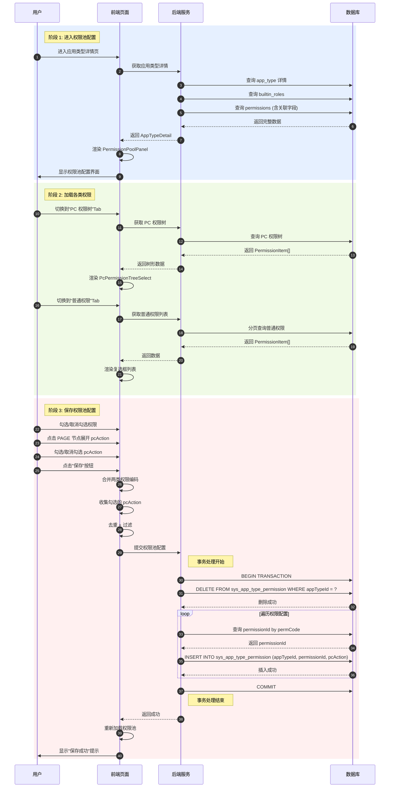
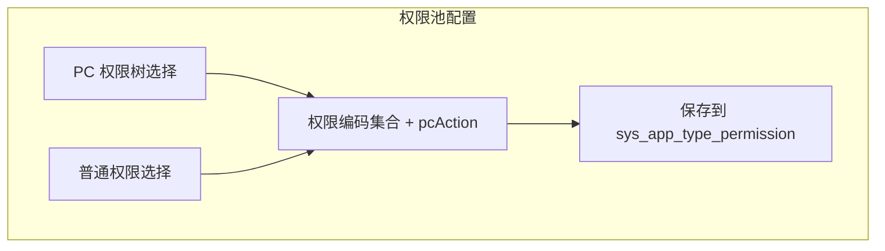
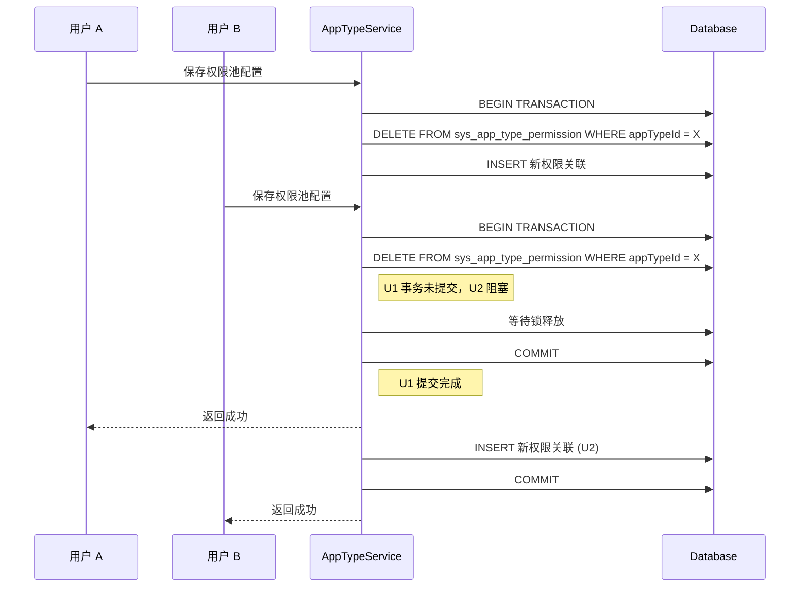
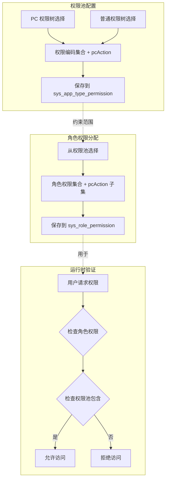
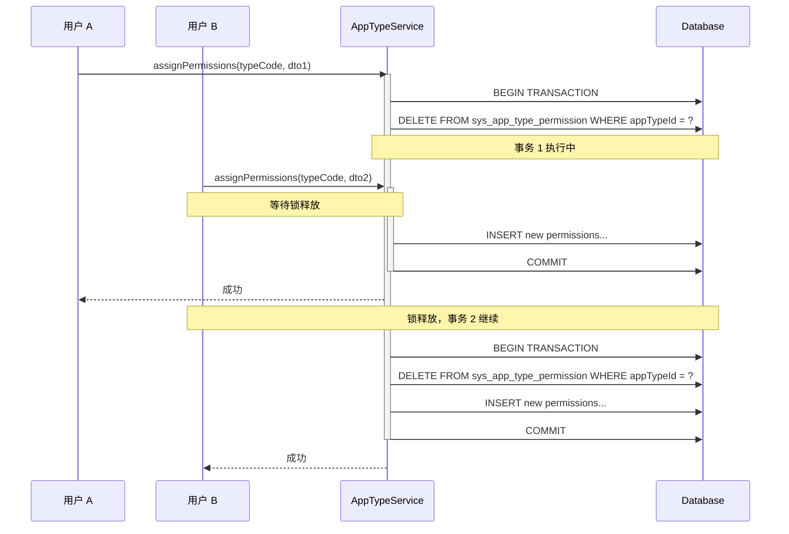

# 权限池配置流程文档

## 概述

本文档描述应用类型权限池配置的详细流程和核心业务规则。

**版本**: 2.0.0

---

## 目录

1. [完整流程图](#完整流程图)
2. [权限池验证逻辑](#权限池验证逻辑)
3. [权限池与角色权限关系](#权限池与角色权限关系)
4. [并发处理机制](#并发处理机制)
5. [业务规则](#业务规则)
6. [pcAction 数据流](#pcAction-数据流)

---

## 完整流程图



---

## 权限池验证逻辑

```mermaid
flowchart TD
    Start[开始保存权限池] --> CollectCodes[收集权限配置]

    CollectCodes --> MergeCodes[合并 PC + 普通]
    MergeCodes --> Dedup[去重 + 过滤空值]

    Dedup --> EmptyCheck{权限列表为空？}
    EmptyCheck -->|是 | AllowEmpty{允许空池？}
    AllowEmpty -->|是 | Proceed[继续处理]
    AllowEmpty -->|否 | ShowError1[显示"至少选择一个权限"]
    ShowError1 --> End1([结束])

    EmptyCheck -->|否 | ValidateCodes[验证权限编码有效性]
    ValidateCodes --> QueryDB[批量查询权限表]
    QueryDB --> CompareCount{数量匹配？}

    CompareCount -->|否 | ShowError2[显示"存在无效权限编码 - " + 缺失列表]
    ShowError2 --> End2([结束])

    CompareCount -->|是 | CheckAppType{应用类型存在？}
    CheckAppType -->|否 | ShowError3[显示"应用类型不存在"]
    ShowError3 --> End3([结束])

    CheckAppType -->|是 | ValidatePcAction[验证 pcAction 有效性]
    ValidatePcAction --> QueryPermission[查询权限的 pcAction 定义]
    QueryPermission --> CheckPcAction{pcAction 在定义内？}

    CheckPcAction -->|否 | ShowError4[显示"存在无效的 pcAction"]
    CheckPcAction -->|是 | StartTransaction[开启事务]

    StartTransaction --> DeleteOld[删除旧关联记录]
    DeleteOld --> BatchInsert[批量插入新关联]

    BatchInsert --> VerifyInsert{插入成功？}
    VerifyInsert -->|否 | Rollback[回滚事务]
    Rollback --> ShowError5[显示"数据库写入失败"]
    ShowError5 --> End4([结束])

    VerifyInsert -->|是 | Commit[提交事务]
    Commit --> Success[返回成功]
    Success --> End5([完成])
```

---

## 权限池与角色权限关系



---

## 并发处理机制



---

## 业务规则

### 权限池验证规则

| 规则 | 说明 | 错误提示 |
|------|------|----------|
| 非空验证 | 权限列表不能为空（除非允许空池） | "至少选择一个权限" |
| 有效性验证 | 所有权限编码必须存在于权限表中 | "存在无效权限编码" |
| pcAction 验证 | pcAction 必须在权限定义的范围内 | "存在无效的 pcAction" |
| 事务一致性 | 删除旧关联和插入新关联在同一事务中 | "数据库写入失败" |

### pcAction 说明

pcAction 是权限的细分操作标识，用于更细粒度的权限控制。

---

## 相关文档

- [权限系统核心概念](../core/permissions.md) - pcAction 数据流说明
- [权限分配流程](./permission-assignment.md) - 角色权限分配
- [数据库实体设计](../database/database-entities-design.md) - sys_app_type_permission 表结构


---

## 权限池与角色权限关系



**说明**:
- 权限池配置是角色权限分配的前提
- 角色权限必须是权限池的子集（包括 pcAction）
- 运行时权限验证先检查角色权限，再检查权限池包含

---

## 并发处理机制



**说明**:
- 权限池配置使用事务保证数据一致性
- 同一应用类型的并发配置请求会串行执行
- 后提交的请求会覆盖先提交的配置（Last Write Wins）

---

## 业务规则

### 权限池约束

- 权限池通过 `appTypeId` 进行隔离，不同应用类型的权限池相互独立
- 角色权限只能从所属应用类型的权限池中选择
- 权限池为空时，该应用类型下的角色无法分配任何权限

### pcAction 约束

- `pcAction` 仅存储在 `PermissionType=PC` 且 `NodeType=PAGE` 的节点上
- 权限池中的 `pcAction` 必须是对应权限 `pcAction` 定义的子集
- 角色分配权限时，`pcAction` 必须是权限池中 `pcAction` 的子集

### 数据一致性

- 权限池配置使用事务保证数据一致性
- 删除权限池记录时，先删除所有旧记录，再插入新记录
- 插入前验证所有权限编码的有效性和 pcAction 的合法性

### 并发控制

- 同一应用类型的权限池配置请求串行执行
- 数据库行锁保证并发安全
- 后提交的配置覆盖先提交的配置

---

## pcAction 数据流

```
┌─────────────────────────────────────────────────────────────────┐
│ 1. 权限定义 (PermissionEntity)                                  │
│    PAGE 节点：pcAction: [add, edit, delete]                     │
└────────────────────┬────────────────────────────────────────────┘
                     │ 权限池配置时读取并选择子集
                     ▼
┌─────────────────────────────────────────────────────────────────┐
│ 2. 权限池 (AppTypePermissionEntity)                             │
│    pcAction: [add, edit]  ← 子集                                │
└────────────────────┬────────────────────────────────────────────┘
                     │ 角色分配权限时读取并选择子集
                     ▼
┌─────────────────────────────────────────────────────────────────┐
│ 3. 角色权限 (RolePermissionEntity)                              │
│    pcAction: [add]  ← 子集                                      │
└────────────────────┬────────────────────────────────────────────┘
                     │ 运行时权限验证
                     ▼
┌─────────────────────────────────────────────────────────────────┐
│ 4. 用户最终权限 = ∪(所有关联角色的 permissionId + pcAction)      │
└─────────────────────────────────────────────────────────────────┘
```

---

## 相关文档

- [数据库实体设计](../database/database-entities-design.md)
- [应用类型管理页面](../pages/app-type-management.md)
- [角色管理页面](../pages/role-management.md)
- [权限分配流程](./permission-assignment.md)

---

## 更新历史

| 版本 | 日期 | 变更说明 |
|------|------|----------|
| 2.0.0 | 2026-03-24 | 重构：添加 pcAction 配置流程 |
| 1.0.0 | 2026-03-23 | 初始版本，从基础设施详细设计文档拆分 |

---

*本文档由基础设施页面详细设计文档拆分而来*