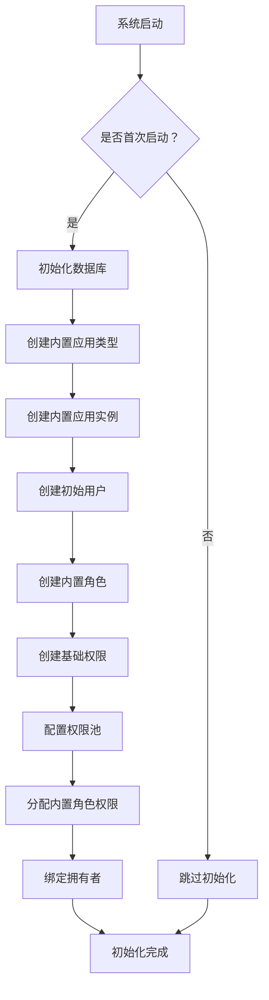

# 系统初始化说明文档

## 概述

本文档描述系统初始化时需要创建的基础数据，包括内置应用类型、内置应用实例、初始用户等。

**版本**: 1.0.0

---

## 目录

1. [初始化流程](#1-初始化流程)
2. [内置应用类型](#2-内置应用类型)
3. [内置应用实例](#3-内置应用实例)
4. [初始用户](#4-初始用户)
5. [内置角色](#5-内置角色)
6. [基础权限](#6-基础权限)

---

## 1. 初始化流程



---

## 2. 内置应用类型

### 2.1 系统内置应用类型

| 字段 | 值 |
|------|------|
| id | 生成 UUID |
| typeName | 系统管理 |
| typeCode | `system` |
| typeDesc | 系统内置应用类型，包含系统管理功能 |
| icon | `settings` |
| multiAppEnabled | 0 |
| typeStatus | 1 |
| sortOrder | 0 |

### 2.2 业务规则

- `typeCode = 'system'` 为系统内置类型，不可删除
- 应用类型不允许前端新增、删除，仅允许后端程序启动时通过代码按编码管理
- 前端仅允许编辑字段：typeName、icon、typeDesc

---

## 3. 内置应用实例

### 3.1 系统内置应用实例

| 字段 | 值 |
|------|------|
| id | 生成 UUID |
| appTypeId | 系统内置应用类型的 ID |
| appName | 系统管理实例 |
| appCode | `system-instance` |
| appDesc | 系统内置应用实例 |
| appLogo | (空) |
| ownerId | 初始用户 ID（admin） |
| appStatus | 1 |
| sortOrder | 0 |

### 3.2 业务规则

- 内置应用实例的 `appCode = 'system-instance'`
- 内置应用实例与其他应用实例的处理逻辑相同，只是初始化方式不同
- 内置应用实例必须绑定一个拥有者

---

## 4. 初始用户

### 4.1 系统管理员账号

| 字段 | 值 |
|------|------|
| id | 生成 UUID |
| username | `admin` |
| password | 加密后的密码（如 bcrypt） |
| nickname | 系统管理员 |
| phone | (空) |
| email | (空) |
| avatar | (空) |
| gender | 0 |
| userStatus | 1 |
| isDeveloper | 1 |

### 4.2 业务规则

- 系统管理员账号默认为开发者用户 (`isDeveloper = 1`)
- 初始密码应该在安装文档中说明，建议首次登录后强制修改
- 开发者用户可以访问开发者模式功能

---

## 5. 内置角色

### 5.1 系统内置角色

每个应用类型必须创建以下内置角色：

| 角色名称 | roleCode | isOwner | 说明 |
|----------|----------|---------|------|
| 管理员 | `{typeCode}_admin` | 1 | 拥有者角色，每个应用类型必须有一个，不允许删除 |
| 操作员 | `{typeCode}_operator` | 0 | 操作员角色，拥有部分权限 |
| 审计员 | `{typeCode}_auditor` | 0 | 审计员角色，拥有查看权限 |

### 5.2 角色结构

```typescript
class RoleEntity {
  id!: string;
  appId?: string;         // 内置角色不绑定 appId
  appTypeId!: string;     // 绑定应用类型 ID
  roleName!: string;
  roleCode!: string;
  roleDesc?: string;
  isBuiltin!: number;     // 1 = 内置角色
  isOwner!: number;       // 1 = 拥有者角色
  roleStatus!: number;
  sortOrder!: number;
  createTime!: Date;
}
```

### 5.3 业务规则

- 每个应用类型必须有一个拥有者角色 (`isOwner = 1`)
- 拥有者角色不允许删除，可以修改名称
- 拥有者变更时，自动将原拥有者的拥有者角色移除，并将新拥有者绑定拥有者角色

---

## 6. 基础权限

### 6.1 PC 权限（系统管理）

| permCode | permName | nodeType | parentId | 说明 |
|----------|----------|----------|----------|------|
| menu.system | 系统管理 | MENU | null | 根菜单 |
| menu.system.app-type | 应用类型管理 | MENU | menu.system | 应用类型管理菜单 |
| page.system.app-type.list | 应用类型列表 | PAGE | menu.system.app-type | 应用类型列表页面 |
| page.system.app-type.list | 应用类型列表 | PAGE | menu.system.app-type | pcAction: [add, edit, delete] |
| menu.system.permission | 权限管理 | MENU | menu.system | 权限管理菜单 |
| page.system.permission.pc | PC 权限树 | PAGE | menu.system.permission | PC 权限管理页面 |
| menu.system.member | 成员管理 | MENU | menu.system | 成员管理菜单 |
| page.system.member.list | 成员列表 | PAGE | menu.system.member | 成员管理页面 |

### 6.2 权限池配置

系统内置应用类型的权限池应该包含所有基础权限，以便内置角色可以分配。

---

## 7. 权限分配

### 7.1 管理员角色权限

管理员角色（拥有者角色）应该分配所有基础权限：

```
管理员角色权限 = 系统内置应用类型权限池中的所有权限
```

### 7.2 拥有者绑定

系统内置应用实例的拥有者应该绑定系统管理员账号：

```
sys_app.ownerId = admin 用户 ID
sys_user_role: (userId = admin 用户 ID, roleId = 管理员角色 ID)
```

---

## 相关文档

- [数据库实体设计](../database/entities-design.md)
- [开发者模式说明](./developer-mode.md)
- [应用类型管理页面](../pages/app-type-management.md)
- [权限池配置流程](./permission-pool-setup.md)

---

## 更新历史

| 版本 | 日期 | 变更说明 |
|------|------|----------|
| 1.0.0 | 2026-03-25 | 初始版本，描述系统初始化的基础数据创建 |

---

*本文档由基础设施页面详细设计文档拆分而来*
