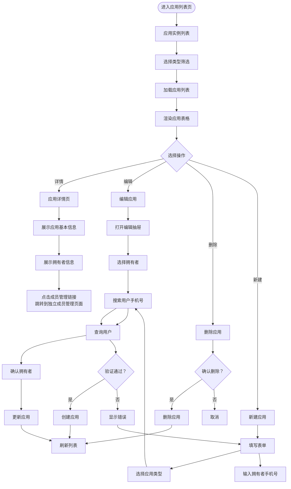

# 应用实例管理页面文档

## 概述

本文档描述应用实例管理页面的管理流程和核心业务规则。

**版本**: 2.0.0

---

## 目录

1. [页面流程图](#页面流程图)
2. [功能说明](#功能说明)
3. [业务规则](#业务规则)
4. [拥有者权限说明](#拥有者权限说明)

---

## 页面流程图



---

## 功能说明

### 应用实例列表页

| 功能 | 说明 |
|------|------|
| 列表展示 | 展示应用实例列表，支持分页 |
| 类型筛选 | 按应用类型筛选应用实例 |
| 新建应用 | 创建新的应用实例（需绑定拥有者） |
| 查看详情 | 查看应用详细信息及拥有者信息 |
| 编辑 | 修改应用信息，可变更拥有者 |
| 删除 | 删除应用实例 |
| 成员管理入口 | 跳转到成员管理页面（独立页面） |

### 应用详情页

| 功能 | 说明 |
|------|------|
| 基本信息 | 展示应用详细信息 |
| 拥有者信息 | 展示当前应用拥有者的用户信息 |
| 成员管理入口 | 提供跳转到成员管理页面的链接 |

### 编辑应用

| 功能 | 说明 |
|------|------|
| 修改应用信息 | 修改应用名称、描述、图标等 |
| 变更拥有者 | 将应用转让给其他用户（必须保留一个拥有者） |

---

## 业务规则

### 应用实例管理

- `appCode` 全局唯一，创建后不可修改
- 创建应用时必须选择应用类型
- 创建应用时必须绑定拥有者
- 应用实例必须始终有一个拥有者（不可解除绑定，只能变更）
- 应用实例删除前需检查是否有关联数据
- 没有设置拥有者的应用实例不允许使用（用户登录后获取的应用实例列表中没有 `ownerId IS NULL` 的应用实例）

### 内置应用实例

- 系统初始化时创建一个内置应用实例，`appCode = 'system-instance'`
- 内置应用实例归属于系统内置应用类型（`typeCode = 'system'`）
- 内置应用实例包含系统管理功能（应用类型管理、权限管理等）
- 内置应用实例的拥有者通常是系统管理员账号（如 admin）
- 内置应用实例与其他应用实例的处理逻辑相同，只是初始化方式不同

### 拥有者绑定

- 拥有者通过 `sys_user_app` 表与应用实例关联
- 一个用户可以拥有多个应用
- 拥有者变更时，原拥有者的应用权限自动移除，新拥有者自动获得完整权限
- 拥有者是独立的身份标识，不属于角色体系

### 应用类型关联

- 应用实例必须归属于一个应用类型
- 应用实例继承应用类型的权限池配置
- 应用级角色的权限从应用类型权限池中选择

---

## 拥有者权限说明

### 拥有者的特殊地位

- **拥有者是应用的"老板"**：类似商铺所有者，拥有该应用的完整权限
- **权限来源**：拥有者通过绑定"拥有者角色"（`isOwner = 1`）获得权限，权限来源与其他成员相同
- **自动获得完整权限**：拥有者自动获得该应用实例对应应用类型权限池的所有权限
- **不可被分配角色**：拥有者在当前应用实体下不能有双重角色身份

### 拥有者权限范围

```
拥有者权限 = 应用类型权限池中的所有权限
           = ∪(所有 PC 权限 + 所有普通权限 + 所有 API 权限)
           + 所有 pcAction 操作权限
```

### 拥有者变更流程

```
原拥有者 A ──[变更]──> 新拥有者 B
    │                        │
    ▼                        ▼
后端 Service 层事务处理：
  - 移除 A 的拥有者角色绑定    - B 自动绑定拥有者角色
    │                        │
    ▼                        ▼
A 不再是该应用的拥有者    B 成为新拥有者
```

**说明**:
- 拥有者变更在后端 Service 层用事务保证原子性
- 如果事务中的任意一步失败，整个操作回滚

### 拥有者与其他应用

- 拥有者可以是**其他应用实例**的成员（包括不同应用类型的应用）
- 拥有者身份是按应用实例独立管理的
- 一个用户可以同时是：
  - 应用 A 的拥有者
  - 应用 B 的成员（被分配了角色）
  - 应用 C 的成员（被分配了角色）

---

## 相关文档

- [数据库实体设计](../database/entities-design.md)
- [应用类型管理页面](./app-type-management.md)
- [角色管理页面](./role-management.md)
- [成员管理页面](./member-management.md)
- [权限池配置流程](../flows/permission-pool-setup.md)
- [权限分配流程](../flows/permission-assignment.md)

---

## 更新历史

| 版本 | 日期 | 变更说明 |
|------|------|----------|
| 2.0.0 | 2026-03-24 | 重构：移除用户绑定功能，明确拥有者权限，添加成员管理入口说明 |
| 1.0.0 | 2026-03-23 | 初始版本，从基础设施详细设计文档拆分 |

---

*本文档由基础设施页面详细设计文档拆分而来*
