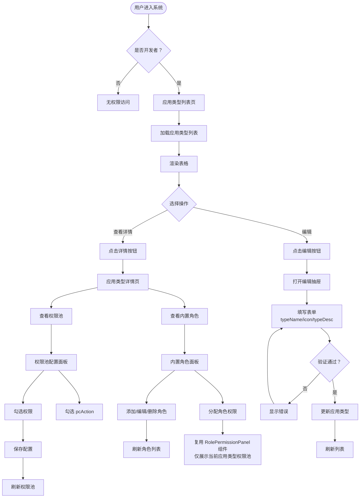

# 应用类型管理页面文档

## 概述

本文档描述应用类型管理页面的管理流程和核心业务规则。

**版本**: 2.0.0

---

## 目录

1. [页面流程图](#页面流程图)
2. [功能说明](#功能说明)
3. [业务规则](#业务规则)
4. [内置角色管理](#内置角色管理)

---

## 页面流程图

**说明**: 应用类型管理页面仅限开发者模式访问（通过后端路由鉴权）。



---

## 功能说明

### 应用类型列表页

| 功能 | 说明 |
|------|------|
| 开发者鉴权 | 仅开发者用户可访问，通过后端路由鉴权 |
| 列表展示 | 展示所有应用类型，支持排序 |
| 查看详情 | 跳转到应用类型详情页 |
| 编辑 | 打开编辑抽屉，修改 typeName、icon、typeDesc |

### 应用类型详情页

| 功能 | 说明 |
|------|------|
| 基本信息 | 展示应用类型详细信息 |
| 权限池配置 | 配置该应用类型可用的权限池（含 pcAction） |
| 内置角色管理 | 管理应用类型全局角色（增删改、分配权限） |

### 权限池配置面板

| 功能 | 说明 |
|------|------|
| PC 权限树 | 勾选 PC 菜单、页面权限加入权限池 |
| pcAction 配置 | 点击 PAGE 节点展开 pcAction，勾选操作权限加入权限池 |
| 普通权限 | 勾选普通权限加入权限池 |
| 保存配置 | 提交权限池配置到后端 |

### 内置角色面板

| 功能 | 说明 |
|------|------|
| 角色列表 | 展示应用类型的内置角色 |
| 添加角色 | 创建新的内置角色 |
| 编辑角色 | 修改内置角色信息 |
| 删除角色 | 删除内置角色 |
| 查看/分配权限 | 复用 RolePermissionPanel 组件查看/分配角色权限 |

---

## 业务规则

### 应用类型管理

- 应用类型不允许前端新增、删除，仅允许后端程序启动时通过代码按编码管理
- 前端仅允许编辑字段：typeName（应用类型名称）、icon（图标）、typeDesc（应用类型描述）
- `typeCode = 'system'` 为系统内置类型，不可删除
- 应用类型管理页面仅限开发者模式访问

### 开发者模式鉴权

- 应用类型管理页面仅限开发者模式访问
- 通过后端接口鉴权实现
- 非开发者用户无法访问应用类型管理相关功能

### 权限池约束

- 权限池通过 `appTypeId` 进行隔离，不同应用类型的权限池相互独立
- 角色权限只能从所属应用类型的权限池中选择
- pcAction 也遵循相同的约束：权限池中的 pcAction 是 Permission.pcAction 的子集

### 内置角色

- 内置角色 (`isBuiltin = 1`) 为应用类型全局角色，不绑定 `appId`
- 内置角色在应用类型管理页面可进行增删改和权限分配操作
- 内置角色在角色管理页面只读显示
- 内置角色权限分配复用 `RolePermissionPanel` 组件

---

## 内置角色管理

### 内置角色说明

内置角色是应用类型级别的全局角色，用于定义该应用类型的标准角色模板。例如：
- 系统管理类型：管理员、操作员、审计员
- 业务管理类型：业务管理员、普通用户

### 内置角色管理流程

```
应用类型详情页 → 内置角色面板
│
├── 查看内置角色列表
│   └── 查询内置角色（appTypeId=当前类型 AND isBuiltin=1）
│
├── 添加内置角色
│   └── 创建角色并绑定 appTypeId，标记为内置角色
│
├── 编辑内置角色
│   └── 修改角色名称、描述
│
├── 删除内置角色
│   └── 删除角色及其权限关联
│
└── 分配权限
    └── 从当前应用类型的权限池中选择权限（含 pcAction）
```

### 内置角色查看位置

| 位置 | 操作权限 |
|------|----------|
| 应用类型管理页面 - 详情页 | 增删改、分配权限 |
| 角色管理页面 | 只读查看 |

---

## 相关文档

- [数据库实体设计](../database/database-entities-design.md)
- [应用实例管理页面](./app-management.md)
- [角色管理页面](./role-management.md)
- [权限池配置流程](../flows/permission-pool-setup.md)

---

## 更新历史

| 版本 | 日期 | 变更说明 |
|------|------|----------|
| 2.0.0 | 2026-03-24 | 重构：添加 pcAction 配置，明确内置角色管理位置，添加开发者鉴权说明 |
| 1.0.0 | 2026-03-23 | 初始版本，从基础设施详细设计文档拆分 |

---

*本文档由基础设施页面详细设计文档拆分而来*