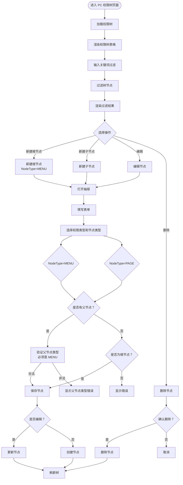
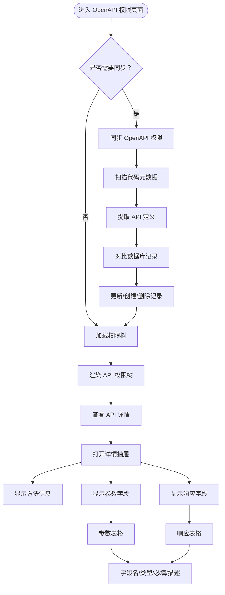

# 权限管理页面文档

## 概述

本文档描述权限管理页面的管理流程和核心业务，包含 PC 权限树和 OpenAPI 权限管理。

**版本**: 2.0.0

---

## 目录

1. [PC 权限树管理](#1-pc-权限树管理)
2. [OpenAPI 权限管理](#2-openapi-权限管理)
3. [业务规则](#业务规则)

---

## 1. PC 权限树管理

### 页面流程图



### 功能说明

| 功能 | 说明 |
|------|------|
| 树形展示 | 以树形结构展示 PC 权限，支持展开/折叠 |
| 关键词过滤 | 输入关键词过滤树节点 |
| 新建根节点 | 创建根节点权限（NodeType=MENU） |
| 新建子节点 | 在选中节点下创建子节点（MENU 或 PAGE） |
| 编辑节点 | 修改权限节点信息 |
| 编辑 pcAction | 编辑 PAGE 节点的操作权限列表 |
| 删除节点 | 删除权限节点及其子节点 |

### 权限类型 hierarchy

```
ROOT (MENU)
└── 一级菜单 (MENU)
    ├── 二级菜单 (MENU)
    │   └── 页面 (PAGE)
    │       └── pcAction: [{name: '新增', permCode: 'xxx:add'}, ...]
    └── 页面 (PAGE)
        └── pcAction: [{name: '编辑', permCode: 'xxx:edit'}, ...]
```

### 业务规则

- `NodeType.PAGE` 的 `parentId` 必须指向 `NodeType.MENU` 类型
- 根节点只能创建 `NodeType.MENU` 类型
- `pcAction` 字段仅存储在 `NodeType.PAGE` 节点上
- `pcAction` 表示该页面下的所有操作权限（按钮）列表
- 删除节点时级联删除所有子节点

---

## 2. OpenAPI 权限管理

### 页面流程图



### 功能说明

| 功能 | 说明 |
|------|------|
| 同步 API | 扫描代码元数据，自动同步 API 权限到数据库 |
| 树形展示 | 以树形结构展示 API 权限（Module -> Controller -> Method） |
| 查看详情 | 查看 API 详细信息，包括参数和响应字段 |
| 字段管理 | 查看参数字段和响应字段的类型、描述等 |

### API 权限树结构

```
API:ROOT (API)
└── API:MODULE:SYS (API)
    ├── API:CONTROLLER:USER (API)
    │   ├── API:METHOD:getList
    │   ├── API:METHOD:getById
    │   └── API:METHOD:create
    └── API:CONTROLLER:ROLE (API)
        └── API:METHOD:assignPermissions
```

### 业务规则

- API 权限通过 `syncOpenApiNodes()` 自动同步代码元数据
- 同步操作会对比数据库记录，执行更新/创建/删除操作
- API 权限的参数和响应字段由代码元数据自动生成

---

## 业务规则

### 权限类型枚举

```typescript
enum PermissionType {
  PC = 'PC',                     // PC 权限
  NORMAL = 'NORMAL',             // 普通权限
  API = 'API',                   // OpenAPI 权限
}

enum NodeType {
  MENU = 'MENU',            // 目录（可与所有 PermissionType 组合使用）
  PAGE = 'PAGE',            // 页面（PermissionType=PC 时使用）
  TAG = 'TAG',              // 标签（PermissionType=NORMAL 时使用）
  API = 'API',              // API（PermissionType=API 时使用）
}

enum ShowMode {
  NORMAL = 'NORMAL',             // 普通模式
  DEV = 'DEV',                   // 开发模式
}
```

### PermissionType 与 NodeType 对应关系

| PermissionType | NodeType | 说明 |
|----------------|----------|------|
| PC | MENU | PC 菜单/目录 |
| PC | PAGE | PC 页面权限（可包含 pcAction） |
| NORMAL | MENU | 普通权限目录 |
| NORMAL | TAG | 普通权限（标签） |
| API | MENU | API 权限目录 |
| API | API | OpenAPI 权限 |

**说明**:
- `NodeType.MENU` 可以与所有 `PermissionType` 组合使用，作为目录节点
- 3 种 `PermissionType` 类型的权限都可以渲染为树形结构的数据
- 树形结构中，`MENU` 节点作为目录/分组，`PAGE/TAG/API` 节点作为叶子节点
- `PC` 权限类型用于 PC 后台管理系统的菜单和页面权限
- `API` 权限类型用于 OpenAPI 接口的访问权限
- `NORMAL` 权限类型通常用于移动端、非后台管理的程序

### 权限编码

- `permCode` 全局唯一，创建后不可修改
- 建议编码格式：
  - MENU: `menu.{module}.{name}`
  - PAGE: `page.{module}.{name}`
  - TAG: `tag.{module}.{name}`
  - API: `api:{module}:{controller}:{method}`

### 显示模式

- `showMode = NORMAL`: 普通模式，对所有用户可见
- `showMode = DEV`: 开发模式，仅对开发模式用户可见

### pcAction 管理

- `pcAction` 仅在 `PermissionType=PC` 且 `NodeType=PAGE` 的节点上有效
- `pcAction` 格式：`[{name: string, permCode: string}]`
- `pcAction` 的 `permCode` 必须全局唯一

---

## 相关文档

- [数据库实体设计](../database/entities-design.md)
- [应用类型管理页面](./app-type-management.md)
- [角色管理页面](./role-management.md)
- [权限池配置流程](../flows/permission-pool-setup.md)

---

## 更新历史

| 版本 | 日期 | 变更说明 |
|------|------|----------|
| 2.0.0 | 2026-03-24 | 重构：使用新的 PermissionType 和 NodeType，添加 pcAction 管理 |
| 1.0.0 | 2026-03-23 | 初始版本，从基础设施详细设计文档拆分 |

---

*本文档由基础设施页面详细设计文档拆分而来*
