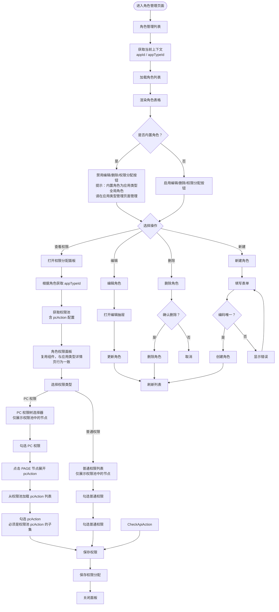

# 角色管理页面文档

## 概述

本文档描述角色管理页面的管理流程和核心业务规则。

**版本**: 2.0.0

---

## 目录

1. [页面流程图](#页面流程图)
2. [功能说明](#功能说明)
3. [业务规则](#业务规则)
4. [组件复用](#组件复用)

---

## 页面流程图

**说明**:
- 角色管理页面是独立页面，不属于应用实例详情页
- 角色管理页面显示：内置角色（应用类型全局角色）+ 应用级角色（应用实例专属角色）
- 内置角色在应用类型管理页面可管理（增删改、分配权限），在角色管理页面只读显示
- 应用级角色在角色管理页面可管理（增删改、分配权限）



---

## 功能说明

### 角色列表页

| 功能 | 说明 |
|------|------|
| 列表展示 | 展示角色列表，区分内置角色和应用级角色 |
| 内置角色标识 | 内置角色显示特殊标识，禁用操作按钮 |
| 应用级角色标识 | 应用级角色显示可编辑状态 |
| 新建角色 | 创建应用级角色（仅应用级） |
| 编辑角色 | 修改角色信息（仅应用级） |
| 删除角色 | 删除角色（仅应用级） |
| 权限分配 | 为角色分配权限（仅应用级） |

### 权限分配面板

| 功能 | 说明 |
|------|------|
| 权限类型 Tab | 切换 PC 权限、普通权限 |
| 权限选择器 | 仅展示当前应用类型权限池中的权限节点 |
| 勾选权限 | 勾选/取消勾选权限节点 |
| pcAction 选择 | 点击 PAGE 节点展开 pcAction，勾选操作权限 |
| 保存权限 | 提交权限分配配置到后端 |

---

## 业务规则

### 角色分类

| 类型 | 绑定字段 | 说明 | 管理位置 | 操作权限 |
|------|----------|------|----------|----------|
| 内置角色 | `appTypeId` | 应用类型全局角色 | 应用类型管理页面 | 应用类型页面：增删改 + 分配权限<br/>角色管理页面：只读 |
| 应用级角色 | `appId` | 应用实例专属角色 | 角色管理页面 | 增删改 + 分配权限 |

### 权限池约束

- 所有角色的权限配置都必须从所属应用类型的权限池中选择
- 权限池通过 `appTypeId` 进行隔离，不同应用类型的权限池相互独立
- 角色权限分配时，前端选择器仅展示该角色所属应用类型权限池中的权限节点

### pcAction 约束

- 角色权限中的 `pcAction` 必须是权限池中对应权限 `pcAction` 的子集
- 保存时自动验证 `pcAction` 的合法性
- `pcAction` 仅在 `PermissionType=PC` 且 `NodeType=PAGE` 的节点上有效

### 角色编码

- `roleCode` 全局唯一，创建后不可修改
- 角色编码建议格式：`{appTypeCode}_{roleName}`

---

## 组件复用

### RolePermissionPanel 组件

| 使用场景 | 说明 |
|----------|------|
| 应用类型详情页 - 内置角色权限查看/分配 | 编辑模式（应用类型页面），可查看/分配内置角色权限 |
| 角色管理页面 - 应用级角色权限分配 | 编辑模式，分配应用级角色权限 |
| 角色管理页面 - 内置角色权限查看 | 只读模式，展示内置角色权限 |

**组件行为一致性**:
- 所有场景下都从应用类型权限池获取数据
- 都展示相同的权限选择器（PC 权限树、普通权限列表）
- 都支持 pcAction 的勾选和保存
- 只读模式下禁用勾选和保存功能

---

## 内置角色管理流程

```
应用类型管理页面
│
├── 查看内置角色列表
│   └── 查询内置角色（appTypeId=当前类型 AND isBuiltin=1）
│
├── 添加内置角色
│   └── 创建角色并绑定 appTypeId，标记为内置角色
│
├── 编辑内置角色
│   └── 修改角色名称、描述
│
├── 删除内置角色
│   └── 删除角色及其权限关联
│
└── 分配权限
    └── 从当前应用类型的权限池中选择权限（含 pcAction）
```

---

## 应用级角色管理流程

```
角色管理页面
│
├── 查看角色列表
│   ├── 内置角色：查询应用类型全局角色（只读）
│   └── 应用级角色：查询应用实例专属角色（可编辑）
│
├── 添加应用级角色
│   └── 创建角色并绑定 appId
│
├── 编辑应用级角色
│   └── 修改角色名称、描述
│
├── 删除应用级角色
│   └── 删除角色及其权限关联
│
└── 分配权限
    └── 从所属应用类型的权限池中选择权限（含 pcAction）
```

---

## 相关文档

- [数据库实体设计](../database/entities-design.md)
- [应用类型管理页面](./app-type-management.md)
- [应用实例管理页面](./app-management.md)
- [权限分配流程](../flows/permission-assignment.md)
- [权限池配置流程](../flows/permission-pool-setup.md)

---

## 更新历史

| 版本 | 日期 | 变更说明 |
|------|------|----------|
| 2.0.0 | 2026-03-24 | 重构：明确内置角色管理位置，添加 pcAction 支持 |
| 1.0.0 | 2026-03-23 | 初始版本，从基础设施详细设计文档拆分 |

---

*本文档由基础设施页面详细设计文档拆分而来*