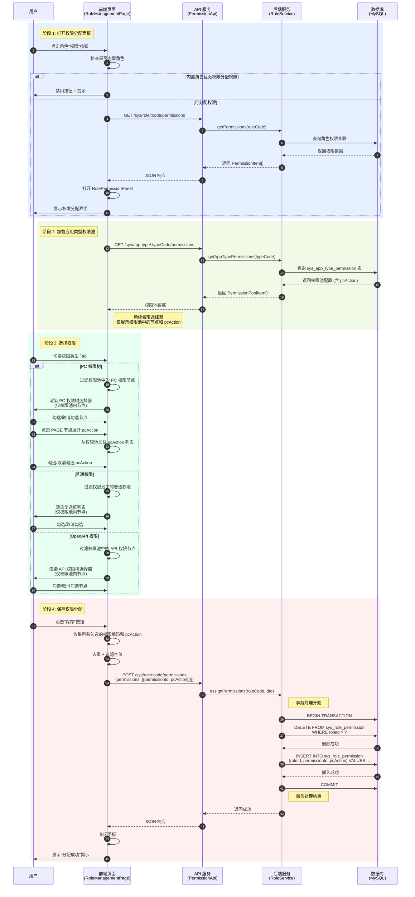
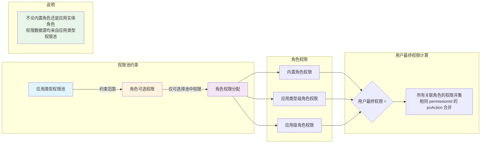

# 权限分配流程文档

## 概述

本文档描述角色权限分配的详细流程和核心业务规则。

**模块路径**:
- 前端：`packages/base-frontend/src/app/pages/permission/`
- 后端：`packages/base-backend/src/services/`

**版本**: 2.0.0

---

## 目录

1. [完整流程图](#完整流程图)
2. [权限验证逻辑](#权限验证逻辑)
3. [权限继承规则](#权限继承规则)
4. [pcAction 数据流](#pcAction-数据流)
5. [API 接口](#API 接口)
6. [业务规则](#业务规则)

---

## 完整流程图



---

## 权限验证逻辑

```mermaid
flowchart TD
    Start[开始权限分配] --> CollectCodes[收集勾选的权限配置]

    CollectCodes --> Dedup[去重 + 过滤空值]
    Dedup --> EmptyCheck{权限列表为空？}

    EmptyCheck -->|是 | AllowEmpty{允许空权限？}
    AllowEmpty -->|是 | Proceed[继续处理]
    AllowEmpty -->|否 | ShowError1[显示"至少选择一个权限"]
    ShowError1 --> End1([结束])

    EmptyCheck -->|否 | ValidateCodes[验证权限编码有效性]
    ValidateCodes --> QueryDB[查询权限表]
    QueryDB --> CompareCount{数量匹配？}

    CompareCount -->|否 | ShowError2[显示"存在无效权限编码"]
    ShowError2 --> End2([结束])

    CompareCount -->|是 | CheckPool{应用类型权限池检查}
    CheckPool -->|需要检查 | GetPool[获取权限池配置]
    GetPool --> ValidateInPool{权限在池中？}

    ValidateInPool -->|否 | ShowError3[显示"权限不在权限池中"]
    ValidateInPool -->|是 | ValidatePcAction[验证 pcAction]

    ValidatePcAction --> CheckPcActionInPool{pcAction 在池中？}
    CheckPcActionInPool -->|否 | ShowError4[显示"pcAction 不在权限池中"]
    CheckPcActionInPool -->|是 | Proceed

    CheckPool -->|不需要检查 | Proceed

    Proceed --> StartTransaction[开启事务]
    StartTransaction --> DeleteOld[删除旧权限关联]
    DeleteOld --> InsertNew[插入新权限关联]
    InsertNew --> Commit{提交成功？}

    Commit -->|是 | Success[返回成功]
    Commit -->|否 | Rollback[回滚事务]
    Rollback --> ShowError5[显示"数据库错误"]
    ShowError5 --> End3([结束])
    Success --> End4([完成])
```

---

## 权限继承规则



**核心规则**:
- 所有角色（内置角色、应用类型级角色、应用级角色）的权限配置都必须从所属应用类型的权限池中选择
- 权限池通过 `appTypeId` 进行隔离，不同应用类型的权限池相互独立
- 角色权限分配时，前端选择器仅展示该角色所属应用类型权限池中的权限节点
- pcAction 也遵循相同的约束：角色中的 pcAction 必须是权限池中 pcAction 的子集

---

## pcAction 数据流

```
┌─────────────────────────────────────────────────────────────────┐
│ 1. 权限定义 (PermissionEntity)                                  │
│    PAGE 节点：pcAction: [add, edit, delete]                     │
└────────────────────┬────────────────────────────────────────────┘
                     │ 权限池配置时读取并选择子集
                     ▼
┌─────────────────────────────────────────────────────────────────┐
│ 2. 权限池 (AppTypePermissionEntity)                             │
│    pcAction: [add, edit]  ← 子集                                │
└────────────────────┬────────────────────────────────────────────┘
                     │ 角色分配权限时读取并选择子集
                     ▼
┌─────────────────────────────────────────────────────────────────┐
│ 3. 角色权限 (RolePermissionEntity)                              │
│    pcAction: [add]  ← 子集                                      │
└────────────────────┬────────────────────────────────────────────┘
                     │ 运行时权限验证
                     ▼
┌─────────────────────────────────────────────────────────────────┐
│ 4. 用户最终权限 = ∪(所有关联角色的 permissionId + pcAction)      │
│    相同 permissionId 的 pcAction 取并集                          │
└─────────────────────────────────────────────────────────────────┘
```

---

## API 接口

### 获取角色权限

```
GET /sys/role/:code/permissions
Response: {
  permissions: Array<{
    permissionId: string,
    permCode: string,
    permName: string,
    permissionType: string,
    nodeType: string,
    pcAction: Array<{name: string, permCode: string}>
  }>
}
```

### 分配权限

```
POST /sys/role/:code/permissions
Body: {
  permissions: Array<{
    permissionId: string,
    pcAction?: Array<{name: string, permCode: string}>
  }>
}
```

### 获取应用类型权限池

```
GET /sys/app-type/:typeCode/permissions
Response: {
  permissions: Array<{
    permissionId: string,
    permCode: string,
    permName: string,
    permissionType: string,
    nodeType: string,
    pcAction: Array<{name: string, permCode: string}>
  }>
}
```

---

## 业务规则

### 角色分类

| 类型 | 说明 | 权限分配 |
|------|------|----------|
| 内置角色 | 不绑定 appId，仅绑定 appTypeId，为应用类型全局角色 | 可在应用类型管理页面分配权限 |
| 应用级角色 | 必须绑定 appId，属于具体应用实例 | 可在应用实例角色管理页面分配权限 |

### 权限池约束

- 所有角色的权限配置都必须从所属应用类型的权限池中选择
- 权限池通过 `appTypeId` 进行隔离，不同应用类型的权限池相互独立
- 角色权限分配时，前端选择器仅展示该角色所属应用类型权限池中的权限节点

### pcAction 约束

- 角色权限中的 `pcAction` 必须是权限池中对应权限 `pcAction` 的子集
- 保存时自动验证 `pcAction` 的合法性
- 用户最终权限计算时，相同 `permissionId` 的 `pcAction` 取并集

### 数据一致性

- 权限分配使用事务保证数据一致性
- 删除角色权限记录时，先删除所有旧记录，再插入新记录
- 插入前验证所有权限编码的有效性和权限池包含关系

### 用户最终权限计算

```
用户最终权限 = ∪(用户所有关联角色的 permissionId + pcAction)
```

- 用户直接绑定的角色权限
- 通过应用绑定的角色权限
- 通过应用类型绑定的角色权限
- 相同 `permissionId` 的 `pcAction` 取并集

---

## 相关文档

- [数据库实体设计](./database-entities-design.md)
- [角色管理页面](./role-management.md)
- [应用类型管理页面](./app-type-management.md)
- [权限池配置流程](./permission-pool-setup.md)

---

## 更新历史

| 版本 | 日期 | 变更说明 |
|------|------|----------|
| 2.0.0 | 2026-03-24 | 重构：添加 pcAction 分配流程，更新 API 接口 |
| 1.0.0 | 2026-03-23 | 初始版本，从基础设施详细设计文档拆分 |

---

*本文档由基础设施页面详细设计文档拆分而来*
