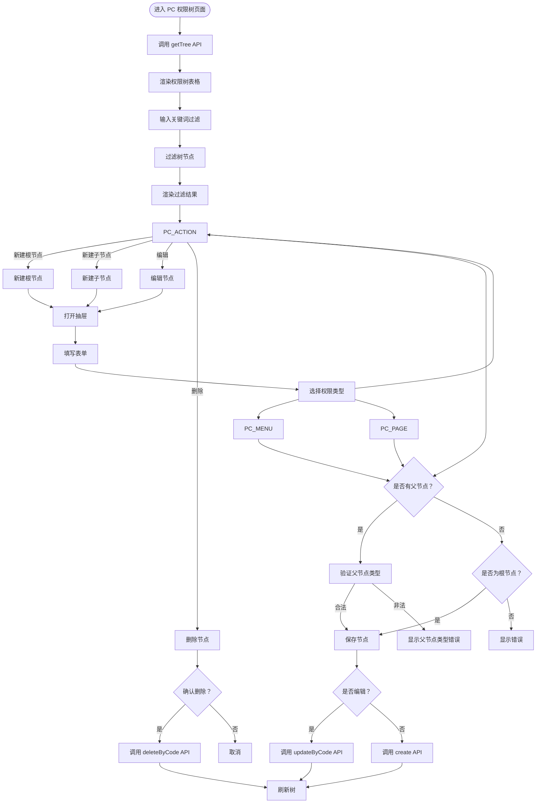
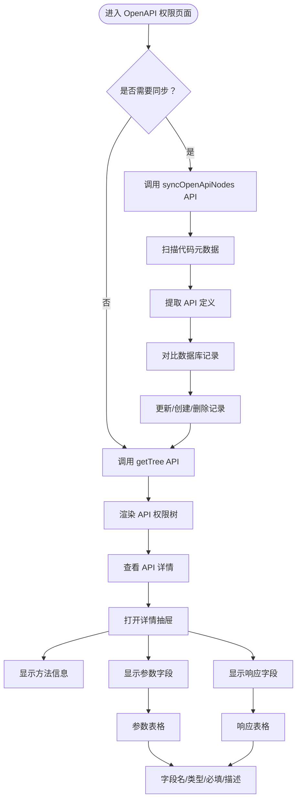

# 权限管理页面文档

## 概述

本文档描述权限管理页面的前端流程和核心业务，包含 PC 权限树和 OpenAPI 权限管理。

**模块路径**: `packages/base-frontend/src/app/pages/permission/`

**版本**: 1.0.0

---

## 目录

1. [PC 权限树管理](#1-pc-权限树管理)
2. [OpenAPI 权限管理](#2-openapi-权限管理)
3. [API 接口](#API 接口)
4. [业务规则](#业务规则)

---

## 1. PC 权限树管理

### 页面流程图



### 功能说明

| 功能 | 说明 |
|------|------|
| 树形展示 | 以树形结构展示 PC 权限，支持展开/折叠 |
| 关键词过滤 | 输入关键词过滤树节点 |
| 新建根节点 | 创建根节点权限（PC_MENU） |
| 新建子节点 | 在选中节点下创建子节点 |
| 编辑节点 | 修改权限节点信息 |
| 删除节点 | 删除权限节点及其子节点 |

### 权限类型 hierarchy

```
ROOT
└── PC_MENU (菜单权限)
    ├── PC_MENU (子菜单)
    │   └── PC_PAGE (页面权限)
    │       └── PC_ACTION (操作权限)
    └── PC_PAGE (页面权限)
        └── PC_ACTION (操作权限)
```

### 业务规则

- `PC_ACTION` 类型的 `parentId` 必须指向 `PC_PAGE` 类型
- 根节点只能创建 `PC_MENU` 类型
- 删除节点时级联删除所有子节点

---

## 2. OpenAPI 权限管理

### 页面流程图



### 功能说明

| 功能 | 说明 |
|------|------|
| 同步 API | 扫描代码元数据，自动同步 API 权限到数据库 |
| 树形展示 | 以树形结构展示 API 权限（Module -> Controller -> Method） |
| 查看详情 | 查看 API 详细信息，包括参数和响应字段 |
| 字段管理 | 查看参数字段和响应字段的类型、描述等 |

### API 权限树结构

```
API:ROOT
└── API:MODULE:SYS (系统模块)
    ├── API:CONTROLLER:USER (用户控制器)
    │   ├── API:METHOD:getList
    │   ├── API:METHOD:getById
    │   └── API:METHOD:create
    └── API:CONTROLLER:ROLE (角色控制器)
        └── API:METHOD:assignPermissions
```

### 业务规则

- API 权限通过 `syncOpenApiNodes()` 自动同步代码元数据
- 同步操作会对比数据库记录，执行更新/创建/删除操作
- API 权限的参数和响应字段由代码元数据自动生成

---

## API 接口

### 获取权限树

```
GET /sys/permission/tree
Params: { permissionType?: string }
```

### 创建权限

```
POST /sys/permission
Body: {
  permName: string,
  permCode: string,
  permDesc?: string,
  permissionType: PermissionType,
  parentId?: string,
  routePath?: string,
  componentPath?: string,
  iconName?: string,
  sortOrder?: number,
  isVisible?: number,
  isCache?: number,
  showMode?: ShowMode
}
```

### 更新权限

```
PUT /sys/permission/:code
Body: {
  permName?: string,
  permDesc?: string,
  routePath?: string,
  componentPath?: string,
  iconName?: string,
  sortOrder?: number,
  isVisible?: number,
  isCache?: number,
  showMode?: ShowMode
}
```

### 删除权限

```
DELETE /sys/permission/:code
```

### 同步 OpenAPI 权限

```
POST /sys/permission/sync-open-api
```

### 获取权限详情

```
GET /sys/permission/:code
```

---

## 业务规则

### 权限类型枚举

```typescript
enum PermissionType {
  PC_MENU = 'PC_MENU',           // 菜单权限
  PC_PAGE = 'PC_PAGE',           // 页面权限
  PC_ACTION = 'PC_ACTION',       // 操作权限
  NORMAL = 'NORMAL',             // 普通权限
  API = 'API',                   // OpenAPI 权限
}

enum ShowMode {
  NORMAL = 'NORMAL',             // 普通模式
  DEV = 'DEV',                   // 开发模式
}
```

### 权限编码

- `permCode` 全局唯一，创建后不可修改
- 建议编码格式：
  - PC_MENU: `menu.{module}.{name}`
  - PC_PAGE: `page.{module}.{name}`
  - PC_ACTION: `action.{module}.{name}`
  - API: `api:{module}:{controller}:{method}`

### 显示模式

- `showMode = NORMAL`: 普通模式，对所有用户可见
- `showMode = DEV`: 开发模式，仅对开发模式用户可见

---

## 相关文档

- [数据库实体设计](./database-entities-design.md)
- [应用类型管理页面](./app-type-management.md)
- [角色管理页面](./role-management.md)
- [权限池配置流程](./permission-pool-setup.md)

---

## 更新历史

| 版本 | 日期 | 变更说明 |
|------|------|----------|
| 1.0.0 | 2026-03-23 | 初始版本，从基础设施详细设计文档拆分 |

---

*本文档由基础设施页面详细设计文档拆分而来*
