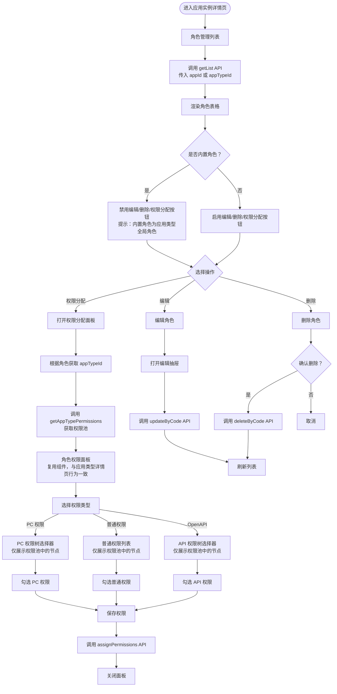

# 角色管理页面文档

## 概述

本文档描述角色管理页面的前端流程和核心业务。

**模块路径**: `packages/base-frontend/src/app/pages/permission/`

**版本**: 1.0.0

---

## 目录

1. [页面流程图](#页面流程图)
2. [功能说明](#功能说明)
3. [API 接口](#API 接口)
4. [业务规则](#业务规则)
5. [组件复用](#组件复用)

---

## 页面流程图

**说明**: 角色管理页面属于具体应用实体，仅管理绑定 appId 的应用级角色。内置角色 (isBuiltin=1) 为应用类型全局角色，不允许编辑、删除、分配权限操作。



---

## 功能说明

### 角色列表页

| 功能 | 说明 |
|------|------|
| 列表展示 | 展示角色列表，区分内置角色和应用级角色 |
| 内置角色标识 | 内置角色显示特殊标识，禁用操作按钮 |
| 新建角色 | 创建应用级角色（仅应用级） |
| 编辑角色 | 修改角色信息（仅应用级） |
| 删除角色 | 删除角色（仅应用级） |
| 权限分配 | 为角色分配权限（仅应用级） |

### 权限分配面板

| 功能 | 说明 |
|------|------|
| 权限类型 Tab | 切换 PC 权限、普通权限、OpenAPI 权限 |
| 权限选择器 | 仅展示当前应用类型权限池中的权限节点 |
| 勾选权限 | 勾选/取消勾选权限节点 |
| 保存权限 | 提交权限分配配置到后端 |

---

## API 接口

### 获取角色列表

```
GET /sys/role/list
Params: { appId?: string, appTypeId?: string, page: number, size: number }
```

### 获取角色详情

```
GET /sys/role/:code
```

### 创建角色

```
POST /sys/role
Body: {
  appId: string,
  roleName: string,
  roleCode: string,
  roleDesc?: string
}
```

### 更新角色

```
PUT /sys/role/:code
Body: {
  roleName?: string,
  roleDesc?: string
}
```

### 删除角色

```
DELETE /sys/role/:code
```

### 获取角色权限

```
GET /sys/role/:code/permissions
```

### 分配权限

```
POST /sys/role/:code/permissions
Body: {
  permissionCodes: string[]
}
```

### 获取应用类型权限池

```
GET /sys/app-type/:typeCode/permissions
```

---

## 业务规则

### 角色分类

| 类型 | 说明 | 操作权限 |
|------|------|----------|
| 内置角色 | 不绑定 appId，仅绑定 appTypeId，为应用类型全局角色 | 只读，不允许编辑、删除、分配权限 |
| 应用级角色 | 必须绑定 appId，属于具体应用实例 | 可编辑、删除、分配权限 |

### 权限池约束

- 所有角色的权限配置都必须从所属应用类型的权限池中选择
- 权限池通过 `appTypeId` 进行隔离，不同应用类型的权限池相互独立
- 角色权限分配时，前端选择器仅展示该角色所属应用类型权限池中的权限节点

### 角色编码

- `roleCode` 全局唯一，创建后不可修改
- 角色编码建议格式：`{appTypeCode}_{roleName}`

---

## 组件复用

### RolePermissionPanel 组件

| 使用场景 | 说明 |
|----------|------|
| 应用类型详情页 - 内置角色权限查看 | 只读模式，展示内置角色权限 |
| 应用实例详情页 - 应用级角色权限分配 | 编辑模式，分配应用级角色权限 |

**组件行为一致性**:
- 两种场景下都从应用类型权限池获取数据
- 都展示相同的权限选择器（PC 权限树、普通权限列表、OpenAPI 权限树）
- 只读模式下禁用勾选和保存功能

---

## 相关文档

- [数据库实体设计](./database-entities-design.md)
- [应用类型管理页面](./app-type-management.md)
- [应用实例管理页面](./app-management.md)
- [权限分配流程](./permission-assignment.md)
- [权限池配置流程](./permission-pool-setup.md)

---

## 更新历史

| 版本 | 日期 | 变更说明 |
|------|------|----------|
| 1.0.0 | 2026-03-23 | 初始版本，从基础设施详细设计文档拆分 |

---

*本文档由基础设施页面详细设计文档拆分而来*
