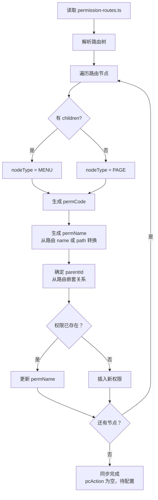

# PC 权限同步功能方案设计 (v3.0)

**文档编号**: PLAN-PC-SYNC-2026-0328
**版本**: v3.0 - permCode 自动拼接、actions 后置配置
**编制日期**: 2026-03-28
**编制人**: 技术团队

---

## 1. 方案修订说明

### v3.0 核心变更（响应老板意见）

| 变更项 | v2.0 问题 | v3.0 修正 |
|--------|----------|----------|
| **actions 定义** | 路由中前置定义 actions | ❌ 删除，不在路由中定义 |
| **permCode 生成** | 路由中手动填写 permCode | ✅ 从路由结构自动拼接 |
| **pcAction 配置** | 同步时生成 pcAction | ✅ 同步后在 PC 权限管理页面配置 |
| **同步范围** | 同步权限 + pcAction | ✅ 仅同步权限树结构，pcAction 后置配置 |

### 设计原则

1. **路由配置最小化**：路由只定义 `path`、`name`、`component`，不定义权限相关元数据
2. **permCode 自动拼接**：从路由嵌套结构自动生成（如 `/system/user` → `menu.system.user`）
3. **pcAction 后置配置**：同步生成权限树后，在 PC 权限管理页面配置 pcAction

---

## 2. 前端路由配置规范

### 2.1 路由配置示例（最小化）

```typescript
// src/router/permission-routes.ts
// 这是 PC 权限系统管理的路由配置

export const permissionRoutes = [
  {
    path: '/system',
    name: 'System',
    component: 'Layout',
    children: [
      {
        path: 'app-type',
        name: 'AppType',
        component: () => import('system/app-type/index.vue'),
        children: [
          {
            path: 'list',
            name: 'AppTypeList',
            component: () => import('system/app-type/list.vue')
          }
        ]
      },
      {
        path: 'permission',
        name: 'Permission',
        component: () => import('system/permission/index.vue'),
        children: [
          {
            path: 'pc',
            name: 'PcPermission',
            component: () => import('system/permission/pc.vue')
          }
        ]
      },
      {
        path: 'member',
        name: 'Member',
        component: () => import('system/member/index.vue'),
        children: [
          {
            path: 'list',
            name: 'MemberList',
            component: () => import('system/member/list.vue')
          }
        ]
      }
    ]
  },
  {
    path: '/business',
    name: 'Business',
    component: 'Layout',
    children: [
      {
        path: 'order',
        name: 'Order',
        component: () => import('business/order/index.vue'),
        children: [
          {
            path: 'list',
            name: 'OrderList',
            component: () => import('business/order/list.vue')
          }
        ]
      }
    ]
  }
]
```

### 2.2 路由 → permCode 映射规则

```
路由结构                          生成的 permCode 规则
─────────────────────────────────────────────────────────────
/system                         → menu.system
  /app-type                     → menu.system.app-type
    /list                       → page.system.app-type.list
  /permission                   → menu.system.permission
    /pc                         → page.system.permission.pc
  /member                       → menu.system.member
    /list                       → page.system.member.list

/business                       → menu.business
  /order                        → menu.business.order
    /list                       → page.business.order.list
```

**拼接规则**:
1. 根路径 (如 `/system`) → `menu.system`
2. 一级子路径 (如 `/system/app-type`) → `menu.system.app-type`
3. 二级子路径 (如 `/system/app-type/list`) → `page.system.app-type.list`
4. `MENU` / `PAGE` 的判断：
   - 有 children 的路由节点 → `MENU`
   - 无 children 的路由节点 → `PAGE`

### 2.3 与现有文档对照

参考 [系统初始化文档 - 6.1 PC 权限](../flows/system-initialization.md):

| permCode | permName | nodeType | parentId | 说明 |
|----------|----------|----------|----------|------|
| menu.system | 系统管理 | MENU | null | 根菜单 |
| menu.system.app-type | 应用类型管理 | MENU | menu.system | 应用类型管理菜单 |
| page.system.app-type.list | 应用类型列表 | PAGE | menu.system.app-type | 应用类型列表页面 |

---

## 3. 同步逻辑设计

### 3.1 同步流程图



### 3.2 permCode 生成算法

```typescript
function generatePermCode(route: RouteRecordRaw, parentPermCode?: string): string {
  // 提取 path 中的有效部分（去除前导/）
  const pathSegment = route.path.replace(/^\//, '')

  // 根路径处理
  if (!parentPermCode) {
    return `menu.${pathSegment}`
  }

  // 判断是否为页面节点（无 children）
  const isPage = !route.children || route.children.length === 0

  if (isPage) {
    return parentPermCode.replace('menu', 'page') + `.${pathSegment}`
  } else {
    return parentPermCode + `.${pathSegment}`
  }
}

// 示例
generatePermCode({ path: '/system' })
  // → "menu.system"

generatePermCode({ path: 'app-type' }, 'menu.system')
  // → "menu.system.app-type"

generatePermCode({ path: 'list', children: undefined }, 'menu.system.app-type')
  // → "page.system.app-type.list"
```

### 3.3 permName 生成规则

```typescript
function generatePermName(route: RouteRecordRaw): string {
  // 优先使用 name 转中文（可配置映射表）
  // 其次使用 path 转中文
  const nameMap: Record<string, string> = {
    'System': '系统管理',
    'AppType': '应用类型管理',
    'AppTypeList': '应用类型列表',
    'Permission': '权限管理',
    'PcPermission': 'PC 权限树',
    'Member': '成员管理',
    'MemberList': '成员列表'
  }

  return nameMap[route.name as string] || route.path
}
```

### 3.4 同步策略

| 场景 | 策略 | 说明 |
|------|------|------|
| 路由新增 | 添加权限节点 | 路由存在，权限不存在→新增 |
| 路由删除 | 标记禁用 | 路由删除，权限 `permStatus=0`（不物理删除） |
| 路由名称变更 | 更新 permName | 保持 permCode 不变 |
| pcAction | 不同步 | 同步后在 PC 权限管理页面手动配置 |

---

## 4. 数据库变更

### 4.1 表结构变更（最小化）

**sys_permission 表**:

| 字段 | 类型 | 说明 | 变更 |
|------|------|------|------|
| routePath | VARCHAR(255) | 路由 path，用于比对 | **新增，可空** |
| isAutoSync | TINYINT(1) | 是否同步生成 | **新增，default 0** |

### 4.2 迁移脚本

```sql
-- Step 1: 添加新字段
ALTER TABLE sys_permission
ADD COLUMN routePath VARCHAR(255) COMMENT '路由 path，同步时使用' AFTER permCode,
ADD COLUMN isAutoSync TINYINT(1) DEFAULT 0 COMMENT '是否同步生成：1-是 0-否' AFTER routePath;

-- Step 2: 已有数据标记为手动创建
UPDATE sys_permission SET isAutoSync = 0 WHERE id > 0;

-- Step 3: 添加索引
CREATE INDEX idx_route_path ON sys_permission(routePath);
CREATE INDEX idx_auto_sync ON sys_permission(isAutoSync);

-- Step 4: 备份
CREATE TABLE sys_permission_backup_20260328 AS SELECT * FROM sys_permission;
```

---

## 5. API 接口设计

### 5.1 同步权限树

**接口**: `POST /api/permission/sync`

**请求**:
```json
{
  "dryRun": true      // true=预览，false=执行
}
```

**响应**:
```json
{
  "code": 200,
  "data": {
    "synced": true,
    "summary": {
      "added": 3,
      "updated": 1,
      "unchanged": 5
    },
    "details": [
      {
        "type": "add",
        "routePath": "/system/user",
        "permCode": "menu.system.user",
        "permName": "用户管理",
        "nodeType": "MENU"
      },
      {
        "type": "update",
        "routePath": "/system/role",
        "permCode": "menu.system.role",
        "changes": {
          "permName": { "old": "角色", "new": "角色管理" }
        }
      }
    ]
  }
}
```

### 5.2 比对差异

**接口**: `GET /api/permission/compare`

**响应**:
```json
{
  "code": 200,
  "data": {
    "hasDiff": true,
    "diffCount": 2,
    "diffs": [
      {
        "type": "missing",
        "routePath": "/system/user",
        "suggestedPermCode": "menu.system.user",
        "suggestion": "添加菜单权限"
      },
      {
        "type": "mismatch",
        "permCode": "menu.system",
        "diff": {
          "routeName": "System",
          "permName": "系统"
        },
        "suggestion": "更新权限名称为'系统管理'"
      },
      {
        "type": "extra",
        "permCode": "old-menu",
        "permName": "旧菜单",
        "routePath": null,
        "suggestion": "路由已删除，建议禁用该权限"
      }
    ]
  }
}
```

### 5.3 pcAction 管理接口（现有接口保持不变）

| 接口 | 方法 | 说明 |
|------|------|------|
| `/api/permission/:id/pc-actions` | POST | 添加 pcAction |
| `/api/permission/:id/pc-actions/:permCode` | PUT | 编辑 pcAction |
| `/api/permission/:id/pc-actions/:permCode` | DELETE | 删除 pcAction |

---

## 6. 前端实现

### 6.1 PC 权限管理页面布局

```
┌─────────────────────────────────────────────────────────────────┐
│  PC 权限管理                          [同步路由] [检查差异]       │
├─────────────────────────────────────────────────────────────────┤
│                                                                 │
│  ┌─────────────────────┐   ┌─────────────────────────────────┐ │
│  │   权限树 (只读)      │   │   pcAction 配置面板              │ │
│  │                     │   │                                 │ │
│  │ 📁 系统管理 (同步)   │   │  选中节点：应用类型列表          │ │
│  │   📄 应用类型列表    │   │  (PAGE 节点，可配置 pcAction)     │ │
│  │   📄 角色管理        │   │                                 │ │
│  │                     │   │  操作权限列表：                 │ │
│  │ 📁 业务管理 (同步)   │   │  ┌────────────────────────────┐ │ │
│  │   📄 订单管理        │   │  │ 新增  [编辑] [删除]        │ │ │
│  │                     │   │  │ 编辑  [编辑] [删除]        │ │ │
│  │                     │   │  │ 删除  [编辑] [删除]        │ │ │
│  │                     │   │  │ 导出  [编辑] [删除]        │ │ │
│  │                     │   │  └────────────────────────────┘ │ │
│  │                     │   │  [+ 添加操作权限]               │ │
│  └─────────────────────┘   └─────────────────────────────────┘ │
│                                                                 │
│  [手动添加权限]                                                  │
└─────────────────────────────────────────────────────────────────┘
```

### 6.2 同步按钮组件

```vue
<template>
  <div class="sync-actions">
    <el-button type="primary" @click="handleSync" :loading="syncing">
      同步路由
    </el-button>
    <el-button @click="handleCompare">
      检查差异
      <el-badge :value="diffCount" :hidden="diffCount === 0" />
    </el-button>

    <DiffPreviewDialog
      v-model:visible="previewVisible"
      :diffs="diffs"
      @confirm="confirmSync"
    />
  </div>
</template>

<script setup lang="ts">
import { ref, onMounted } from 'vue'
import { comparePermission, syncPermission } from '@/api/permission'

const syncing = ref(false)
const diffCount = ref(0)
const diffs = ref([])
const previewVisible = ref(false)

onMounted(async () => {
  const res = await comparePermission()
  if (res.data.hasDiff) {
    diffCount.value = res.data.diffCount
  }
})

const handleCompare = async () => {
  const res = await comparePermission()
  diffs.value = res.data.diffs
  diffCount.value = res.data.diffCount
  previewVisible.value = true
}

const handleSync = async () => {
  await handleCompare()
}

const confirmSync = async () => {
  syncing.value = true
  try {
    await syncPermission({ dryRun: false })
    ElMessage.success('同步成功')
    emit('refresh')
  } catch (e) {
    ElMessage.error('同步失败')
  } finally {
    syncing.value = false
    previewVisible.value = false
  }
}
</script>
```

---

## 7. 实施计划

### 7.1 任务分解

| 阶段 | 任务 | 负责人 | 工时 |
|------|------|--------|------|
| 1 | 数据库表结构变更 | @backend | 1h |
| 2 | 后端 API - 路由解析服务 | @backend | 3h |
| 3 | 后端 API - 同步接口 | @backend | 3h |
| 4 | 后端 API - 比对接口 | @backend | 2h |
| 5 | 前端 - 同步按钮组件 | @frontend | 2h |
| 6 | 前端 - 权限树展示（只读） | @frontend | 3h |
| 7 | 前端 - pcAction 管理面板 | @frontend | 4h |
| 8 | 前后端联调 | @both | 3h |
| 9 | 测试 | @qa | 3h |
| 10 | 文档更新 | @doc | 2h |
| **合计** | | | **26h** |

### 7.2 里程碑

| 里程碑 | 交付物 | 时间 |
|--------|--------|------|
| M1 | 数据库就绪 | Day 1 上午 |
| M2 | API 完成 | Day 2 下午 |
| M3 | 前端完成 | Day 3 下午 |
| M4 | 联调完成 | Day 4 上午 |
| M5 | 测试通过 | Day 4 下午 |
| M6 | 上线发布 | Day 5 |

---

## 8. 验收标准

### 8.1 功能验收

| 编号 | 验收项 | 标准 |
|------|--------|------|
| F1 | 路由同步 | 点击同步，正确生成 PC 权限树（无 pcAction） |
| F2 | permCode 自动生成 | 从路由结构自动拼接，无需手动填写 |
| F3 | 权限树只读 | isAutoSync=1 的节点不可编辑结构 |
| F4 | pcAction 可配置 | 可在 PAGE 节点配置 pcAction |
| F5 | 手动添加 | 支持手动添加权限节点 |
| F6 | 差异预览 | 同步前展示变更预览 |

### 8.2 数据验收

| 编号 | 验收项 | 标准 |
|------|--------|------|
| D1 | pcAction 格式 | 严格遵循 `{name, permCode}` 格式 |
| D2 | 权限类型 | 同步生成 PC 权限，不影响 NORMAL |
| D3 | 同步后 pcAction | 为空，需手动配置 |

---

## 9. 附录：同步示例

### 9.1 输入（路由配置）

```typescript
[
  {
    path: '/system',
    name: 'System',
    children: [
      {
        path: 'app-type',
        name: 'AppType',
        children: [
          {
            path: 'list',
            name: 'AppTypeList'
          }
        ]
      }
    ]
  }
]
```

### 9.2 输出（权限树）

```json
[
  {
    "permCode": "menu.system",
    "permName": "系统管理",
    "nodeType": "MENU",
    "routePath": "/system",
    "isAutoSync": 1,
    "pcAction": [],
    "children": [
      {
        "permCode": "menu.system.app-type",
        "permName": "应用类型管理",
        "nodeType": "MENU",
        "routePath": "/system/app-type",
        "isAutoSync": 1,
        "pcAction": [],
        "children": [
          {
            "permCode": "page.system.app-type.list",
            "permName": "应用类型列表",
            "nodeType": "PAGE",
            "routePath": "/system/app-type/list",
            "isAutoSync": 1,
            "pcAction": [],
            "children": []
          }
        ]
      }
    ]
  }
]
```

### 9.3 后续配置（PC 权限管理页面）

选中 `page.system.app-type.list` 节点，配置 pcAction：

```json
{
  "pcAction": [
    { "name": "新增", "permCode": "add" },
    { "name": "编辑", "permCode": "edit" },
    { "name": "删除", "permCode": "delete" }
  ]
}
```

---

**版本**: v3.0
**状态**: 待老板评审
