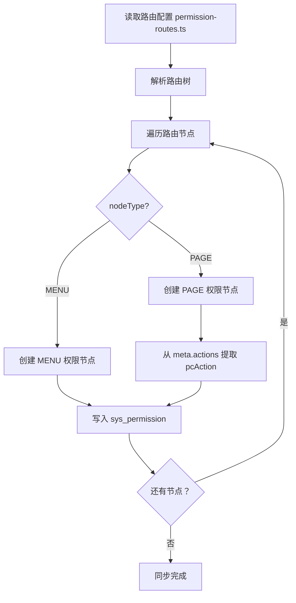

# PC 权限同步功能方案设计 (v2.0)

**文档编号**: PLAN-PC-SYNC-2026-0328
**版本**: v2.0 - 严格遵循现有数据结构
**编制日期**: 2026-03-28
**编制人**: 技术团队

---

## 1. 方案修订说明

### v2.0 主要变更

| 变更项 | v1.0 问题 | v2.0 修正 |
|--------|----------|----------|
| pcAction 格式 | 自创格式 `actionName/actionType` | 采用现有格式 `name/permCode` |
| 权限类型映射 | 未定义 | 路由→PC 权限，手动添加支持 NORMAL |
| 表结构变更 | 新增字段过多 | 仅新增 `routePath` 字段用于同步标记 |
| 同步范围 | 模糊 | 仅同步 PC 权限树，不影响 NORMAL |

---

## 2. 与现有设计融合

### 2.1 现有数据结构（严格遵循）

**sys_permission.pcAction 格式**:
```json
[
  { "name": "新增", "permCode": "add" },
  { "name": "编辑", "permCode": "edit" },
  { "name": "删除", "permCode": "delete" }
]
```

**PermissionType + NodeType 架构**:
```
PC 权限树:
├── MENU (目录)
│   └── PAGE (页面)
│       └── pcAction: [{name, permCode}]

NORMAL 权限树:
├── MENU (目录)
│   └── TAG (标签)
```

### 2.2 同步边界

| 同步内容 | 说明 |
|----------|------|
| ✅ PC + MENU 节点 | 从路由 `meta.menu` 生成 |
| ✅ PC + PAGE 节点 | 从路由 path 生成 |
| ✅ pcAction | 从路由 `meta.actions` 生成 |
| ❌ NORMAL 权限 | 不同步，保持手动管理 |

---

## 3. 前端路由配置规范

### 3.1 路由配置模板

```typescript
// src/router/permission-routes.ts
// 这是 PC 权限系统管理的 routelist

export const permissionRoutes = [
  {
    path: '/system',
    name: 'System',
    component: 'Layout',
    meta: {
      title: '系统管理',
      icon: 'setting',
      menuType: 'PC',           // 标记为 PC 权限
      nodeType: 'MENU',         // 目录节点
      permCode: 'system'        // 权限编码（可选，默认用 path）
    },
    children: [
      {
        path: 'user-manage',
        name: 'UserManage',
        component: 'system/user/index',
        meta: {
          title: '用户管理',
          icon: 'user',
          menuType: 'PC',
          nodeType: 'PAGE',     // 页面节点
          permCode: 'user-manage',
          actions: [            // pcAction 定义
            { name: '新增', permCode: 'add' },
            { name: '编辑', permCode: 'edit' },
            { name: '删除', permCode: 'delete' },
            { name: '导出', permCode: 'export' }
          ]
        }
      },
      {
        path: 'role-manage',
        name: 'RoleManage',
        component: 'system/role/index',
        meta: {
          title: '角色管理',
          icon: 'role',
          menuType: 'PC',
          nodeType: 'PAGE',
          permCode: 'role-manage',
          actions: [
            { name: '新增', permCode: 'add' },
            { name: '编辑', permCode: 'edit' },
            { name: '删除', permCode: 'delete' }
          ]
        }
      }
    ]
  }
]
```

### 3.2 路由 meta 字段说明

| 字段 | 类型 | 必填 | 说明 |
|------|------|------|------|
| `menuType` | 'PC' | 是 | 固定为 'PC'，标识属于 PC 权限体系 |
| `nodeType` | 'MENU'/'PAGE' | 是 | MENU=目录，PAGE=页面 |
| `permCode` | string | 建议 | 权限编码，默认用 path |
| `actions` | Array | PAGE 节点必填 | pcAction 定义 |
| `title` | string | 是 | 菜单名称 |
| `icon` | string | 建议 | 菜单图标 |

---

## 4. 同步逻辑设计

### 4.1 路由 → 权限节点映射

```
路由配置                          →   权限节点 (sys_permission)
─────────────────────────────────────────────────────────────────────
{                                    {
  path: '/system',                     permName: '系统管理',
  meta: {                              permCode: 'system',
    title: '系统管理',                  permissionType: 'PC',
    menuType: 'PC',                    nodeType: 'MENU',
    icon: 'setting'                    iconName: 'setting',
  }                                    routePath: '/system',
}                                      parentId: null,
                                       // MENU 节点无 pcAction
                                     }

{                                    {
  path: 'user-manage',                 permName: '用户管理',
  meta: {                              permCode: 'user-manage',
    title: '用户管理',                  permissionType: 'PC',
    menuType: 'PC',                    nodeType: 'PAGE',
    actions: [                         routePath: '/system/user-manage',
      { name: '新增', permCode: 'add' }  parentId: [system 的 id],
    ]                                  pcAction: [
  }                                      { name: '新增', permCode: 'add' }
}                                        ]
                                     }
```

### 4.2 同步流程图



### 4.3 同步策略

| 场景 | 策略 | 说明 |
|------|------|------|
| 路由新增 | 添加权限节点 | 路由存在，权限不存在→新增 |
| 路由删除 | 标记禁用 | 路由删除，权限 `permStatus=0`（不物理删除） |
| 路由名称变更 | 更新 permName | 保持 permCode 不变 |
| pcAction 新增 | 追加 | 合并到现有 pcAction 数组 |
| pcAction 删除 | 保留 | 不自动删除，避免影响已有角色权限 |

---

## 5. 数据库变更

### 5.1 表结构变更（最小化）

**sys_permission 表**:

| 字段 | 类型 | 说明 | 变更 |
|------|------|------|------|
| routePath | VARCHAR(255) | 路由 path，用于比对 | **新增，可空** |
| isAutoSync | TINYINT(1) | 是否同步生成 | **新增，default 0** |

**变更说明**:
- `routePath`: 用于标记该权限节点是否由路由同步生成，以及用于比对差异
- `isAutoSync`: 为 1 时，节点结构（permName, parentId 等）不可编辑

### 5.2 迁移脚本

```sql
-- Step 1: 添加新字段
ALTER TABLE sys_permission
ADD COLUMN routePath VARCHAR(255) COMMENT '路由 path，同步时使用' AFTER permCode,
ADD COLUMN isAutoSync TINYINT(1) DEFAULT 0 COMMENT '是否同步生成：1-是 0-否' AFTER routePath;

-- Step 2: 已有数据标记为手动创建
UPDATE sys_permission SET isAutoSync = 0 WHERE id > 0;

-- Step 3: 添加索引
CREATE INDEX idx_route_path ON sys_permission(routePath);
CREATE INDEX idx_auto_sync ON sys_permission(isAutoSync);

-- Step 4: 备份（安全起见）
CREATE TABLE sys_permission_backup_20260328 AS SELECT * FROM sys_permission;
```

---

## 6. API 接口设计

### 6.1 获取路由配置

**接口**: `GET /api/permission/routes`

**响应**:
```json
{
  "code": 200,
  "data": {
    "routes": [
      {
        "path": "/system",
        "name": "System",
        "meta": {
          "title": "系统管理",
          "menuType": "PC",
          "nodeType": "MENU",
          "permCode": "system"
        },
        "children": [
          {
            "path": "user-manage",
            "meta": {
              "title": "用户管理",
              "menuType": "PC",
              "nodeType": "PAGE",
              "permCode": "user-manage",
              "actions": [
                { "name": "新增", "permCode": "add" }
              ]
            }
          }
        ]
      }
    ]
  }
}
```

### 6.2 同步权限树

**接口**: `POST /api/permission/sync`

**请求**:
```json
{
  "dryRun": true,      // true=预览，false=执行
  "strategy": "merge"  // merge=合并，update=更新
}
```

**响应**:
```json
{
  "code": 200,
  "data": {
    "synced": true,
    "summary": {
      "added": 2,      // 新增节点数
      "updated": 1,    // 更新节点数
      "unchanged": 5   // 无变更节点数
    },
    "details": [
      {
        "type": "add",
        "path": "/system/user-manage",
        "name": "用户管理",
        "message": "新增页面权限"
      },
      {
        "type": "update",
        "path": "/system/role-manage",
        "changes": {
          "permName": { "old": "角色", "new": "角色管理" }
        }
      }
    ]
  }
}
```

### 6.3 比对差异

**接口**: `GET /api/permission/compare`

**响应**:
```json
{
  "code": 200,
  "data": {
    "hasDiff": true,
    "diffCount": 3,
    "diffs": [
      {
        "type": "missing",
        "routePath": "/system/user-manage",
        "permName": "用户管理",
        "suggestion": "添加到权限树"
      },
      {
        "type": "mismatch",
        "routePath": "/system",
        "permCode": "system",
        "diff": {
          "routeTitle": "系统管理",
          "permName": "系统"
        },
        "suggestion": "更新权限名称"
      },
      {
        "type": "extra",
        "permCode": "old-menu",
        "permName": "旧菜单",
        "routePath": null,
        "suggestion": "路由已删除，建议禁用该权限"
      }
    ]
  }
}
```

### 6.4 获取权限树

**接口**: `GET /api/permission/tree`

**响应**:
```json
{
  "code": 200,
  "data": {
    "tree": [
      {
        "id": "1",
        "permName": "系统管理",
        "permCode": "system",
        "permissionType": "PC",
        "nodeType": "MENU",
        "routePath": "/system",
        "isAutoSync": 1,
        "children": [
          {
            "id": "2",
            "permName": "用户管理",
            "permCode": "user-manage",
            "permissionType": "PC",
            "nodeType": "PAGE",
            "routePath": "/system/user-manage",
            "isAutoSync": 1,
            "pcAction": [
              { "name": "新增", "permCode": "add" },
              { "name": "编辑", "permCode": "edit" }
            ],
            "children": []
          }
        ]
      }
    ],
    "manualNodes": [
      {
        "id": "99",
        "permName": "特殊权限",
        "permCode": "manual-001",
        "permissionType": "PC",
        "nodeType": "PAGE",
        "routePath": null,
        "isAutoSync": 0,
        "pcAction": [],
        "children": []
      }
    ]
  }
}
```

### 6.5 pcAction 管理接口

**保持现有接口不变**，仅遵循现有 `name/permCode` 格式：

| 接口 | 方法 | 说明 |
|------|------|------|
| `/api/permission/:id/actions` | POST | 添加 pcAction |
| `/api/permission/:id/actions/:permCode` | PUT | 编辑 pcAction |
| `/api/permission/:id/actions/:permCode` | DELETE | 删除 pcAction |

---

## 7. 前端实现

### 7.1 PC 权限管理页面布局

```
┌─────────────────────────────────────────────────────────────────┐
│  PC 权限管理                                      [同步路由] [检查差异] │
├─────────────────────────────────────────────────────────────────┤
│                                                                 │
│  ┌─────────────────────┐   ┌─────────────────────────────────┐ │
│  │   权限树 (只读)      │   │   pcAction 管理                  │ │
│  │                     │   │                                 │ │
│  │ 📁 系统管理 (同步)   │   │ 选中节点：用户管理               │ │
│  │   📄 用户管理        │   │                                 │ │
│  │   📄 角色管理        │   │  操作权限列表：                 │ │
│  │                     │   │  ┌────────────────────────────┐ │ │
│  │ 📁 业务管理 (手动)   │   │  │ 新增  [edit] [delete]      │ │ │
│  │   📄 订单管理        │   │  │ 编辑  [edit] [delete]      │ │ │
│  │                     │   │  │ 删除  [edit] [delete]      │ │ │
│  │                     │   │  └────────────────────────────┘ │ │
│  │                     │   │  [+ 添加操作权限]               │ │
│  └─────────────────────┘   └─────────────────────────────────┘ │
│                                                                 │
│  [手动添加权限]                                                  │
└─────────────────────────────────────────────────────────────────┘
```

### 7.2 同步按钮组件

```vue
<template>
  <div class="sync-actions">
    <el-button type="primary" @click="handleSync" :loading="syncing">
      同步路由
    </el-button>
    <el-button @click="handleCompare">
      检查差异
      <el-badge :value="diffCount" :hidden="diffCount === 0" />
    </el-button>

    <!-- 差异预览弹窗 -->
    <DiffPreviewDialog
      v-model:visible="previewVisible"
      :diffs="diffs"
      @confirm="confirmSync"
    />
  </div>
</template>

<script setup lang="ts">
import { ref, onMounted } from 'vue'
import { comparePermission, syncPermission } from '@/api/permission'

const syncing = ref(false)
const diffCount = ref(0)
const diffs = ref([])
const previewVisible = ref(false)

onMounted(async () => {
  // 页面加载时自动比对
  const res = await comparePermission()
  if (res.data.hasDiff) {
    diffCount.value = res.data.diffCount
  }
})

const handleCompare = async () => {
  const res = await comparePermission()
  diffs.value = res.data.diffs
  diffCount.value = res.data.diffCount
  previewVisible.value = true
}

const handleSync = async () => {
  await handleCompare()  // 先预览
}

const confirmSync = async () => {
  syncing.value = true
  try {
    await syncPermission({ dryRun: false })
    ElMessage.success('同步成功')
    emit('refresh')
  } catch (e) {
    ElMessage.error('同步失败')
  } finally {
    syncing.value = false
    previewVisible.value = false
  }
}
</script>
```

### 7.3 权限树展示（只读）

```vue
<template>
  <el-tree
    :data="treeData"
    :props="defaultProps"
    node-key="id"
    default-expand-all
    :expand-on-click-node="false"
  >
    <template #default="{ node, data }">
      <div class="tree-node">
        <span class="node-icon">{{ getNodeIcon(data.nodeType) }}</span>
        <span class="node-name">{{ node.label }}</span>
        <span class="node-code">{{ data.permCode }}</span>

        <!-- 同步标记 -->
        <el-tag
          v-if="data.isAutoSync === 1"
          size="small"
          type="info"
          class="sync-tag"
        >
          同步
        </el-tag>

        <!-- pcAction 预览 -->
        <span v-if="data.pcAction" class="action-preview">
          [{{ data.pcAction.length }} 个操作]
        </span>
      </div>
    </template>
  </el-tree>
</template>

<script setup lang="ts">
import { getPermissionTree } from '@/api/permission'
import { ref, onMounted } from 'vue'

const treeData = ref([])
const defaultProps = {
  children: 'children',
  label: 'permName'
}

onMounted(async () => {
  const res = await getPermissionTree()
  treeData.value = res.data.tree
})

const getNodeIcon = (nodeType: string) => {
  return nodeType === 'MENU' ? '📁' : '📄'
}
</script>

<style scoped>
.tree-node {
  display: flex;
  align-items: center;
  gap: 8px;
  flex: 1;
}

.node-code {
  font-size: 12px;
  color: #999;
}

.sync-tag {
  margin-left: 8px;
}

.action-preview {
  font-size: 12px;
  color: #666;
  margin-left: auto;
}
</style>
```

---

## 8. 实施计划

### 8.1 任务分解

| 阶段 | 任务 | 负责人 | 工时 |
|------|------|--------|------|
| 1 | 数据库表结构变更 | @backend | 1h |
| 2 | 后端 API - 获取路由 | @backend | 2h |
| 3 | 后端 API - 同步接口 | @backend | 4h |
| 4 | 后端 API - 比对接口 | @backend | 2h |
| 5 | 前端 - 同步按钮组件 | @frontend | 2h |
| 6 | 前端 - 权限树展示 | @frontend | 3h |
| 7 | 前端 - pcAction 管理 | @frontend | 3h |
| 8 | 前后端联调 | @backend, @frontend | 3h |
| 9 | 测试 | @qa | 3h |
| 10 | 文档更新 | @doc | 2h |
| **合计** | | | **25h** |

### 8.2 里程碑

| 里程碑 | 交付物 | 时间 |
|--------|--------|------|
| M1 | 数据库就绪 | Day 1 上午 |
| M2 | API 完成 | Day 2 下午 |
| M3 | 前端完成 | Day 3 下午 |
| M4 | 联调完成 | Day 4 上午 |
| M5 | 测试通过 | Day 4 下午 |
| M6 | 上线发布 | Day 5 |

---

## 9. 验收标准

### 9.1 功能验收

| 编号 | 验收项 | 标准 |
|------|--------|------|
| F1 | 路由同步 | 点击同步，正确生成 PC 权限树 |
| F2 | 自动比对 | 页面加载时自动检测差异 |
| F3 | 权限树只读 | isAutoSync=1 的节点不可编辑结构 |
| F4 | pcAction 可编辑 | 可对 pcAction 增删改 |
| F5 | 手动添加 | 支持手动添加权限节点 |
| F6 | 差异预览 | 同步前展示变更预览 |

### 9.2 数据验收

| 编号 | 验收项 | 标准 |
|------|--------|------|
| D1 | pcAction 格式 | 严格遵循 `{name, permCode}` 格式 |
| D2 | 权限类型 | 同步生成 PC 权限，不影响 NORMAL |
| D3 | 数据迁移 | 已有数据标记为 isAutoSync=0 |

---

## 10. 附录

### 10.1 关键代码片段

**后端同步服务 (伪代码)**:

```typescript
class PermissionSyncService {
  async sync(routes: RouteConfig[], strategy: 'merge' | 'update') {
    const existingPerms = await this.permissionRepo.findAll()
    const diffs = this.compare(routes, existingPerms)

    for (const diff of diffs) {
      if (diff.type === 'add') {
        await this.createPermissionFromRoute(diff.route)
      } else if (diff.type === 'update') {
        await this.updatePermission(diff.perm, diff.route)
      } else if (diff.type === 'extra') {
        // 标记禁用，不物理删除
        await this.disablePermission(diff.perm)
      }
    }
  }

  private createPermissionFromRoute(route: RouteConfig) {
    return this.permissionRepo.save({
      permName: route.meta.title,
      permCode: route.meta.permCode || route.path,
      permissionType: 'PC',
      nodeType: route.meta.nodeType,
      routePath: route.path,
      isAutoSync: 1,
      pcAction: route.meta.actions || [],
      parentId: this.findParentId(route.path)
    })
  }
}
```

### 10.2 参考文档

- [权限系统核心概念](./core/permissions.md)
- [数据库实体设计](./database/database-entities-design.md)
- [权限分配流程](./flows/permission-assignment.md)

---

**版本**: v2.0
**状态**: 待老板评审
