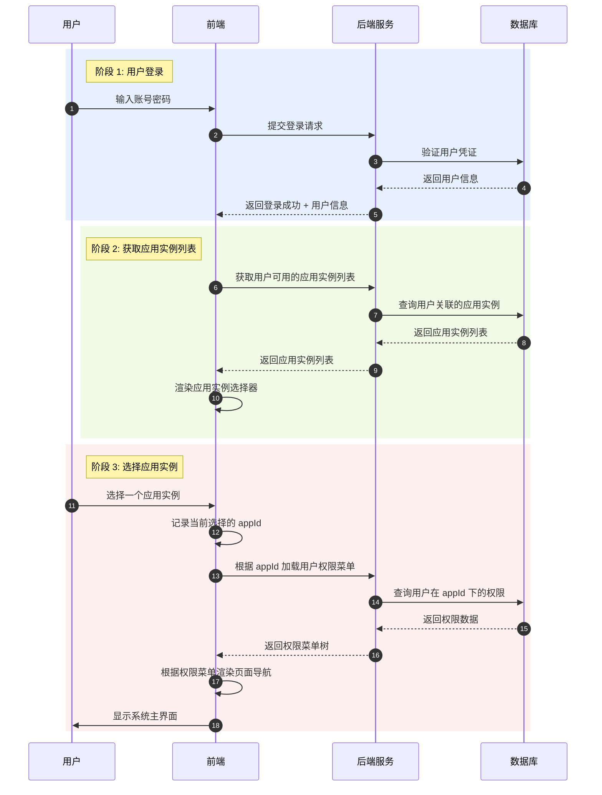
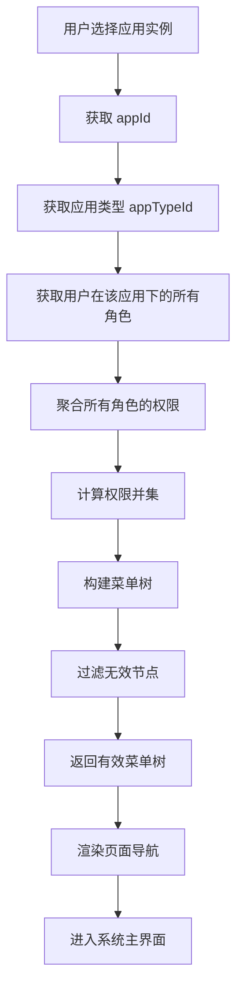
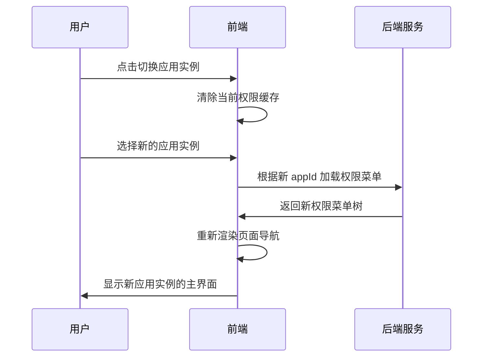

# 用户登录流程文档

## 概述

本文档描述用户登录系统后的应用实例选择流程及权限加载机制。

**版本**: 1.0.0

---

## 目录

1. [登录流程图](#登录流程图)
2. [应用实例选择](#应用实例选择)
3. [权限加载流程](#权限加载流程)
4. [切换应用实例](#切换应用实例)
5. [业务规则](#业务规则)

---

## 登录流程图



---

## 应用实例选择

### 选择器展示条件

| 场景 | 行为 |
|------|------|
| 用户有多个应用实例 | 显示应用实例选择器，用户必须选择一个才能进入系统 |
| 用户只有一个应用实例 | 可跳过选择，直接进入该应用实例 |
| 用户没有可用应用实例 | 提示"暂无可用应用实例"，无法进入系统 |

### 应用实例来源

用户可用的应用实例包括：

1. **作为拥有者**：用户是应用实例的拥有者 (`sys_app.ownerId = userId`)
2. **作为成员**：用户是应用实例的成员 (`sys_user_app.userId = userId`)

### 选择器数据结构

```typescript
interface AppInstanceItem {
  appId: string;           // 应用实例 ID
  appName: string;         // 应用实例名称
  appTypeId: string;       // 应用类型 ID
  appTypeCode: string;     // 应用类型编码
  appTypeName: string;     // 应用类型名称
  role: 'owner' | 'member'; // 用户身份：拥有者/成员
  icon?: string;           // 应用图标
}
```

---

## 权限加载流程



### 权限计算规则

```
用户最终权限 = ∪(所有关联角色的权限)

具体计算方式：
1. 遍历用户绑定的所有角色
2. 合并相同 permissionId 的权限
3. pcAction 取并集
4. 去重后返回最终权限集合
```

### 权限数据结构

```typescript
interface UserPermission {
  permissionId: string;
  permCode: string;
  permissionType: 'PC' | 'NORMAL' | 'API';
  nodeType?: 'MENU' | 'PAGE' | 'TAG' | 'API';
  pcAction?: Array<{name: string, permCode: string}>;
}
```

---

## 切换应用实例



### 切换说明

| 项目 | 说明 |
|------|------|
| 是否需要重新登录 | 否，切换应用实例无需重新登录 |
| 权限变化 | 切换后权限刷新为新应用实例下的权限 |
| 会话状态 | 用户登录态保持不变 |
| 缓存处理 | 切换时清除旧应用实例的权限缓存 |

---

## 业务规则

### 用户身份

| 身份 | 说明 | 权限来源 |
|------|------|----------|
| 拥有者 | 应用实例的负责人，每个应用实例只能有一个拥有者 | 自动绑定"管理员"内置角色，拥有所有权限 |
| 成员 | 应用实例的员工，一个应用实例可以有多个成员 | 通过角色分配获得权限 |

### 应用实例访问权限

- 用户必须是应用实例的拥有者或成员才能访问该应用实例
- 拥有者变更时，原拥有者失去访问权限（除非同时是成员）
- 移除成员时，该成员失去访问权限

### 权限隔离

- 不同应用实例的权限相互隔离
- 用户在不同应用实例下可能拥有不同的权限
- 用户切换应用实例后，权限自动刷新

### 内置应用实例

- 系统初始化时创建一个内置应用实例（`typeCode = 'system'`）
- 内置应用实例包含系统管理功能（应用类型管理、权限管理等）
- 内置应用实例的拥有者通常是系统管理员账号（如 admin）
- 内置应用实例与其他应用实例的处理逻辑相同，只是初始化方式不同

---

## 相关文档

- [数据库实体设计](./database-entities-design.md)
- [应用实例管理页面](./app-management.md)
- [成员管理页面](./member-management.md)
- [权限分配流程](./permission-assignment.md)

---

## 更新历史

| 版本 | 日期 | 变更说明 |
|------|------|----------|
| 1.0.0 | 2026-03-25 | 初始版本，描述用户登录后的应用实例选择和权限加载流程 |

---

*本文档由系统架构设计文档拆分而来*
