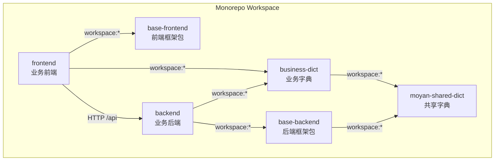
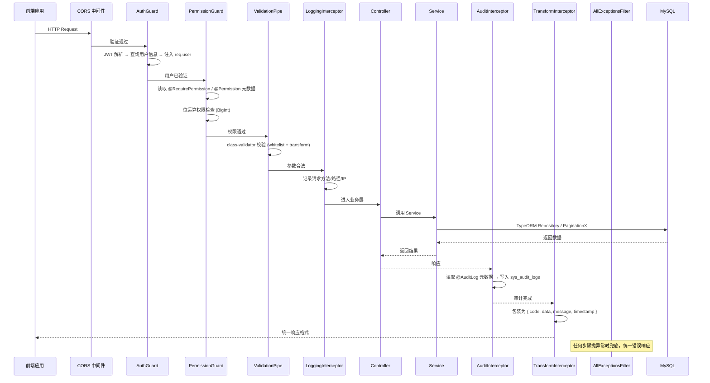
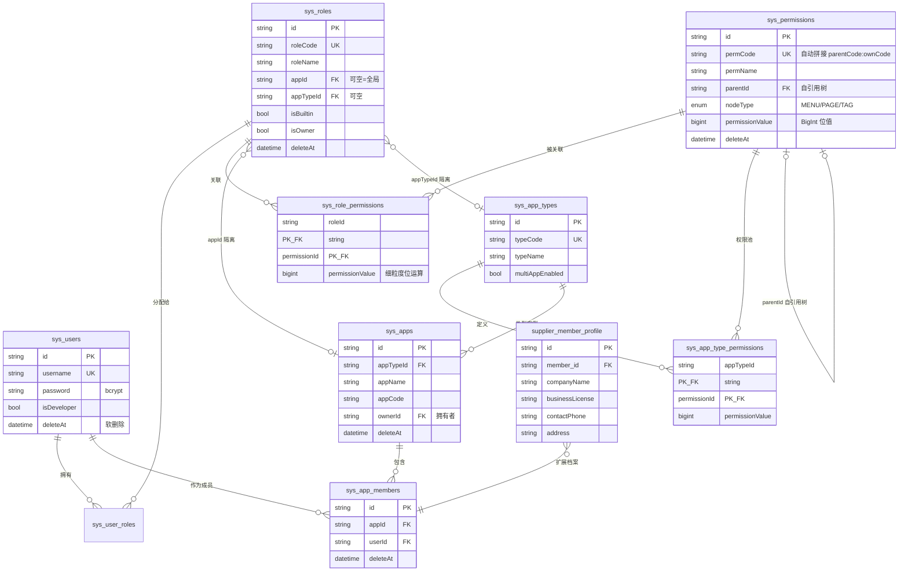
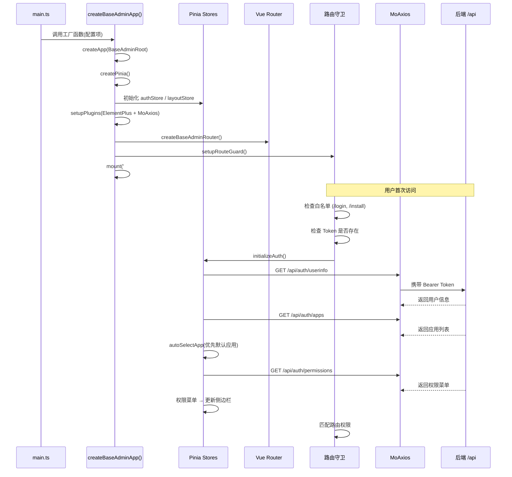
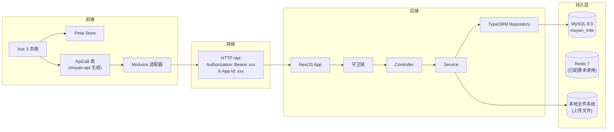
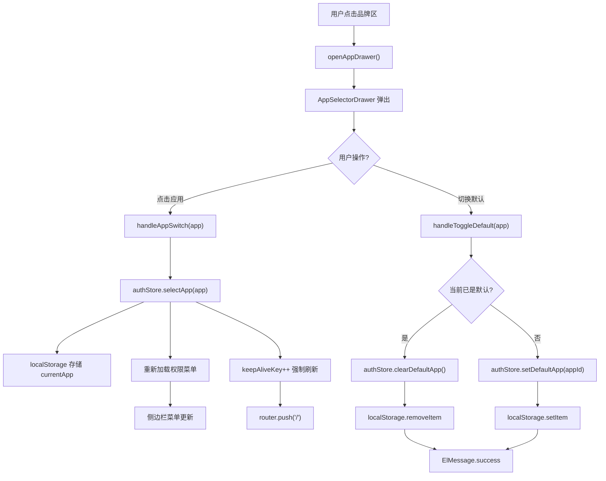

# Moyan MFW 架构分析报告

> **⛔ 本文档已过时** — 生成于 2026-05-09。
> 引用的包名（`moyan-base-backend`、`moyan-mfw-base-frontend`、`moyan-shared-dict`、`business-dict`）、
> 目录结构（`packages/base-backend/`、`backend/` 独立业务后端）及业务模块（`supplier`）在当前代码库中已不存在。
> 架构图仍有参考价值，具体内容请以 [api-reference/](api-reference/) 和 [development-standards/](development-standards/) 为准。

---

## 一、总体架构图

```
┌──────────────────────────────────────────────────────────────────────┐
│                         Moyan MFW Monorepo                           │
│                      pnpm workspace (Node ≥ 20)                      │
├──────────────────────────────────────────────────────────────────────┤
│                                                                       │
│  ┌──────────────────────┐          ┌──────────────────────┐          │
│  │   frontend/          │          │   backend/           │          │
│  │   业务前端应用        │          │   业务后端应用         │          │
│  │   (Vue 3 + Vite 5)   │          │   (NestJS 10)        │          │
│  │   port: 5173          │          │   port: 3000          │          │
│  └──────────┬───────────┘          └──────────┬───────────┘          │
│             │ 消费                            │ 消费                  │
│  ┌──────────▼───────────┐          ┌──────────▼───────────┐          │
│  │ base-frontend/       │          │ base-backend/        │          │
│  │ 前端基础设施包        │          │ 后端基础框架包        │          │
│  │ moyan-mfw-base-      │          │ moyan-base-backend    │          │
│  │ frontend             │◄─────────│ (发布为 npm 包)       │          │
│  └──────────────────────┘  API调用  └──────────────────────┘          │
│             │                              │                          │
│             ▼                              ▼                          │
│  ┌──────────────────┐          ┌──────────────────────┐              │
│  │ business-dict/   │          │ moyan-shared-dict/   │              │
│  │ 业务字典          │          │ 共享字典框架          │              │
│  └──────────────────┘          └──────────────────────┘              │
│                                                                       │
│  ┌─────────────────────────────────────────────────────────┐         │
│  │              基础设施层 (Infrastructure)                   │         │
│  ├─────────────┬───────────────┬──────────────┬────────────┤         │
│  │ MySQL 8.0   │  Redis 7      │  Docker      │  JWT       │         │
│  │ :3306       │  :6379        │  Compose     │  HS256     │         │
│  │ moyan_mfw   │  (已配置未用)   │              │            │         │
│  └─────────────┴───────────────┴──────────────┴────────────┘         │
└──────────────────────────────────────────────────────────────────────┘
```

### 包依赖关系



---

## 二、后端架构详图

### 2.1 请求处理流水线



### 2.2 模块依赖图

```mermaid
graph TD
    subgraph "base-backend 框架层"
        direction TB
        MAIN["createBaseBackendApp()<br/>工厂函数"]
        CONFIG["config/<br/>app/db/jwt/redis/user"]
        DB["database/<br/>data-source/seeds"]

        subgraph "common/ 通用层"
            DEC["decorators/<br/>@User @Public @RequirePermission<br/>@AuditLog @ApiPaginatedResponse"]
            GUARD["guards/<br/>AuthGuard<br/>PermissionGuard"]
            INTER["interceptors/<br/>Transform Logging Audit"]
            FILTER["filters/<br/>AllExceptionsFilter"]
            EXCEPT["exceptions/<br/>Business Unauthorized<br/>Forbidden NotFound"]
            UTILS["utils/<br/>encrypt pagination-x<br/>tree query-builder"]
            TYPES["types/<br/>UserDto ApiResponse<br/>ResourceDto"]
        end

        subgraph "modules/ 业务模块"
            AUTH["auth<br/>登录/注册/刷新"]
            USER["user<br/>用户CRUD"]
            ROLE["role<br/>角色/权限分配"]
            PERM["permission<br/>权限树管理"]
            APPTYPE["app-type<br/>应用类型/权限池"]
            APP["app<br/>应用实例/成员"]
            AUDIT["audit-log<br/>审计日志"]
            INSTALL["install<br/>系统初始化"]
            UPLOAD["upload<br/>文件上传"]
            HEALTH["health<br/>健康检查"]
        end
    end

    subgraph "backend 业务层"
        SUPPLIER["supplier<br/>供应商档案"]
    end

    MAIN --> CONFIG
    MAIN --> DB
    MAIN --> GUARD
    MAIN --> FILTER
    MAIN --> INTER
    MAIN --> AUTH
    MAIN --> USER
    MAIN --> ROLE
    MAIN --> PERM
    MAIN --> APPTYPE
    MAIN --> APP
    MAIN --> AUDIT
    MAIN --> INSTALL
    MAIN --> UPLOAD
    MAIN --> HEALTH
    MAIN --> SUPPLIER
```



### 2.3 实体关系图 (ER)



### 2.4 权限体系架构

```
                            ┌───────────────────┐
                            │    @Permission     │
                            │  (类级别 + 方法级)  │
                            └────────┬──────────┘
                                     │
                          读取装饰器元数据
                                     │
                            ┌────────▼──────────┐
                            │  PermissionGuard   │
                            │  (canActivate)     │
                            └────────┬──────────┘
                                     │
                    ┌────────────────┼────────────────┐
                    │                │                │
              isDeveloper?      isOwner?         普通用户
              → 直接放行       → 全部权限       → 位运算检查
                                                     │
                                          ┌──────────▼──────────┐
                                          │  权限值计算流程       │
                                          │                       │
                                          │ 1. 查用户角色列表      │
                                          │ 2. 查角色权限关联      │
                                          │ 3. 累加 permissionValue │
                                          │ 4. (requiredValue &    │
                                          │    userValue) !== 0n   │
                                          └───────────────────────┘

权限位运算模型：
┌────────┬──────────┬──────────┐
│ 权限名  │ 位偏移    │ BigInt 值  │
├────────┼──────────┼──────────┤
│ 添加   │ << 0     │ 1n       │
│ 编辑   │ << 1     │ 2n       │
│ 删除   │ << 2     │ 4n       │
│ 导出   │ << 3     │ 8n       │
│ 导入   │ << 4     │ 16n      │
│ 审批   │ << 5     │ 32n      │
│ 拒绝   │ << 6     │ 64n      │
│ 发布   │ << 7     │ 128n     │
│ 归档   │ << 8     │ 256n     │
└────────┴──────────┴──────────┘
```

---

## 三、前端架构详图

### 3.1 初始化流程



### 3.2 组件层级树

```
BaseAdminRoot (App.vue)
├── AdminLayout.vue ───────────────────────────────────────────────
│   ├── HeaderPanel.vue ─────────────────────────────────────────
│   │   ├── 品牌区 (BrandLogo + 应用切换入口)
│   │   │   └── AppSelectorDrawer ← 弹出应用选择抽屉
│   │   │       ├── 应用列表 (当前应用高亮)
│   │   │       ├── @toggle-default → handleToggleDefault()
│   │   │       │   └── authStore.setDefaultApp / clearDefaultApp
│   │   │       └── @select → handleAppSwitch()
│   │   │           └── authStore.selectApp → 重新加载权限菜单
│   │   ├── NavigationPanel.vue (顶部菜单)
│   │   └── 操作区 (HeaderCommonActions 扩展)
│   │       ├── 主题切换 (useColorMode)
│   │       ├── 全屏切换
│   │       └── 布局设置
│   ├── AsidePanel.vue ──────────────────────────────────────────
│   │   └── el-menu
│   │       └── MenuTreeNode (递归组件)
│   │           └── 权限过滤 → 只显示有权限的菜单项
│   ├── MainPanel.vue ───────────────────────────────────────────
│   │   ├── TabsPanel.vue (多标签页)
│   │   │   └── 标签操作: 关闭当前/左侧/右侧/其他/全部
│   │   └── <router-view> + <keep-alive>
│   │       └── 业务页面组件
│   └── SettingsPanel.vue ───────────────────────────────────────
│       ├── 布局模式选择 (sidebar/top/dual)
│       ├── 主题包选择 (9套)
│       └── 紧凑模式开关
└── EmptyLayout.vue (模块分组路由)
    └── <router-view>
```

### 3.3 三大布局模式

```
sidebar (侧边栏)          top (顶部)              dual (双栏)
┌─────────────────┐   ┌─────────────────┐   ┌─────────────────┐
│ HEADER           │   │ HEADER + NAV     │   │ HEADER + TOP NAV│
├────────┬────────┤   ├─────────────────┤   ├─────────────────┤
│ ASIDE  │ MAIN   │   │      MAIN        │   │ ASIDE │ MAIN    │
│        │        │   │                  │   │       │         │
│ 菜单   │ 内容区  │   │    内容区         │   │ 菜单  │ 内容区   │
│        │        │   │                  │   │       │         │
└────────┴────────┘   └─────────────────┘   └─────────────────┘
```

### 3.4 状态管理 Store 架构

```
authStore (useAuthStore)           layoutStore (useLayoutStore)
├── token: string                  ├── styleConfig
├── user: UserDto                  │   ├── layoutMode: sidebar|top|dual
├── apps: AppListItem[]            │   ├── themePackage: 主题ID
├── currentApp: AppListItem        │   ├── colorMode: light|dark|system
├── currentAppId: string           │   ├── showTabs: boolean
├── permissions: PermissionNode[]  │   └── compactMode: boolean
├── permissionValueMap: Map        ├── navigation
├── defaultAppId: string           │   ├── brandName: string
├── isAppLoading: boolean          │   └── topMenuItems[]
│                                  ├── tabs: PageTabItem[]
├── 方法:                          ├── showSettingsPanel: boolean
│   ├── login/logout               └── layoutExtensions
│   ├── initializeAuth
│   ├── restoreToken               appLoadingStore (useAppLoadingStore)
│   ├── fetchUserInfo              ├── isLoading: boolean
│   ├── fetchUserApps              └── error: string|null
│   ├── autoSelectApp
│   ├── selectApp                  localStorage 持久化:
│   ├── loadPermissions            ├── mfw:admin:token          (auth)
│   ├── setDefaultApp              ├── mfw:admin:default_app    (auth)
│   └── clearDefaultApp            └── mfw:admin:layout_prefs   (layout)
```

---

## 四、数据流全景图



---

## 五、项目思维导图

```
Moyan MFW（墨焱管理框架）
├── 1. 项目定位
│   ├── 后台管理全栈框架
│   ├── Monorepo 架构 (pnpm workspace)
│   ├── 基础层与业务层分离
│   └── 工厂函数模式：一行启动
│
├── 2. 技术栈
│   ├── 前端：Vue 3 + Vite 5 + Element Plus + Pinia + Vue Router 4
│   ├── 后端：NestJS 10 + TypeORM + TypeScript 5
│   ├── 数据库：MySQL 8.0 + Redis 7
│   ├── 认证：JWT (HS256) + bcrypt
│   ├── 包管理：pnpm 10
│   └── 容器化：Docker + docker-compose
│
├── 3. 基础框架层
│   ├── 3.1 base-backend（后端框架）
│   │   ├── common/ 通用基础设施
│   │   │   ├── decorators/ 装饰器
│   │   │   │   ├── @User —— 参数注入用户信息
│   │   │   │   ├── @AppId —— 参数注入应用 ID
│   │   │   │   ├── @Public —— 跳过认证
│   │   │   │   ├── @SkipPermission —— 跳过权限检查
│   │   │   │   ├── @RequirePermission —— 声明所需权限
│   │   │   │   ├── @AuditLog —— 声明审计日志
│   │   │   │   └── @ApiPaginatedResponse —— Swagger 分页文档
│   │   │   ├── guards/ 守卫
│   │   │   │   ├── AuthGuard —— JWT 解析 + 用户查询
│   │   │   │   └── PermissionGuard —— 位运算权限检查
│   │   │   ├── interceptors/ 拦截器
│   │   │   │   ├── TransformInterceptor —— 统一响应格式包装
│   │   │   │   ├── LoggingInterceptor —— 请求日志
│   │   │   │   └── AuditInterceptor —— 审计日志写入
│   │   │   ├── filters/ 过滤器
│   │   │   │   └── AllExceptionsFilter —— 全局异常兜底
│   │   │   ├── exceptions/ 异常类
│   │   │   │   ├── BusinessException
│   │   │   │   ├── UnauthorizedError
│   │   │   │   ├── ForbiddenError
│   │   │   │   └── NotFoundError
│   │   │   ├── entities/ 实体基类
│   │   │   │   └── Base —— id + createAt + updateAt + deleteAt(软删除)
│   │   │   ├── utils/ 工具
│   │   │   │   ├── encrypt —— bcrypt 密码加密
│   │   │   │   ├── pagination-x —— 分页查询工具
│   │   │   │   ├── query-builder —— 查询构建器
│   │   │   │   ├── tree —— 扁平转树形
│   │   │   │   └── sql —— SQL 工具
│   │   │   └── types/ 类型
│   │   │       ├── UserDto —— 用户信息 DTO
│   │   │       ├── ApiResponse —— 统一响应
│   │   │       └── ResourceDto —— 资源类型
│   │   ├── config/ 配置
│   │   │   ├── app.config.ts —— 应用基础配置
│   │   │   ├── database.config.ts —— 数据库连接
│   │   │   ├── jwt.config.ts —— JWT 密钥/过期时间
│   │   │   ├── redis.config.ts —— Redis 连接
│   │   │   └── user.config.ts —— 用户默认策略
│   │   ├── modules/ 业务模块
│   │   │   ├── auth —— 登录/注册/刷新 Token
│   │   │   ├── user —— 用户 CRUD
│   │   │   ├── role —— 角色管理 + 权限分配
│   │   │   ├── permission —— 权限树管理
│   │   │   ├── app-type —— 应用类型 + 权限池
│   │   │   ├── app —— 应用实例 + 成员管理
│   │   │   ├── audit-log —— 审计日志查看
│   │   │   ├── install —— 系统初始化向导
│   │   │   ├── upload —— 文件上传
│   │   │   └── health —— 健康检查 (DB/内存/运行时间)
│   │   ├── database/ 数据库
│   │   │   ├── data-source.ts —— TypeORM 数据源
│   │   │   ├── seeds/ —— 种子数据
│   │   │   └── migrations/ —— 数据迁移
│   │   └── createBaseBackendApp() —— 工厂函数入口
│   │
│   └── 3.2 base-frontend（前端框架）
│       ├── views/ 系统管理页面 (自动路由扫描)
│       │   ├── login —— 登录页
│       │   ├── dashboard —— 首页占位
│       │   ├── install —— 系统初始化向导
│       │   ├── sys/ —— 系统管理
│       │   │   ├── user —— 用户管理
│       │   │   ├── role —— 角色管理
│       │   │   ├── permission —— 权限管理
│       │   │   ├── app-type —— 应用类型管理
│       │   │   ├── app —— 应用管理 + 详情
│       │   │   ├── member —— 成员管理
│       │   │   └── audit-log —— 审计日志
│       │   ├── forbidden —— 403 页
│       │   └── not-found —— 404 页
│       ├── components/ 通用组件库 (50+ 组件)
│       │   ├── business/ —— 业务通用组件
│       │   │   ├── app-selector-dialog —— 应用选择弹窗
│       │   │   ├── app-selector-drawer —— 应用选择抽屉
│       │   │   ├── permission-manager —— 权限管理器
│       │   │   ├── permission-tree —— 权限树
│       │   │   ├── role-card —— 角色卡片
│       │   │   └── owner-changer —— 拥有者变更
│       │   ├── display/ —— 展示组件
│       │   │   ├── mfw-card-panel —— 卡片面板
│       │   │   ├── mfw-detail —— 详情面板
│       │   │   └── mfw-format —— 格式化 (日期/字典/图片/标签)
│       │   ├── editor/ —— 编辑器 (JSON/Markdown/富文本)
│       │   ├── feedback/ —— 弹窗反馈
│       │   ├── form/ —— 表单卡片
│       │   ├── page/ —— 页面级组件 (列表/搜索/包装器)
│       │   ├── picker/ —— 选择器 (用户/图标/应用)
│       │   ├── table/ —— 表格列表
│       │   └── upload/ —— 上传 (单图/多图/裁剪)
│       ├── layouts/ 布局系统
│       │   ├── AdminLayout.vue —— 主布局 (含应用切换)
│       │   ├── EmptyLayout.vue —— 空布局
│       │   └── panels/ —— 面板组件
│       │       ├── HeaderPanel —— 顶栏
│       │       ├── AsidePanel —— 侧边栏
│       │       ├── MainPanel —— 主内容区
│       │       ├── NavigationPanel —— 顶部导航
│       │       ├── TabsPanel —— 多标签页
│       │       ├── SettingsPanel —— 布局设置
│       │       └── UserPanel —— 用户头像菜单
│       ├── router/ 路由系统
│       │   ├── routes.ts —— import.meta.glob 自动扫描
│       │   ├── guard.ts —— 路由守卫 (认证/权限)
│       │   └── menu-tree.ts —— 路由→菜单树转换
│       ├── store/ 状态管理
│       │   ├── auth-store.ts —— 认证核心 (500行)
│       │   ├── layout-store.ts —— 布局状态
│       │   └── app-loading-store.ts —— 加载状态
│       ├── directives/ 指令
│       │   └── v-permission —— 按钮级权限控制
│       ├── hooks/ 钩子
│       │   └── usePermission —— 脚本层权限判断
│       ├── composables/ 组合式函数
│       │   ├── useColorMode —— 明/暗模式
│       │   └── useThemeSwitch —— 主题切换
│       ├── plugins/ 插件
│       │   ├── Element Plus + 中文 locale
│       │   └── MoAxios —— API 适配器 (拦截器链)
│       ├── themes/ 主题系统 (9套)
│       │   ├── default/ocean/graphite/fintech
│       │   └── tech/luxury/nature/aurora/sunset
│       ├── styles/ 样式系统
│       │   ├── base-admin/ —— 管理后台核心样式 (10个SCSS)
│       │   └── dark/ —— 暗色模式CSS变量
│       └── createBaseAdminApp() —— 工厂函数入口
│
├── 4. 业务应用层
│   ├── 4.1 backend（业务后端）
│   │   ├── main.ts —— createBaseBackendApp() 调用
│   │   ├── app-types.config.ts —— 新增 supplier 应用类型
│   │   ├── permissions.ts —— 业务权限: 上架/发货/退款
│   │   └── modules/supplier/ —— 供应商模块
│   │       ├── supplier-member-profile.entity.ts —— 供应商档案实体
│   │       ├── supplier.controller.ts —— CRUD 接口 + 权限控制
│   │       ├── supplier.service.ts —— 业务逻辑
│   │       └── dto/create-supplier.dto.ts —— 请求校验
│   │
│   ├── 4.2 frontend（业务前端）
│   │   ├── main.ts —— createBaseAdminApp() 调用
│   │   ├── router.ts —— import.meta.glob 自动扫描
│   │   ├── permissions.ts —— 业务权限: 发货/充值/接待/指派
│   │   ├── themes.ts —— 落日橙/薄荷青主题
│   │   ├── views/
│   │   │   ├── dashboard/ —— 首页仪表盘
│   │   │   ├── business/
│   │   │   │   ├── orders/ —— 订单中心
│   │   │   │   └── reports/ —— 报表中心
│   │   │   └── monitor/
│   │   │       └── overview/ —— 运行概览
│   │   └── components/Layout/
│   │       └── HeaderCommonActions.vue —— 顶部操作区扩展
│   │
│   └── 4.3 business-dict（业务字典）
│       └── supplier.ts —— 供应商状态: 待审核/已通过/已拒绝
│
├── 5. 核心设计模式
│   ├── RBAC + 位运算 权限模型
│   ├── 三层角色: 全局 → 应用类型 → 应用实例
│   ├── 基础层与业务层分离 (装饰器扩展)
│   ├── 自动路由扫描 (import.meta.glob)
│   ├── 工厂函数 (createBaseBackendApp / createBaseAdminApp)
│   ├── 约定式页面配置 (definePageConfig)
│   └── 插件化布局扩展 (LayoutExtensionComponents)
│
└── 6. 关键数据实体 (10张核心表)
    ├── sys_users —— 用户
    ├── sys_roles —— 角色 (三层级)
    ├── sys_user_roles —— 用户-角色关联
    ├── sys_permissions —— 权限树 (自引用)
    ├── sys_role_permissions —— 角色-权限关联 (位值)
    ├── sys_app_types —— 应用类型
    ├── sys_app_type_permissions —— 权限池
    ├── sys_apps —— 应用实例
    ├── sys_app_members —— 应用成员
    └── sys_audit_logs —— 审计日志
```

---

## 六、应用切换流程（AdminLayout:L185-L195）



---

## 七、整改问题清单

通过深度分析，发现以下需要关注的问题：

### 7.1 权限配置不一致（高）

| 问题 | 详情 |
|------|------|
| 前后端权限值不匹配 | 后端定义 `['上架', '发货', '退款']`，前端定义 `['发货', '充值', '接待', '指派']`，仅 `发货` 是交集 |
| 控制器使用了未定义权限值 | `supplier.controller.ts` 的 `listProfiles` 方法使用了 `'添加'`，该值不在 `BUSINESS_PERMISSION_VALUES` 中 |

**建议**：统一前后端权限值定义，将 `BUSINESS_PERMISSION_VALUES` 抽到 `moyan-shared-dict` 包中共享。

### 7.2 实体建模问题（中）

| 问题 | 文件 | 建议 |
|------|------|------|
| `@ManyToOne` 实现一对一语义 | `supplier-member-profile.entity.ts` | 改用 `@OneToOne` + 显式 `@Column('member_id')` |
| `listSupplierProfiles` 无分页 | `supplier.service.ts` | 使用 `PaginationX + WhereBuilder` |
| 更新操作未做字段白名单 | `supplier.service.ts` | 使用 `repository.merge()` 或字段过滤 |

### 7.3 其他注意项（低）

| 问题 | 详情 |
|------|------|
| JWT Secret 硬编码 | `jwt.config.ts` 使用测试值，生产环境必须修改 |
| Redis 配置但未使用 | 已定义 Redis 配置，但无业务代码实际使用 |
| 业务页面均为占位 | `orders`/`reports`/`overview` 等页面等待填充真实内容 |
| 字典与迁移分离 | `business-dict` 定义了字典结构，但表创建依赖独立 migrate 脚本 |
